# JOURNAL OF Optical Communications and Networking

# Eavesdropping exposure model and energy-efficient survivable routing based on extended OISLs in optical satellite networks

Zihao Lin,1 Liyazhou Hu,1,\* Fei Yu,1 Wei Wang,2 Yongli Zhao,2 AND Jie Zhang2

1School of Electronics and Communication Engineering, Shenzhen Polytechnic University, Shenzhen 518055, China

2State Key Laboratory of Information Photonics and Optical Communications, Beijing University of Posts and Telecommunications, Beijing 100876, China

\*liyazhouhu@ieee.org

Received 5 December 2025; revised 30 March 2026; accepted 7 April 2026; published 21 May 2026

Large-scale low Earth orbit (LEO) optical satellite networks (OSNs) are expected to support increasing volumes of confidential services. Although optical inter-satellite links (OISLs) feature strong directionality and antiinterference capability, their open free-space transmission and highly dynamic topology still create non-uniform eavesdropping exposure across relay regions. Although strong physical-layer or cryptographic protection can enhance the confidentiality of optical transmission, the exposure of optical information in open free-space still poses a serious threat because intercepted optical signals may create opportunities for subsequent exploitation. Traditional survivability mechanisms, such as 1 + 1, and 1:1 protection, can provide a certain degree of exposure avoidance through backup routing. However, in highly dynamic OSNs, this solution is only effective within limited topology conditions and also consumes more computation resources due to the redundant links. To address this issue, this paper introduces extended OISLs (ELs) and proposes an energy-efficient survivable routing (EESR) scheme for adaptive eavesdropping exposure avoidance. First, we present the network model that incorporates both NLs and ELs. According to a time-zone-aware traffic model reflecting real-world global communication patterns, an energy-efficient eavesdropping exposure model based on fuzzy comprehensive evaluation is proposed to quantify the exposure levels of relay satellites (RSs) across four dimensions: spatial, time, technique, and environment factors. Based on the exposure assessment, the survivable routing problem is modeled as minimizing the cumulative eavesdropping exposure along relay paths. Our proposed EESR algorithm employs exposure-weighted path selection and on-demand EL activation to avoid high-exposure satellites while maintaining routing efficiency. Extensive experiments conducted on the Iridium constellation demonstrate that the EESR algorithm significantly reduces the blocking ratio by about 18.13% and the network energy consumption by about 9.11% but increases about 1.16 routing hops and decreases 15.91% link utilization. Under strict exposure constraints, the proposed scheme achieves a low path exposure level for confidential services. © 2026 Optica Publishing Group. All rights, including for text and data mining (TDM), Artificial Intelligence (AI) training, and similar technologies, are reserved.

https://doi.org/10.1364/JOCN.586930

# 1. INTRODUCTION

With the cost of launching satellites decreasing [1], megaconstellations in LEO have been experiencing a stage of rapid development. Represented by SpaceX’s Starlink, plans for constellations exceeding 10,000 satellites are driving satellite communication networks toward the goals of supporting global coverage and low-latency services. To achieve this goal, laser communication technology has quickly emerged as the core solution by establishing optical inter-satellite links (OISLs) due to its many advantages [2,3]. Compared to traditional radio frequency (RF) communication, laser communication enables higher data rates [4] and narrower beams, significantly enhancing the transmission capacity and security of satellite networks. Currently, the European data relay system has achieved commercial application of laser inter-satellite links [5,6], while companies like Mynaric are advancing the development of LEO satellite terminals, aiming to achieve 10 Gbps communication over distances up to 4500 km [7]. LEO OSNs, interconnected by laser links, can not only overcome the distance limitations of terrestrial fiber optics but also provide global users with high-capacity, lowlatency, and anti-interference communication services, making them a key direction for the technological development of space–ground–air integration communication networks.

However, with the large-scale deployment of OSNs, the security threats they face have become increasingly prominent. Six types of attacks are generally found: spoofing, tampering, repudiation, information disclosure, denial of service, and elevation of privilege [8]. Among them, information disclosure attacks caused by eavesdropping have become a critical risk due to their negligible impact on the quality of communication even under the fully exposed and highly dynamic OISLs [9,10]. Although laser links benefit from narrow beam advantages, signal dispersion still occurs due to the non-ideal channel conditions during the satellite-to-ground and satellite-tosatellite transmission process in such complex environments. Combined with frequent topology changes caused by the high-speed movement of satellites, more interception opportunities are available for malicious attackers. The risk of passive eavesdropping has been empirically demonstrated by incidents such as the interception of military communications during the Iraq war due to insufficient bandwidth leading to encryption failures [11], as well as cases of software-defined radio (SDR) signal theft from the Iridium network [12]. Meanwhile, novel active eavesdropping attacks leverage airborne drone platforms to precisely locate the line-of-sight path between satellites and ground stations [13], intercepting enhanced signals through direct connection at critical positions, significantly suppressing legitimate communications, thereby posing the most severe eavesdropping threat. Furthermore, the long latency of satellite-to-ground links relying on remote telemetry and insufficient protection of ground facilities continuously expands the attack surface for eavesdropping. Current defense mechanisms lag behind technological advancements, urgently necessitating the design of anti-eavesdropping reinforcement solutions tailored to the dynamic topology of optical satellite communications to ensure the security of space-based information transmission.

To mitigate the impacts of information leakage caused by eavesdropping attacks, the academic community has explored protective solutions across various communication scenarios. In terrestrial fiber-optic communication systems, countermeasures against eavesdropping attacks are already well-established. Some scholars employ sensing technologies and machine learning (ML) methods to precisely detect eavesdropping attacks [14,15], while others focus on protection mechanisms to reduce the damage and loss caused by such attacks [16,17]. Unlike fiber-optic systems that confine optical signals within cables, free-space optical (FSO) communication systems operate over non-guided channels, making them highly vulnerable to interception. Generally, the interception probability for unintended receivers can be reduced by dynamically narrowing the beam width and power or by transmitting composite signals with multiple beams [18,19]. However, the key to ensuring FSO security lies in data encryption [20] and eavesdropping detection [21]. In current RF satellite communications, eavesdropping protection focuses on physical-layer security: techniques such as beamforming [22], intelligent reflecting surfaces [23], artificial noise [24], and joint power/bandwidth optimization [25] are used to enhance secrecy capacity. Additionally, relay cooperation via unmanned aerial vehicles (UAVs) or high-altitude platform stations (HAPS) [26] strengthens legitimate links while suppressing eavesdroppers, forming a multi-layered anti-eavesdropping framework.

Although OISLs are generally considered less vulnerable to unintended interception than traditional links [27], the potential threats of eavesdropping in OISLs should not be overlooked. In [28], the authors proposed a physical-layer encryption strategy based on a key-less quantum private communication protocol to enhance the credibility of point-to-point OISL. However, although physical-layer or cryptographic protection can enhance the confidentiality of optical transmission, the exposure of signal-bearing optical information in open free-space may still create opportunities for interception and subsequent exploitation, especially in large-scale and highly dynamic OSNs. At the routing layer, researchers have conducted studies on other security issues in OSNs [29,30]. For the eavesdropping exposure problem, [31] explored a preventive routing scheme by selecting the path with minimized eavesdropping exposure, which is measured by a service-eavesdropping-ratio based on per-link beam accessibility and exposure time. Reference [32] also employed a similar scheme to protect against eavesdropping on the space–ground link in the space–ground integrated optical network (SGION). Due to the continuous high-speed movement of satellites, the eavesdropping exposure they encounter changes dynamically with geographical location. Specifically, when satellites fly over high-exposure areas such as war zones, hostile regions, or politically sensitive areas, the likelihood of eavesdropping increases significantly, making it challenging to reduce the exposure of confidential services during end-to-end transmission. Thus, only considering the eavesdropping exposure from per-link beam accessibility and exposure time is not sufficient. Survivable routing mechanisms provide a practical way to cope with complex network conditions. In [33], Liu et al. proposed an eavesdropping-aware survivable routing in physical-layer secured optical networks and achieved a zero-exposure protection for security services. Due to the high dynamics of OSN topology, frequent protection operations take much more on-board resources, thereby introducing additional routing overhead. To address this issue, network operators call for efficient routing techniques specifically designed for time-varying topologies [34]. In our latest work [35], we discussed the performances of selecting a secure routing path in the full-mesh topology and fully interconnected topology of an OSN, respectively. A short-range fully interconnected topology achieved significant reductions in path exposure but consumed twice as much network energy. This is the most relevant work, but it just considers a pair of selected satellites and also has a high energy cost. A detailed comparison of this work and related works is presented in Table 1.

Motivated by the above issues in OSNs, this paper first analyzes the potential eavesdropping exposure in overall aspects, including the spatial factor, time factor, technique factor, and environment factor. Based on this, the fuzzy comprehensive evaluation (FCE) method is introduced to establish an eavesdropping exposure assessment model for RSs. To make this model more energy-efficient, we further combine it with a link energy consumption model to reflect the cost of link activation. Instead of preparing abundant paths, we construct extended OISLs (ELs) by flexibly connecting any other satellites in the range of the visible beacon. Notably, this flexible EL establishment improves topology adaptability in highly dynamic networks but also introduces additional routing overhead. Considering this, we further propose an energy-efficient survivable routing (EESR) algorithm based on ELs, which achieves adaptive exposure avoidance by dynamically constructing low-exposure links as the primary routing path. Through extensive experiments, the EESR algorithm is evaluated in terms of blocking ratio, average hop, network energy consumption, path exposure level, and link utilization. Simulation results indicate that the EESR algorithm effectively reduces path exposure for confidential services while maintaining network energy consumption at a low level.

Table 1. Comparison of This Work to Existing Studies 

<table><tr><td rowspan="2">Related Works</td><td colspan="2">Routing</td><td colspan="2">Threat Focus</td><td rowspan="2">Traffic Demands</td><td rowspan="2">Confidential-Service Demands</td><td rowspan="2">Energy-Efficient Considerations</td></tr><tr><td>Static</td><td>Dynamic</td><td>Other Threats</td><td>Eavesdropping Exposure</td></tr><tr><td>[16]</td><td>✓</td><td>×</td><td>×</td><td>✓</td><td>✓</td><td>✓</td><td>×</td></tr><tr><td>[33]</td><td>✓</td><td>×</td><td>×</td><td>✓</td><td>✓</td><td>✓</td><td>×</td></tr><tr><td>[29]</td><td>×</td><td>✓</td><td>✓</td><td>×</td><td>×</td><td>×</td><td>×</td></tr><tr><td>[30]</td><td>×</td><td>✓</td><td>✓</td><td>×</td><td>×</td><td>×</td><td>×</td></tr><tr><td>[31]</td><td>×</td><td>✓</td><td>×</td><td>✓</td><td>✓</td><td>×</td><td>×</td></tr><tr><td>[32]</td><td>×</td><td>✓</td><td>×</td><td>✓</td><td>✓</td><td>×</td><td>×</td></tr><tr><td>[35]</td><td>×</td><td>✓</td><td>×</td><td>✓</td><td>×</td><td>×</td><td>✓</td></tr><tr><td>This work</td><td>×</td><td>✓</td><td>×</td><td>✓</td><td>✓</td><td>✓</td><td>✓</td></tr></table>

The organization of this paper is as follows: Section 2 introduces the OSN model, including the constellation configuration, traffic model, and link energy consumption model, and presents the problem of network information leakage caused by eavesdropping attacks. Section 3 details the FCE-based satellite eavesdropping exposure model. Section 4 introduces the EESR algorithm. Section 5 presents the simulation parameter settings, result analysis, and discussion. Section 6 summarizes the research content of the entire paper.

# 2. MODEL OF THE OSN

# A. Satellite Constellation

A satellite constellation is a system composed of multiple satellites operating cooperatively in space. Through carefully designed orbital parameters and spatial distribution, it achieves continuous coverage of the Earth’s surface and enables timeefficient communication. Depending on the distance from the Earth’s surface, constellations are generally categorized into three types: geostationary Earth orbit (GEO), medium Earth orbit (MEO), and LEO [36]. Among these, LEO satellite constellations, due to their lower orbital altitude, offer advantages such as low propagation delay, reduced link loss, and high data transmission rates, making them a key direction for building global communication networks in future 6G systems [37]. Compared to traditional GEO systems, LEO constellations not only significantly improve communication timeliness and capacity but also can form a multi-layered space-based information network with broader coverage and more flexible architecture by bridging terrestrial networks and high-orbit satellite systems. A typical LEO satellite constellation usually adopts a regular orbital design to ensure uniform distribution of satellites both between and within orbital planes (OPs), thereby achieving seamless coverage of the Earth’s surface. Generally, the spatial layout of a uniform constellation can be described by four parameters {inc, alt, $N _ { o r b i t } , N _ { s a t } \}$ , which denote the orbital inclination, orbital altitude, number of OPs, and number of satellites per orbit, respectively.

# B. Two Types of OISL

In a free-space OSN, an OISL is a key component for achieving high-speed inter-satellite communication. Since laser communication requires an unobstructed line-of-sight path between satellites, an OISL can be established as long as two satellites are visible to each other outside the atmosphere. Based on the topological connection relationships between satellites, OISLs can be classified into two types: (1) neighbor OISLs (NLs), which refer to fixed connections established between satellites and their adjacent satellites in the same OP or adjacent OPs that remain stable throughout the operational cycle and form the basic framework of the OSN, and (2) ELs, which refer to dynamically established connections between satellites and more distant non-adjacent satellites within the OISL range (LR), based on visibility conditions. The existence of ELs provides the network with greater flexibility and redundancy at the topological level. Figure 1 shows an example of a satellite and its establishable links within the LR. The blue-dashed lines represent NLs, while the green solid lines represent ELs. It can be observed that, when the LR is small, the satellite can only communicate with a limited number of satellites. However, when the LR increases, the satellite can establish links with more satellites, thereby significantly enhancing the overall connectivity and flexibility of the network.

In the OSN, constrained by the complexity of the acquisition, tracking, and pointing (ATP) systems [38] and link establishment delays, networks typically tend to adopt static link configurations that include only NLs to reduce control difficulty and energy consumption. However, with the development of optical control and rapid pointing technologies, ELs are expected to become a viable solution in future space-based systems. ELs can provide higher satellite connectivity and overall network availability, along with lower average network latency [39]. Therefore, this paper makes use of this flexible architecture, which possesses both NLs and ELs to deal with security issues in complex and dynamic network topologies.

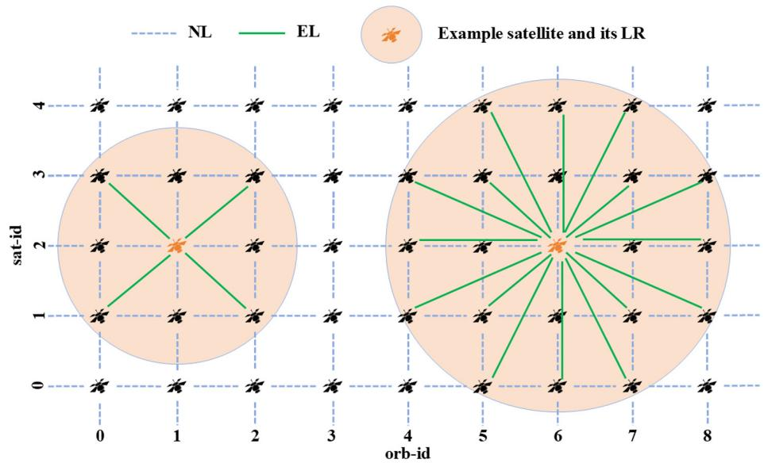

<details>
<summary>text_image</summary>

NL
EL
Example satellite and its LR
sat-id
sat-id
0
1
2
3
4
5
6
7
8
orb-id
</details>

Fig. 1. Schematic diagram of NLs and ELs within the LR.

# C. Network Topology

Due to the periodic and predictable nature of LEO constellation operations, the dynamic network topology can be divided into multiple discrete topology snapshots. Within each snapshot period, the visibility relationships between nodes and the set of links remain unchanged. Therefore, the network can be modeled as k periodically repeating static topology snapshots $G ( t ^ { k } ) = ( V , \bar { E } ( t ^ { k } ) )$ . For each snapshot $G ( t ^ { * } )$ , based on the uniform constellation configuration {inc, alt, $N _ { o r b i t } , N _ { s a t } \}$ and OISL type, the network topology can be modeled as an undirected graph $G ( t ^ { * } ) = ( V , E ( t ^ { * } ) { \bar { ) } }$ . Here, V represents the set of satellite nodes, where each satellite node $v _ { i , j }$ is uniquely identified by the OP index i and the intra-orbit satellite index $j ,$ expressed as $\{ v _ { i , j } \in V \| 0 \leq i < N _ { o r b i t } , 0 \leq j < N _ { s a t } \}$ . $E$ is the set of links, containing all establishable OISLs, which can be divided into the NL set $E _ { N }$ and the EL set $E _ { E } ,$ , satisfying $E = E _ { N } \cup E _ { E }$ . Among them, the NL connecting $v _ { i , j }$ and $v _ { i + m , j + n }$ can be represented as $\{ l _ { i , j , m , n } ^ { N } \in$ $E _ { N } | | 0 \leq i < N _ { o r b i t } , 0 \leq j < N _ { s a t } , m ^ { 2 } + n ^ { 2 } = 1 \}$ , and such links stably exist throughout the entire operational cycle, forming the necting $v _ { i , j }$ c skeand $v _ { i + m , j + n }$ he network. Meais represented as $\{ l _ { i , j , m , n } ^ { E } \in E _ { E } \Vert 0 \leq$ $i < N _ { o r b i t } , 0 \le j < N _ { s a t } , m ^ { 2 } + n ^ { 2 } > 1 \}$ , which is constrained by optical pointing and visible range limitations, exhibiting a bandwidth capacity significant time-varying characteristics. Each NL $C _ { i , j , m , n } ^ { N } ,$ and each EL $\bar { l } _ { i , j , m , n } ^ { E }$ $l _ { i , j , m , n } ^ { N }$ m,nhas a has bandwidth capacity $C _ { i , j , m , n } ^ { E } ,$ collectively determining the link resource distribution of the network. In traditional research based on static link relationships, satellites can only establish four NLs, specifically two intra-OP OISLs and two inter-OP OISLs. This structure is simple but fails to reflect the link diversity brought by the dynamic LR in the network. This paper assumes that any two satellites can establish a link as long as they meet the preset LR conditions. Therefore, the LR becomes a key parameter determining network connectivity and topological density.

# D. Traffic Model

In an OSN, data traffic originates from the communication demands of terrestrial users, and its time-varying characteristics are significantly influenced by the circadian rhythm resulting from the Earth’s rotation. Human activities typically exhibit regular fluctuations according to local solar time, with communication requests during the daytime, especially around noon, being substantially higher than during the quiet nighttime periods. To characterize this pattern, this paper introduces a time-zone-aware traffic model (TZTM) to reflect the dynamic traffic variation characteristics across different regions worldwide based on their respective local times [40]. The terrestrial traffic exhibits an approximately sinusoidal periodic variation over time, reflecting the rhythmic nature of user activities. Consequently, we use a continuous-time traffic function $T r a _ { t }$ , whose variation curve is shown in Fig. 2, with the horizontal axis representing local time and the vertical axis representing the normalized traffic intensity, used to characterize the proportion of requests generated by terrestrial users per unit time. Furthermore, to map terrestrial user behavior to the communication demands of the OSN, a city-level traffic generation mechanism is often used. For any two cities i and $j ,$ the time coefficient of requests between them is jointly determined by their respective time factors $T r a _ { t } ^ { i }$ and $T r a _ { t } ^ { j }$ , forming the time coupling term $T _ { i j }$ as shown in Eq. (1). Based on this, assuming there are n pairs of city communication relationships, the request probability $P ^ { k }$ for the kth city pair can be given by Eq. (2), describing its proportion in the global communication requests.

$$
T _ {i j} = \operatorname{Tra} _ {t} ^ {i} \cdot \operatorname{Tra} _ {t} ^ {j}, \tag {1}
$$

$$
P ^ {k} = \frac {T _ {i j} ^ {k}}{T _ {i j} ^ {1} + T _ {i j} ^ {2} + \cdots + T _ {i j} ^ {n}}. \tag {2}
$$

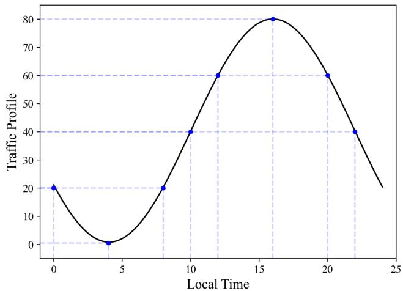

<details>
<summary>line</summary>

| Local Time | Traffic Profile |
| ---------- | --------------- |
| 0          | 20              |
| 4          | 0               |
| 8          | 20              |
| 10         | 40              |
| 12         | 60              |
| 16         | 80              |
| 20         | 60              |
| 22         | 40              |
</details>

Fig. 2. 24 h traffic distribution.

# E. Energy Consumption Model for OISLs

To evaluate the energy consumption of establishing paths based on OISLs in an OSN, it is necessary to explore the architecture of laser communication terminals and their energy consumption model. According to [41], the main optical components of a laser communication terminal consist of four parts: a communication transmitter, communication receiver, beacon transmitter, and beacon receiver. The primary energy consumption is concentrated in the laser transmitter [42], which includes the energy consumption of the erbium-doped fiber amplifier (EDFA) and the power required for laser transmission. For OISL, the relationship between the received power $P _ { R }$ and the transmitted power $P _ { T }$ can be expressed using the link-budget equation as $P _ { R } = L _ { c b } P _ { T } [ 4 3 ]$ , where the channel gain $L _ { c b }$ includes terms such as free-space path loss $( \lambda / 4 \pi R ) ^ { 2 }$ , transmit/receive gain, optical efficiency, and pointing errors. By consolidating the above relationship and grouping the distance-independent constants into a single term, the transmit power can be written in the dominant distance scaling form $\mathsf { \bar { P } } _ { T } ( R ) = C R ^ { 2 }$ . Strictly speaking, the analytical expression for the constant C is denoted as follows:

$$
C = P _ {R, r e q} \left(\frac {4 \pi}{\lambda}\right) ^ {2} \frac {e ^ {G _ {T} \sigma_ {T} ^ {2}} e ^ {G _ {R} \sigma_ {R} ^ {2}}}{n _ {T} n _ {R} G _ {T} G _ {R}}. \tag {3}
$$

In Eq. (3), $P _ { R , r e q }$ is the receiver sensitivity; λ is the operating wavelength; $\overset { \cdot } { G _ { T } } = 1 6 / \Theta _ { T } ^ { 2 }$ and $G _ { R } = ( \pi D _ { R } / \lambda ) ^ { 2 }$ are the transmit and receive gains, respectively, with $\Theta _ { T }$ being the divergence angle and $D _ { R }$ being the receiving aperture; and finally $\sigma _ { T }$ and $\sigma _ { R }$ are the pointing errors. Since the establishment of the OISL involves not only the transmit power but also a fixed overhead $P _ { f o }$ from the EDFA, the power required to establish the OISL can be modeled as

$$
P _ {\text { total }} = P _ {T} (R) + P _ {f o} = C R ^ {2} + P _ {f o}. \tag {4}
$$

It should be noted that, although other components in the laser communication terminal also consume energy, this study focuses on establishing the energy consumption of OISLs. In the simulations, C is set according to the link-budget parameters reported in [43], and the fixed overhead $P _ { f o }$ is treated as a constant terminal-side activation cost, set according to [42]. For simplicity, both C and $P _ { f o }$ are assumed identical for all satellites. In this regard, we associate the common energy consumption model with real-time terrestrial traffic, which is determined by whether there are traffic demands and how many of them. Then, the energy consumption can be denoted as Eq. (5):

$$
P _ {I S L} = P _ {\text { total }} \cdot T _ {i j}. \tag {5}
$$

# F. Problem Statement

In a dynamically operating OSN, the time-varying topology of OISLs and the changing communication environment lead to different eavesdropping exposure levels for different satellites. In this paper, confidential services are assumed to be already protected by underlying physical-layer or cryptographic mechanisms. On this basis, the routing layer further aims to avoid relay regions with relatively high exposure, so as to reduce information access opportunities to potential eavesdroppers during transmission. Conventional survivability mechanisms, such as backup routing or multi-path protection, usually improve service robustness by reserving or activating additional paths. However, such redundancy also introduces considerable link activation overhead and energy consumption, which conflicts with the low-energy operation requirement of large-scale OSNs. Therefore, instead of relying on abundant backup paths, this paper focuses on the following routing issue: how to select a feasible low-exposure path while satisfying transmission constraints and limiting additional topology adaptation overhead. Accordingly, the routing objective is formulated as minimizing the cumulative eavesdropping exposure of the selected path:

$$
\text { Object } = \min \sum_ {l \in E} r _ {l} x _ {l}, \tag {6}
$$

where rl denotes the eavesdropping exposure of link l , and $x _ { l } \in \{ 0 , 1 \}$ indicates whether link l is selected in the path. It should be noted that the energy efficiency of the proposed scheme does not come from introducing an explicit energy term into the routing objective, but from avoiding redundant protection paths.

Additionally, the following constraints must be considered: (1) the wavelength continuity constraint, requiring consistent wavelength usage along the entire path, and (2) the bandwidth constraint, ensuring the path provides sufficient bandwidth for services. Notably, connection requests arrive at and depart from the network randomly according to the TZTM, meaning not all connection requests and releases occur simultaneously. When responding to requests, decision-makers cannot predict future requests nor readjust already established connections.

# 3. EAVESDROPPING EXPOSURE MODEL

# A. Eavesdropping Model

This section describes the eavesdropping model considered in this paper. As illustrated in Fig. 3, we consider the scenario of in-beam interception, where Eve is located within the optical beam footprint between Alice and Bob and attempts to access the signal-bearing optical information carried by the link. In this scenario, Eve may intercept only a fraction of the transmitted optical signal, and the intercepted fraction depends on the beam footprint and the receiver aperture of Eve [10].

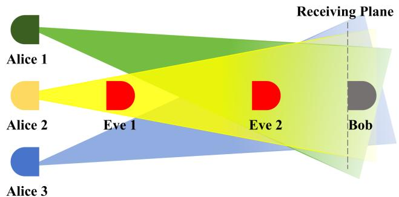

<details>
<summary>flowchart</summary>

```mermaid
graph TD
    A["Alice 1"] --> B["Eve 1"]
    C["Alice 2"] --> B
    D["Alice 3"] --> B
    B --> E["Eve 2"]
    E --> F["Bob"]
    style A fill:#999
    style C fill:#ff99
    style D fill:#999
    style B fill:#ff99
    style E fill:#ff99
    style F fill:#999
    style_G["Receiving Plane"] --> H["Green arrow"]
    style G --> I["Yellow arrow"]
    style G --> J["Blue arrow"]
```
</details>

Fig. 3. In-beam eavesdropping model.

Let $d _ { A E }$ denote the propagation distance from Alice to the plane where Eve is located, and let $\theta _ { d }$ denote the beam divergence angle. Following the geometric spreading property of optical beams, the effective beam radius at distance $d _ { A E }$ can be approximated as

$$
r _ {b} \left(d _ {A E}\right) = \frac {\theta_ {d} d _ {A E}}{2}, \tag {7}
$$

where $r _ { b } ( d _ { A E } )$ is the beam radius at Eve’s observation plane [38]. Let $\rho _ { E }$ denote the lateral offset between Eve and the beam center axis. Then, the geometric condition for in-beam interception can be written as

$$
\rho_ {E} \leq r _ {b} \left(d _ {A E}\right), \tag {8}
$$

which indicates that Eve is located inside the beam footprint and is therefore able to intercept signal-bearing optical energy.

When Eq. (8) is satisfied, the intercepted power at Eve can be approximated based on a Gaussian beam profile together with a small-aperture collection model. Specifically, following the Gaussian spatial intensity distribution of a divergent optical beam on the observation plane and the corresponding aperture-collection approximation [44], and incorporating propagation attenuation as in free-space optical link-budget analysis [43], the intercepted power can be expressed as

$$
P _ {E} \approx P _ {T} e ^ {- a _ {\text {atten}} d _ {A E}} \frac {2 A _ {E}}{\pi r _ {b} ^ {2} \left(d _ {A E}\right)} \exp \left(- \frac {2 \rho_ {E} ^ {2}}{r _ {b} ^ {2} \left(d _ {A E}\right)}\right), \tag {9}
$$

where $P _ { T }$ is the transmit power of Alice, $A _ { E }$ is the effective aperture area of Eve’s receiver, and $\boldsymbol { d } _ { a t t e n }$ denotes the attenuation coefficient along the interception path. Here, the term $\begin{array} { r } { \frac { 2 } { \pi r _ { b } ^ { 2 } ( d _ { A E } ) } \exp \left( - \frac { 2 \rho _ { E } ^ { 2 } } { r _ { b } ^ { 2 } ( d _ { A E } ) } \right) } \end{array}$ characterizes the local Gaussian beam intensity at Eve’s offset position, while the multiplication by $A _ { E }$ corresponds to the small-aperture approximation for the collected optical power, which is adopted here to provide a tractable interception-feasibility model for routing-layer exposure evaluation. Based on the received intercepted power, the corresponding signal reception condition at Eve can be described by

$$
\Gamma_ {E} = \frac {P _ {E}}{p _ {\text { noise }}}, \tag {10}
$$

where $\phi _ { n o i s e }$ is the effective noise power at Eve. If $\Gamma _ { E } \geq \Gamma _ { t b } .$ the interception is regarded as feasible from the signal reception perspective, where $\Gamma _ { t b }$ is the minimum detection threshold.

# B. Eavesdropping Exposure Model

Based on the eavesdropping model defined above, once interception is geometrically and physically feasible, the actual eavesdropping exposure of an RS is still not uniform over the network. In this work, an exposure event means that an adversary can obtain or intercept signal-bearing optical information from a transmission segment, regardless of whether the content can eventually be decoded. Therefore, the exposure model characterizes information access opportunity, rather than a strict confidentiality breach. In public free-space, the eavesdropping exposure of an RS mainly depends on three aspects: (1) the relative position of attackers to the optical transceiver [9], (2) the distribution density of transmitting stations associated with the RS coverage region [45], and (3) the interception probability of the optical transmission signal [46]. These considerations can be abstracted into four types of exposure factors (FAs), namely, the spatial factor, the time factor, the technique factor, and the environment factor. The spatial factor includes the relative geometric position of attackers and the density of transmitting stations associated with the RS coverage region, whereas the interception probability reflects the time, technique, and environment factors jointly. The time factor is governed by the monitored duration of the satellite– ground link, the technique factor reflects whether the system itself is prone to energy leakage to locations that attackers can intercept, and the environment factor describes the influence of atmospheric attenuation, turbulence, and background noise.

Through theoretical analysis in [47], passive interception becomes more favorable when the observer is located closer to the vulnerable relay region. Therefore, the eavesdropping exposure is strongly correlated with the distance between the attack location and the RS. We quantify this spatial characteristic in Eq. (11), where dAE represents the distance from the eavesdropper to the transmitting station, and $d _ { E B }$ denotes the distance to the RS. The factor $F A _ { p o s i t i o n }$ thus characterizes the effect of attacker position on RS exposure.

$$
F A _ {\text { position }} = \frac {d _ {A E}}{d _ {E B}}. \tag {11}
$$

The distribution density of transmitting stations associated with the RS coverage region can be quantified by (1) the coverage area of the RS as Eq. (12), which is determined by the Earth radius $R _ { e }$ and the orbit inclination inc, and (2) the number of associated transmitting stations $N _ { s t a t i o n } .$ , which are directly or indirectly served to support crucial cities such as military, political, and financial centers. In high-density areas, the eavesdropping exposure as Eq. (13) is generally higher because more possible optical transmissions may enter the RS region.

$$
F A _ {\text { cover }} = 2 \pi R _ {e} ^ {2} (1 - i n c), \tag {12}
$$

$$
F A _ {\text { density }} = \text { Poisson } \left(\mu \frac {N _ {\text { station }}}{F A _ {\text { cover }}}\right). \tag {13}
$$

The remaining three indicators capture how an already geometrically feasible observation opportunity is further shaped by time persistence (time factor), technical difficulty (technique factor), and environmental conditions (environment factor). For the time factor, the attacker’s advantage increases with the duration that the vulnerable communication state can be continuously monitored. Consequently, Eq. (14) adopts an exponential saturation form to describe how exposure increases with the satellite–ground link duration $t _ { l i n k }$ . Here, λ denotes a temporal sensitivity coefficient associated with the observation opportunity. As $t _ { l i n k }$ increases, $F A _ { t i m e }$ approaches 1, indicating that the temporal condition becomes increasingly favorable to interception.

$$
F A _ {\text { time }} = 1 - e ^ {- \lambda t _ {\text { link }}}. \tag {14}
$$

The technique factor reflects the transmission directionality and beam control capability of the OISL system. Specifically, beam divergence $\theta _ { d }$ and pointing errors $\varepsilon _ { \ / p }$ expand the spatial range of the optical energy carrying the signal and cause alignment deviations, thereby increasing the likelihood of interception within the beam. In contrast, stronger ATP capability mitigates such eavesdropping exposure by improving beam acquisition, tracking, and pointing performance. Therefore, the technical exposure contribution is defined by Eq. (15), where $C _ { \mathrm { A T P } }$ represents the ATP capability coefficient. $\mathrm { A }$ higher $F A _ { t e c b n i q u e }$ value indicates a greater exposure contribution from the technique factor.

$$
F A _ {\text { technique }} = 1 - e ^ {- \theta_ {d} \varepsilon_ {p} / C _ {\mathrm{ATP}}}. \tag {15}
$$

Finally, the environment factor reflects how atmospheric attenuation $\boldsymbol { d } _ { a t t e n }$ and background noise $\phi _ { n o i s e }$ affect the feasibility of interception under open-space optical transmission. In $\operatorname { E q . }$ (16), a larger $F A _ { e n v i r o n m e n t }$ indicates environmental conditions that are more favorable to interception. Note that other path losses are constant in the free space, and we do not consider them in the formulation:

$$
F A _ {\text { environment }} = e ^ {- a _ {\text {atten}}} \frac {1}{1 + p _ {\text {noise}}}. \tag {16}
$$

# C. Fuzzy Comprehensive Evaluation Method

By applying the FCE method [48], the eavesdropping exposure can be quantified. The eavesdropping exposure of a single RS can be represented by four evaluation indicators using the exposure set $U = \{ u _ { 1 } , u _ { 2 } , u _ { 3 } , u _ { 4 } \}$ , and let the evaluation set $V = \{ v _ { 1 } , v _ { 2 } \}$ , where $v _ { 1 }$ is high eavesdropping exposure (HEE), and $v _ { 2 }$ is low eavesdropping exposure (LEE). FCE is a systematic evaluation framework that includes indicator quantification, construction of the fuzzy evaluation matrix, calculation of deviation-based weights, and final aggregation of exposure grades. This process allows us to handle uncertainty in expert scoring and capture the contribution of each factor in a unified mathematical model.

Taking an example, four experts participated in the scoring as in Table $^ { 2 , }$ then the fuzzy relation matrix $R$ is obtained as Eq. (17). In the formulation, $v _ { 1 } ^ { u _ { 1 } }$ and $v _ { 2 } ^ { u _ { 1 } }$ denote the average comments for spatial factor $u _ { 1 }$ in terms of HEE and LEE, respectively. Equation (17) also shows the calculation results for each factor. Based on the results, we can determine the weight vectors of each factor $w _ { i }$ following Eq. (18). The deviation vector reflects how clearly each factor distinguishes LEE from HEE—factors with larger deviations have stronger discriminative power, while smaller deviations indicate weaker influence on the final exposure judgment. Thus, the eavesdropping exposure of the RS $\boldsymbol { B } \doteq \boldsymbol { W } \cdot \boldsymbol { R } = ( 4 2 \% , 5 8 \% )$ , meaning that the RS can be judged as LEE. However, if $B = ( 6 0 \% , 4 0 \% )$ , the RS can be judged as HEE.

$$
R = \left[ \begin{array}{l l} v _ {1} ^ {u _ {1}} & v _ {2} ^ {u _ {1}} \\ v _ {1} ^ {u _ {2}} & v _ {2} ^ {u _ {2}} \\ v _ {1} ^ {u _ {3}} & v _ {2} ^ {u _ {3}} \\ v _ {1} ^ {u _ {4}} & v _ {2} ^ {u _ {4}} \end{array} \right] = \left[ \begin{array}{l l} 0. 6 5 & 0. 3 5 \\ 0. 5 5 & 0. 4 5 \\ 0. 2 5 & 0. 7 5 \\ 0. 4 5 & 0. 5 5 \end{array} \right], \tag {17}
$$

$$
W = \frac {\left| v _ {1} ^ {u _ {i}} - v _ {2} ^ {u _ {i}} \right|}{\Sigma \left| v _ {1} ^ {u _ {j}} - v _ {2} ^ {u _ {j}} \right|} = \{0. 3 0, 0. 1 0, 0. 5 0, 0. 1 0 \}. \tag {18}
$$

# 4. ENERGY-EFFICIENT SURVIVABLE ROUTING ALGORITHM

# A. EESR Scheme

In the future OSN with flexibly adjustable EL connection relationships, conventional protection mechanisms (e.g., 1:1 or 1 + 1) typically rely on additional backup paths to enhance survivability. However, this approach activates a large number of $\operatorname { E L } s ,$ resulting in significant energy consumption overhead. Therefore, a more reasonable approach is to avoid HEE satellites (HEES) based on the scoring of the eavesdropping exposure model, achieving survivability with only a single path while reducing unnecessary energy consumption. For this reason, we propose an energy-efficient survivable routing scheme. After obtaining the topology of the current snapshot, unlike methods that only perform routing on a fixed topology, this study allows dynamic establishment of ELs within the LR, giving the path search the ability to adjust the link structure. The core idea is to map the satellite exposure scores to link exposure weights, perform a minimum-exposure path search on a virtual fully connected graph composed of both NLs and $\operatorname { E L } s ,$ and then establish any unbuilt ELs in the resulting path. Prior information, such as the relative azimuth angle and latitude-longitude coordinates of two satellites, determines whether an EL can be established. These parameters can be obtained in advance from ephemeris data, allowing the virtual fully connected graph to be generated before the simulation begins. The exposure weight of any link $l _ { i , j }$ is defined as the average of the exposure scores of the two nodes:

Table 2. General Example of Eavesdropping Exposure Scoring by Four Experts 

<table><tr><td>Indicators</td><td>Spatial  $u_1$ </td><td>Time  $u_2$ </td><td>Technique  $u_3$ </td><td>Environment  $u_4$ </td></tr><tr><td>Expert 1</td><td>(0.7,0.3)</td><td>(0.5,0.5)</td><td>(0.2,0.8)</td><td>(0.4,0.6)</td></tr><tr><td>Expert 2</td><td>(0.5,0.5)</td><td>(0.6,0.4)</td><td>(0.3,0.7)</td><td>(0.5,0.5)</td></tr><tr><td>Expert 3</td><td>(0.6,0.4)</td><td>(0.4,0.6)</td><td>(0.1,0.9)</td><td>(0.3,0.7)</td></tr><tr><td>Expert 4</td><td>(0.8,0.2)</td><td>(0.7,0.3)</td><td>(0.4,0.6)</td><td>(0.6,0.4)</td></tr><tr><td>HEE  $v_1$ </td><td>Average = 0.65</td><td>Average = 0.55</td><td>Average = 0.25</td><td>Average = 0.45</td></tr><tr><td>LEE  $v_2$ </td><td>Average = 0.35</td><td>Average = 0.45</td><td>Average = 0.75</td><td>Average = 0.55</td></tr></table>

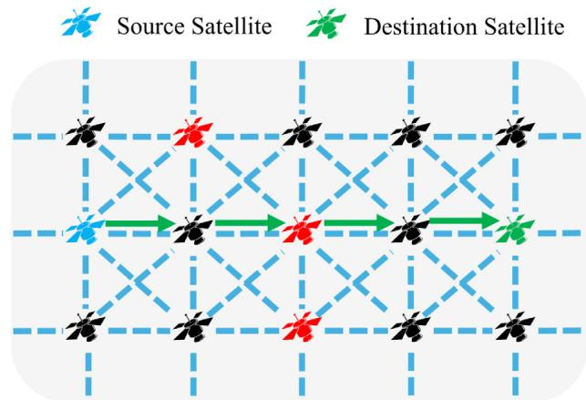

<details>
<summary>flowchart</summary>

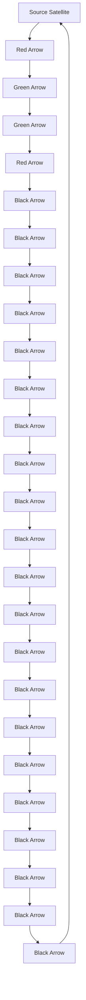
</details>

(a)Dijkstra shortest path algorithm

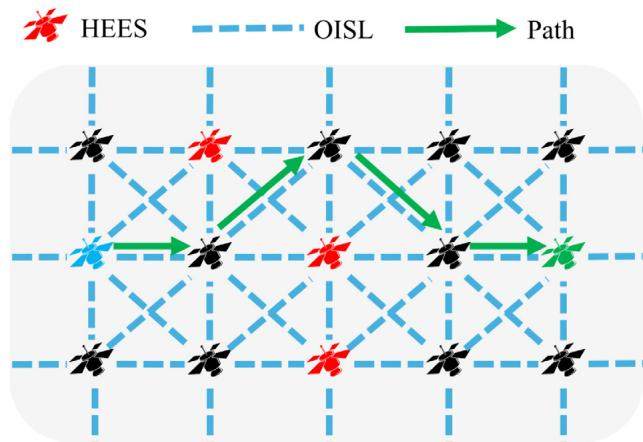

<details>
<summary>flowchart</summary>

```mermaid
graph TD
    A["HEES"] --> B["OISL"]
    B --> C["Path"]
    C --> D["Green Arrow"]
    D --> E["Black Arrow"]
    E --> F["Black Arrow"]
    F --> G["Black Arrow"]
    G --> H["Black Arrow"]
    H --> I["Black Arrow"]
    I --> J["Black Arrow"]
    J --> K["Black Arrow"]
    K --> L["Black Arrow"]
    L --> M["Black Arrow"]
    M --> N["Black Arrow"]
    N --> O["Black Arrow"]
    O --> P["Black Arrow"]
    P --> Q["Black Arrow"]
    Q --> R["Black Arrow"]
    R --> S["Black Arrow"]
    S --> T["Black Arrow"]
    T --> U["Black Arrow"]
    U --> V["Black Arrow"]
    V --> W["Black Arrow"]
    W --> X["Black Arrow"]
    X --> Y["Black Arrow"]
    Y --> Z["Black Arrow"]
    Z --> A
    style A fill:#f9f,stroke:#333
    style B fill:#ccf,stroke:#333
    style C fill:#cfc,stroke:#333
    style D fill:#fcc,stroke:#333
    style E fill:#cff,stroke:#333
    style F fill:#ffc,stroke:#333
    style G fill:#cfc,stroke:#333
    style H fill:#fcc,stroke:#333
    style I fill:#cfc,stroke:#333
    style J fill:#fcc,stroke:#333
    style K fill:#cfc,stroke:#333
    style L fill:#fcc,stroke:#333
    style M fill:#cfc,stroke:#333
    style N fill:#fcc,stroke:#333
    style O fill:#cfc,stroke:#333
    style P fill:#fcc,stroke:#333
    style Q fill:#cfc,stroke:#333
    style R fill:#fcc,stroke:#333
    style S fill:#cfc,stroke:#333
    style T fill:#fcc,stroke:#333
    style U fill:#cfc,stroke:#333
    style V fill:#fcc,stroke:#333
    style W fill:#cfc,stroke:#333
```
</details>

(b) Exposure-weighted Dijkstra algorithm   
Fig. 4. Comparison of path-finding results between Dijkstra’s shortest path algorithm and the exposure-weighted Dijkstra algorithm on a virtual fully connected graph.

$$
W _ {i, j} = \frac {R (i) + R (j)}{2}, \tag {19}
$$

where R(i) and $R ( j )$ represent the exposure score of satellites i and $j ,$ respectively.

After this construction, all links connected to HEES are assigned larger weights. By integrating this into the Dijkstra shortest path algorithm, an exposure-weighted Dijkstra algorithm is formed, which naturally tends to favor LEE satellites during path search. It is important to note that, under this weight definition, except for the start and end points, the exposure score of each intermediate node in the path is counted exactly once across its two associated links. Therefore, minimizing the cumulative link exposure is strictly equivalent to minimizing the cumulative node exposure. Based on this, the path $\rho _ { s d }$ obtained by the exposure-weighted Dijkstra algorithm on the virtual graph is essentially the lowest-exposure reachable path under the current snapshot. Figure 4 illustrates the path-finding strategies of the Dijkstra shortest path algorithm and the exposure-weighted Dijkstra algorithm in a virtual fully connected graph, where the exposure-weighted Dijkstra algorithm found a lower-exposure path.

# B. EESR Algorithm

To achieve exposure-aware routing for confidential services, this section proposes the EESR algorithm, as shown in Algorithm 1. The algorithm’s input includes the satellite set $V ,$ the virtual fully connected edge set $E _ { V } ,$ the currently constructed edge set $E _ { C } ,$ and the RS exposure score $R ( s )$ ,

Algorithm 1. EESR Algorithm   
Input: satellite set V, virtual fully connected edges set $E_{V}$ , currently established edges set $E_{C}$ , RS exposure score $R(s)$ , arrival connection request $R_{q}(s, d, \varphi)$ Output: $\rho_{sd}$ — path from s to d

1 Function selectPaths $(V, E_{V}, E_{C}, R(s), R_{q})$ :

2 for each edge $\in E_{V}$ do

3 calculate the exposure weight $W_{edge}$ for each edge satisfying Eq. (19)

4 end

5 if $\varphi = 1$ (confidential service) then

6 exclude HEES to obtain the feasible exposure-filtered candidate set $V_{C}$ 7 $\rho_{sd} \leftarrow Dijkstra(G(V_{C}, E_{V}), W_{edge}, s, d)$ 8 else if $\varphi = 0$ (ordinary service) then

9 $\rho_{sd} \leftarrow Dijkstra(G(V, E_{V}), s, d)$ 10 if no common wavelength is available on all links of $\rho_{sd}$ then

11 block $R_{q}$ 12 return $\emptyset$ 13 for each link $(i, j) \in \rho_{sd}$ do

14 if $(i, j) \notin E_{C}$ then

15 activate link $(i, j)$ as an EL and add to $E_{C}$ 16 end

17 return $\rho_{sd}$ 18 end

which are parameters that can be precomputed and will be updated with snapshots. When a snapshot is updated, the exposure weight $W _ { e d g e }$ corresponding to each edge in $E _ { V }$ is calculated based on Eq. (19), enabling subsequent path searches to avoid HEES as much as possible. When a new connection request $R _ { q } ( s , d , \varphi )$ arrives, different routing strategies are adopted according to the service type. For confidential services $\varphi = 1$ , the algorithm first excludes HEES, thereby obtaining an exposure-filtered candidate set $V _ { C } .$ . Then, an exposureweighted Dijkstra algorithm is executed on the corresponding subgraph $G ( V _ { C } , E _ { V } )$ to select the path with the lowest cumulative exposure. For ordinary services $\varphi = 0 ,$ the shortest path is directly searched over the entire virtual topology $G ( V , { \overline { { E } } } _ { V } )$ without exposure filtering.

After obtaining the path $\rho _ { s d } ,$ wavelength continuity is verified along $\rho _ { s d }$ through a simple common-wavelength check over the available wavelength set. If no common wavelength exists on all links of the selected path, the request is regarded as blocked. It is worth noting that this paper only considers wavelength-level services. After passing the wavelength consistency verification, the algorithm maps $\rho _ { s d }$ to the physical topology by establishing ELs on demand. If the links along the path are already established, they are directly reused; otherwise, the corresponding ELs are immediately activated and added to $E _ { C } .$ . To avoid excessive control oscillation caused by frequent EL activation and shutdown, EL management is performed at snapshot granularity rather than at the packet level, so that the EL switching frequency remains bounded by the snapshot timescale. Additionally, an idle EL can be retained for a short holding interval before release, which helps reduce repeated setup overhead under bursty traffic.

# C. Complexity Analysis

Under the periodic characteristics of satellite networks, each snapshot topology exhibits strict repeatability. Therefore, the construction of the weighted virtual fully connected graph can be completed offline before the cycle begins and is no longer included in the online computational overhead. Although the worst-case complexity of constructing a virtual fully connected graph is $O ( V ^ { 2 } )$ , where V is the number of network nodes, the practical construction cost of the virtual graph is much lower due to the pruning imposed by the LR, visibility, and relative geometric constraints. For each snapshot, only one shortest path calculation is required based on the preprocessed edge weights, with its main complexity determined by the Dijkstra algorithm. The worst-case computational complexity of Dijkstra’s algorithm is O(E log V ) [49], where E represents the number of network edges. Given the predictability of topology evolution and the sparsity of the graph structure, the algorithm maintains excellent scalability even in largescale OSNs, making it suitable for real-time online routing decisions.

# 5. SIMULATION AND NUMERIC RESULTS

# A. Simulation Settings

This paper develops a software simulator based on Python. The simulation constructs an OSN topology using the Iridium constellation {780, 86.4◦, 6, 11}, with the minimum elevation angle set to 8.2◦. This constellation consists of six OPs with 11 satellites deployed in each plane, enabling seamless global coverage without reverse seams. Each satellite is initially configured with four NLs, and no upper limit is imposed on the establishment of ELs during the simulation. The bandwidth capacity of each OISL is set to 10 Gbps, which includes 200 wavelengths. Since this study focuses on exposure avoidance routing planning for OISLs, the simulation assumes that the satellite-to-ground uplink and downlink have sufficient bandwidth to carry user terminal traffic and ignores the security risks of the satellite-to-ground links, thereby excluding the constraints of space–ground links to evaluate the performance of the inter-satellite network. We select the 1000 cities with the largest population worldwide as the source and destination nodes for services, and the corresponding city population data can be found in [50]. To study the impact of EESR on network performance, the experiment randomly generated 100,000 wavelength-level service requests according to the TZTM. Each service has a duration of 5 s, and during the service duration, the city-to-LEE satellite mapping method converts city pairs into satellite pairs. When an established OISL is disconnected due to satellite movement, it will lead to service transmission interruption, and then timely rerouting is required. The detailed configurations of the network topology, algorithms, and traffic parameters are shown in Table 3. We run the simulator with the above configuration on a Windows 11 computer equipped with an AMD R5-7500F processor and 32 GB of memory. The simulator employs a priority matching strategy to allocate bandwidth from the target path. If traversing all OISLs still cannot meet the bandwidth requirement, the request will be blocked.

Table 3. Simulation Parameters 

<table><tr><td>Parameter</td><td>Value</td></tr><tr><td>Bandwidth capacity of each OISL</td><td>10 Gbps</td></tr><tr><td>The number of wavelengths</td><td>200</td></tr><tr><td>Minimum elevation angle</td><td>8.2°</td></tr><tr><td>The number of connection requests</td><td>100,000</td></tr><tr><td>The holding time of service</td><td>5 s</td></tr><tr><td>OISL energy consumption model constant C</td><td>3.4e-18 [43]</td></tr><tr><td>Fixed OISL activation overhead  $P_{fo}$ </td><td>12.2 W [42]</td></tr><tr><td>Security demand</td><td>Uniform distribution</td></tr></table>

# B. Results and Analysis

In the simulation, we vary the LR, service request rate (RR), and confidential service ratio (CR) of EESR. To validate the superiority of the proposed EESR algorithm, we also use 1 + 1 protection and 1:1 protection as baseline comparisons. Both of them require allocating backup paths and use the Dijkstra shortest path algorithm as the routing algorithm, regardless of the service type. The difference is that 1 + 1 protection transmits the service simultaneously on both the primary and backup paths. In contrast, 1:1 protection transmits the service only on the primary path. The backup path is activated only when the primary path is threatened, and the service transmission on the primary path will be interrupted. As for ELs, they will be shut down if not in use by any service, while NLs will remain as the backbone network. We compare the performance of the three algorithms in terms of blocking ratio, average hop count, link utilization, network energy consumption, and path exposure level. The blocking ratio, defined as the ratio of blocked requests to the total number of requests, is monitored in real-time during the simulation. The hop count refers to the number of links in the selected path, which mainly affects connection delay. Therefore, the average hop count is defined as the average number of hops for all successfully established paths. Link utilization evaluates the efficiency of network bandwidth resource allocation, and we always select the average utilization. During the routing process, ELs can be freely constructed as needed. The more ELs that are activated, the greater the network energy consumption will be, and we calculate the average network energy consumption in real-time. The path exposure level is defined as the proportion of successfully established confidential service paths that traverse at least one HEES. In the constellation, the number of possible paths between any two satellites is extremely large, so it is necessary to determine a reasonable number of shortest paths for each satellite pair. It should be noted that, when discussing the impact of different LRs on the algorithm, we set the RR at 5000, and when discussing the impact of different RRs on the algorithm, we give the LR at 4500.

# 1. Blocking Ratio

Figure 5 compares the blocking ratio for all kinds of services of (1) 1 + 1 protection schemes with different LRs and RR values (labeled by numbers following “LR-” and “RR-” in the legend), (2) 1:1 protection schemes with different LRs and RR values (labeled similarly in the legend), and (3) the EESR algorithm using different CR values (labeled by numbers following “CR-” in the legend). As expected, the blocking ratio of the EESR algorithm increases as the CR value increases. In Fig. 5(a), it can be observed that, as the LR increases from 1500 to 4500, the blocking ratio generally shows a downward trend. The performances of different algorithms vary under different LRs, but the overall trend is consistent. The EESR algorithm exhibits a lower blocking ratio across all LRs, with an average reduction of 18.18% compared to the 1 + 1 protection scheme and 18.09% compared to the 1:1 protection scheme. This can be attributed to the larger LR, which provides more routing options and thus reduces the probability of blocking. In Fig. 5(b), as expected, the blocking ratio increases with higher RR values, since a higher RR value injects more services into the network within the same time period, leading to a significant reduction in available network resources in a short time, thus increasing the blocking ratio. Notably, when RR = 1000, the blocking ratio of EESR is only half that of the other two algorithms. Across the entire range of RR variations, the blocking ratio of EESR is reduced by an average of 27.01% compared to the other two algorithms.

Figure 6 shows the blocking ratio for confidential services. It is evident that, due to the need to arrange backup route protection, the 1 + 1 and 1:1 protection algorithms still maintain blocking ratios of 86.05% and 85.59%, respectively, for confidential services. In contrast, when only one path is required to achieve routing, the performance of EESR in Fig. 6(a) is reduced by 10.91% and 10.83% compared to the 1 + 1 and 1:1 protection algorithms, respectively, and in Fig. 6(b) it is diminished by 22.36% and 22.41%, respectively. Overall, the EESR algorithm can conserve network resources, thereby reducing the blocking ratio.

Figure 7 shows the blocking ratio of ordinary services. Surprisingly, despite the high blocking ratio of confidential services, the blocking ratio of ordinary services has also reached a similar level. The blocking ratio of EESR is reduced by 25.57% and 25.49% compared to 1 + 1 and 1:1, respectively, and continues to decrease as the CR increases. The reason is that confidential services only consume low-exposure routing resources, while the remaining resources are all available for ordinary services. When the CR continues to increase, it is known from Fig. 6 that the blocking ratio of confidential services will keep rising, freeing up more resources for ordinary services, thus causing the blocking ratio of ordinary services to continue decreasing.

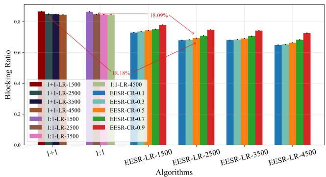

<details>
<summary>bar</summary>

| Algorithms       | 1+1-LR-1500 | 1+1-LR-2500 | 1+1-LR-3500 | 1+1-LR-4500 | 1:1-LR-1500 | 1:1-LR-2500 | 1:1-LR-3500 | 1:1-LR-4500 | EESR-CR-0.1 | EESR-CR-0.3 | EESR-CR-0.5 | EESR-CR-0.7 | EESR-CR-0.9 |
| ---------------- | ----------- | ----------- | ----------- | ----------- | ----------- | ----------- | ----------- | ----------- | ----------- | ----------- | ----------- | ----------- | ----------- |
| 1+1              | 0.85        | 0.84        | 0.83        | 0.82        | 0.86        | 0.85        | 0.84        | 0.83        | 0.85        | 0.84        | 0.83        | 0.82        | 0.81        |
| 1:1              | 0.80        | 0.79        | 0.78        | 0.77        | 0.81        | 0.80        | 0.79        | 0.78        | 0.81        | 0.80        | 0.79        | 0.78        | 0.77        |
| EESR-LR-1500     | 0.75        | 0.74        | 0.73        | 0.72        | 0.76        | 0.75        | 0.74        | 0.73        | 0.76        | 0.75        | 0.74        | 0.73        | 0.72        |
| EESR-LR-2500     | 0.70        | 0.69        | 0.68        | 0.67        | 0.71        | 0.70        | 0.69        | 0.68        | 0.71        | 0.70        | 0.69        | 0.68        | 0.67        |
| EESR-LR-3500     | 0.65        | 0.64        | 0.63        | 0.62        | 0.66        | 0.65        | 0.64        | 0.63        | 0.66        | 0.65        | 0.64        | 0.63        | 0.62        |
| EESR-LR-4500     | 0.60        | 0.59        | 0.58        | 0.57        | 0.61        | 0.60        | 0.59        | 0.58        | 0.61        | 0.60        | 0.59        | 0.58        | 0.57        |
</details>

(a) Blocking ratio decreases as LR increases.

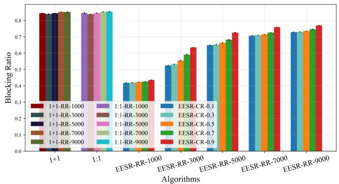  
(b) Blocking ratio increases as RR increases.

Fig. 5. Comparison results of three algorithms in the blocking ratio.   
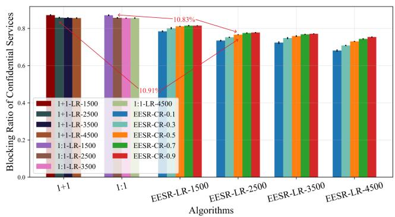

<details>
<summary>bar</summary>

| Algorithms       | 1+1-LR-1500 | 1:1-LR-1500 | 1:1-LR-2500 | 1:1-LR-3500 | 1:1-LR-4500 | 1:1-LR-5500 | 1:1-LR-6500 | 1:1-LR-7500 | 1:1-LR-8500 | 1:1-LR-9500 |
| ---------------- | ----------- | ----------- | ----------- | ----------- | ----------- | ----------- | ----------- | ----------- | ----------- | ----------- |
| 1+1              | 0.85        | 0.85        | 0.85        | 0.85        | 0.85        | 0.85        | 0.85        | 0.85        | 0.85        | 0.85        |
| 1:1              | 0.85        | 0.85        | 0.85        | 0.85        | 0.85        | 0.85        | 0.85        | 0.85        | 0.85        | 0.85        |
| EESR-LR-1500     | 0.80        | 0.80        | 0.80        | 0.80        | 0.80        | 0.80        | 0.80        | 0.80        | 0.80        | 0.80        |
| EESR-LR-2500     | 0.75        | 0.75        | 0.75        | 0.75        | 0.75        | 0.75        | 0.75        | 0.75        | 0.75        | 0.75        |
| EESR-LR-3500     | 0.70        | 0.70        | 0.70        | 0.70        | 0.70        | 0.70        | 0.70        | 0.70        | 0.70        | 0.70        |
| EESR-LR-4500     | 0.65        | 0.65        | 0.65        | 0.65        | 0.65        | 0.65        | 0.65        | 0.65        | 0.65        | 0.65        |
</details>

(a) Blocking ratio of confidential services decreases as LR increases.

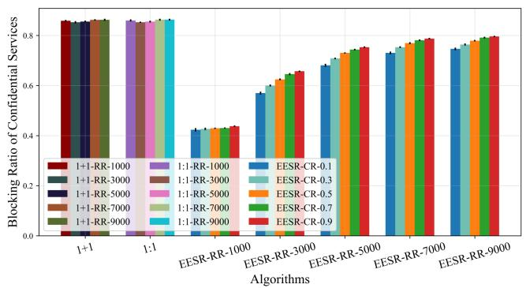

<details>
<summary>bar</summary>

| Algorithms       | 1+1-RR-1000 | 1+1-RR-3000 | 1+1-RR-5000 | 1+1-RR-7000 | 1+1-RR-9000 | 1:1-RR-1000 | 1:1-RR-3000 | 1:1-RR-5000 | 1:1-RR-7000 | 1:1-RR-9000 | EESR-CR-0.1 | EESR-CR-0.3 | EESR-CR-0.5 | EESR-CR-0.7 | EESR-CR-0.9 |
| ---------------- | ----------- | ----------- | ----------- | ----------- | ----------- | ----------- | ----------- | ----------- | ----------- | ----------- | ----------- | ----------- | ----------- | ----------- | ----------- |
| 1+1              | 0.85        | 0.85        | 0.85        | 0.85        | 0.85        | 0.85        | 0.85        | 0.85        | 0.85        | 0.85        | 0.85        | 0.85        | 0.85        | 0.85        | 0.85        |
| 1:1              | 0.85        | 0.85        | 0.85        | 0.85        | 0.85        | 0.85        | 0.85        | 0.85        | 0.85        | 0.85        | 0.85        | 0.85        | 0.85        | 0.85        | 0.85        |
| EESR-RR-1000     | 0.43        | 0.43        | 0.43        | 0.43        | 0.43        | 0.43        | 0.43        | 0.43        | 0.43        | 0.43        | 0.43        | 0.43        | 0.43        | 0.43        | 0.43        |
| EESR-RR-3000     | 0.57        | 0.57        | 0.57        | 0.57        | 0.57        | 0.57        | 0.57        | 0.57        | 0.57        | 0.57        | 0.57        | 0.57        | 0.57        | 0.57        | 0.57        |
| EESR-RR-5000     | 0.70        | 0.70        | 0.70        | 0.70        | 0.70        | 0.70        | 0.70        | 0.70        | 0.70        | 0.70        | 0.70        | 0.70        | 0.70        | 0.70        | 0.70        |
| EESR-RR-7000     | 0.75        | 0.75        | 0.75        | 0.75        | 0.75        | 0.75        | 0.75        | 0.75        | 0.75        | 0.75        | 0.75        | 0.75        | 0.75        | 0.75        | 0.75        |
| EESR-RR-9000     | 0.78        | 0.78        | 0.78        | 0.78        | 0.78        | 0.78        | 0.78        | 0.78        | 0.78        | 0.78        | 0.78        | 0.78        | 0.78        | 0.78        | 0.78        |
</details>

(b) Blocking ratio of confidential services increases as RR increases.   
Fig. 6. Comparison results of three algorithms in the blocking ratio of confidential services.

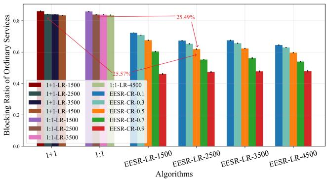

<details>
<summary>bar</summary>

| Algorithms       | 1+1-LR-1500 | 1+1-LR-2500 | 1+1-LR-3500 | 1+1-LR-4500 | 1:1-LR-1500 | 1:1-LR-2500 | 1:1-LR-3500 | 1:1-LR-4500 | EESR-CR-0.1 | EESR-CR-0.3 | EESR-CR-0.5 | EESR-CR-0.7 | EESR-CR-0.9 |
| ---------------- | ----------- | ----------- | ----------- | ----------- | ----------- | ----------- | ----------- | ----------- | ----------- | ----------- | ----------- | ----------- | ----------- |
| 1+1              | 0.85        | 0.83        | 0.84        | 0.83        | 0.86        | 0.85        | 0.84        | 0.83        | 0.82        | 0.81        | 0.80        | 0.80        | 0.80        |
| 1:1              | 0.85        | 0.84        | 0.85        | 0.84        | 0.86        | 0.85        | 0.84        | 0.83        | 0.82        | 0.81        | 0.80        | 0.80        | 0.80        |
| EESR-LR-1500     | 0.45        | 0.46        | 0.47        | 0.48        | 0.49        | 0.50        | 0.51        | 0.52        | 0.53        | 0.54        | 0.55        | 0.56        | 0.57        |
| EESR-LR-2500     | 0.47        | 0.48        | 0.49        | 0.50        | 0.51        | 0.52        | 0.53        | 0.54        | 0.55        | 0.56        | 0.57        | 0.58        | 0.59        |
| EESR-LR-3500     | 0.48        | 0.49        | 0.50        | 0.51        | 0.52        | 0.53        | 0.54        | 0.55        | 0.56        | 0.57        | 0.58        | 0.59        | 0.60        |
| EESR-LR-4500     | 0.49        | 0.50        | 0.51        | 0.52        | 0.53        | 0.54        | 0.55        | 0.56        | 0.57        | 0.58        | 0.59        | 0.60        | 0.61        |
</details>

(a) Blocking ratio of ordinary services decreases as LR increases.

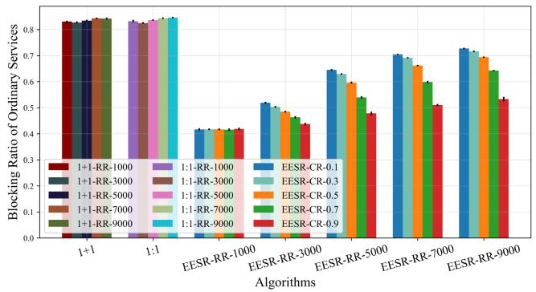  
(b)Blocking ratio of ordinary services increases as RR increases.   
Fig. 7. Comparison results of three algorithms in the blocking ratio of ordinary services.

# 2. Average Hop

Figure 8 shows the average hop count of confidential service paths. Both baseline schemes exhibit shorter hop counts than EESR because they consistently pursue shortest-path routing, while their high blocking ratio filters out many long-path requests. For EESR, in Fig. 8(a), when CR ≤ 0.5, as the LR increases, the number of feasible routing choices that avoid HEES also increases, allowing the algorithm to find shorter low-exposure paths in denser topologies, so the hop count initially decreases. However, when the LR continues to increase, the expanded topology does not necessarily reduce the presence of HEE satellites along candidate routes. EESR still proactively avoids these high-exposure relay satellites in the larger topological space, and thus may select relatively more circuitous low-exposure paths, which leads to a slight rebound in hop count. Conversely, when CR > 0.5, a large number of confidential services compete for limited low-exposure routing opportunities, and the algorithm tends to choose longer but lower-exposure paths over the entire LR, resulting in a continuous and slow increase in hop count. In Fig. 8(b), the average hop count of confidential services shows a decreasing trend as the RR increases. Under high load, longer candidate paths are more likely to fail during route establishment because they consume more routing resources and traverse more potential bottlenecks. Consequently, the successfully established confidential-service paths become increasingly concentrated in shorter feasible paths, which lowers the average hop count. Meanwhile, as the CR increases, confidential services require more exposure-filtered routing opportunities, but the amount of such feasible routing choices does not increase with the RR, further restricting successfully established confidential paths to shorter ranges. Therefore, a clear “short-path preservation effect” is observed.

Figure 9 shows the average hop of ordinary service paths. Although all algorithms aim to optimize for the shortest path for ordinary services, in the baseline algorithm, the need to establish both primary and backup paths for confidential services consumes a large amount of link resources, significantly reducing the available links for ordinary services. As a result, most successfully routed paths are shorter ones that occupy fewer links, keeping the average hop count consistently low and almost unaffected by the changes in the LR and CR. Combined with Fig. 7, it can be observed that the trend of hop counts for ordinary services is closely related to the blocking ratio. When the blocking ratio decreases, it means more ordinary service paths with a larger number of links can be successfully established, leading to an increase in the average hop count. Conversely, when the blocking ratio is high, only shorter paths can be accommodated, resulting in a lower hop count.

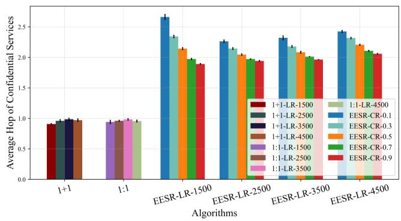  
(a)Average hop of confidential services first decreases and then increases as LR increases.

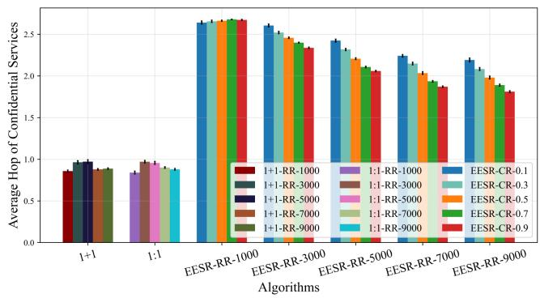

<details>
<summary>bar</summary>

| Algorithms       | 1+1-RR-1000 | 1+1-RR-3000 | 1+1-RR-5000 | 1+1-RR-7000 | 1+1-RR-9000 | 1:1-RR-1000 | 1:1-RR-3000 | 1:1-RR-5000 | 1:1-RR-7000 | 1:1-RR-9000 | 1:1-RR-0.1 | 1:1-RR-0.3 | 1:1-RR-0.5 | 1:1-RR-0.7 | 1:1-RR-0.9 |
| ---------------- | ----------- | ----------- | ----------- | ----------- | ----------- | ----------- | ----------- | ----------- | ----------- | ----------- | ---------- | ---------- | ---------- | ---------- | ---------- |
| 1+1              | 0.8         | 0.9         | 0.9         | 0.8         | 0.8         | 0.8         | 0.8         | 0.8         | 0.8         | 0.8         | 0.8        | 0.8        | 0.8        | 0.8        | 0.8        |
| 1:1              | 0.8         | 0.9         | 0.9         | 0.8         | 0.8         | 0.8         | 0.8         | 0.8         | 0.8         | 0.8         | 0.8        | 0.8        | 0.8        | 0.8        | 0.8        |
| EESR-RR-1000     | 2.7         | 2.7         | 2.7         | 2.7         | 2.7         | 2.7         | 2.7         | 2.7         | 2.7         | 2.7         | 2.7        | 2.7        | 2.7        | 2.7        | 2.7        |
| EESR-RR-3000     | 2.6         | 2.6         | 2.6         | 2.5         | 2.5         | 2.5         | 2.5         | 2.5         | 2.5         | 2.5         | 2.5        | 2.5        | 2.5        | 2.5        | 2.5        |
| EESR-RR-5000     | 2.4         | 2.4         | 2.4         | 2.3         | 2.3         | 2.3         | 2.3         | 2.3         | 2.3         | 2.3         | 2.3        | 2.3        | 2.3        | 2.3        | 2.3        |
| EESR-RR-7000     | 2.2         | 2.2         | 2.2         | 2.1         | 2.1         | 2.1         | 2.1         | 2.1         | 2.1         | 2.1         | 2.1        | 2.1        | 2.1        | 2.1        | 2.1        |
| EESR-RR-9000     | 2.1         | 2.1         | 2.1         | 2.0         | 2.0         | 2.0         | 2.0         | 2.0         | 2.0         | 2.0         | 2.0        | 2.0        | 2.0        | 2.0        | 2.0        |
</details>

(b) Average hop of confidential services decreases as RR increases.   
Fig. 8. Comparison results of three algorithms in the average hop of confidential services.

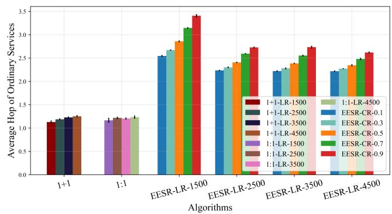

<details>
<summary>bar</summary>

| Algorithms       | 1+1-LR-1500 | 1+1-LR-2500 | 1+1-LR-3500 | 1+1-LR-4500 | 1:1-LR-1500 | 1:1-LR-2500 | 1:1-LR-3500 | 1:1-LR-4500 | EESR-CR-0.1 | EESR-CR-0.3 | EESR-CR-0.5 | EESR-CR-0.7 | EESR-CR-0.9 |
| ---------------- | ----------- | ----------- | ----------- | ----------- | ----------- | ----------- | ----------- | ----------- | ----------- | ----------- | ----------- | ----------- | ----------- |
| 1+1              | 1.1         | 1.2         | 1.2         | 1.2         | 1.2         | 1.2         | 1.2         | 1.2         | 1.2         | 1.2         | 1.2         | 1.2         | 1.2         |
| 1:1              | 1.2         | 1.2         | 1.2         | 1.2         | 1.2         | 1.2         | 1.2         | 1.2         | 1.2         | 1.2         | 1.2         | 1.2         | 1.2         |
| EESR-LR-1500    | 2.5         | 2.6         | 2.7         | 2.8         | 2.9         | 3.0         | 3.1         | 3.2         | 2.5         | 2.6         | 2.7         | 2.8         | 3.4         |
| EESR-LR-2500    | 2.2         | 2.3         | 2.4         | 2.5         | 2.6         | 2.7         | 2.8         | 2.9         | 2.2         | 2.3         | 2.4         | 2.5         | 2.7         |
| EESR-LR-3500    | 2.2         | 2.3         | 2.4         | 2.5         | 2.6         | 2.7         | 2.8         | 2.9         | 2.2         | 2.3         | 2.4         | 2.5         | 2.7         |
| EESR-LR-4500    | 2.2         | 2.3         | 2.4         | 2.5         | 2.6         | 2.7         | 2.8         | 2.9         | 2.2         | 2.3         | 2.4         | 2.5         | 2.6         |
</details>

(a) Average hop of ordinary services decreases as LR increases.

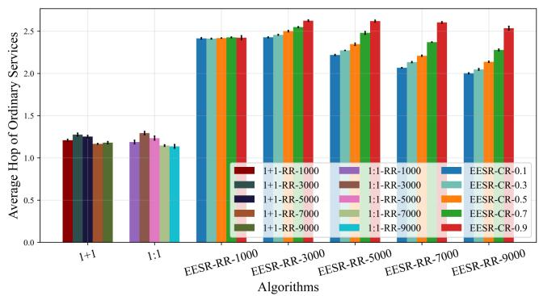

<details>
<summary>bar</summary>

| Algorithms       | 1+1   | 1:1   | EESR-RR-1000 | EESR-RR-3000 | EESR-RR-5000 | EESR-RR-7000 | EESR-RR-9000 | 1:1-RR-1000 | 1:1-RR-3000 | 1:1-RR-5000 | 1:1-RR-7000 | 1:1-RR-9000 | EESR-CR-0.1 | EESR-CR-0.3 | EESR-CR-0.5 | EESR-CR-0.7 | EESR-CR-0.9 |
| ---------------- | ----- | ----- | ------------ | ------------ | ------------ | ------------ | ------------ | ------------ | ------------ | ------------ | ------------ | ------------ | ----------- | ----------- | ----------- | ----------- | ----------- |
| 1+1              | 1.2   | 1.2   | 2.4          | 2.4          | 2.4          | 2.4          | 2.4          | 2.4          | 2.4          | 2.4          | 2.4          | 2.4          | 2.4         | 2.4         | 2.4         | 2.4         | 2.4         |
| 1:1              | 1.2   | 1.2   | 2.4          | 2.4          | 2.4          | 2.4          | 2.4          | 2.4          | 2.4          | 2.4          | 2.4          | 2.4          | 2.4         | 2.4         | 2.4         | 2.4         | 2.4         |
| EESR-RR-1000     | 2.4   | 2.4   | 2.4          | 2.4          | 2.4          | 2.4          | 2.4          | 2.4          | 2.4          | 2.4          | 2.4          | 2.4          | 2.4         | 2.4         | 2.4         | 2.4         | 2.4         |
| EESR-RR-3000     | 2.4   | 2.4   | 2.4          | 2.4          | 2.4          | 2.4          | 2.4          | 2.4          | 2.4          | 2.4          | 2.4          | 2.4          | 2.4         | 2.4         | 2.4         | 2.4         | 2.4         |
| EESR-RR-5000     | 2.4   | 2.4   | 2.4          | 2.4          | 2.4          | 2.4          | 2.4          | 2.4          | 2.4          | 2.4          | 2.4          | 2.4          | 2.4         | 2.4         | 2.4         | 2.4         | 2.4         |
| EESR-RR-7000     | 2.4   | 2.4   | 2.4          | 2.4          | 2.4          | 2.4          | 2.4          | 2.4          | 2.4          | 2.4          | 2.4          | 2.4          | 2.4         | 2.4         | 2.4         | 2.4         | 2.4         |
| EESR-RR-9000     | 2.4   | 2.4   | 2.4          | 2.4          | 2.4          | 2.4          | 2.4          | 2.4          | 2.4          | 2.4          | 2.4          | 2.4          | 2.4         | 2.4         | 2.4         | 2.4         | 2.4         |
</details>

(b) Average hop of ordinary services decreases as RR increases.   
Fig. 9. Comparison results of three algorithms in the average hop of ordinary services.

# 3. Link Utilization

Figure 10 illustrates the link utilization of the three algorithms. Although most confidential services are blocked in 1 + 1 protection and 1:1 protection, their primary-backup path allocation mechanisms still consume more link resources. Therefore, when the actual service load is low, their overall resource consumption remains higher than that of EESR. In Fig. 10(a), the link utilization of each algorithm continuously decreases as the LR increases, with the most significant drop occurring when the LR increases from 1500 to 2500. The reductions for 1 + 1, 1:1, and EESR are 26.41%, 27.06%, and 26.77%, respectively, indicating that topology connectivity improves most significantly during this phase. The number of ELs that can be constructed increases rapidly, allowing traffic to be distributed across more links and thereby significantly reducing link utilization. As the CR increases, the link utilization of EESR shows an overall declining trend, which corresponds to the increase in the confidential service blocking ratio shown in Fig. 6(a): the higher the CR, the fewer confidential paths are successfully established, and the fewer link resources are actually consumed. In Fig. 10(b), as the RR increases, the link utilization of the 1 + 1 and 1:1 algorithms increases linearly at rates of 1.04% and 1.05%, respectively, indicating that their network capacity has not yet reached saturation within this load range. For EESR, when RR = 1000, its link utilization is less than half of that of the baseline schemes, indicating that the overall load imposed by confidential services under exposure-aware routing is still limited at this stage, and the network remains largely idle. Therefore, utilization increases slowly at a rate of approximately 0.32% as the RR increases. However, as the RR continues to increase, the link utilization of EESR rises at an average rate of 6.24%, reflecting its entry into a phase of high resource occupancy. At this stage, link utilization generally decreases as the CR increases because once the feasible low-exposure routing opportunities become saturated, the success rate of confidential services under a high CR decreases, thereby reducing the actual resource usage.

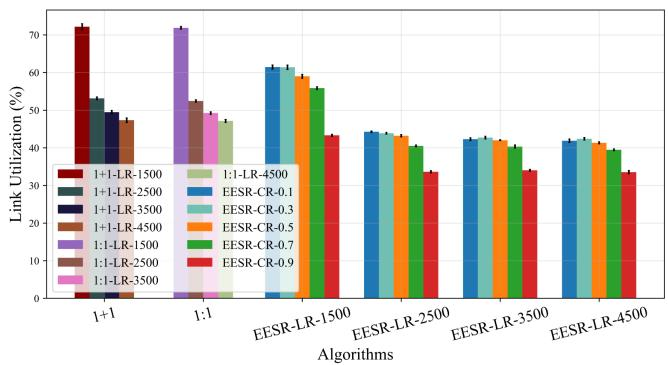

<details>
<summary>bar</summary>

| Algorithms       | 1+1-LR-1500 | 1:1-LR-1500 | 1:1-LR-2500 | 1:1-LR-3500 | 1:1-LR-4500 | 1:1-LR-4500 | 1:1-LR-3500 | 1:1-LR-4500 | 1:1-LR-3500 | 1:1-LR-4500 | 1:1-LR-3500 | 1:1-LR-4500 | 1:1-LR-3500 | 1:1-LR-4500 | 1:1-LR-3500 | 1:1-LR-4500 | 1:1-LR-3500 | 1:1-LR-4500 | 1:1-LR-3500 | 1:1-LR-4500 |
| ---------------- | ----------- | ----------- | ----------- | ----------- | ----------- | ----------- | ----------- | ----------- | ----------- | ----------- | ----------- | ----------- | ----------- | ----------- | ----------- | ----------- | ----------- | ----------- | ----------- | ----------- |
| Link Utilization  | 72          | 72          | 53          | 53          | 53          | 53          | 53          | 53          | 53          | 53          | 53          | 53          | 53          | 53          | 53          | 53          | 53          | 53          | 53          | 53          |
| EESR-CR-0.1      | 48          | 61          | 44          | 44          | 44          | 44          | 44          | 44          | 44          | 44          | 44          | 44          | 44          | 44          | 44          | 44          | 44          | 44          | 44          | 44          |
| EESR-CR-0.3      | 48          | 61          | 44          | 44          | 44          | 44          | 44          | 44          | 44          | 44          | 44          | 44          | 44          | 44          | 44          | 44          | 44          | 44          | 44          | 44          |
| EESR-CR-0.5      | 48          | 61          | 44          | 44          | 44          | 44          | 44          | 44          | 44          | 44          | 44          | 44          | 44          | 44          | 44          | 44          | 44          | 44          | 44          | 44          |
| EESR-CR-0.7      | 48          | 61          | 44          | 44          | 44          | 44          | 44          | 44          | 44          | 44          | 44          | 44          | 44          | 44          | 44          | 44          | 44          | 44          | 44          | 44          |
| EESR-CR-0.9      | 48          | 61          | 44          | 44          | 44          | 44          | 44          | 44          | 44          | 44          | 44          | 44          | 44          | 44          | 44          | 44          | 44          | 44          | 44          | 44          |
</details>

(a) Link utilization decreases as LR increases.

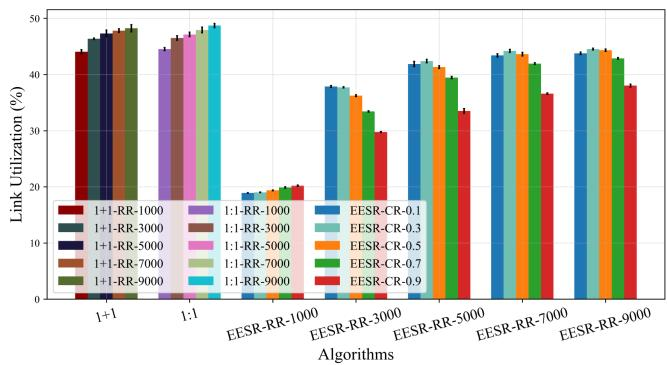

<details>
<summary>bar</summary>

| Algorithms       | 1+1-RR-1000 | 1+1-RR-3000 | 1+1-RR-5000 | 1+1-RR-7000 | 1+1-RR-9000 | 1:1-RR-1000 | 1:1-RR-3000 | 1:1-RR-5000 | 1:1-RR-7000 | 1:1-RR-9000 | EESR-CR-0.1 | EESR-CR-0.3 | EESR-CR-0.5 | EESR-CR-0.7 | EESR-CR-0.9 |
| ---------------- | ----------- | ----------- | ----------- | ----------- | ----------- | ----------- | ----------- | ----------- | ----------- | ----------- | ----------- | ----------- | ----------- | ----------- | ----------- |
| 1+1              | 45          | 47          | 48          | 49          | 49          | 45          | 47          | 48          | 49          | 49          | 48          | 49          | 49          | 49          | 49          |
| 1:1              | 20          | 20          | 20          | 20          | 20          | 20          | 20          | 20          | 20          | 20          | 20          | 20          | 20          | 20          | 20          |
| EESR-RR-1000     | 30          | 30          | 30          | 30          | 30          | 30          | 30          | 30          | 30          | 30          | 30          | 30          | 30          | 30          | 30          |
| EESR-RR-3000     | 40          | 40          | 40          | 40          | 40          | 40          | 40          | 40          | 40          | 40          | 40          | 40          | 40          | 40          | 40          |
| EESR-RR-5000     | 45          | 45          | 45          | 45          | 45          | 45          | 45          | 45          | 45          | 45          | 45          | 45          | 45          | 45          | 45          |
| EESR-RR-7000     | 45          | 45          | 45          | 45          | 45          | 45          | 45          | 45          | 45          | 45          | 45          | 45          | 45          | 45          | 45          |
| EESR-RR-9000     | 45          | 45          | 45          | 45          | 45          | 45          | 45          | 45          | 45          | 45          | 45          | 45          | 45          | 45          | 45          |
</details>

(b) Link utilization increases as RR increases.   
Fig. 10. Comparison results of three algorithms in link utilization.

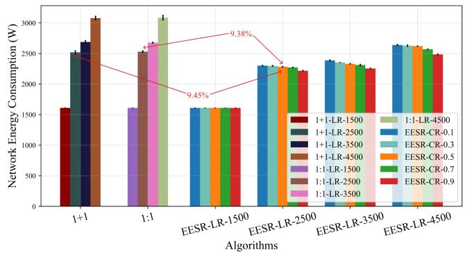

<details>
<summary>bar</summary>

| Algorithms       | 1+1-LR-1500 | 1+1-LR-2500 | 1+1-LR-3500 | 1+1-LR-4500 | 1:1-LR-1500 | 1:1-LR-2500 | 1:1-LR-3500 | 1:1-LR-4500 | EESR-CR-0.1 | EESR-CR-0.3 | EESR-CR-0.5 | EESR-CR-0.7 | EESR-CR-0.9 |
| ---------------- | ----------- | ----------- | ----------- | ----------- | ----------- | ----------- | ----------- | ----------- | ----------- | ----------- | ----------- | ----------- | ----------- |
| 1+1              | 1600        | 2500        | 2700        | 3100        | 1600        | 2500        | 2600        | 3100        | 1600        | 2500        | 2600        | 2600        | 2600        |
| 1:1              | 1600        | 2500        | 2500        | 2600        | 1600        | 2500        | 2600        | 3100        | 1600        | 2500        | 2600        | 2600        | 2600        |
| EESR-LR-1500     | 1600        | 1600        | 1600        | 1600        | 1600        | 1600        | 1600        | 2300        | 1600        | 2300        | 2300        | 2300        | 2300        |
| EESR-LR-2500     | 2300        | 2300        | 2300        | 2300        | 2300        | 2300        | 2300        | 2300        | 2300        | 2300        | 2300        | 2300        | 2300        |
| EESR-LR-3500     | 2300        | 2300        | 2300        | 2300        | 2300        | 2300        | 2300        | 2300        | 2300        | 2300        | 2300        | 2300        | 2300        |
| EESR-LR-4500     | 2600        | 2600        | 2600        | 2600        | 2600        | 2600        | 2600        | 2600        | 2600        | 2600        | 2600        | 2600        | 2600        |
</details>

(a) Network energy consumption increases as LR increases.

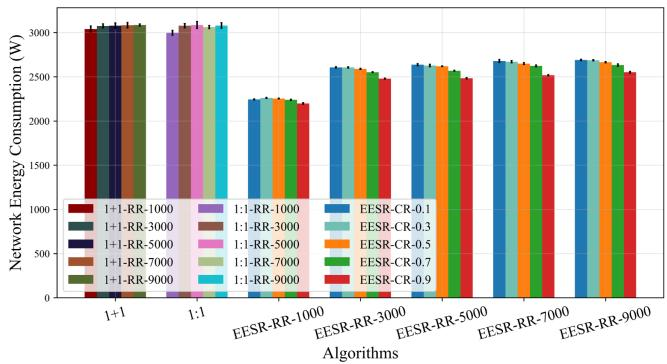

<details>
<summary>bar</summary>

| Algorithms       | 1+1-RR-1000 | 1:1-RR-1000 | 1:1-RR-3000 | 1:1-RR-5000 | 1:1-RR-7000 | 1:1-RR-9000 | EESR-RR-0.1 | EESR-RR-0.3 | EESR-RR-0.5 | EESR-RR-0.7 | EESR-RR-0.9 |
| ---------------- | ----------- | ----------- | ----------- | ----------- | ----------- | ----------- | ----------- | ----------- | ----------- | ----------- | ----------- |
| 1+1              | 3000        | 3000        | 3000        | 3000        | 3000        | 3000        | 3000        | 3000        | 3000        | 3000        | 3000        |
| 1:1              | 3000        | 3000        | 3000        | 3000        | 3000        | 3000        | 3000        | 3000        | 3000        | 3000        | 3000        |
| EESR-RR-1000     | 2200        | 2200        | 2200        | 2200        | 2200        | 2200        | 2200        | 2200        | 2200        | 2200        | 2200        |
| EESR-RR-3000     | 2600        | 2600        | 2600        | 2600        | 2600        | 2600        | 2600        | 2600        | 2600        | 2600        | 2600        |
| EESR-RR-5000     | 2600        | 2600        | 2600        | 2600        | 2600        | 2600        | 2600        | 2600        | 2600        | 2600        | 2600        |
| EESR-RR-7000     | 2600        | 2600        | 2600        | 2600        | 2600        | 2600        | 2600        | 2600        | 2600        | 2600        | 2600        |
| EESR-RR-9000     | 2600        | 2600        | 2600        | 2600        | 2600        | 2600        | 2600        | 2600        | 2600        | 2600        | 2600        |
</details>

(b) Network energy consumption increases as RR increases.   
Fig. 11. Comparison results of three algorithms in network energy consumption.

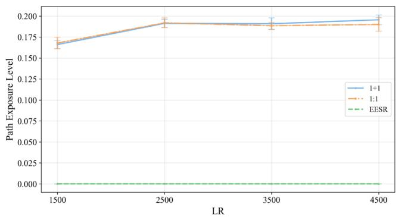

<details>
<summary>line</summary>

| LR   | 1+1    | 1:1    | EESR   |
| ---- | ------ | ------ | ------ |
| 1500 | 0.165  | 0.170  | 0.000  |
| 2500 | 0.195  | 0.195  | 0.000  |
| 3500 | 0.190  | 0.185  | 0.000  |
| 4500 | 0.195  | 0.190  | 0.000  |
</details>

(a) Path exposure level of baseline algorithm increases as LR increases.

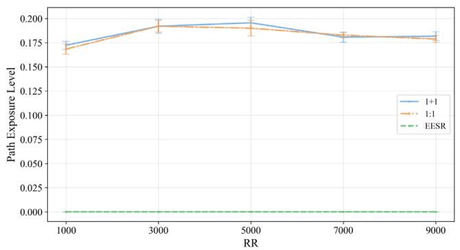

<details>
<summary>line</summary>

| RR   | 1+1    | 1:1    | EESR   |
| ---- | ------ | ------ | ------ |
| 1000 | 0.175  | 0.165  | 0.000  |
| 3000 | 0.195  | 0.190  | 0.000  |
| 5000 | 0.195  | 0.190  | 0.000  |
| 7000 | 0.180  | 0.180  | 0.000  |
| 9000 | 0.180  | 0.175  | 0.000  |
</details>

(b) Path exposure level of baseline algorithm shows no obvious characteristics as RR increases.

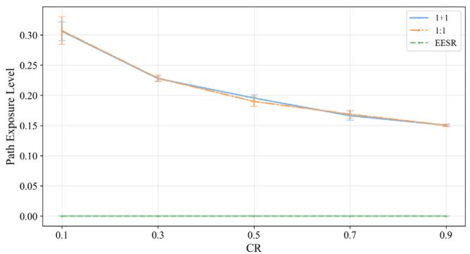

<details>
<summary>line</summary>

| CR   | 1:1    | 1:1    | EESR   |
| ---- | ------ | ------ | ------ |
| 0.1  | 0.30   | 0.30   | 0.00   |
| 0.3  | 0.23   | 0.23   | 0.00   |
| 0.5  | 0.20   | 0.19   | 0.00   |
| 0.7  | 0.17   | 0.17   | 0.00   |
| 0.9  | 0.15   | 0.15   | 0.00   |
</details>

(c) Path exposure level of baseline algorithm decreases as CR increases.   
Fig. 12. Comparison results of three algorithms in the path exposure level.

# 4. Network Energy Consumption

Figure 11 shows a comparison of network energy consumption for three schemes. It is clearly visible that the EESR algorithm achieves significant energy savings compared to the baseline algorithms. In Fig. 11(a), the network energy consumption of the EESR algorithm is reduced by 9.38% and 9.45% compared to the 1 + 1 and 1:1 algorithms, respectively. When LR = 1500, the number of ELs that can be established in the network is very small, and the algorithms mainly route within the backbone network formed by NLs, so the energy consumption performance of the three algorithms is quite similar. However, as the LR increases, the number of ELs that can be established in the network gradually increases, and the advantage of EESR becomes apparent. In Fig. 11(b), the network energy consumption of the EESR algorithm is reduced by 16.87% and 16.56% compared to the 1 + 1 and 1:1 algorithms, respectively. With the LR fixed at 4500, the baseline algorithm shows little fluctuation as the RR changes. EESR gradually increases with the rise in the RR because, at higher request arrival rates, more services can be successfully established, requiring more ELs to be activated to carry the traffic, which causes the overall energy consumption to trend upward as the RR increases.

# 5. Path Exposure Level

Figure 12 shows the path exposure level under different LR, RR, and CR scenarios when testing three schemes. Since the EESR scheme performs exposure-aware routing under strict exposure constraints, it maintains a low path exposure level throughout the experiments. By contrast, the two baseline schemes do not perform exposure-aware filtering, so their confidential service paths may still traverse HEES. In Fig. 12(c), a clear declining trend can be observed in the baseline algorithms as the CR increases. When the CR becomes large, a considerable number of requests cannot be established due to insufficient resources, and the remaining successfully established paths are more likely to be shorter and less resource consuming, which incidentally reduces the probability of traversing HEES. This trend does not reflect an increase in the exposure avoidance capability of baseline algorithms, but rather a path filtering effect caused by the high blocking ratio.

# 6. CONCLUSION

Large-scale LEO OSNs are becoming a key infrastructure for future global communication services, where the demand for confidential data transmission continues to increase. However, due to the open free-space transmission of OISLs and the strong dynamics of satellite topology, eavesdropping exposure remains a non-negligible threat during end-to-end service delivery. At the same time, the limited on-board resources and energy budget of satellites make traditional redundancy-based survivability mechanisms, such as 1 + 1 and 1:1 protection, less suitable for large-scale dynamic OSNs. Therefore, it is necessary to develop a routing scheme that can simultaneously achieve low-energy consumption and low exposure in such open optical transmission environments. To address this issue, this paper studies routing-layer exposure avoidance for confidential services in OSNs under the assumption that such services are already protected by underlying physical-layer or cryptographic mechanisms. We first construct a network model that integrates NLs and ELs and analyze the spatiotemporal characteristics of user traffic through the TZTM. Furthermore, we combine traffic and the baseline energy consumption of links to build an energy consumption model that reflects traffic demand and the size of the demand. Based on this, an energy-efficient eavesdropping exposure model based on the FCE model is established to quantify satellite exposure across spatial, time, technique, and environment factors. Based on the exposure assessment and link energy consumption model, the routing problem is formulated as minimizing the cumulative eavesdropping exposure. On this basis, EESR performs exposure-weighted path selection and activates ELs on demand, thereby achieving adaptive exposure avoidance while controlling topology adaptation overhead. Simulation shows that the proposed EESR algorithm reduces the blocking ratio by approximately 18.13% and decreases overall network energy consumption by approximately 9.11%, albeit with an increment of average hops by 1.16 times and a reduction in link utilization by about 15.91%. Moreover, under a relatively strict exposure-filtering policy, the proposed scheme maintains a low path exposure level for confidential services. Future work will focus on extending the current exposure model to other eavesdropping scenarios, such as cases where Eve and Bob are located on the same receiving plane or where Eve is positioned behind Bob, while also pursuing tighter integration between routing and resource scheduling and further evaluating topology adaptation overhead in large-scale constellation scenarios.

Funding. National Natural Science Foundation of China (62425105, 62350001, 62021005, 62101063); Fundamental Research Funds for the Central Universities (530424001, ZDYY202102); Beijing Natural Science Foundation (L242077); State Key Laboratory of Information Photonics and Optical Communications (IPOC2024B05); Shenzhen Science and Technology Major Project (KJZD20230923114412026).

Disclosures. The authors declare no conflicts of interest.

Data availability. Data underlying the results presented in this paper are not publicly available at this time but may be obtained from the authors upon reasonable request.

# REFERENCES

1. J. Wang, Y. Yan, and L. Dittmann, “Design of energy efficient optical networks with software enabled integrated control plane,” IET Netw. 4, 30–36 (2015).   
2. A. U. Chaudhry and H. Yanikomeroglu, “Free space optics for nextgeneration satellite networks,” IEEE Consum. Electron. Mag. 10(6), 21–31 (2020).   
3. M. Motzigemba, H. Zech, and P. Biller, “Optical inter satellite links for broadband networks,” in 9th International Conference on Recent Advances in Space Technologies (RAST) (IEEE, 2019), pp. 509–512.   
4. P. Sharma and S. Meena, “Performance analysis of inter-satellite optical wireless communication (IS-OWC) system by using channel diversity technique,” in International Conference on Inventive Research in Computing Applications (ICIRCA) (IEEE, 2018), pp. 477–480.   
5. B. Smutny, H. Kaempfner, G. Muehlnikel, et al., “5.6 Gbps optical intersatellite communication link,” Proc. SPIE 7199, 38–45 (2009).   
6. F. Heine, P. Martin-Pimentel, H. Kaempfner, et al., “Alphasat and sentinel 1A, the first 100 links,” in IEEE International Conference on Space Optical Systems and Applications (ICSOS) (IEEE, 2015).   
7. S. Müncheberg, C. Gal, J. Horwath, et al., “Development status and breadboard results of a laser communication terminal for large LEO constellations,” Proc. SPIE 11180, 1180–1192 (2019).   
8. S. Salim, N. Moustafa, and M. Reisslein, “Cybersecurity of satellite communications systems: a comprehensive survey of the space, ground, and links segments,” IEEE Commun. Surv. Tutorials 27, 372–425 (2024).   
9. D.-H. Jung, J.-G. Ryu, and J. Choi, “When satellites work as eavesdroppers,” IEEE Trans. Inf. Forensics Secur. 17, 2784–2799 (2022).   
10. O. B. Yahia, E. Erdogan, G. K. Kurt, et al., “Optical satellite eavesdropping,” IEEE Trans. Veh. Technol. 71, 10126–10131 (2022).   
11. S. Gorman, Y. J. Dreazen, and A. Cole, “Insurgents hack U.S. drones,” The Wall Street Journal (2009), https://www.wsj.com/ articles/SB126102247889095011.   
12. P. Paganini, “Hacking the Iridium network could be very easy” (2015). https://securityaffairs.co/wordpress/39510/hacking/hackingiridium-network.   
13. A. Baltaci, E. Dinc, M. Ozger, et al., “A survey of wireless networks for future aerial communications (FACOM),” IEEE Commun. Surv. Tutorials 23, 2833–2884 (2021).   
14. L. Sadighi, S. Karlsson, C. Natalino, et al., “Detection and classification of eavesdropping and mechanical vibrations in fiber optical networks by analyzing polarization signatures over a noisy environment,” in 50th European Conference on Optical Communication (ECOC) (VDE, 2024), pp. 527–530.   
15. H. Song, R. Lin, L. Wosinska, et al., “Cluster-based unsupervised method for eavesdropping detection and localization in WDM systems,” J. Opt. Commun. Netw. 16, F52–F61 (2024).

16. L. Hu, W. Wang, Y. Pan, et al., “Security enhanced routing and spectrum allocation against crosstalk attacks for confidential lightpath in elastic optical networks,” Opt. Express 32, 7254–7275 (2024).   
17. X. Yu, Y. Liu, X. Zou, et al., “Secret-key provisioning with collaborative routing in partially-trusted-relay-based quantumkey-distribution-secured optical networks,” J. Lightwave Technol. 40, 3530–3545 (2022).   
18. A. Bekkali, H. Fujita, and M. Hattori, “New generation free-space optical communication systems with advanced optical beam stabilizer,” J. Lightwave Technol. 40, 1509–1518 (2022).   
19. S. A. Lahari, A. Raj, and S. Soumya, “Control of fast steering mirror for accurate beam positioning in FSO communication system,” in International Conference on System, Computation, Automation and Networking (ICSCAN) (IEEE, 2021).   
20. Y. Qi, J. Li, C. Wei, et al., “Free-space optical stealth communication based on wide-band spontaneous emission,” Opt. Continuum 1, 2298–2307 (2022).   
21. N. J. Savino, S. Lohani, and R. T. Glasser, “Deep learning for eavesdropper detection in free-space optical ON-OFF keying,” Opt. Continuum 1, 2416–2425 (2022).   
22. G. Cheng, Q. Huang, R. Xing, et al., “On the secrecy performance of integrated satellite-aerial-terrestrial networks,” Int. J. Satell. Commun. Netw. 38, 314–327 (2020).   
23. B. Zheng, S. Lin, and R. Zhang, “Intelligent reflecting surface-aided LEO satellite communication: cooperative passive beamforming and distributed channel estimation,” IEEE J. Sel. Areas Commun. 40, 3057–3070 (2022).   
24. M. G. Schraml, R. T. Schwarz, and A. Knopp, “Multiuser MIMO concept for physical layer security in multibeam satellite systems,” IEEE Trans. Inf. Forensics Secur. 16, 1670–1680 (2020).   
25. Y. Shi, J. Liu, J. Wang, et al., “Jamming-aided secure communication in ultra-dense LEO integrated satellite-terrestrial networks,” China Commun. 20, 43–56 (2023).   
26. R. Kumar and S. Arnon, “Enhancing satellite link security against drone eavesdropping through cooperative communication,” Int. J. Satell. Commun. Netw. 43, 10–22 (2025).   
27. M. Kang, S. Park, and Y. Lee, “A survey on satellite communication system security,” Sensors 24, 2897 (2024).   
28. Á. Vázquez-Castro, A. Winter, and H. Zbinden, “Quantum keyless private communication with decoy states for space channels,” IEEE Trans. Inf. Forensics Secur. 19, 6213–6224 (2024).   
29. R. Fratty, Y. Saar, R. Kumar, et al., “Random routing algorithm for enhancing the cybersecurity of LEO satellite networks,” Electronics 12, 518 (2023).   
30. Z. Liu, J. Rong, Y. Jiang, et al., “Satellite network security routing technology based on deep learning and trust management,” Sensors 23, 8474 (2023).   
31. C. Zhang, L. Hu, W. Wang, et al., “Eavesdropping-aware secure routing based on beam accessibility in optical satellite networks,” in Asia Communications and Photonics Conference (ACP), Suzhou, China, 2025.   
32. G. Wang and X. Wang, “DMSR: dynamic multipath secure routing against eavesdropping in space-ground integrated optical networks,” Photonics 12, 1039 (2025).   
33. T. Liu, W. Wang, F. Ouyang, et al., “Eavesdropping-aware survivable routing in physical-layer secured optical networks,” J. Opt. Commun. Netw. 17, 127–138 (2025).

34. M. Werner, “A dynamic routing concept for ATM-based satellite personal communication networks,” IEEE J. Sel. Areas Commun. 15, 1636–1648 (2002).   
35. Z. Lin, L. Hu, W. Wang, et al., “Eavesdropping-aware secure routing in optical satellite networks: a topology performance comparison,” in Asia Communications and Photonics Conference (ACP), Suzhou, China, 2025.   
36. Y. Su, Y. Liu, Y. Zhou, et al., “Broadband LEO satellite communications: architectures and key technologies,” IEEE Wirel. Commun. 26, 55–61 (2019).   
37. Z. Xiao, J. Yang, T. Mao, et al., “LEO satellite access network (LEO-SAN) toward 6G: challenges and approaches,” IEEE Wirel. Commun. 31, 89–96 (2022).   
38. H. Kaushal, V. Jain, and S. Kar, “Acquisition, tracking, and pointing,” in Free Space Optical Communication (Springer, 2017), pp. 119–137.   
39. A. U. Chaudhry and H. Yanikomeroglu, “Temporary laser intersatellite links in free-space optical satellite networks,” IEEE Open J. Commun. Soc. 3, 1413–1427 (2022).   
40. E. Oh, B. Krishnamachari, X. Liu, et al., “Toward dynamic energyefficient operation of cellular network infrastructure,” IEEE Commun. Mag. 49(6), 56–61 (2011).   
41. M. J. Long, “Pointing acquisition and tracking design and analysis for cubesat laser communication,” Ph.D. thesis (Massachusetts Institute of Technology, 2018).   
42. W. Wang, Y. Zhang, Y. Zhao, et al., “Gravity-based network traffic abstraction and laser ON/OFF control in optical satellite networks,” J. Opt. Commun. Netw. 15, 958–968 (2023).   
43. J. Liang, A. U. Chaudhry, E. Erdogan, et al., “Link budget analysis for free-space optical satellite networks,” in IEEE 23rd International Symposium on a World of Wireless, Mobile and Multimedia Networks (WoWMoM) (IEEE, 2022), pp. 471–476.   
44. P. V. Trinh, A. Carrasco-Casado, A. T. Pham, et al., “Secrecy analysis of FSO systems considering misalignments and eavesdropper’s location,” IEEE Trans. Commun. 68, 7810–7823 (2020).   
45. K. O. Odeyemi, P. A. Owolawi, and O. O. Olakanmi, “On secrecy performance of a dual-hop UAV-assisted relaying network with randomly distributed non-colluding eavesdroppers: a stochastic geometry approach,” Electronics 11, 3302 (2022).   
46. N. Abdelsalam, S. Al-Kuwari, and A. Erbad, “Physical layer security in satellite communication: state-of-the-art and open problems,” IET Commun. 19, e12830 (2025).   
47. R. Singh, I. Ahmad, and J. Huusko, “The role of physical layer security in satellite-based networks,” in Joint European Conference on Networks and Communications & 6G Summit (EuCNC/6G Summit) (IEEE, 2023), pp. 36–41.   
48. S. Feng and L. D. Xu, “Decision support for fuzzy comprehensive evaluation of urban development,” Fuzzy Sets Syst. 105, 1–12 (1999).   
49. J. S. B. Mitchell, “Geometric shortest paths and network optimization,” in Handbook of Computational Geometry (Elsevier, 2000), Vol. 334, pp. 633–702.   
50. D. Bhattacherjee and A. Singla, “Network topology design at 27,000 km/hour,” in Proceedings of the 15th International Conference on Emerging Networking Experiments and Technologies (2019), pp. 341–354.