# JOURNAL OF Optical Communications and Networking

# Exploring the potential of longitudinal power monitoring for detecting physical-layer attacks [Invited]

Matheus Sena,1,\* Abdelrahmane Moawad,2 Robert Emmerich,2 Behnam Shariati,2 Marc Geitz,1 Ralf-Peter Braun,3 Johannes Fischer,2 AND Ronald Freund2

1Deutsche Telekom AG, Winterfeldtstraße 21, Berlin 10781, Germany

2Fraunhofer Heinrich Hertz Institute, Einsteinufer 37, Berlin 10587, Germany

3Orbit Gesellschaft für Applikations- und Informationssysteme mbH, Mildred-Scheel-Str. 1, Bonn 53175, Germany

\*matheus.ribeiro-sena@telekom.de

Received 3 January 2025; revised 17 February 2025; accepted 21 February 2025; published 20 March 2025

The recurring cases of suspicious incidents involving optical fiber cables in recent years have exposed the vulnerabilities of modern communication networks. Whether driven by geopolitical tensions, sabotage, or urban vandalism, these disruptions can cause Internet blackouts, compromise user privacy, and, most critically, challenge operators’ reliability in delivering secure connectivity. Moreover, the emergence of such incidents raises key concerns about how effectively network operators can secure thousands of kilometers of deployed fiber without incurring additional costs from expensive monitoring solutions. In this context, the rise of receiver (Rx)-based digital signal processing (DSP) monitoring schemes can serve as a valuable ally. Originally designed for optical performance monitoring—providing insights such as the estimation of the longitudinal power monitoring (LPM) in optical fiber links—these approaches can also play a crucial role in detecting fiber-related attacks, as any attempt to leak or degrade information leaves distinctive optical power signatures that can be revealed by the Rx-DSP. Therefore, this work investigates the effectiveness of LPM in detecting physical-layer attacks. A detailed simulative analysis is conducted for fiber tapping, addressing aspects such as monitoring implementation, security vulnerabilities, and signature recognition. Other attacks, such as quality-of-service degradation and out-of-band jamming via gain competition, are explored qualitatively, offering insights and identifying opportunities for future research. © 2025 Optica Publishing Group. All rights, including for text and data mining (TDM), Artificial Intelligence (AI) training, and similar technologies, are reserved.

https://doi.org/10.1364/JOCN.554766

# 1. INTRODUCTION

In light of recent events, such as conflicts in Europe and the Middle East, a growing sense of global geopolitical instability has emerged [1]. These uncertainties make communication networks vulnerable targets for “hybrid” warfare, and reports of sabotage involving submarine optical fiber cables have become increasingly frequent in the news [2,3]. Given this growing number of suspicious activities on optical fiber infrastructure around the world, network operators must adapt to a new reality and enhance their ability to predict and respond swiftly to potential threats.

Traditionally, operators rely on monitoring tools such as optical time-domain reflectometers (OTDRs) to detect power disturbances along fiber links, exposing potential intrusions like tappings or breaks [4]. Alternative methods, using phasesensitive OTDRs, can identify subtle mechanical vibrations near the fiber, offering early warnings of suspicious activities that may signal an attack [5]. However, the high cost and complexity of deploying these solutions at scale across nationwide or even transcontinental networks pose significant challenges. Other advanced techniques leverage machine learning (ML) algorithms to analyze polarization rotations [6] or optical performance monitoring (OPM) indicators, such as bit-error ratio (BER), chromatic dispersion, and optical signal-to-noise ratio (OSNR) [7], enabling the identification of attacker signatures with enhanced precision. Yet, such ML-based models require computationally intensive training processes and, in security scenarios, generating sufficient and representative training data may be complex, as physical-layer attacks are short-lived and highly variable [8], making it difficult to create datasets that accurately reflect the diverse nature of potential threats [9].

One promising and more scalable solution lies in harnessing the monitoring capabilities of receiver (Rx) digital signal processing (DSP) modules [10,11]. By extracting information from the Rx-DSP, more specifically from the received digital samples, one can infer longitudinal characteristics of the optical fiber link—such as power evolution profiles and excessive attenuation points—potentially disclosing a fiber intrusion without the need for additional dedicated measurement devices. This DSP-based approach not only reduces costs but also integrates seamlessly into existing network infrastructure, enabling continuous, real-time, and non-intrusive monitoring across multiple fiber spans.

In that regard, it is no surprise that within the topic of DSP-based monitoring, the estimation of longitudinal power monitoring (LPM) has gained significant attention over the past six years [10,12–16]. The clear message being conveyed so far is that existing LPM methods are practical tools for infrastructure mapping [11] and anomaly detection caused by faulty devices, such as optical amplifiers [17]—an important topic that rightly deserves recognition. However, to date, no other study has explored the potential of LPM from the perspective of physical-layer security. Specifically, questions remain unanswered regarding:

1. the types of physical-layer attacks this approach can detect,   
2. the extent of its vulnerability to such attacks,   
3. and the distinct attack signatures it can reliably identify.

Therefore, in this paper, we explore the use of LPM with a focus on its applications in security. We do this by addressing the detection of fiber tapping through detailed numerical simulations and examining other attack scenarios, such as low-power quality-of-service (QoS) attacks and out-of-band jamming via gain competition, offering a qualitative discussion that paves the way for future research. At the end of this paper, we aim to address the three previously unanswered questions (1, 2, and 3), further highlighting the potential of LPM as a powerful physical-layer security monitoring tool.

This paper is an invited extended contribution from our previous work presented at the European Conference on Optical Communications (ECOC) [18], where we discussed how LPM can be employed for designing digital twins of optical networks. Here, we extend our focus to explore its potential in physical-layer security.

The paper’s structure is organized as follows. Section 2 briefly reviews some important physical-layer attacks and their characteristics. In Section 3, we contextualize the role of LPM in monitoring such attack scenarios. In Section 4, the transmission model used in our simulations is introduced. After that, Section 5 explores the first physical-layer attack that can be visualized with the proposed technique, i.e., fiber tapping. This section includes illustrations of different levels of tapping using the proposed approach, an analysis of how attackers can exploit its monitoring vulnerabilities, along with security measures (Section 5.A), and a discussion on how the LPM can be utilized to extract attack signatures in both the wavelength and time domains (Section 5.B). Section 6 suggests the application of this technique in detecting other attack scenarios, namely, low-power QoS attacks and out-of-band jamming via gain competition. Finally, Section 7 summarizes the main conclusions of the study.

# 2. PHYSICAL-LAYER ATTACKS

Espionage is no longer confined to the realm of fiction; it has become a serious and present threat to communication infrastructures, with reports of alleged eavesdropping making headlines in the media [19]. A person with unauthorized access to patch panels, e.g., only needs to unplug a fiber connection, insert a coupler to divert a portion of the light, and reconnect the fiber—raising minimal or no suspicion [8,20]. In more sophisticated scenarios, unplugging the fiber is not even necessary; attackers can use clip-on couplers to induce a slight bend in the fiber, leaking decimals of a decibel from the incoming light to extract unencrypted data, such as email traffic [21].

Unlike fiber tapping, which focuses on intercepting data, other attacks are designed to degrade the quality of the optical communication channel. A notable example is the low-power QoS attack, where an attacker strategically places an attenuator along the link, reducing the signal power to a level that prevents the amplifier from effectively compensating for it [22]. This induced attenuation can severely impact the performance metrics of the affected lightpaths, compromising the overall QoS [8]. Another example is cited in Ref. [23]. In this paper, the concept of out-of-band jamming via gain competition is explored as a method of attacking optical communication systems. This attack involves injecting a high-power signal outside the data channel’s operational band, effectively “robbing” the gain provided by optical amplifiers. As a result, the QoS of the legitimate data channels is significantly degraded, leading to impairments such as reduced OSNR. The effectiveness of this type of attack lies in its ability to exploit the shared gain medium of optical amplifiers, causing disruption without directly interfering with the data-carrying wavelengths.

# 3. LPM FOR PHYSICAL-LAYER SECURITY

The aforementioned physical-layer attacks leave distinct fingerprints or signatures in the LPM, which can be extracted using Rx-DSP techniques. An example of a technique can be found in the pioneering work of Tanimura et al. [12], who introduced the correlation method (CM). This approach was the first to demonstrate how the LPM along an optical fiber link could be visualized solely through Rx-DSP. By applying a signal processing scheme on the digitized received samples, the CM permits the detection of anomalies such as imperfect splicing and can potentially identify intrusions, as fiber tapping introduces power drops that are in essence equal to those generated by imperfect splicing.

After that, Sasai et al. significantly advanced the field by introducing alternative approaches [11,24] and expanding the scope of use cases beyond LPM estimation. Examples include chromatic dispersion mapping [11], narrowband filtering effects [25], and Raman gain extraction [26]. A key contribution from Sasai et al. was the development of the linear least squares (LLS) method, which demonstrated superior performance compared to the CM and achieved errors as low as 0.18 dB relative to OTDR readings [16], offering a more accurate and reliable tool for detecting power variations in optical fiber links.

In summary, both techniques—CM and LLS—share the ability to extract the stepwise nonlinear phase rotation (NLPR)

induced by the Kerr effect using the Rx-DSP. The longitudinal monitoring of the NLPR provides an indication of the optical power, as the NLPR at each point along the fiber corresponds to a scaled version of the instantaneous optical power at that location. A more detailed comparison between LPM methods lies beyond the scope of this work. Hence, for a comprehensive analysis, we highly recommend referring to Ref. [27].

The use of Rx-based information to identify and locate physical-layer attacks is a topic that has been explored in previous works [6,7]. For instance, in Ref. [7], the authors propose using OPM parameters, such as BER, chromatic dispersion, and OSNR, combined with artificial neural networks to accurately detect and identify attacks. While this method demonstrates impressive detection efficiency, the approach presented in this manuscript eliminates the need for training machine learning models or relying on OPM parameters. Instead, it focuses on processing digital samples directly, offering a more straightforward and spatially resolved indication of both the location and nature of the attacks.

In the following section, we describe the transmission model employed in our studies.

# 4. TRANSMISSION MODEL

The transmission model used in this work is based on the simulation of an optical signal propagation through a 200 km fiber link, as illustrated in Fig. 1(a). The transmitter (Tx) DSP generates four independent random sequences. These sequences are mapped to a dual-polarization (DP) 16-quadrature amplitude modulation (QAM) format, with each tributary $( X _ { I } ,$ , $X _ { Q } , Y _ { I } ,$ and $Y _ { Q } ;$ where X : x -polarization, Y : y -polarization, I : in-phase, and $Q \colon$ quadrature) receiving $N \dot { = } \dot { 2 } ^ { 1 5 }$ symbols. Pulse shaping is applied to each tributary using a root-raised cosine (RRC) filter with a roll-off factor of 0.2. The output of the DSP is then fed to a digital-to-analog converter (DAC), which operates at a fixed symbol rate of 128 GBd (except in Section $5 . \mathrm { A } ,$ where this value was varied from 32 to 128 GBd). These four tributaries $X _ { I } , X _ { Q } , Y _ { I }$ , and $Y _ { Q }$ are then fed into a DP-IQ modulator. A continuous-wave (CW) laser, with a linewidth of 100 kHz and centered at 193.4 THz (≈ 1550 nm) provides the optical carrier for the modulator, resulting in the generation of a modulated DP-QAM optical signal.

To enable simulation of the fiber propagation, the modulated signal is oversampled at a rate of eight times the signal’s symbol rate. This oversampled signal is used in the split-step Fourier method (SSFM) for numerical simulation of the optical fiber transmission [28]. The SSFM was realized with a spatial step size of 1 km to balance accuracy and computational efficiency.

The optical link consists of a booster amplifier that provides an output power of 5 dBm (per channel), followed by four $5 0$ km spans of standard single-mode fiber (SMF). Each fiber span is accompanied by an in-line amplifier. The fiber parameters used in the simulation include an attenuation of 0.2 dB/km, a chromatic dispersion coefficient of 16.47 ps/(nm · km), and a nonlinear coefficient of 1.1 $\mathbb { W } ^ { - 1 } \mathrm { k m } ^ { - 1 }$ . The in-line amplifiers output a fixed power level at 5 dBm and have a noise figure of 5 dB.

At the end of the optical link, a random polarization rotation is applied to the signal in the Stokes space, simulating the polarization effects typically encountered in practical systems. These effects arise from environmental factors such as fiber bends, vibrations, and mechanical stress, which can dynamically alter the state of polarization during transmission [29].

Upon arriving at the receiver side, the optical signal undergoes filtering via an optical bandpass filter (OBPF) centered at 193.4 THz with a bandwidth of 80 GHz. The filtered signal is then received by an ideal coherent optical frontend and demodulated. The local oscillator used for demodulation has a frequency offset of 10 MHz relative to the transmitter’s laser and a linewidth of 100 kHz. Subsequently, the signal is resampled to two samples per symbol by the analog-to-digital converter (ADC) and fed to the receiver DSP for further processing.

In Fig. 1(b), the Rx-DSP chain applied in this work is illustrated. After resampling by the ADC, the signal is passed through a matched filter and then compensated for CD. Next, polarization demultiplexing [Pol. demux in Fig. 1(b)] is performed to correct for the random polarization rotation introduced during transmission [30]. This is followed by carrier frequency recovery to account for the frequency offset between the transmitter’s laser and the local oscillator [31].

(a)   
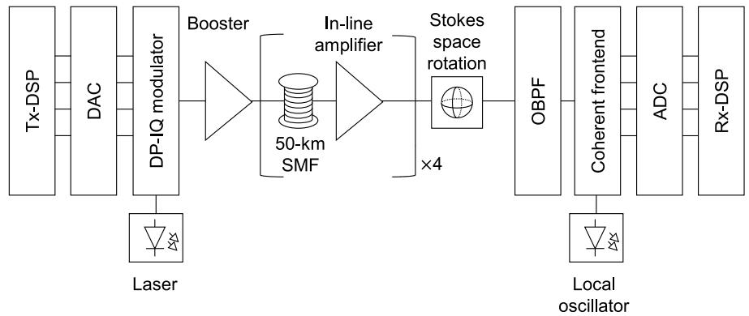

<details>
<summary>flowchart</summary>

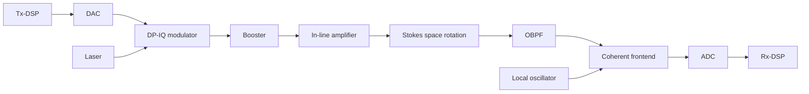
</details>

(b)   
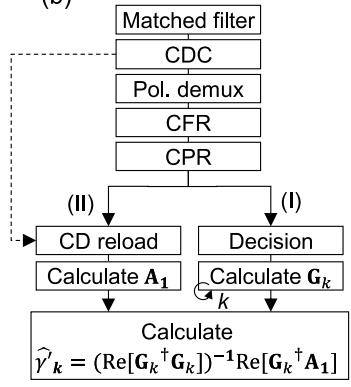

<details>
<summary>flowchart</summary>

```mermaid
graph TD
    A["Matched filter"] --> B["CDC"]
    B --> C["Pol. demux"]
    C --> D["CFR"]
    D --> E["CPR"]
    E --> F["(II)"]
    E --> G["(I)"]
    F --> H["CD reload"]
    G --> I["Decision"]
    H --> J["Calculate A₁"]
    I --> K["Calculate Gₖ"]
    J --> L["Calculate γ′ₖ = (Re[Gₖ⁺Gₖ"])⁻¹Re["Gₖ⁺A₁"]]
    K --> L
    L --> M["Output"]
```
</details>

Fig. 1. (a) Schematic of the transmission model used in the numerical simulations of this paper. (b) Rx-DSP structure based on the LLS method [24] for estimating the LPM of the proposed transmission model. CD, chromatic dispersion; CDC, chromatic dispersion compensation; CFR, carrier frequency recovery; CPR, carrier phase recovery.

Subsequently, blind carrier phase recovery is performed to mitigate phase noise arising from the linewidth of the laser and local oscillator using a blind phase search algorithm [32]. Afterward, this pre-processed signal is prepared for use in our proposed LPM scheme by being copied into two tributaries, denoted as I and II in Fig. 1(b).

To extract the LPM in this paper, we used a distinct but similar approach to what was proposed by Sasai et al. [16,24]. However, we emphasize that the detection of physical-layer attacks is not a unique feature of our implementation. Instead, it can be achieved with any Rx-DSP algorithm capable of visualizing optical power as a function of distance, such as LLS or CM. In this approach, Tributary I undergoes standard symbol decision processing, thus generating the reference waveform $A [ 0 , n ] $ , after which it is used to compute the first-order regular perturbation coefficient vector, ${ \bf G } _ { k } \mathrm { ~ } ( N \times 1$ vector, where N is the number of symbols). The vector $G _ { k }$ corresponds to the kth column of the matrix $( G ) _ { n k } = g [ n , z _ { k } ]$ defined in Ref. [24], where ${ \mathcal { Z } } _ { k }$ represents the spatial position, n is the symbol index with n ∈ [1, N], and k is the fiber segment index with $k \in [ 1 , 2 0 0 ]$ . Each element ${ \mathit { g } } [ n , z _ { k } ]$ can be then computed by $g [ n , z _ { k } ] = ( - j \Delta z _ { k } ) \tilde { D } _ { z _ { k } - L } [ \tilde { N } [ \tilde { D } _ { 0 - z _ { k } } [ A [ 0 , n ] ] ] ]$ , such that $\Delta z _ { k } = z _ { k + 1 } - z _ { k } , \ \tilde { D } _ { a - b } [ \cdot ]$ is a CD operator from position a to $^ { b , }$ and $\tilde { N } [ \cdot ]$ is an operator that applies a nonlinear phase rotation. Meanwhile, Tributary II is reloaded with the link-accumulated CD, resulting in ${ \bf A } _ { 1 } ( { N } \times 1 \mathrm { v e c t o r } )$ , the first-order regular perturbation term. In summary, $\mathbf { G } _ { k }$ represents a sequence of $N$ symbols subjected to partial CD loading, nonlinear phase rotation, and residual CD applied sequentially to the decided symbols [Decision block in Fig. 1(b)] [24]. On the other hand, ${ \bf A } _ { 1 }$ represents an “equivalent” N-symbol sequence that already includes nonlinear noise, only requiring the reloading of chromatic dispersion [CD reload in Fig. 1(b)].

To determine the segment-wise optical power value, which is linearly proportional to $\gamma _ { k } ^ { \prime } ,$ the cost function

$$
I _ {k} = \left\| \mathbf {A} _ {1} - \mathbf {G} _ {k} \cdot \gamma_ {k} ^ {\prime} \right\| ^ {2} \tag {1}
$$

is minimized. This minimization is achieved using the linear least squares [33]. Since $\gamma _ { k } ^ { \prime }$ is a real scalar, it can be estimated as

$$
\hat {\gamma} _ {k} ^ {\prime} = \left(\operatorname{Re} \left[ \mathbf {G} _ {k} ^ {\dagger} \mathbf {G} _ {k} \right]\right) ^ {- 1} \operatorname{Re} \left[ \mathbf {G} _ {k} ^ {\dagger} \mathbf {A} _ {1} \right], \tag {2}
$$

where $\mathbf { G } _ { k } ^ { \dagger }$ represents the conjugate transpose of $\mathbf { G } _ { k }$ . This approach shares key mathematical similarities with the CM, particularly in its correlation-like term. Specifically, the factor $\mathrm { R e } [ \mathbf G _ { k } ^ { \dagger } \mathbf A _ { 1 } ]$ can be compared to the CM correlation term calculated between the Rx-DSP based recovered signal and the one obtained from the simplified digital backpropagation chain [10]. Unlike the CM, but similar to LLS, the presented approach employs a forward propagation model, where $\mathbf { G } _ { k }$ and ${ \bf A } _ { 1 }$ are obtained from a digital forward propagation scheme. Additionally, $\operatorname { R e } [ \mathbf { G } _ { k } ^ { \dagger } \mathbf { A } _ { 1 } ]$ is scaled by the position-dependent factor $( \mathrm { R e } [ \mathbf { G } _ { k } ^ { \dagger } \mathbf { G } _ { k } ] ) ^ { - 1 }$ .

After performing 350 simulations, each with a different transmitter seed, we averaged all the resulting LPMs to obtain a final LPM output. In Ref. [34], the authors suggest that such an averaging procedure as an effective method for improving power estimation accuracy. Finally, a calibration is applied to map the LPM output to the actual power profile set beforehand in the simulation. This process typically involves scaling the LPM output by a scalar and adding an offset term [14]. While this calibration is essential in our scheme, deviations still occur in low-power regions. To mitigate this, we used a scaling nonlinear correction term (third-order polynomial) exclusively applied over the last 10 km before each in-line amplifier that slightly improves the LPM output [The utilization of alternative methods, such as the LLS, eliminates this calibration necessity.].

The simulations were carried out using the commercial tool VPITransmissionMaker with the VPItoolkit DSP-Library [35]. The computations were performed on a system equipped with an Intel Xeon processor (8 cores, 2.1 GHz), 16 GB of RAM, and a 64-bit operating system.

# 5. LPM FOR DETECTING FIBER TAPPING

To demonstrate the effectiveness of LPM in detecting malicious activities along fiber links, Fig. 2 presents the power disturbances caused in LPMs by commonly used fiber couplers. Specifically, we simulate the impact of 90:10, 75:25, and 50:50 couplers, which introduce attenuation levels of 0.46, 1.25, and 3.00 dB, respectively. These values quantify the degree of stealth in the fiber-tapping attack, with 3 dB indicating a blatant attack, 1.25 dB representing a moderately subtle attack, and 0.46 dB signifying a stealthy intrusion. It is important to highlight two critical aspects here. First, from a practical perspective, the insertion of such couplers by an attacker is unlikely to ${ \bf g o }$ unnoticed unless it occurs during maintenance windows or periods of network downtime. This is because the process involves a brief interruption of transmission to insert the tapping device. Second, an attacker could alternatively use fiber clip-on couplers to extract optical light via micro-bending. In this scenario, no transmission interruption is required, as the attacker only needs to locate an uncoated section of the cable and induce the bending. This method typically results in power losses of approximately 0.8 dB, which fall within the range of attenuation values tested in our studies [21].

In Fig. 2(a), the actual and the LPM power profiles under normal system operation are depicted, where a good agreement between them can be noticed, confirming the efficiency of the LLS in our studied transmission model. In Figs. 2(b)– 2(d), we illustrate the longitudinal power profiles when an attacker (physical-layer hacker) taps 10%, 25%, and 50% of the incoming light at the 75th kilometer, respectively. As seen in Fig. 2(d), the 3 dB power drop caused by the attacker is prominent due to the significant attenuation level. This drop is easily identifiable in the LPM, as indicated by the blue solid line showing a clear downward trend following the actual LPM (blue dashed line). In Fig. 2(d), a black dashed curve for visual guidance was also added (LPM without loss), representing the actual LPM extracted from Fig. 2(a) between the 75th and

(a)   
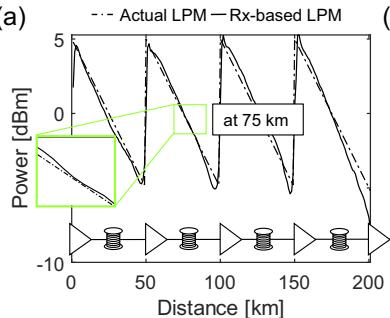

<details>
<summary>line</summary>

| Distance [km] | Actual LPM [dBm] | Rx-based LPM [dBm] |
| ------------- | ---------------- | ------------------ |
| 0             | 5                | 0                  |
| 50            | 0                | 5                  |
| 100           | 5                | 0                  |
| 150           | 0                | 5                  |
| 200           | -10              | 0                  |
</details>

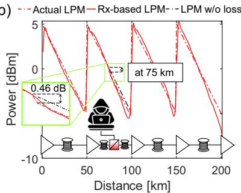

<details>
<summary>line</summary>

| Distance [km] | Actual LPM [dBm] | Rx-based LPM [dBm] | LPM w/o loss [dBm] |
| ------------- | ---------------- | ------------------ | ------------------ |
| 0             | 5.0              | 5.0                | 5.0                |
| 50            | 0.46             | 0.46               | 0.46               |
| 100           | 5.0              | 5.0                | 5.0                |
| 150           | 0.46             | 0.46               | 0.46               |
| 200           | -10.0            | -10.0              | -10.0              |
</details>

(e)   
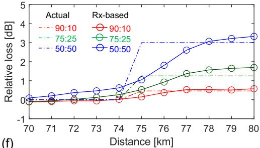

<details>
<summary>line</summary>

| Distance [km] | Actual 90:10 | Rx-based 90:10 | Actual 75:25 | Rx-based 75:25 | Actual 50:50 | Rx-based 50:50 |
| ------------- | ------------ | -------------- | ------------ | -------------- | ------------ | -------------- |
| 70            | 0.0          | 0.0            | 0.0          | 0.0            | 0.0          | 0.0            |
| 71            | 0.0          | 0.0            | 0.0          | 0.0            | 0.0          | 0.0            |
| 72            | 0.0          | 0.0            | 0.0          | 0.0            | 0.0          | 0.0            |
| 73            | 0.0          | 0.0            | 0.0          | 0.0            | 0.0          | 0.0            |
| 74            | 0.0          | 0.0            | 0.0          | 0.0            | 0.0          | 0.0            |
| 75            | 0.0          | 0.0            | 0.0          | 0.0            | 0.0          | 0.0            |
| 76            | 0.0          | 0.0            | 0.0          | 0.0            | 0.0          | 0.0            |
| 77            | 0.0          | 0.0            | 0.0          | 0.0            | 0.0          | 0.0            |
| 78            | 0.0          | 0.0            | 0.0          | 0.0            | 0.0          | 0.0            |
| 79            | 0.0          | 0.0            | 0.0          | 0.0            | 0.0          | 0.0            |
| 80            | 0.0          | 0.0            | 0.0          | 0.0            | 0.0          | 0.0            |
</details>

(c)   
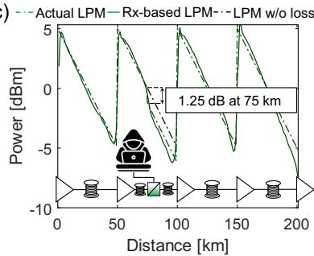

<details>
<summary>line</summary>

| Distance [km] | Actual LPM [dBm] | Rx-based LPM [dBm] | LPM w/o loss [dBm] |
| ------------- | ---------------- | ------------------ | ------------------ |
| 0             | 5.0              | 5.0                | 5.0                |
| 50            | -5.0             | -5.0               | -5.0               |
| 100           | -5.0             | -5.0               | -5.0               |
| 150           | -5.0             | -5.0               | -5.0               |
| 200           | -5.0             | -5.0               | -5.0               |
</details>

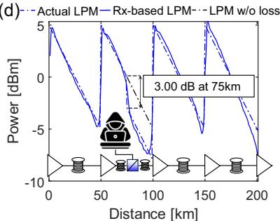

<details>
<summary>line</summary>

| Distance [km] | Actual LPM [dBm] | Rx-based LPM [dBm] | LPM w/o loss [dBm] |
| ------------- | ---------------- | ------------------ | ------------------ |
| 0             | 5.0              | 5.0                | 5.0                |
| 50            | -5.0             | -5.0               | -5.0               |
| 100           | -10.0            | -10.0              | -10.0              |
| 150           | -5.0             | -5.0               | -5.0               |
| 200           | 0.0              | 0.0                | 0.0                |
</details>

(f)

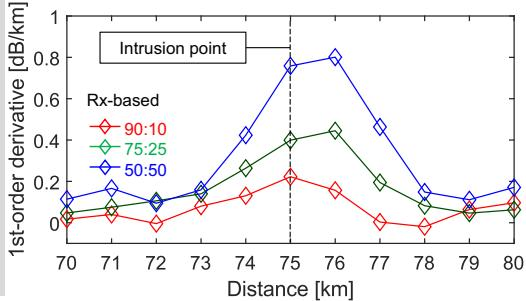

<details>
<summary>line</summary>

| Distance [km] | Rx-based 90:10 | Rx-based 75:25 | Rx-based 50:50 |
| ------------- | -------------- | -------------- | -------------- |
| 70            | 0.05           | 0.05           | 0.10           |
| 71            | 0.05           | 0.10           | 0.15           |
| 72            | 0.05           | 0.10           | 0.10           |
| 73            | 0.10           | 0.15           | 0.15           |
| 74            | 0.15           | 0.25           | 0.40           |
| 75            | 0.20           | 0.40           | 0.80           |
| 76            | 0.15           | 0.45           | 0.85           |
| 77            | 0.05           | 0.20           | 0.50           |
| 78            | 0.05           | 0.10           | 0.15           |
| 79            | 0.10           | 0.05           | 0.10           |
| 80            | 0.10           | 0.05           | 0.15           |
</details>

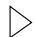  
Optical amplifier

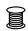  
Optical fiber (50km)

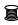  
Optical fiber (25km)


Fiber coupler (90:10/75:25/50:50)   
  
Attacker (physical layer hacker)   
Fig. 2. (a) Actual LPM versus estimated LPM. Actual LPM versus estimated LPM with an emulated power drop at 75 km with a value of (b) 0.46 dB, (c) 1.25 dB, and (d) 3 dB. (e) Zoomed-in LPM tracking the emulated relative loss (power drop) in the vicinity of 75 km. (f ) Anomaly tracker through the first-order derivative of (e).

99th kilometer. As can be seen, the blue solid curve (LPM) detaches from the black dashed curve (LPM without loss), disclosing the power gap between the attacked and the normal operation scenarios.

Figures 2(b) and 2(c) reveal that despite the subtler power drops caused by the 90:10 and 75:25 couplers, respectively, nitid gaps between the LPM (red and green solid lines) and the LPM without loss (black dashed line) can be observed. To better visualize the gap, we ask the reader to look at the zoomed area of Fig. 2(a) (normal operation) and compare it with the zoomed area in Fig. 2(b) (system under attack). Such gaps are actually quantified in Fig. 2(e). In this figure, the difference between the actual LPM in Figs. 2(b)–2(d) and the actual LPM in Fig. 2(a) is depicted by the red, green, and blue dashed curves, respectively. These curves can be physically interpreted as the actual relative loss between the attacked and the normal operation link. In a similar fashion, Fig. 2(e) illustrates the difference between the LPM in Figs. 2(b)–2(d) and the actual LPM in Fig. 2(a), here depicted by the red, green, and blue solid lines with empty circles, respectively. These curves, in turn, reveal in how many decibels the LPMs of all three fibertapping scenarios deviate from the actual LPM under normal system operation. As can be noticed, the Rx-based relative loss estimation curves follow a similar trend to their respective actual relative loss by showing an S-shaped behavior, yet with a smoother inclination.

Now, we direct the reader’s attention to the red solid line in Fig. 2(e). Despite the stealthy nature of the attack, which diverts only 0.46 dB of light, the Rx-based relative loss asymptotically approaches the actual 0.46 dB loss from the 76 km mark onward. This highlights the potential of LPM for detecting fiber-tapping attacks with attenuation levels as low as decimals of a decibel.

Additionally, it has been demonstrated in other works that by calculating the first-order derivative of the relative loss, a rough spatial indication of the excessive attenuation points can be determined by locating the derivative’s optima [10]. This is confirmed in Fig. 2(f ) by the global optima of the three attack scenario curves, which are located either at the same location of the intrusion (90:10 coupler) or around its vicinity (1 km apart for 75:25 and 50:50 couplers). This demonstrates that the LPM is not only effective in detecting fiber tapping, indicating suspicious power drops but also in pinpointing it with a relatively good accuracy.

Now, it is reasonable to ask whether an attacker could identify vulnerable points along the link to extract information without being detected by the LPM. Moreover, are there signal properties that turn a fiber-tapping attack more prone to not being revealed by the LPM? This is investigated in the following subsection.

# A. Security Vulnerabilities

Let us assume that our proposed link has been commissioned by the operator and is now under normal operation. An LPM is periodically generated and compared against a reference LPM, such as the one depicted by the solid black line in Fig. 2(a). This comparison typically involves subtracting the continuously monitored LPM from the reference LPM, as suggested in Ref. [12], and enables the immediate detection of anomalous power disturbances along the link.

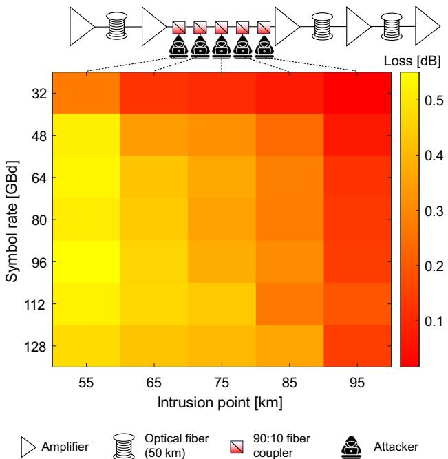

<details>
<summary>heatmap</summary>

| Symbol rate [GBd] | 55 | 65 | 75 | 85 | 95 | 128 |
|---|---|---|---|---|---|---|
| 32 | 0.15 | 0.25 | 0.35 | 0.45 | 0.55 | 0.65 |
| 48 | 0.25 | 0.35 | 0.45 | 0.55 | 0.65 | 0.75 |
| 64 | 0.35 | 0.45 | 0.55 | 0.65 | 0.75 | 0.85 |
| 80 | 0.45 | 0.55 | 0.65 | 0.75 | 0.85 | 0.95 |
| 96 | 0.55 | 0.65 | 0.75 | 0.85 | 0.95 | 1.05 |
| 112 | 0.65 | 0.75 | 0.85 | 0.95 | 1.05 | 1.15 |
| 128 | 0.75 | 0.85 | 0.95 | 1.05 | 1.15 | 1.25 |
</details>

Fig. 3. Monitored loss obtained by subtracting the value of attacked LPM from the normal operation LPM 1 km after the intrusion point with respect to the location of the intrusion point and the channel’s symbol rate.

Now, consider an attacker who manages to go undetected and inserts a 90:10 coupler or a fiber clip-on coupler into the second span, allowing 10% of the light to be siphoned off (stealthy intrusion scenario). The attacker can choose from five potential intrusion points along the second span, specifically at the 55th, 65th, 75th, 85th, or 95th kilometer, as illustrated in the link schematic in Fig. 3. The attacked signal may also have varying symbol rates, from 32 to 128 GBd (in steps of 16 GBd).

An indication that the fiber tapping remains undetected by the network monitoring can be demonstrated if the monitored loss—determined by subtracting the continuously monitored LPM (possibly attacked) from the reference LPM (obtained during commission)—yields a low value (close to 0 dB). This implies no observable difference between the attacked and the reference LPM, thus allowing the attacker to leak power from the fiber without being perceived. In Fig. 3, we illustrate with a two-dimensional map how this monitored loss (measured 1 km after the intrusion point [We use the location 1 km after the intrusion point to account for the slow response of the obtained LPM to loss insertion, which is confirmed in Fig. 2(e) by the smooth S-shaped curves.]) responds to the insertion of the optical coupler at different locations of the link, while the signal symbol rate is tested for multiple values.

As can be seen in Fig. 3, the monitored loss decreases as the intrusion point moves closer to the end of the span, what is evidenced by comparing the first column (intrusion point: 55 km) and the last column (intrusion point: 95 km) of the heat map. At 55 km, the heat map shows a predominantly yellow trend, indicating losses above 0.4 dB, which aligns well with the induced power leakage of 0.46 dB. In contrast, at 95 km, the map shows predominantly red tones, reflecting losses below 0.1 dB, making fiber-tapping detection significantly more challenging.

This decline in monitored loss can be attributed to the reduced effectiveness of LPM toward the end of the span. The accuracy of this method relies on estimating self-phase modulation caused by the Kerr effect, which diminishes at lower power levels typically found near the span’s end.

The monitored loss also exhibits a trend when compared to the symbol rate of the attacked signal. This can be observed by contrasting the first row (32 GBd) and the last row (128 GBd) of the heat map in Fig. 3. As the intrusion point increases, the 32 GBd signal transitions to an orange or red tone more quickly than the 128 GBd signal, indicating a faster reduction in detected loss for lower symbol rates. An explanation for such effect lies in the fact that high symbol-rate optical signals spread more rapidly due to chromatic dispersion, facilitating the distinction of different waveform states and, consequently, different power levels [10]. Since our specific LPM approach shares fundamental similarities with the CM [10], we believe that these outcomes are reasonable. Yet, we find that these unreliable readings at low symbol rates in LPMs are a universal feature that also affects other approaches. For instance, under low-symbol-rate conditions, the estimated power profile from LLS can become unstable or even fail entirely, as discussed in Ref. [16].

In summary, the key takeaway from Fig. 3 is that higher symbol rate regimes are more effective for detecting attacks. This suggests that in scenarios where multiple channels with varying symbol rates share the same route, the network management should prioritize high-symbol-rate channels to strengthen physical-layer security monitoring. This is particularly critical for intrusion detection in low-power regimes, such as at the end of the span, where the reduced signal power increases the complexity of identifying the attack. Consequently, prioritizing high-symbol-rate signals forces eavesdroppers to choose intrusion points near the span’s end, creating greater difficulties for them to intercept and process the low-power signal. Furthermore, we acknowledge that cross-phase modulation (XPM) from co-propagating channels can degrade the accuracy of LPM, potentially making the monitored loss even less reliable in a multi-channel configuration. This effect was not explicitly modeled in our study, and in principle, it could be exploited by an attacker to tap the fiber while remaining undetected. This challenge becomes even more critical toward the end of the link, where the signal-to-noise ratio (SNR) is already degraded [36]. In this case, a possible mitigation strategy is to prioritize monitoring on channels that are less susceptible to XPM, such as the first and last channels in the WDM grid, which interact with fewer neighboring channels. Additionally, the accuracy can be improved by increasing the number of LPM averaging iterations or employing machine learning techniques to refine the estimation process and enhance detection reliability.

# B. Fiber-Tapping Signatures

When identifying physical-layer attacks, it is helpful to look for specific signatures indicative of malicious activities. However, distinguishing a fiber-tapping signature from a conventional splicing imperfection caused by routine maintenance is challenging. Both scenarios introduce attenuation on the order of fractions of a decibel, and the resulting longitudinal power profile shows similar characteristics. In principle, the nature of the power loss in both cases is virtually identical, making it difficult to differentiate between a malicious intrusion and a routine maintenance artifact. A potential approach to address this challenge is to extend the visualization of power evolutions to additional degrees of freedom, such as wavelength and time. By analyzing how attenuation patterns vary across different wavelengths or evolve over time, it may be possible to uncover the fingerprints of an eavesdropper.

# 1. Wavelength Domain

Optical fiber splicing typically does not cause significant wavelength-dependent loss under normal conditions. The splice loss mainly depends on factors such as core alignment, fiber type mismatch, or contamination. As a result, the attenuation introduced by splicing remains consistent across commonly used communication wavelengths (e.g., 1310 nm, 1550 nm).

However, an attacker utilizing either a conventional optical fiber coupler or bend-induced clip-on couplers encounters a significant limitation: the coupling efficiency of these devices may vary with the wavelength [37,38]. Standard fused couplers, e.g., are designed for specific wavelengths and can experience reduced performance when exposed to a broader wavelength range. This wavelength dependence makes it challenging for an attacker to maintain efficient coupling across different channels, potentially limiting their ability to intercept signals reliably in wavelength-division multiplexing (WDM) systems.

To illustrate this, we provide an example that demonstrates the impact of the coupler’s wavelength dependence when an attacker uses a popular, commercially available fused fiber coupler, i.e., the Thorlabs Single Mode 1 × 2 Fiber Optic 90:10 Coupler (TN1550R2A1) [39]. In Fig. 4(a), we show the coupling ratio of such a device, which exhibits a narrowband response with a ±15 nm bandwidth centered at 1550 nm. In Fig. 4(a), the blue and red markers represent the datapoints extracted from the specification sheet for the signal and tap outputs, respectively. The dashed lines are linear fits calculated to estimate the coupler’s response beyond the operating range. As shown, the signal output of the coupler exhibits a decreasing coupling ratio at shorter wavelengths. Consequently, the monitored loss, i.e., the subtraction of the continuously monitored LPM (after attack) from the reference LPM (before attack) at the intrusion point (again at 75 km), is expected to display a downward trend as the wavelength increases if such a coupler is inserted into the fiber link. This can be confirmed in Fig. 4(b), where we observe the monitored loss across the 200 km for different wavelengths (1460, 1500, 1550, 1600, and 1625 nm) spanning from S- to L-band and indicated by the solid lines in different color schemes [Instead of conducting a multichannel simulation spanning 1460 nm to 1625 nm, i.e., over 165 nm, a single-channel simulation was performed at all tested wavelengths. This decision was made due to the significant computational demand for such a wideband simulation scenario, especially considering the need to average 350 LPMs for acceptable results. A multichannel simulation would have resulted in impractically long durations. However, LPM’s resilience in wideband multichannel scenarios has been demonstrated in Refs. [41] and [42]. For this reason, we believe the conclusions drawn from this analysis remain valid.]. Square fits [dashed lines in Fig. 4(b)], defined as

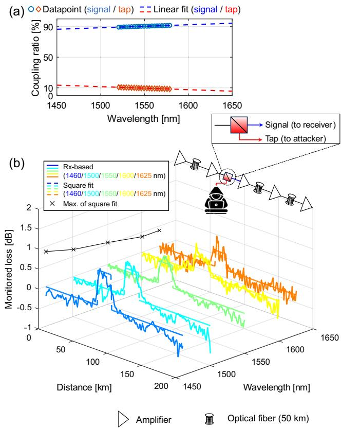

<details>
<summary>line</summary>

| Wavelength [nm] | Coupling ratio [%] (Signal to receiver) | Coupling ratio [%] (Signal to attacker) | Monitored loss [dB] (Signal to receiver) | Monitored loss [dB] (Signal to attacker) | Distance [km] | Amplifier (dB) | Optical fiber (50 km) (dB) |
| --------------- | -------------------------------------- | -------------------------------------- | ---------------------------------------- | ---------------------------------------- | ------------- | -------------- | -------------------------- |
| 1450            | 90                                     | 10                                     | 0.0                                      | 0.0                                      | 50            | -              | -                          |
| 1500            | 90                                     | 10                                     | 0.5                                      | 0.5                                      | 100           | -              | -                          |
| 1550            | 90                                     | 10                                     | 0.0                                      | 0.0                                      | 150           | -              | -                          |
| 1600            | 90                                     | 10                                     | -0.5                                     | -0.5                                     | 1500          | -              | -                          |
| 1650            | 90                                     | 10                                     | -1.0                                     | -1.0                                     | 1600          | -              | -                          |
</details>

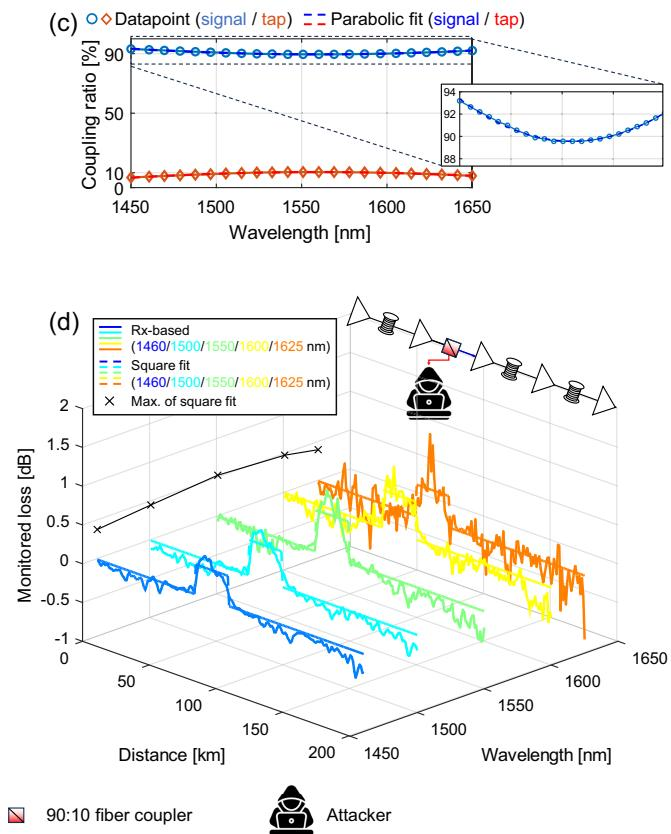

<details>
<summary>line</summary>

| Wavelength [nm] | Coupling ratio [%] (Datapoint) | Coupling ratio [%] (Parabolic fit) | Monitored loss [dB] (Rx-based) | Monitored loss [dB] (Square fit) | Monitored loss [dB] (1460/1500/1550/1600/1625 nm) | Monitored loss [dB] (1460/1500/1550/1600/1625 nm) | Monitored loss [dB] (Max. of square fit) |
|------------------|----------------------------------|--------------------------------------|--------------------------------|----------------------------------|----------------------------------------------------------|----------------------------------------------------------|------------------------------------------|
| 1450             | 90                               | 90                                   | 0                              | 0                                | 0                                                        | 0                                                        | 0                                        |
| 1500             | 90                               | 88                                   | -0.5                           | -0.5                             | -0.5                                                     | -0.5                                                     | -0.5                                     |
| 1550             | 90                               | 88                                   | -1.0                           | -1.0                             | -1.0                                                     | -1.0                                                     | -1.0                                     |
| 1600             | 90                               | 88                                   | -1.5                           | -1.5                             | -1.5                                                     | -1.5                                                     | -1.5                                     |
| 1650             | 90                               | 94                                   | -2.0                           | -2.0                             | -2.0                                                     | -2.0                                                     | -2.0                                     |
</details>

Fig. 4. Coupling ratio’s wavelength dependence for a commercially available 90:10 (a) narrowband [39] and (c) wideband [40] optical coupler. Monitored loss as a function of wavelength and distance when a (b) narrowband and (d) wideband coupler is inserted by an attacker at the 75th kilometer.

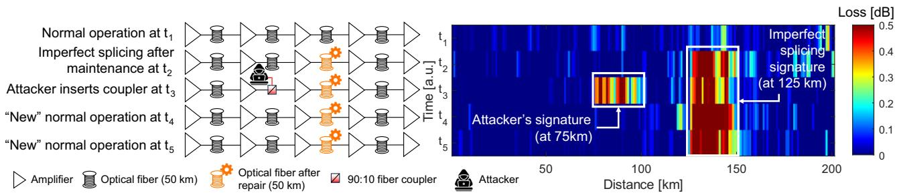

<details>
<summary>heatmap</summary>

| Condition | Time (a.u.) | Distance (km) | Loss (dB) |
|-----------|-------------|---------------|-----------|
| Normal operation at t₁ | t₁ | 50 | 0.0 |
| Imperfect splicing after maintenance at t₂ | t₂ | 75 | 0.0 |
| Attacker inserts coupler at t₃ | t₃ | 100 | 0.0 |
| "New" normal operation at t₄ | t₄ | 150 | 0.0 |
| "New" normal operation at t₅ | t₅ | 200 | 0.0 |
</details>

Fig. 5. Monitored loss as a function of distance and time when two hypothetical events, i.e., imperfect splicing (0.46 dB at 125 km) left by a maintenance team and insertion of a coupler (0.46 dB at 75 km) by an attacker, coexist in the same link.

$$
f (x) = \left\{ \begin{array}{l l} 0, & \text { if } 1 \leq x \leq 7 4 \text { or } 1 0 0 \leq x \leq 2 0 0, \\ \mu_ {\lambda}, & \text { otherwise }, \end{array} \right.
$$

where $\mu _ { \lambda }$ is the average loss within the 75th to the 99th kilometer [In a real-world scenario, the loss location can be identified by an attenuation spike, with the square fit starting near this point and extending to the next amplifier.] for the wavelength λ ∈ {1460,1500,1550,1600, and1625} [The transmission model parameters were adapted to account for the physical properties of standard SMF across the tested wavelengths [43].], are likewise plotted. These square fits provide insight into the wavelength-dependent impact of the coupler’s loss. Observing the projection of the maximum values of the square fits onto the background plane (black cross markers), the results reveal a decreasing trend as the wavelength increases. This behavior aligns with the descending profile of the tap output coupling ratio, as illustrated by the red dashed line in Fig. 4(a), therefore, potentially unveiling a malicious intrusion into the fiber link.

The same analysis is now performed considering the use of a wideband coupler, specifically the TW1550R2A1 [40]. The coupling ratio of this device is shown in Fig. 4(c). Despite being designed as a wideband coupler with a 100 nm operating range centered at 1550 nm, it exhibits a slight parabolic dependence of the coupling ratio on the wavelength, as highlighted in the zoomed section of Fig. 4(c). This behavior is further corroborated by the monitored loss estimation in Fig. 4(d), which also shows a parabolic trend (black cross markers). The maximum loss occurs at 1550 nm, coinciding with the wavelength where the signal output coupling ratio is at its minimum, as indicated in Fig. 4(c).

A key takeaway from Figs. 4(b) and 4(c) is that by exploring the wavelength domain and extracting spectral information from the fiber using channels allocated at different wavelengths/bands along the same route, it is possible to reveal distinctive fingerprints of the attacker’s tapping instruments.

# 2. Time Domain

In scenarios where attackers employ nearly ideal wideband couplers, making network monitoring ineffective for detecting wavelength-dependent behaviors, time-domain analysis becomes a crucial complementary approach. For instance, time-correlating information from the LPM with maintenance activities can help distinguish suspicious behavior from attenuation caused by imperfect splicing [In large network operators, maintenance activities are well-documented, allowing unexpected power drops—whether due to an attack or an imperfect splicing loss—to be cross-referenced with maintenance records.]. If the location of the excessive attenuation does not align with sites recently visited by technicians, the network management system should raise an alarm for potential unauthorized activity. Furthermore, attackers are likely to retrieve their hardware to minimize the risk of detection, as leaving a tapping device in place increases the chance of discovery during routine inspections, network upgrades, or unexpected fiber testing. Therefore, the transient nature of the tapping attack, as cited in Ref. [44], contrasts with the permanence of fiber damage. This distinction allows network operators to differentiate between temporary intrusions and lasting fiber imperfections.

To illustrate this, consider the heat map shown in Fig. 5, where we emulate the hypothetical behaviors of a bad splice and that of an attacker with a tapping device in the same optical link.

After a maintenance activity, an imperfect splice left by the repair team causes an excessive loss of 0.46 dB (10% of power lost) at the 125th kilometer. At time instance $t _ { 2 } ,$ the monitored loss increases from 0 dB (blue at $t _ { 1 } )$ to approximately 0.5 dB (red) at the 125th kilometer, and this persists from $t _ { 2 }$ to $t _ { 5 } ,$ indicating permanent fiber damage. Conversely, at time instance $t _ { 3 } ,$ a loss emerges at the 75th kilometer, disappearing by $t _ { 4 } .$ This behavior suggests an attack, where a tapping device (90:10 coupler) temporarily leaked approximately 0.5 dB of signal. Such time-dependent signatures are crucial for network operators to distinguish between physical-layer attacks and maintenance-related issues.

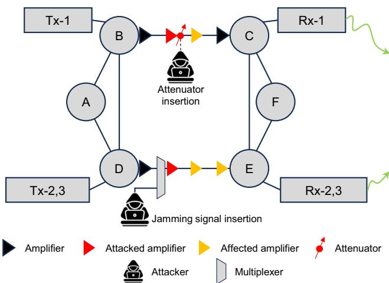

<details>
<summary>flowchart</summary>

Antenna signal processing flowchart with Tx-1, Tx-2,3 inputs, B, D, E, F outputs, Rx-1, Rx-2,3 outputs, and labeled components like attenuator insertion and jamming signal insertion.
</details>

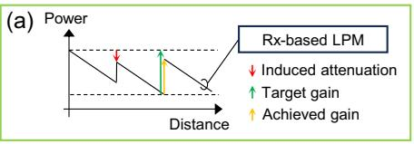

<details>
<summary>line</summary>

| Distance | Power | Rx-based LPM |
| -------- | ----- | ------------ |
| Low      | High  | -            |
| Mid      | Low   | -            |
| High     | -     | -            |
</details>

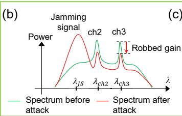

<details>
<summary>line</summary>

| λ       | Spectrum before attack | Spectrum after attack |
| ------- | ---------------------- | --------------------- |
| λs      | ~0.5                   | ~1.0                  |
| λch2    | ~0.8                   | ~0.6                  |
| λch3    | ~0.7                   | ~0.4                  |
| Robbed gain | ~0.6                 | ~0.3                  |
</details>

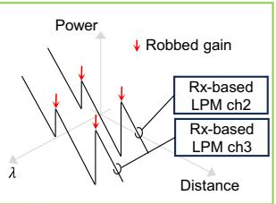

<details>
<summary>text_image</summary>

Power
Robbed gain
Rx-based
LPM ch2
Rx-based
LPM ch3
Distance
</details>

Fig. 6. Illustration of two additional physical-layer attacks: low-power QoS attacks and out-of-band jamming via gain competition. (a) Expected LPM when attacker performs a low-power QoS attack between nodes B and C. (b) Spectrum with and without the presence of a jamming signal that “robs” the gain of the legitimate channels. (c) Expected LPM when an attacker performs out-of-band jamming via gain competition between nodes D and E.

# 6. FUTURE RESEARCH

So far, this work has extensively investigated the application of using LPM for detecting and characterizing fiber tapping. We demonstrated how this approach enables the visualization of different tapping levels, assessed its vulnerabilities, and showed how to extract unique attack signatures in the wavelength and in the time domain. Now, we suggest the potential of LPM to identify two additional attack types: (i) low-power QoS attacks and (ii) out-of-band jamming through gain competition.

# A. Low-Power QoS Attacks

As mentioned in Section 2, low-power QoS attacks compromise the integrity of transmitted signals by subtly reducing power levels within the optical line system [22]. For instance, an attacker might insert an attenuator at the output of an amplifier (e.g., second amplifier between nodes B and C in Fig. 6). Since optical amplifiers are usually configured such that they only compensate for the losses on the previous fiber span, if the induced attenuation is significantly high, it will prevent the following amplifier (e.g., the third amplifier between nodes B and C in Fig. 6) to provide the target gain. In this case, the achieved gain is lower than the target gain and the optical channel experiences an absolute power reduction, potentially degrading its OSNR. Consequently, the corresponding LPM will indicate an abrupt power drop at the output of the attacked amplifier as well as at the output of the following cascaded amplifier(s) [as illustrated in Fig. 6(a)].

An important observation here is that successful detection of this attack assumes that the Rx-DSP can perform symbol decision without exceeding a certain BER threshold—such a value requires further investigation. However, employing robust forward error correction (FEC) schemes and increasing the amount of averaging in estimating the LPM can enhance the system’s ability to reliably identify such scenarios.

Additionally, to differentiate such an attack from fiber mishandling or equipment failures, such as a malfunctioning amplifier, operators can verify maintenance records and remotely check the amplifier’s status. If no maintenance was performed at the site and the amplifier shows no signs of anomalous operation, the observed power drop is likely indicative of intentional tampering.

# B. Out-of-Band Jamming via Gain Competition

By injecting a powerful jamming signal at a wavelength [e.g., λJS in Fig. 6(b)] distinct from the legitimate signals [e.g., λch2 and $\lambda _ { \mathrm { c h } 3 }$ in Fig. 6(b)], but still within the amplifier’s waveband, it is possible to deplete power from the legitimate signals, thereby deteriorating their OSNR. This phenomenon, known as gain competition [23], can also be visualized using LPM, as illustrated in Fig. 6(c).

The construction of a two-dimensional representation of the LPM—plotted as a function of wavelength and distance— reveals the collective attenuation of legitimate channels (in this case, $\lambda _ { \mathrm { c h } 2 }$ and $\lambda _ { \mathrm { c h } 3 } )$ at the location of the attacked amplifier. In principle, this attenuation persists across subsequent amplifiers as long as the jamming signal remains within the system and is not demultiplexed.

The insertion of the jamming signal also induces a wavelength-dependent effect on the BER, with channels closer in wavelength to the jamming signal experiencing greater degradation due to increased crosstalk. Consequently, the closer a legitimate channel’s wavelength is to $\lambda _ { \mathrm { J S } } ,$ the more pronounced the impact on its signal integrity. This combination of conditions, i.e., visualization of amplifier-related power disruption and wavelength-dependence of BER, can help network operators to identify the nature of the attack.

# 7. CONCLUSION

This paper explores a novel scope of use cases in physical-layer security, a domain not previously considered for the utilization of longitudinal power monitoring (LPM). In summary, this work addresses three critical questions: (1) What types of attacks can LPM identify? (2) What are some of the technique’s security vulnerabilities? and (3) How can attack signatures be obtained by using this approach?

Initially, we studied the efficiency of LPMs in detecting fiber tapping. Simulating various levels of tapping revealed that the technique can detect not only overt attacks with significant attenuation levels (e.g., 3 dB) but also highly stealthy ones with attenuation as low as fractions of a decibel (e.g., 0.46 dB). Furthermore, we found that the technique exhibits signal-dependent vulnerabilities. For instance, lower symbol rates in the attacked signal reduce the effectiveness of the monitoring scheme in reliably detecting intrusions. This vulnerability could be exploited by attackers to leak information while remaining undetected. On the other hand, higher symbol rates enhance the visibility of the losses caused by an attack, making such intrusions easier to detect.

Regarding fiber tapping, we also explored methods to distinguish maintenance artifacts from physical-layer attacks by using additional dimensions such as wavelength and time. By performing the LPM on channels allocated at different wavelengths, network monitoring can extract wavelengthdependent characteristics (attack signatures) of the tapping device. Similarly, temporal analysis of transient intrusions enables differentiation between attacks and fiber damage.

Finally, we qualitatively discussed two additional attack scenarios: low-power QoS attacks and out-of-band jamming via gain competition. In both cases, it is essential to extract spatially resolved link characteristics to remotely monitor amplifiers’ health, which can reveal signs of intrusion. For such applications, the LPM is a powerful tool, offering significant potential for future research in physical-layer security.

Funding. Horizon 2020 Framework Programme (101096120, 101096909). This work was supported in part by the German Federal Ministry of Education and Research (Bundesministerium für Bildung und Forschung, BMBF) under the project QuaPhySI (16KIS1601).

Acknowledgment. This work was partly funded by the Horizon Europe Project SEASON and the Horizon Europe Project FLEX-SCALE. The authors would like to thank the anonymous reviewers for their insightful comments and suggestions, which significantly contributed to improving the quality and clarity of this work.

# REFERENCES

1. United Nations News, “SECURITY COUNCIL LIVE: updates on Gaza, Sudan and Ukraine,” (2024), https://news.un.org/en/story/2024/11/1157111.   
2. Deutsche Welle, “NATO to revise strategy on how to tackle hybrid warfare,” (2024), https://www.dw.com/en/nato-to-revise-strategyon-how-to-tackle-hybrid-warfare/a-70959822.   
3. The Guardian, “‘Security through obscurity’: the Swedish cabin on the frontline of a possible hybrid war,” (2024), https://www.theguardian.com/world/2024/dec/23/swedish-cabinfrontline-possible-hybrid-war-undersea-cables-sabotage.   
4. T. D. Bradley, M. van den Hout, B. Kalla, et al., “Fiber eavesdropping using tapers in standard and trench-assisted single-mode fibers,” IEEE Photonics Technol. Lett. 36, 953–956 (2024).   
5. Y. Wang, H. Yuan, X. Liu, et al., “A comprehensive study of optical fiber acoustic sensing,” IEEE Access 7, 85821–85837 (2019).   
6. L. Sadighi, S. Karlsson, C. Natalino, et al., “Machine learning-based polarization signature analysis for detection and categorization of eavesdropping and harmful events,” in Optical Fiber Communications Conference and Exhibition (OFC) (2024), paper M1H.1.

7. C. Natalino, M. Schiano, A. Di Giglio, et al., “Experimental study of machine-learning-based detection and identification of physicallayer attacks in optical networks,” J. Lightwave Technol. 37, 4173–4182 (2019).   
8. N. Skorin-Kapov, M. Furdek, S. Zsigmond, et al., “Physical-layer security in evolving optical networks,” IEEE Commun. Mag. 54, 110–117 (2016).   
9. C. Santos, B. Shariati, R. Emmerich, et al., “Automated dataset generation for QoT estimation in coherent optical communication systems,” in European Conference on Optical Communication (ECOC) (2022), paper Tu2.4.   
10. T. Tanimura, S. Yoshida, K. Tajima, et al., “Fiber-longitudinal anomaly position identification over multi-span transmission link out of receiver-end signals,” J. Lightwave Technol. 38, 2726–2733 (2020).   
11. T. Sasai, M. Nakamura, S. Okamoto, et al., “Simultaneous detection of anomaly points and fiber types in multi-span transmission links only by receiver-side digital signal processing,” in Optical Fiber Communication Conference and Exhibition (OFC) (2020), paper Th1F.1.   
12. T. Tanimura, K. Tajima, S. Yoshida, et al., “Experimental demonstration of a coherent receiver that visualizes longitudinal signal power profile over multiple spans out of its incoming signal,” in European Conference on Optical Communication (ECOC) (2019), paper PD.3.4.   
13. T. Sasai, M. Nakamura, E. Yamazaki, et al., “Digital longitudinal monitoring of optical fiber communication link,” J. Lightwave Technol. 40, 2390–2408 (2022).   
14. A. May, F. Boitier, E. Awwad, et al., “Receiver-based experimental estimation of power losses in optical networks,” IEEE Photonics Technol. Lett. 33, 1238–1241 (2021).   
15. M. Sena, R. Emmerich, B. Shariati, et al., “DSP-based link tomography for amplifier gain estimation and anomaly detection in C+L-band systems,” J. Lightwave Technol. 40, 3395–3405 (2022).   
16. T. Sasai, M. Takahashi, M. Nakamura, et al., “Linear least squares estimation of fiber-longitudinal optical power profile,” J. Lightwave Technol. 42, 1955–1965 (2024).   
17. M. Sena, R. Emmerich, B. Shariati, et al., “Link tomography for amplifier gain profile estimation and failure detection in C + l-band open line systems,” in Optical Fiber Communication Conference and Exhibition (OFC) (2022), paper Th1H.1.   
18. M. Sena, R. Emmerich, B. Shariati, et al., “Link tomography: a tool for monitoring optical network and designing digital twins,” in European Conference on Optical Communication (ECOC) (2024), paper M3E.5.   
19. Deutsche Welle, “Conspicuous silence,” (2013). Available online.   
20. M. Zafar Iqbal, H. Fathallah, and N. Belhadj, “Optical fiber tapping: methods and precautions,” in 8th International Conference on High-Capacity Optical Networks and Emerging Technologies (2011), pp. 164–168, https://www.dw.com/en/how-telcos-collude-with-thensa-and-gchq/a-17213850.   
21. H. Song, R. Lin, L. Wosinska, et al., “Cluster-based unsupervised method for eavesdropping detection and localization in WDM systems,” J. Opt. Commun. Netw. 16, F52–F61 (2024).   
22. T. Deng and S. Subramaniam, “Covert low-power QoS attack in all-optical wavelength routed networks,” in IEEE Global Telecommunications Conference (GLOBECOM) (2004), Vol. 3, pp. 1948–1952.   
23. M. Furdek, M. Bosiljevac, N. Skorin-Kapov, et al., “Gain competition in optical amplifiers: a case study,” in 33rd International Convention MIPRO (2010), pp. 467–472.   
24. T. Sasai, E. Yamazaki, M. Nakamura, et al., “Proposal of linear least squares for fiber-nonlinearity-based longitudinal power monitoring in multi-span link,” in OptoElectronics and Communications Conference (OECC) and 2022 International Conference on Photonics in Switching and Computing (PSC) (2022), pp. 1–4.   
25. T. Sasai, M. Nakamura, E. Yamazaki, et al., “Digital backpropagation for optical path monitoring: loss profile and passband narrowing estimation,” in European Conference on Optical Communications (ECOC) (2020), pp. 1–4.   
26. T. Sasai, M. Nakamura, T. Kobayashi, et al., “Revealing Ramanamplified power profile and Raman gain spectra with digital

backpropagation,” in Optical Fiber Communications Conference and Exhibition (OFC) (2021), paper M3I.5.   
27. T. Sasai, E. Yamazaki, and Y. Kisaka, “Performance limit of fiberlongitudinal power profile estimation methods,” J. Lightwave Technol. 41, 3278–3289 (2023).   
28. O. Sinkin, R. Holzlohner, J. Zweck, et al., “Optimization of the splitstep Fourier method in modeling optical-fiber communications systems,” J. Lightwave Technol. 21, 61–68 (2003).   
29. C. B. Czegledi, M. Karlsson, E. Agrell, et al., “Polarization drift channel model for coherent fibre-optic systems,” Sci. Rep. 6, 21217 (2016).   
30. B. Szafraniec, B. Nebendahl, and T. Marshall, “Polarization demultiplexing in Stokes space,” Opt. Express 18, 17928–17939 (2010).   
31. M. Selmi, Y. Jaouen, and P. Ciblat, “Accurate digital frequency offset estimator for coherent polmux QAM transmission systems,” in European Conference on Optical Communication (ECOC) (2009), pp. 1–2.   
32. T. Pfau, S. Hoffmann, and R. Noé, “Hardware-efficient coherent digital receiver concept with feedforward carrier recovery for m-QAM constellations,” J. Lightwave Technol. 27, 989–999 (2009).   
33. Å. Björck, Numerical Methods for Least Squares Problems (SIAM, 2024).   
34. T. Sasai, M. Takahashi, M. Nakamura, et al., “On the signal pattern effect on fiber-longitudinal power monitor,” in European Conference on Optical Communication (ECOC) (2024), paper M3E.1.   
35. VPIphotonics, “VPITransmissionMaker with VPItoolkit DSP-library,” (2024), https://www.vpiphotonics.com.

36. T. Sasai, S. Y. Set, and S. Yamashita, “Design of fiber-longitudinal optical power monitor,” J. Lightwave Technol. 43, 2192–2202 ( 2024).   
37. X. Ai, Y. Zhang, W.-L. Hsu, et al., “Broadband 2 × 2 multimodeinterference coupler on the silicon-nitride platform,” Opt. Express 32, 9405–9419 (2024).   
38. R. Morgan, J. S. Barton, P. G. Harper, et al., “Wavelength dependence of bending loss in monomode optical fibers: effect of the fiber buffer coating,” Opt. Lett. 15, 947–949 (1990).   
39. Thorlabs, “Narrowband fiber optic coupler, 1550 nm, 90:10 ratio,” (n.d.). Available online.   
40. Thorlabs, “Wideband fiber optic coupler 1550 nm, 90:10 ratio,” (n.d.). Available online.   
41. M. Sena, P. Hazarika, C. Santos, et al., “Advanced DSP-based monitoring for spatially resolved and wavelength-dependent amplifier gain estimation and fault location in C+ L-band systems,” J. Lightwave Technol. 41, 989–998 (2022).   
42. R. Kaneko, T. Sasai, F. Hamaoka, et al., “Fiber longitudinal monitoring of inter-bands-induced power transition in S+C+L WDM transmission,” in Optical Fiber Communications Conference and Exhibition (OFC) (2024), paper W1B.4.   
43. G. P. Agrawal, Fiber-Optic Communication Systems, 5th ed., (Wiley, 2021).   
44. T. Uematsu, H. Hirota, T. Kawano, et al., “Design of a temporary optical coupler using fiber bending for traffic monitoring,” IEEE Photonics J. 9, 1–13 (2017).