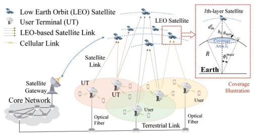
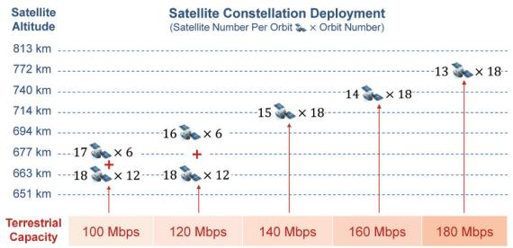
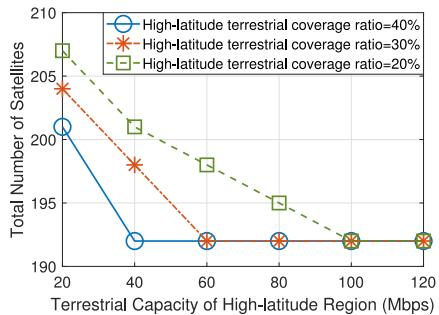

# Mega-Constellation Design for Integrated Satellite-Terrestrial Networks for Global Seamless Connectivity

Pengfei Wang , Graduate Student Member, IEEE, Boya Di , Member, IEEE, and Lingyang Song, Fellow, IEEE

Abstract—In this letter, we study the integrated satelliteterrestrial network where users can access the core network by the backhaul links via both multi-layer satellites in the space and terrestrial access points on the ground. The mega-constellation design for such an integrated satellite-terrestrial network is investigated to realize the global seamless connectivity and provide high-rate backhaul transmission. First, we propose a theoretical framework for the average uplink capacity analysis. Second, based on the developed theoretical framework, we design a mega satellite constellation given the capacity of terrestrial backhaul links for realizing the global connectivity with the minimum satellite number. Simulation results show that as the terrestrial infrastructures are distributed more evenly in latitude, the designed mega-constellation first requires more satellites and then remains unchanged regardless of the terrestrial transmission capacity of high-latitude user terminals.

Index Terms—Integrated satellite-terrestrial network, mega constellation, satellite number minimization.

# I. INTRODUCTION

W ITH the development of 5G mobile network, variousmobile applications, e.g., automotive driving or smart city, have triggered the growing needs for the ubiquitous coverage and high-rate transmission services [1]. Future 6G mobile network is expected to provide the continuous network connection at anywhere and anytime [2]. However, the terrestrial infrastructures are not sufficient to support the full-coverage high-rate backhaul services due to the limited resources and the knotty deployment of access points [3]. Benefitted from the high operating frequency and vast coverage, the satellite communication network is a promising solution for the seamless user access and high-rate backhaul services around the world [4]. Making use of both satellite and terrestrial fiber links, user terminals (UTs) access the core network [5].

Most current satellite constellations are independently constituted by single-layer low Earth orbit (LEO) satellites [6], [7] to provide global backhaul transmission service. Specifically, a global LEO constellation is designed in [7] providing the quality-of-service-guaranteed global backhaul transmission service. However, given the limited orbit resources on a single satellite layer, multi-layer satellite constellation is widely applied in practice, e.g., Starlink and Telesat, and thus, the multi-layer constellation design needs to be considered.

Manuscript received 7 March 2022; revised 12 April 2022; accepted 27 April 2022. Date of publication 2 May 2022; date of current version 9 August 2022. This work was supported in part by the National Key Research and Development Project of China under Grant 2020YFB1807100; and in part by the Beijing Natural Science Foundation under Grant 4222005 and Grant L212027. The associate editor coordinating the review of this article and approving it for publication was N. Saeed. (Corresponding authors: Lingyang Song; Boya Di.)

The authors are with the School of Electronics, Peking University, Beijing 100871, China (e-mail: wangpengfei13@pku.edu.cn; diboya@pku.edu.cn; lingyang.song@pku.edu.cn).

Digital Object Identifier 10.1109/LWC.2022.3171574

flowchart

Satellite coverage illustration showing LEO satellite coverage between Low Earth Orbit, User Terminal, LEO-based Link, and Cellular Link, with coverage illustration and coverage example.

Fig. 1. Integrated satellite-terrestrial network model.

Moreover, the influence of the terrestrial network on constellation design is ignored in current works. In practice, the satellite network is constructed on top of the terrestrial network, and thus, the satellite deployment relies heavily on the distribution and terrestrial transmission capacity of user terminals. Therefore, the satellite and terrestrial networks need to be considered jointly for the satellite constellation design.

To handle these issues, we discuss the mega-constellation design for the integrated satellite-terrestrial network given the terrestrial terminal deployment, aiming to support both global seamless connectivity and high-rate backhaul transmission. Against this background, two questions remain to be answered:

• First, how to decipt the uplink capacity of the integrated backhaul network influenced by the number of satellites and the terrestrial transmission capacity of UTs?   
Second, how to design the mega-constellation for multilayer satellites to fulfill the rate-differentiated transmission demands with the minimum number of satellites?

To address the aforementioned challenges, we propose an uplink capacity theoretical framework where the average uplink capacity is analyzed given the terrestrial distribution density of UTs. Based on the data rate of satellites analyzed in the theoretical framework, we optimize the mega-constellation of multi-layer satellites to minimize the total required satellites number.

# II. SYSTEM MODEL

In this section, we first describe the network structure, and then introduce the satellite coverage and transmission model.

# A. Network Structure

As illustrated in Fig. 1, we consider an integrated satelliteterrestrial network consisting of the UTs as well as multiple layers of LEO satellites on different altitudes. The terrestrial users transmit the data to the UTs over the C-band spectrum. The UTs then access the core network via both two types of backhaul links: through the terrestrial link once the UT is within the range of the optical network and through the satellite link via either layer of LEO satellite1 at anywhere.

1Assume that the UTs are equipped with the GNSS receivers, being able to estimate the position of the satellite, and thus, the Doppler shift of LEO satellites can be significantly compensated [2], [8].

Specifically, the satellite links are established over the Kaband spectrum and all satellites deliver the data to the core network via the satellite gateways.

# B. Satellite Coverage Model

We discuss the coverage of the satellite on layer l assuming that the Earth is a sphere with radius R. The coverage area of a satellite is determined by its altitude $h _ { l }$ and the elevation angle range of the line-of-sight (LoS) terrestrial-satellite link. Let $\theta _ { m i n }$ represent the minimum elevation angle of the UT, so the UT is considered within the coverage of a satellite when its elevation angle $\theta _ { l } \geq \theta _ { m i n }$ . Therefore, the coverage area $S _ { l }$ of a satellite is the area of a spherical crown with the angular radius $\begin{array} { r } { \phi _ { l } ^ { m a x } = \operatorname { a r c c o s } ( \frac { R } { R + h _ { l } } \dot { \cos } \theta _ { m i n } ) - \theta _ { m i n } } \end{array}$ , expressed by

$$
S _ {l} = 2 \pi R ^ {2} \left(1 - \cos \phi_ {l} ^ {\max}\right). \tag {1}
$$

# C. Satellite Transmission Model

We discuss the data transmission of the UT to the satellite within time slot2 t. For the brevity of expression, the index t is omitted. The antenna arrays are assumed at both satellites and UTs for the directional beamforming. For the tractability of the analysis, an approximated sectored array model is widely adopted for formulating the antenna gain of each beam [9]. Single-beam is discussed for the satellite that all the UTs con-$G _ { s a t e } ^ { M }$ to that satellite are within its main lobe with the gain. Multi-beam is assumed for each UT to connect with mis $G _ { u t } ^ { \dot { M } }$ e satellites, where the antenna gain of UT’s eafor the desired link in the main lobe and $G _ { u t } ^ { S }$ eamfor the interference link in the side lobe. Considering the satellite link from UT q to satellite m on the l-th layer, the signal to interference plus noise ratio $( \mathrm { S I N R } ) \ \gamma _ { m , q } ^ { l }$ at the satellite is

$$
\gamma_ {m, q} ^ {l} = \frac {P G _ {u t} ^ {M} G _ {s a t e} ^ {M} h _ {r , q m , p} \left(d _ {m , q} ^ {l}\right) ^ {- \alpha}}{\left(\sum_ {n = 1} ^ {L} k _ {n}\right) \left(\sigma^ {2} + I _ {m , q} ^ {l}\right)}. \tag {2}
$$

where P is the UT’s total transmitting power and $k _ { n }$ denotes the average number of connected satellites on the n-th layer. An equal power scheme is used by the UT to allocate the same transmitting power to each satellite backhaul link. The rain $h _ { r , q m , p } = 1 0 ^ { - \frac { A { r } , q m , p } { 1 0 } }$ Ar,qm,p fading is considered over the $\mathrm { K a }$ band, where $A _ { r , q m , p }$ = 10[dB] denotes the rain attenuation exceeded for $p \%$ of an average year, which is determined by the geometrical and electrical characteristics of the antenna [10]. For convenience, we define $G _ { 0 } = G _ { s a t e } ^ { M } G _ { u t } ^ { M } h _ { r }$ e G Mut hr , where hr is $h _ { r }$ 0 =the expectation of the rain fading. dlm,q $d _ { m , q } ^ { l }$ denotes the distance between UT q and satellite m on the l-th layer, and α is the path loss exponent. The additive white gaussian noise is considered following $\mathcal { C N } ( 0 , \sigma ^ { 2 } )$ distribution, and $I _ { m , q } ^ { l }$ is the interference.

(0 )We assume that all satellites share the same spectrum resource pool with total bandwidth B for the data transmission. In total J orthogonal subchannels are divided and allocated by each satellite to the UTs within its coverage according to their satellite transmission rate requirements. Thus, the transmission rate $R _ { m , q } ^ { l }$ of the satellite link from UT q to satellite m on the l-th layer is influenced by the number $V _ { m , q } ^ { l }$ of subchannels allocated to UT q, which is expressed by

$$
R _ {m, q} ^ {l} = \frac {B V _ {m , q} ^ {l}}{J} \log \left(1 + \gamma_ {m, q} ^ {l}\right). \tag {3}
$$

2The network topology is viewed as static in each time slot with 1s duration. Note that any UT q can be served by multiple satellites simultaneously once the elevation angle of the satellite is not smaller than $\theta _ { m i n }$ for UT q. Let $\mathcal { A } _ { l } ^ { q }$ denote the set of serving satellites on layer l for UT $q ,$ where $\mathcal { A } _ { l } ^ { q } = \{ m \ | \ \theta _ { m } ^ { l } \geq \theta _ { m i n } \}$ . =Considering L satellite layers, the total data rate of UT q is

$$
R _ {q} = \sum_ {l = 1} ^ {L} \sum_ {m \in \mathcal {A} _ {l} ^ {q}} R _ {m, q} ^ {l}. \tag {4}
$$

# III. UPLINK CAPACITY THEORETICAL FRAMEWORK

In this section, we propose an uplink capacity theoretical framework for the integrated satellite-terrestrial network.

# A. Interference Model

Given the on-demand deployment of the UTs, their locations are commonly assumed to follow the homogeneous Poisson point process (HPPP)  with density $\lambda ~ \mathrm { U T s } / \mathrm { k m ^ { 2 } }$ . The rate Φrequirement of the UT’s backhaul service is represented by $C _ { t h }$ . The average coverage ratio of the terrestrial network is denoted by $\rho .$ Each UT within the coverage of the terrestrial network is provided by the transmission capacity of $\boldsymbol { C } _ { t e r r }$ .

The orthogonal subchannels are allocated by the satellite to the UTs randomly within its coverage, and the allocated number is proportional to the satellite rate requirements. Thus, the distribution of the interfering UT on the same subchannel for UT q follows the HPPP with density $\begin{array} { r } { \lambda ^ { \prime } = \frac { \lambda } { J } ~ \mathrm { U T s / k m ^ { 2 } } } \end{array}$ . =The interference of UT q- satellite m (layer l) link is

$$
I _ {m, q} ^ {l} = V _ {m, q} ^ {l} \sum_ {n = 1} ^ {L} \sum_ {q ^ {\prime} \in D _ {m, q} ^ {n}} \frac {P G _ {u t} ^ {S} G _ {s a t e} ^ {M} h _ {r , q ^ {\prime} m , p}}{K} (d _ {m, q ^ {\prime}} ^ {l}) ^ {- \alpha}, \tag {5}
$$

where $\begin{array} { r } { K = \sum _ { n = 1 } ^ { L } k _ { n } } \end{array}$ and $D _ { m , q } ^ { n }$ is given in Proposition 1. = =1Based on Campells theorem, the average interference of that satellite backhaul link $I _ { m , q } ^ { l , ( i n ) }$ (within the terrestrial coverage) and $I _ { m , q } ^ { l , ( o u t ) }$ (outside the terrestrial coverage) are expressed by

$$
\mathbb {E} \left[ I _ {m, q} ^ {l, (s)} \right] = \frac {P G _ {I}}{K} \sum_ {n = 1} ^ {L} \frac {C _ {s a t e} ^ {(s)} J \lambda^ {\prime}}{\left(C _ {t h} - C _ {t e r r} \rho\right) \lambda S _ {l}} \int_ {q ^ {\prime} \in D _ {m, q} ^ {n}} \left(d _ {m, q ^ {\prime}} ^ {l}\right) ^ {- \alpha} d q ^ {\prime}. \tag {6}
$$

where $s \in \{ i n , o u t \}$ and $G _ { I } = G _ { u t } ^ { S } G _ { s a t e } ^ { M } h _ { r }$ . We define the $C _ { s a t e } ^ { ( i n ) } = C _ { t h } - C _ { t e r r }$ e satellite backhaulwhen s = in and $C _ { s a t e } ^ { ( o u t ) } = C _ { t h }$ $C _ { s a t e } ^ { ( s ) }$ wherewhen $s \ = \ o u t$ =. Given the orthogonal subchannel among different =UTs, the average allocated subchannel number is proportional to the ratio of the rate requirement of UT q to the total rate requirement in the coverage area $S _ { l }$ of the same satellite.

l Proposition 1: The interference region $D _ { m , q } ^ { n }$ of co-layer and cross-layer interfering UTs is:

$$
D _ {m, q} ^ {n} = \left\{ \begin{array}{l} \left\{q ^ {\prime} \mid d _ {o} ^ {l} \leq d _ {m, q ^ {\prime}} ^ {l} \leq \sqrt {h _ {l} ^ {2} + 2 R h _ {l}} \right\}, n = l, \\ \left\{q ^ {\prime} \mid h _ {l} \leq d _ {m, q ^ {\prime}} ^ {n} \leq \sqrt {h _ {l} ^ {2} + 2 R h _ {l}} \right\}, n \neq l. \end{array} \right.
$$

The smallest distance $d _ { o } ^ { l }$ from the UT within coverage of the neighbouring satellite to satellite m satisfies that

$$
(d _ {o} ^ {l}) ^ {2} = R ^ {2} + (R + h _ {l}) ^ {2} - 2 R (R + h _ {l}) \cos \phi_ {l} ^ {o}, \tag {7}
$$

where $\begin{array} { r l r } { \phi _ { l } ^ { o } } & { { } = } & { \operatorname* { m a x } \{ 0 , \sqrt { \frac { 8 \pi R ^ { 2 } ( 1 - \cos \phi _ { l } ^ { m a x } ) } { 2 \sqrt { 3 } k _ { l } } } - R \cdot \phi _ { l } ^ { m a x } \} / R } \end{array}$ and $k _ { l }$ 2 3is the connected satellite number on layer l for each UT. The longest distance of the LoS path between the interfering UT $q ^ { \prime }$ and satellite m on layer l is indicated by $\sqrt { h _ { l } ^ { 2 } + 2 R h _ { l } }$ . Proof: See Appendix A.

Therefore, we can obtain the average interference in (6):

$$
\begin{array}{l} \mathbb {E} [ I _ {m, q} ^ {l, (s)} ] = \frac {2 \pi R P G _ {I} C _ {s a t e} ^ {(s)}}{(\alpha - 2) (C _ {t h} - C _ {t e r r} \rho) K S _ {l}} \left[ \eta_ {l} \frac {(d _ {o} ^ {l}) ^ {2 - \alpha} - (2 R h _ {l} + h _ {l} ^ {2}) ^ {\frac {2 - \alpha}{2}}}{R + h _ {l}} \right. \\ \left. + \left(\sum_ {n \neq l} \eta_ {n} \frac {\left(h _ {l}\right) ^ {2 - \alpha} - \left(2 R h _ {l} + h _ {l} ^ {2}\right) ^ {\frac {2 - \alpha}{2}}}{R + h _ {l}}\right) \right], \tag {8} \\ \end{array}
$$

where $\eta _ { l } = k _ { l } / ( \sum _ { n = 1 } ^ { L } k _ { n } )$ represents the proportion of the = ( =1 )satellite link number to the l-th layer of satellite (denoted by $k _ { l } )$ in all the satellite links of the same UT.

# B. Uplink Capacity Analysis

In this part, we first derive the average spectrum efficiency $\mu _ { l } ^ { ( s ) }$ of the satellite link from the UT (where $s \in \{ i n , o u t \} )$ to the satellite on the layer l, and then derive the average data rate $C _ { U T } ^ { ( s ) }$ of the UTs considering all the terrestrial fiber links. The uplink capacity of the integrated satellite-terrestrial network is calculated considering all UTs.

Proposition 2: The average spectrum efficiency $\mu _ { l } ^ { ( s ) }$ is

$$
\mu_ {l} ^ {(s)} = \frac {\mathcal {F} ((d _ {m} ^ {l}) ^ {2} , X , Y) - \mathcal {F} ((h _ {l}) ^ {2} , X , Y)}{2 R (R + h _ {l}) (1 - \cos \phi_ {l} ^ {m a x}) \ln 2}, \tag {9}
$$

where the longest distance between satellite m (on layer l) and its serving UT is $d _ { m } ^ { l } = \sqrt { ( R \sin \theta _ { m i n } ) ^ { 2 } + h _ { l } ^ { 2 } + 2 R h _ { l } - }$ R $\theta _ { m i n }$ . The function is defined by $\mathcal { F } ( v , X , Y )$ $v [ { Y _ { 2 } } { F _ { 1 } } ( 1 , { \textstyle { \frac { 1 } { Y } } } ; 1 + { \textstyle { \frac { 1 } { Y } } } ; - X v ^ { Y } ) + \ln ( 1 + \dot { X } v ^ { Y } ) - { Y } ]$ ) =and we [ 2 1(1 ;set that X $\begin{array} { r } { X = \frac { P G _ { 0 } } { K ( \sigma ^ { 2 } + \mathbb { E } [ I _ { m _ { \alpha } } ^ { l } ] ) } , Y = - \frac { \alpha } { 2 } } \end{array}$ K σ 2 E I lm , q  , Y = − α . Y ;PG0

( + [ ])Proof: See Appendix B.

The average data rate of each satellite link $\mathbb { E } [ R _ { m , q } ^ { l } ]$ from [the UT to the satellite on the l-th layer, denoted by $C _ { l } ^ { ( s ) }$ ], is the product of the available bandwidth for the UT and the average spectrum efficiency $\mu _ { l } ^ { ( s ) }$ . According to the properties of PPP, we express $C _ { l } ^ { ( s ) } = \mathbb { E } [ R _ { m , q } ^ { l } ]$ as:

$$
\begin{array}{l} C _ {l} ^ {(s)} = \sum_ {u _ {1} = 1} ^ {\infty} \sum_ {u _ {2} = 1} ^ {\infty} \left[ (\rho \lambda S _ {l}) ^ {u _ {1}} \frac {e ^ {- \rho \lambda S _ {l}}}{u _ {1} !} \right] \left[ ((1 - \rho) \lambda S _ {l}) ^ {u _ {2}} \frac {e ^ {(\rho - 1) \lambda S _ {l}}}{u _ {2} !} \right] \\ \cdot \frac {C _ {s a t e} ^ {(s)} B \cdot \mu_ {l}}{\left(C _ {t h} - C _ {t e r r}\right) \rho u _ {1} + C _ {t h} (1 - \rho) u _ {2}}. \tag {10} \\ \end{array}
$$

Given that the UT connects with $k _ { l }$ satellites on the l-th layer, the average data rate of the UT within and outside the terrestrial network coverage are be expressed by

$$
C _ {U T} ^ {(i n)} = \sum_ {l = 1} ^ {L} k _ {l} C _ {l} ^ {(i n)} + C _ {t e r r}, C _ {U T} ^ {(o u t)} = \sum_ {l = 1} ^ {L} k _ {l} C _ {l} ^ {(o u t)}. \tag {11}
$$

Thus, the uplink capacity C for the entire integrated satelliteterrestrial network can be modeled by the sum rate of both satellite and terrestrial fiber links of all UTs.

$$
C = \rho \lambda S _ {E} \cdot C _ {U T} ^ {(i n)} + (1 - \rho) \lambda S _ {E} \cdot C _ {U T} ^ {(o u t)}, \tag {12}
$$

where $S _ { E }$ denotes the area of the whole earth. The uplink capacity is related with the average number of satellites

kl $( 1 \leq l \leq L )$ serving the same UT as well as the coverage (1 )ratio ρ and the transmission capacity $\boldsymbol { C } _ { t e r r }$ of the terrestrial network. Given the density λ and data rate requirement $C _ { t h }$ of the UTs, the uplink capacity C can be calculated by solving the equations (8)-(12).

# IV. MEGA-CONSTELLATION DESIGN

In this section, we first formulate the satellite number minimization problem, and then design the mega-constellation using the dynamic programming based method.

# A. Satellite Number Minimization Problem Formulation

We aim to minimize the total number of deployed satellites in all layers given the terrestrial optical network while satisfying the rate requirements of all UTs for backhaul transmission. Let $N _ { l }$ represent the number of orbits on layer l (with altitude $h _ { l } )$ and let $M _ { i } ^ { l }$ denote the number of satellites in orbit i on layer l. Thus, the satellite number minimization problem is

$$
\min _ {\boldsymbol {h}, \boldsymbol {N}, \boldsymbol {M}} \sum_ {1 \leq l \leq L} \sum_ {i \in \mathcal {N} _ {l}} M _ {i} ^ {(l)}, \tag {13}
$$

$$
s. t. C _ {U T} ^ {(s)} \geq C _ {t h}, \forall s \in \{i n, o u t \}, \forall U T, \forall t \tag {13a}
$$

where $C _ { U T } ^ { ( s ) }$ is the average data rate of the UT inside $( s = i n )$ and outside $( s = o u t )$ = of the terrestrial network coverage.

# B. Mega-Constellations Design

In this part, we design the mega-constellation for the integrated satellite-terrestrial network via dynamic programming, aiming to minimize the number of total deployed satellites.

1) One-Coverage Satellite Constellation Deployment: We first consider a one-coverage satellites constellation deployment $( \mathrm { i . e . , ~ } L = 1 , k = 1 )$ with polar orbits [6] on the same = =satellite layer l. For the seamless coverage, the number of satellites deployed on each orbit is assumed to be same, expressed by $M ^ { ( \bar { l } ) } = M _ { 1 } ^ { ( l ) } = M _ { 2 } ^ { ( l ) } = \cdots = M _ { i } ^ { ( l ) }$ M . The satellites moves = 1 = 2 = =in the same direction with a phase difference $\pi / M ^ { ( l ) }$ between two neighbouring orbits. Considering the hemisphere divided by one polar orbit, to satisfy the seamless coverage of the equator, the coverage angular radius $\phi _ { l } ^ { m a x }$ and the number of orbits N satisfy the relation that

$$
(N - 1) \phi_ {l} ^ {\text { max }} + (N + 1) \Delta_ {l} = \pi , \tag {14}
$$

where $\Delta _ { l } = \operatorname { a r c c o s } ( \cos \phi _ { l } ^ { m a x } / \cos ( \pi / M ^ { ( l ) } ) )$ according to the Δ = arccos(cos cos( ))geometry relation. We can express the relation among $\theta _ { m i n }$ $h _ { l } , N ,$ and satellites number $\hat { M } ^ { ( l ) }$ on each orbit as

$$
\begin{array}{l} (N + 1) \arccos \left[ \cos \left[ \arccos \left(\frac {R \cos \theta_ {m i n}}{R + h _ {l}}\right) - \theta_ {m i n} \right] / \cos \left(\frac {\pi}{M ^ {(l)}}\right) \right] \\ + (N - 1) \left[ \arccos \left(\frac {R \cos \theta_ {\text { min }}}{R + h _ {l}}\right) - \theta_ {\text { min }} \right] = \pi . \tag {15} \\ \end{array}
$$

Definition 1: A UT q is k-covered (where ${ \pmb k } = \{ k _ { l } \} , 1 \le$ $l \leq \dot { L } )$ indicates that UT q is covered by $k _ { l }$ = 1satellites on layer l, where $k _ { l }$ represents the l-th coverage degree of UT q for the satellites on layer l. The region is k-covered if each UT $q$ within this region is k-covered.

Based on the uplink capacity framework in Section III, the average data rate $C _ { U T } ^ { ( s ) } ( k )$ of the UT can be reached when the ( )whole discussed region is k-covered. Therefore, to satisfy the rate requirement $C _ { t h }$ for any UT in any position, we need to

# Algorithm 1 Satellite Number Minimization Algorithm

Input: Maximum satellite layer L; Satellite orbit number N; Satellite number per orbit $M ^ { ( l ) }$ for each layer; Required average data rate $C _ { t h } ^ { ( s ) } , \forall s .$ .

Output: Optimal satellite altitude h, optimal coverage degree $k _ { f } .$

1: Calculate the altitude $h _ { l }$ for each layer l given $M ^ { ( l ) }$ according to (15).   
2: Calculate the average rate $C _ { l } ^ { ( s ) }$ of the l-th layer satellite link given (10).   
$\chi ( 1 , t ) = \lceil t / C _ { l } ^ { ( s ) } \rceil N M ^ { ( 1 ) } , 1 \leq t \leq C _ { t h } ^ { ( s ) } .$   
4:  Layer number $2 \leq l \leq \dot { L }$ (1 )do   
5: ≤  ≤   Calculate the minimum satellite number $\chi ( l , C _ { t h } ^ { ( s ) } )$ according to (17).   
6: $\begin{array} { r } { \pmb { k } _ { t h } = \arg \operatorname* { m i n } _ { \pmb { k } } \chi ( l , C _ { t h } ^ { ( s ) } ) } \end{array}$   
7: $l \stackrel { \cdot } {  } l + 1 .$

realize that the whole earth is seamlessly $C _ { l J T } ^ { ( s ) } ( \pmb { k } _ { t h } ) \geq C _ { t h } , \forall s \in \{ i n , o u t \} , \forall U T$ . $k _ { t h } \mathrm { - c o v e r e d }$ so that

( )2) Global Coverage for the Required Data Rate: Considering L satellite layers and terrestrial capacity $C _ { t e r r } .$ , for providing the average data rate $C _ { t h }$ , the satellite minimization problem (13) can be decoupled from reformulated as below.

$$
\min _ {\boldsymbol {h}, \boldsymbol {k}} \sum_ {l = 1} ^ {L} k _ {l} N \cdot M ^ {(l)} \tag {16}
$$

$$
s. t. C _ {U T} ^ {(s)} \geq C _ {t h}, 0 \leq k _ {l} \leq \left\lceil \frac {C _ {s a t e} ^ {(s)}}{C _ {l} ^ {(s)} \left(h _ {l}\right)} \right\rceil , \forall s, \forall U T, \tag {16a}
$$

where $k _ { l }$ is the coverage degree of the l-th satellite layer. Problem (16) is a complete knapsack problem, where the volume of each object is $\setminus M ^ { ( l ) }$ and the weight of each object is $C _ { l } ^ { ( s ) } ( h _ { l } )$ . We aim to minimize the total number of satellites ( )(i.e., total weight of the knapsack) while providing $C _ { t h }$ data rate to each UT in any position (i.e., filling the knapsack with size $C _ { t h } )$ . Given that the number of satellites $M ^ { ( \bar { l } ) }$ on each orbit is a natural number, the possible value of satellite altitude $h _ { l }$ is discrete with each feasible $M ^ { ( l ) }$ according to (15), and the reachable rate $C _ { l } ^ { ( s ) } ( h _ { l } )$ of each satellite link is also discrete.

( )To solve the complete knapsack problem (16), we then propose a dynamic programming based satellite number minimization (DP-SNM) algorithm. Let $\chi ( l , c )$ denote the min-( )imum satellite number when deploying the satellites from layer 1 to layer l (initialed by $L ) .$ , where t denotes the remaining data rate required by the UTs (initialed by C (s)sate ). The recursive rela- $C _ { s a t e } ^ { ( s ) } )$ tion between the minimum satellite number can be expressed by the following equation where $0 < = k _ { l } C _ { l } ^ { ( s ) } < = c$ .

$$
\chi (l, c) = \min _ {k _ {l}} \left\{\chi \left(l - 1, c - k _ {l} C _ {l} ^ {(s)}\right) + k _ {l} N M ^ {(l)}, \left\lceil \frac {C _ {\text {sate}} ^ {(s)}}{C _ {l} ^ {(s)}} \right\rceil N M ^ {(l)} \right\}. \tag {17}
$$

The DP-SNM algorithm is described in Algorithm 1. First, given $M ^ { ( l ) }$ for layer l, we calculate the optimal altitude $h _ { l }$ for each layer l and derive the data rate C (s)l $\bar { C } _ { l } ^ { ( s ) }$ provided by the l-th layer of satellites to each satellite. Second, we initialize the minimum satellite number $\chi ( 1 , c )$ when deploying (1 )the satellites on only one layer. Third, we calculate the total satellite number with increasing l according to the dynamic programming based recurrence relation (17). Using the DP-SNM algorithm, we can obtain the optimal $\boldsymbol { k } _ { t h }$ that provides seamless $C _ { t h }$ data rate for any UT.

The complexity of Algorithm 1 is then analyzed. Denote the maximum number of each UT’s connected co-layer satellites by $W = \operatorname* { m a x } _ { l , s } \{ \lceil C _ { s a t e } ^ { ( s ) } / C _ { l } \rceil \}$ . Using the dynamic = maxprogramming method, the optimal vector k can be obtained by calculating $\chi ( L , C _ { t h } )$ recursively according to relation (17). ( )Thus, the complexity of the DP-SNM algorithm is $O ( S L W ^ { 2 } )$ for the L deployable satellite layers.

TABLE I PARAMETER SETTING 

<table><tr><td>Parameters</td><td>Value</td></tr><tr><td>Total transmitting power of each UT P</td><td>2 W</td></tr><tr><td>Antenna gain of the UT G^M_{ut}, G^S_{ut}</td><td>31.2 dBi, -10 dBi</td></tr><tr><td>Antenna gain of the satellite G^M_{sate}, G^S_{sate}</td><td>37.1 dBi, -6.75 dBi</td></tr><tr><td>Main lobe beamwidth of the satellite and UT</td><td>60°, 2.5°</td></tr><tr><td>Bandwidth for satellite data transmission B</td><td>800 MHz</td></tr><tr><td>Number of subchannels J for each satellite</td><td>1000</td></tr><tr><td>Noise density for Ka-band transmission σ2</td><td>-174 dBm/Hz</td></tr><tr><td>Density of UTs λ</td><td>4 × 10-6km-2</td></tr><tr><td>Minimum elevation angle θmin</td><td>10°</td></tr><tr><td>Number of one-coverage satellite orbits N</td><td>6</td></tr><tr><td>Number of feasible satellites layers</td><td>40</td></tr></table>

<table><tr><td colspan="2">Terrestrial Coverage Ratio</td><td colspan="5">50%</td><td colspan="6">60%</td></tr><tr><td colspan="2">Terrestrial Capacity (Mbps)</td><td colspan="2">100</td><td colspan="2">120</td><td>140</td><td colspan="2">100</td><td colspan="2">120</td><td colspan="2">140</td></tr><tr><td colspan="2">Satellite Altitude (km)</td><td>663</td><td>677</td><td>663</td><td>694</td><td>714</td><td>677</td><td>714</td><td>694</td><td>740</td><td>714</td><td>867</td></tr><tr><td colspan="2">Orbit Number</td><td>12</td><td>6</td><td>12</td><td>6</td><td>18</td><td>12</td><td>6</td><td>6</td><td>12</td><td>12</td><td>6</td></tr><tr><td colspan="2">Satellite Number/Orbit</td><td>18</td><td>17</td><td>18</td><td>16</td><td>15</td><td>17</td><td>15</td><td>16</td><td>14</td><td>15</td><td>11</td></tr><tr><td rowspan="2">Total Number of Satellites</td><td>Integrated</td><td colspan="2">318</td><td colspan="2">294</td><td>270</td><td colspan="2">294</td><td colspan="2">264</td><td colspan="2">246</td></tr><tr><td>Satellite-only</td><td colspan="11">420</td></tr></table>

Fig. 2. Optimal constellation deployment solutions.

# V. SIMULATION RESULTS

In this section, we present the optimal satellite deployment scheme for global connectivity and show the minimum number of required satellites satisfying the backhaul rate requirement.

The main parameters and their default values are set as 3GPP R-15 in Table I [11]. For fulfilling the rate requirements of the backhaul services, we consider that $C _ { t h } = 2 0 0$ Mbps for = 200all the UTs. We apply the rain fading parameters given by ITU-R P.618 [10]. We discuss the number of deployed satellites given different terrestrial capacity $C _ { t e r r } \sim ( 1 0 0 , 1 8 0 )$ Mbps (100 180)and different global average coverage ratio of the terrestrial network $\rho \sim ( 5 0 \% , 6 0 \% )$ with the pathloss factor $\alpha = 2 . 5$ .

(50% 60%) = 2 5The optimal constellation deployment solutions are presented in Fig. 2 given different terrestrial capacity Cterr . It is shown that compared with the satellite-only network, the required number of satellites largely decreases when considering the terrestrial network. As the coverage ratio of the terrestrial network increases, the altitude of satellites rises up and the number of satellites decreases. Fig. 3 presents the optimal deployed altitude and number of satellites on each orbit given different terrestrial capacities with the coverage ratio $\rho = 5 0 \%$ . We can observe from the optimal constellation = 50%that as the terrestrial capacity increases, the deployed satellite altitude increases so that fewer satellites are required to deploy.

In Fig. 4, we evaluate the required satellite number given different terrestrial capacities in different regions. Assume that $C _ { t e r r } ^ { l o w } = 1 8 0$ terr and $\rho \ : = \ : 6 0 \%$ in the low-latitude and = 180 Mbps = 60mid-latitude regions (i.e., between $6 0 ^ { \circ } \mathrm { S }$ and $6 0 ^ { \circ } \mathrm { N } )$ . Fig. 4 shows the total number of satellites vs. the terrestrial capacity in high-latitude regions (i.e., larger than $6 0 ^ { \circ } )$ given different high-latitude terrestrial network coverage ratio. It is shown that the satellite number reduces with a decreasing rate as $C _ { t e r r } ^ { h i g h }$ grows. A maximum high-latitude terrestrial capacity $C _ { o } ^ { * }$ exists where the satellite number cannot reduce anymore when

bar

Satellite Constellation Deployment (Satellite Number Per Orbit × Orbit Number)
| Terrestrial Capacity | 100 Mbps | 120 Mbps | 140 Mbps | 160 Mbps | 180 Mbps |
| :--- | :--- | :--- | :--- | :--- | :--- |
| 651 km | 18 | 18 | 15 | 14 | 13 |
| 663 km | 12 | 12 | 12 | 12 | 12 |
| 677 km | 6 | 6 | 6 | 6 | 6 |
| 694 km | 6 | 6 | 6 | 6 | 6 |
| 714 km | 6 | 6 | 6 | 6 | 6 |
| 740 km | 6 | 6 | 6 | 6 | 6 |
| 772 km | 6 | 6 | 6 | 6 | 6 |
| 813 km | 6 | 6 | 6 | 6 | 6 |

Fig. 3. Satellite altitude of the optimized constellation vs. terrestrial capacity.

line

| Terrestrial Capacity of High-latitude Region (Mbps) | High-latitude terrestrial coverage ratio=40% | High-latitude terrestrial coverage ratio=30% | High-latitude terrestrial coverage ratio=20% |
| -------------------------------------------------- | ------------------------------------------- | ------------------------------------------- | ------------------------------------------- |
| 20                                                 | 201                                         | 204                                         | 207                                         |
| 40                                                 | 192                                         | 198                                         | 201                                         |
| 60                                                 | 192                                         | 192                                         | 198                                         |
| 80                                                 | 192                                         | 192                                         | 195                                         |
| 100                                                | 192                                         | 192                                         | 192                                         |
| 120                                                | 192                                         | 192                                         | 192                                         |

Fig. 4. Total number of satellites vs. high-latitude terrestrial capacity.

$C _ { t e r r } ^ { h i g h } > C _ { o } ^ { * }$ , representing that more larger terrestrial capacity in the high-latitude regions cannot contribute to saving satellites anymore. Moreover, with the larger coverage ratio of the terrestrial network, the satellite number reaches the minimum at a smaller high-latitude terrestrial capacity.

# VI. CONCLUSION

In this letter, we studied the integrated satellite-terrestrial network. A theoretical framework for the uplink capacity analysis was proposed considering the terrestrial capacity. A mega-constellation with multi-layer satellites was designed given any terrestrial capacity, where the differentiated data rate requirements of all UTs can be satisfied even in the maximum interference case. The following conclusions are drawn. First, the optimal constellation deployment is obtained with the minimum number of satellites, where the deployed altitude increases with the terrestrial capacity. Second, as the terrestrial infrastructures are distributed more evenly in latitude, the mega-constellation first requires fewer satellites and then remains unchanged regardless of the terrestrial transmission capacity of high-latitude user terminals.

# APPENDIX A

Interference From Co-Layer Satellite Links $( n \ = \ l ) { \mathrm { : } }$ Let $d _ { m , q } ^ { l }$ lm , =denote the distance between the UT q and satellite m on the l-th layer. The region of co-layer interfering UTs is expressed by $D _ { m , q } ^ { l } = \{ q ^ { \prime } \ | \ d _ { o } ^ { l } \ \leq \ d _ { m , q ^ { \prime } } ^ { l } \ \leq \ \sqrt { h _ { l } ^ { 2 } + 2 R h _ { l } } \}$ , where $d _ { o } ^ { l }$ represents the smallest distance from the UT of the neighbouring satellite cell to satellite m, and $\sqrt { h _ { l } ^ { 2 } + 2 R h _ { l } }$ + 2indicates the longest distance of the interference LoS path.

We then derive the expression of $d _ { o } ^ { l }$ by geometry. Given the uniform distribution, let $K _ { l }$ denote the total number of satellites on layer l expressed by Kl  π R hl 2 φmax $\begin{array} { r } { K _ { l } = \frac { k _ { l } } { 2 \pi ( R + h _ { l } ) ^ { 2 } ( 1 - \cos \phi _ { l } ^ { m a x } ) } } \end{array}$ kl $\begin{array} { r } { 4 \pi ( R + h _ { l } ) ^ { 2 } \ = \ \frac { 2 k _ { l } } { 1 - \cos \phi _ { l } ^ { m a x } } } \end{array}$ 2 ( + ) (1 cos )and the distance between the 1 cos coverage center of any satellite is equidistant to its surrounding coverage centers, expressed by bl   $\begin{array} { r } { b _ { l } = \sqrt { \frac { 8 \pi R ^ { 2 } } { \sqrt { 3 } K _ { l } } } . } \end{array}$ . The

radius of each satellite’s coverage circle is $r _ { l } = R \cdot \phi _ { l } ^ { m a x }$ . =Thus, the radius of the interference-free coverage $r _ { l } ^ { \dot { o } } = $ max $\{ 0 , b _ { l } - r _ { l } \}$ and the angular radius $\begin{array} { r } { \phi _ { l } ^ { o } = \frac { r _ { l } ^ { o } } { R } } \end{array}$ =. According max 0 =to the law of cosines, we can derive the distance $d _ { o } ^ { l } \ =$ $\sqrt { R ^ { 2 } + ( R + h _ { l } ) ^ { 2 } - 2 R ( R + h _ { l } ) \cos \phi _ { l } ^ { o } }$ .

\+ ( + ) 2 ( + ) cosInterference From Cross-Layer Satellite Links $( n \neq l ) { : }$ The =serving range of satellites on different layers are completely overlapped, so the interfering range is the whole LoS area. Let $D _ { m , q } ^ { n }$ indicate the region of UTs inducing the crosslayer interference, which is expressed by $D _ { m , q } ^ { n } = \{ q ^ { \prime } \mid h _ { l } \leq$ $d _ { m , q ^ { \prime } } ^ { l } \leq \sqrt { h _ { l } ^ { 2 } + 2 R h _ { l } } \} , ~ n \neq l .$ , where $h _ { l }$ =indicates the altitude of the satellite m on layer $l ,$ and $\sqrt { h _ { l } ^ { 2 } + 2 R h _ { l } }$ indicates the + 2longest distance of the LoS path between the interfering UT $q ^ { \prime }$ and satellite m.

# APPENDIX B

According to the geometry relation, the area of serving satellites on layer l for UT q (in set $\mathcal { A } _ { q } ^ { l } )$ can be calculated by $S _ { q } ^ { l } = 2 \pi ( R + h _ { l } ) ^ { 2 } ( 1 - \cos \phi _ { l } ^ { m a x } )$ . Thus, the average spectrum efficiency μ(sl $\mu _ { l } ^ { ( s ) }$ (1 cos )for layer l can be calculated by $\mu _ { l } ^ { ( s ) } =$ $\begin{array} { r }  \frac { 1 } { S _ { q } ^ { l } \ln 2 } \int _ { m \in A _ { q } ^ { l } } \ln ( 1 + \frac { P G _ { 0 } ( d _ { m , q } ^ { l } ) ^ { - \alpha } } { K ( \sigma ^ { 2 } + \mathbb { E } [ I _ { m , q } ^ { l } ] ) } ) d m \frac { \pi ( R + h _ { l } ) } { S _ { q } ^ { l } R \cdot \ln 2 } \int _ { ( h _ { l } ) ^ { 2 } } ^ { ( d _ { m } ^ { l } ) ^ { 2 } } \ln ( 1 + \frac { ( P G _ { 0 } ( d _ { m , q } ^ { l } ) ) ^ { - \alpha } }  \ln 2 ( 1 + \frac { ( P G _ { 0 } ( d _ { m , q } ^ { l } ) ) } { \ln 2 ( 1 + \frac { ( P G _ { 0 } ( d _ { m , q } ^ { l } ) ) } { \ln 2 ( 1 + \frac { ( P G _ { 0 } ( d _ { m , q } ^ { l } ) ) } { \ln 2 ( 1 + \frac { ( P G _ { 0 } ( d _ { m , q } ^ { l } ) ) } { \ln 2 ( 1 + \frac { ( P G _ { 0 } ( d _ { m , q } ^ { l } ) ) } { \ln 2 ( 1 + \frac { ( P G _ { 0 } ( d _ { m , q } ^ { l } ) ) } { \ln 2 ( 1 + \frac { ( P G _ { 0 } ( d _ { m , q } ^ { l } ) ) } { \ln 2 ( 1 + \frac { ( P G _ { 0 } ( d _ { m , q } ^ { l } ) ) } { \ln 2 ( } ) } ) } ) } } ) } ) } ) } \end{array}$ ( )K σ2 E I lm,q  ) PG0 dlm,q −α ( + )S lq R·ln 2 
 ( )(hl )2 $\frac { \overset { \cdot } { P G _ { 0 } } { \cdot } v ^ { - \frac { \alpha } { 2 } } } { K ( \sigma ^ { 2 } + \mathbb { E } [ I _ { m , q } ^ { l } ] ) } ) d v$ ( + [ ]). Denote the longest distance of between ( + [ ])satellite m (on layer l) and its serving UT by $d _ { m } ^ { l } =$ $- R \sin \theta _ { m i n } + \sqrt { ( R \sin \theta _ { m i n } ) ^ { 2 } + h _ { l } ^ { 2 } + 2 R h _ { l } }$ .

By utilizing the integral formula, let X  K σ2 E I lm q $\begin{array} { r } { X = \frac { P G _ { 0 } } { K ( \sigma ^ { 2 } + { \mathbb E } [ I _ { m . a } ^ { l } ] ) } } \end{array}$ PG0 and $\begin{array} { l l l } { Y } & { = } & { - { \frac { \alpha } { 2 } } } \end{array}$ . Define that $\begin{array} { r l r } { \mathcal { F } ( v , X , Y ) } & { = } & { \int \ln ( 1 ^ { - \cdot } + } \end{array}$ $\begin{array} { r l r } { X v ^ { Y } ) d v } & { = } & { v \widetilde { [ } Y \mathrm { ~  ~ \cdot ~ } _ { 2 } F _ { 1 } ( 1 , \frac { 1 } { Y } ; 1 + \frac { 1 } { Y } ; - X v ^ { Y } ) \mathrm { ~  ~ \cdot ~ } \mathrm { ~  ~ \ln ( 1 ~ } + } \end{array}$ $X v ^ { Y } ) - \ Y ]$ [ 2 1(1 ; 1 + ; ) + l. Thus, the average spectrum efficiency $\mu _ { l } =$ $\mathcal { F } ( ( d _ { m } ^ { l ^ { ' } } ) ^ { 2 } , X , \dot { Y } ) - \mathcal { F } ( ( h _ { l } ) ^ { 2 } , X , Y )$ $\begin{array} { r } { \overline { { 2 R ( R { + } h _ { l } ) ( 1 { - } \cos \phi _ { l } ^ { m a x } ) \ln 2 } } } \end{array}$

# REFERENCES

[1] P. Wang et al., “Heterogeneous multi-layer mobile edge computing for 6G,” Chin. J. Internet Things, vol. 4, no. 1, pp. 121–130, Apr. 2020.   
[2] O. Kodheli et al., “Integration of satellites in 5G through LEO constellations,” in Proc. IEEE GLOBECOM, Dec. 2017, pp. 1–6.   
[3] X. Ge et al., “5G wireless backhaul networks: Challenges and research advances,” IEEE Netw., vol. 28, no. 6, pp. 6–11, Nov./Dec. 2014.   
[4] B. Di et al., “Ultra-dense LEO: Integration of satellite access networks into 5G and beyond,” IEEE Wireless Commun., vol. 26, no. 2, pp. 62–69, Apr. 2019.   
[5] Z. Lin et al., “Supporting IoT with rate-splitting multiple access in satellite and aerial-integrated networks,” IEEE Internet Things J., vol. 8, no. 14, pp. 11123–11134, Jul. 2021.   
[6] D. C. Beste, “Design of satellite constellations for optimal continuous coverage,” IEEE Trans. Aerosp. Electron. Syst., vol. AES-14, no. 3, pp. 466–473, May 1978.   
[7] R. Deng et al., “Ultra-dense LEO satellite constellations: How many LEO satellites do we need?” IEEE Trans. Wireless Commun., vol. 20, no. 8, pp. 4843–4857, Aug. 2021.   
[8] I. Ali et al., “Doppler characterization for LEO satellites,” IEEE Trans. Commun., vol. 46, no. 3, pp. 309–313, Mar. 1998.   
[9] S. Singh et al., “Tractable model for rate in self-backhauled millimeter wave cellular networks,” IEEE J. Sel. Areas Commun., vol. 33, no. 10, pp. 2196–2211, Oct. 2015.   
[10] “Propagation data and prediction methods required for the design of Earth-space telecommunication systems,” ITU, Geneva, Switzerland, ITU-Recommendation P.618-12, 2015.   
[11] “Study on new radio (NR) to support non terrestrial networks (release 15),” 3GPPP, Sophia Antipolis, France, 3GPP Rep. TR 38.811 (V0.3.0), Dec. 2017.