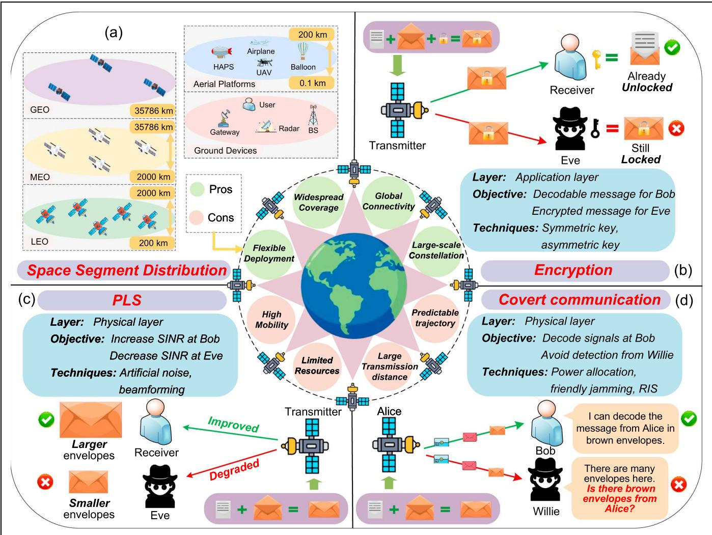
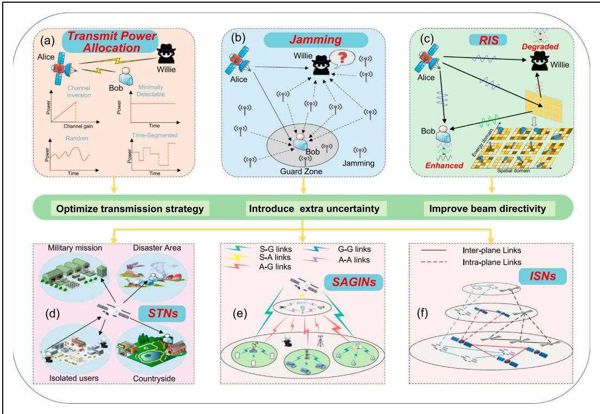
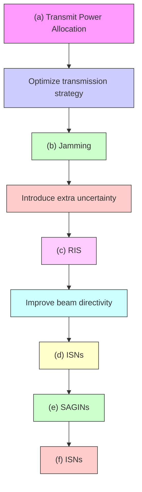
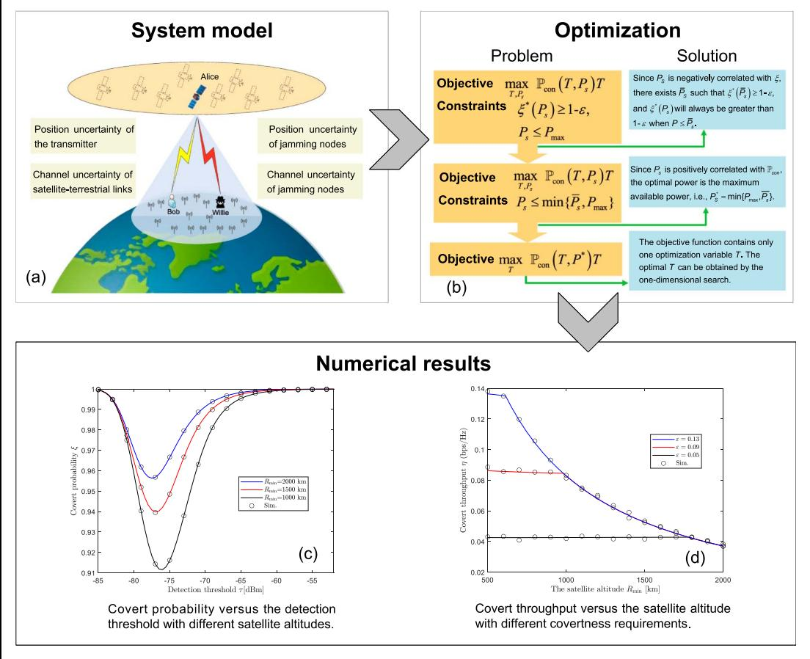

# COVERT COMMUNICATION FOR SATELLITE NETWORKS: FUNDAMENTALS, APPLICATIONS, AND FUTURE DIRECTIONS

Hao Shi , Graduate Student Member, IEEE, Jiacheng Wang , Member, IEEE, Haichao Wei , Member, IEEE,

Chengwen Xing , Member, IEEE, Na Deng , Senior Member, IEEE, Nan Zhao , Senior Member, IEEE,

Dusit Niyato , Fellow, IEEE, and George K. Karagiannidis , Fellow, IEEE

# ABSTRACT

Due to its global coverage and seamless connectivity, satellite communication is considered a promising research area for the upcoming 6G networks. However, due to the inherent openness of wireless communications and unique characteristics of satellite communication, satellite links are vulnerable to eavesdropping and other attacks by malicious devices. Fortunately, covert communication is emerging as a highly effective technique for improving the security of information transmission in satellite networks by exploiting environmental uncertainties to hide transmission signals. Thus, in this article, we explore the potential of covert communication to address the security challenges in satellite communication. We first introduce the characteristics of satellite communication and secure transmission techniques. Then, we present the basics of covert communications and discuss critical aspects of covert satellite communication. Next, we study covert satellite-terrestrial communication networks focusing on their covertness and reliability, taking into account the spatial variation of a satellite transmitter and the influence of terrestrial jamming nodes. Finally, several open research challenges in covert satellite communication are outlined.

# I. INTRODUCTION

By supporting global coverage and seamless connectivity, satellite communication has been regarded as one of the most promising research areas and a vital component of 6G networks [1]. Satellite communication can provide timely and efficient services in areas where ground infrastructure is difficult to deploy, such as rural regions, oceans, or disaster-affected zones. Meanwhile, the rapid advancement of related industrial technologies has significantly reduced the cost and cycle of satellite launches, further accelerating the development of satellite communication [2]. Thus, satellite communication will play a crucial role in future networks.

However, due to the openness of communication channels and the broadcast nature of wireless signals, along with large coverage and long transmission distance of satellite communication, satellite links are vulnerable to various malicious attacks [3]. Moreover, other inherent issues of satellites, such as Doppler shifts, limited resources, and predictable trajectories, make secure satellite communication more challenging [4]. Thus, ensuring the security of satellite information transmission is also an urgent priority.

Encryption and physical layer security (PLS) are common security techniques. However, their primary focus on safeguarding the specific content of confidential information limits the scope of protection and results in insufficient security ability [5]. Specifically, encryption employs secret keys to encrypt information, while PLS leverages the characteristics of wireless channels to prevent eavesdroppers from decoding the received signals. However, encryption is ineffective when facing attackers with powerful computing capabilities, and it requires more computing power for encryption/decryption, which may not be feasible for satellites and wireless nodes. The security of PLS is limited when facing attacks that depend on the signal transmission behavior rather than specific information content [6], [7].

Meanwhile, as mentioned above, satellite communication faces several unique challenges due to its distinct paradigm compared with other communication networks. These challenges complicate the implementation of encryption and PLS, for example, by increasing the difficulty in key management and distribution for encryption and reducing the accuracy of channel estimation for PLS. Therefore, advanced techniques are urgently needed to overcome these limitations for improved satellite communication security.

Hao Shi, Na Deng (corresponding author), and Nan Zhao are with the School of Information and Communication Engineering, Dalian University of Technology, Dalian 116024, China; Jiacheng Wang and Dusit Niyato are with the College of Computing and Data Science, Nanyang Technological University, Singapore 639798; Haichao Wei is with the School of Information Science and Technology, Dalian Maritime University, Dalian 116026, China; Chengwen Xing is with the School of Information and Electronics, Beijing Institute of Technology, Beijing 100081, China; George K. Karagiannidis is with the Department of Electrical and Computer Engineering, Aristotle University of Thessaloniki, 541 24 Thessaloniki, Greece.

This work was supported by the National Natural Science Foundation of China under Grant 62371086.

Digital Object Identifier: 10.1109/MWC.2026.3668100

<table><tr><td>Reference</td><td>Key Technique</td><td>Performance Metric</td><td>Existing Roles &amp; Main Feature &amp; Pros &amp; Cons</td></tr><tr><td rowspan="4">[11]</td><td rowspan="4">Stackelberg game</td><td rowspan="4">Network utility</td><td>LEO satellites as Alice, UAV as Bob, terrestrial BS as Willie</td></tr><tr><td>★ Model the conflict between Alice and Willie by Stackelberg game</td></tr><tr><td>✓ Apply stochastic geometry to model the spatial distribution of satellites and UAV</td></tr><tr><td>✗ Lack the investigation on practical channels</td></tr><tr><td rowspan="4">[12]</td><td rowspan="4">Randomized Gaussian signaling</td><td rowspan="4">Covert rate</td><td>LEO satellites as Alice, terrestrial user as Bob and overt user, terrestrial warden as Willie</td></tr><tr><td>★ Randomize the transmitted signals by the Gaussian signaling</td></tr><tr><td>✓ Analyze two cases: perfect CSI and only channel distribution information</td></tr><tr><td>✗ Lack the study of satellite mobility</td></tr><tr><td rowspan="4">[13]</td><td rowspan="4">Uninformed jamming, cognitive jamming</td><td rowspan="4">Covert outage probability</td><td>LEO satellites as Alice, terrestrial user as Bob, aerial warden as Willie</td></tr><tr><td>★ Consider dual-hop scenario and finite block-length covert communication</td></tr><tr><td>✓ Integrate satellite, aerial devices and terrestrial user</td></tr><tr><td>✗ Lack the discussion on communication reliability</td></tr><tr><td rowspan="4">[14]</td><td rowspan="4">Rate-splitting multiple access</td><td rowspan="4">Covert rate</td><td>LEO satellites as Alice, terrestrial user as Bob, terrestrial warden as Willie</td></tr><tr><td>★ Develop a dual-CSI model with phase and norm-bounded uncertainty</td></tr><tr><td>✓ Jointly consider CSI uncertainty of Bob and Willie</td></tr><tr><td>✗ Lack the study of satellite mobility</td></tr><tr><td rowspan="4">[15]</td><td rowspan="4">Beamforming</td><td rowspan="4">Covert rate</td><td>UAV as Alice, GEO Satellite as Bob, aerial warden as Willie</td></tr><tr><td>★ Design the 3D beamforming and 3D trajectory for the transmitter UAV</td></tr><tr><td>✓ Introduce UAV to enhance the design flexibility</td></tr><tr><td>✗ Lack the expansion to other satellites</td></tr></table>

TABLE I. Summary of the research on covert satellite communication. represents existing roles; \$ represents main feature; ✓ represents pros; ✗ represents cons.

Covert communication is a security technique designed to safeguard confidential information by concealing transmission signals within the environment, which mainly addresses security at the detection level by lowering the probability that adversaries can detect transmitted signals [8], [9], [10]. In contrast, PLS addresses security at the decoding level by lowering the probability that adversaries can decode a signal after it has been detected, whereas encryption addresses security at the application data content level after a signal has been decoded. From this perspective, covert communication provides a higher level of security on the attack chain than PLS and encryption. Thus, it is promising to apply covert communication to provide information security for satellite networks [11], [12], [13], [14], [15].

As an emerging field in its early stages, covert satellite communication has garnered some technological research, as summarized in Table I. However, a comprehensive framework for deep integration of covert communication with satellite networks is still lacking. To this end, this article provides a forwardlooking exploration to elaborate on some important aspects for covert satellite communication. The primary contributions of this article are summarized as follows:

We begin with a brief review of satellite communication. Subsequently, we discuss secure transmission techniques and explore security challenges of satellite communication.   
We discuss some critical aspects of covert satellite communication in detail, including the basic principles of covert communication, the effectiveness of advanced techniques, and typical application scenarios.

We present a covert satellite-terrestrial communication network where the satellite is randomly distributed in the visible area as a case study. We analyze the influence of position uncertainty and jamming uncertainty.

# II. SECURE TRANSMISSION FOR SATELLITE COMMUNICATION

# A. BASIC OF SATELLITE COMMUNICATION

Satellite communication refers to any network operating through satellites for efficient communication and high-quality services. The satellite can act as a relay or base station to modulate and encode the signal in the case of transparent payloads or serve as a relay to amplify and forward the signal in the case of regenerative payloads. Due to its unique spatial characteristics, satellites can cover extensive areas and form large constellations to achieve seamless global connectivity. As shown in Fig. 1(a), based on heights, satellites are generally divided into three categories: Geostationary Earth Orbit (GEO), Medium Earth Orbit (MEO), and Low Earth Orbit (LEO). The details of these three satellite types are as follows.

GEO: The height of GEO satellites is about 35786 km. The relative positions of GEO satellites and the Earth are fixed. A single GEO satellite can cover approximately one-third of the Earth’s surface. However, the communication delay is too long for widespread applications.

MEO: MEO satellites are generally deployed at a height ranging from 2000 to 25000km and used for navigation, such as GPS and Galileo. MEO satellites have lower latency than GEO satellites while broader coverage and longer orbital periods than LEO satellites.

flowchart

Space segment distribution and encryption flowchart, covering PLS, encryption, and covert communication layers with key components like transmitters, receivers, and Alice.

FIG. 1. The center of this figure shows the pros and cons of satellite communication. (a) illustrates the classification of the space segment. (b), (c), and (d) present the fundamental principles of encryption, PLS, and covert communication. Eve represents the adversary who attempts to decode the signal. Willie represents the adversary who detects whether the communication occurs.

LEO: The orbital altitude of LEO satellites ranges from 200 to 2000 km. LEO satellites are well-suited for real-time missions since they have the lowest transmission delay, which is approximately 0.05 seconds. However, it is hard to maintain a stable connection link due to the high speed.

In this paper, we focus on LEO satellites due to their low latency and growing deployment in modern communication systems. It is also important to secure satellite communication, as satellites generally serve missions involving sensitive information, such as military missions. To address these concerns, the following subsection presents the solutions to secure satellite communication.

# B. SOLUTIONS TO SECURE SATELLITE COMMUNICATION

Encryption: As shown in Fig. 1(b), encryption protects confidential information by generating unique and sophisticated secret keys to encode signals, usually at the upper layer of communication. If the receiver is unauthorized, it is unable to obtain the correct key to decode the confidential information from the received signal, thereby ensuring information security. Since satellite resources are generally limited, complex secret keys consume excessive processing time, resulting in the failure to decode signals in the visibility period. Furthermore, for devices with high computing power, such as quantum computers, simple keys can be simply cracked.

PLS: As depicted in Fig. 1(c), PLS protects confidential information from the perspective of information theory that the eavesdropper (Eve) is unable to decode valid information from received signals if it has poorer link quality than the legitimate user. To achieve this, various techniques can be employed. For example, artificial noise (AN) can be introduced to degrade the received signal quality of Eve while maintaining reliable transmission for the legitimate user, and beamforming is used to concentrate transmission power on the legitimate user while reducing leakage to Eve.

However, compared to terrestrial communication, special characteristics of satellite communication introduce new security problems, which will reduce the effectiveness of the two aforementioned solutions when applied in satellite communications.

# C. EXISTING CHALLENGES FOR SECURING SATELLITE COMMUNICATION

The unique paradigm of satellite communication not only offers numerous advantages but also introduces the following distinctive security challenges.

High mobility: High mobility results in several Doppler effects, short orbital periods, and rapid changes of channel state, which lead to unstable communication links. Furthermore, high mobility makes it challenging to distribute and manage secret keys for encryption and estimate perfect channel state information (CSI) for PLS.

 Limited resources: Due to hardware limitations, satellites generally have limited resources, such as power, storage capacity, and computing capability. This renders high-complexity security techniques unsuitable for satellite communication, as such techniques not only consume excessive resources but also increase processing delays.   
Large transmission distance: Satellites require high transmission power to overcome severe path loss. However, the considerable transmission distance means that signals may be detectable at devices other than the intended receiver; the signal may in fact be stronger at a malicious warden than it is at the legitimate receiver.   
Predictable trajectory: Some basic satellite information, such as altitude and orbital inclination, is typically publicly available, making its flight trajectory predictable, which may enable malicious devices to launch targeted attacks at the specific position of the satellite orbit.

Furthermore, a major security limitation of encryption and PLS is that they focus on protecting the specific content of communication rather than the communication behavior. Consequently, attacks may still occur when the communication behavior is detected by malicious devices, even without decoding the specific information. These challenges motivates the need for covert communication, which can provide a higher level of protection for satellite communication.

# III. COVERT SATELLITE COMMUNICATION

The objective of covert communication is hiding legitimate signals in ambient noise and preventing malicious devices from detecting legitimate signal transmission activities by using natural/artificial uncertainty. In covert communication, the failure to detect the communication hinders the attackers from launching attacks, such as eavesdropping and jamming. Stronger covertness constraints impose a lower allowable detection probability for Willie, whereas weaker constraints permit a higher detection probability. Thus, covert communication overcomes the inherent limitation of encryption and PLS in protecting the communication behavior itself, and provides security for satellite communication from a higher level. This section first introduces the basic principles of covert communication. Then, several advanced techniques that facilitate covert communication are explored. Finally, we discuss covert communication in satellite networks.

# A. PRINCIPLES OF COVERT COMMUNICATION

In covert communication illustrated in Fig. 1(d), a warden (Willie) monitors the sender (Alice), e.g., to prevent her from communicating with Bob. However, Willie is unconcerned with the specific content of the communication. Instead, Willie focuses only on whether there is communication or not, which is a binary detection problem for Willie. Unlike encryption and PLS, covert communication aims to hide the transmission signal rather than protect its specific content, which provides security from the viewpoint of information hiding.

In covert communication, Willie will make two hypotheses $\mathcal { H } _ { 0 }$ and $\mathcal { H } _ { 1 } . \mathcal { H } _ { 0 }$ is the null hypothesis that Alice is silent while $\mathcal { H } _ { 1 }$ is the alternative hypothesis that Alice is transmitting. Willie generally employs radiometers as the detector to measure the environmental signal power and determine whether Alice is transmitting. Based on the received signal power $\mathcal { T } _ { N } ,$ , Willie will make binary decisions according to the following detection rule $\begin{array} { r } { \mathcal { T } _ { N } \overset { \mathcal { D } _ { 1 } } { \gtrless } \tau , } \\ { \mathcal { T } _ { N } \overset { \mathcal { D } _ { 1 } } { \gtrless } \tau , } \end{array}$ , with $\mathcal { D } _ { 1 }$ indicating

Willie believes that Alice is transmitting and $\mathcal { D } _ { 0 }$ representing the opposite decision, where is the detecstion threshold. Willie could make two types of errors, $\mathrm { i . e . , }$ , the false alarm (FA) and the missed detection $( \mathsf { M D } )$ , where FA occurs when Willie decides $\mathcal { D } _ { 1 }$ under $\mathcal { H } _ { 0 } ,$ , and MD happens when Willie decides $\mathcal { D } _ { 0 }$ under $\mathcal { H } _ { 1 }$ . The sum of FA probability and MD probability, also known as covert probability or detection error probability . Considering a worst-case scenario nfor a covert communications system, where Willie has perfect knowledge of the channel statistics and system parameters, he can design the optimal detector and determine the lowest covert probability $\xi ^ { * } ,$ , nwhich is commonly used to represent the level of covertness for a system design. $\mathbb { P } _ { \mathrm { c o n } }$ represents the probability that the transmission rate at Bob exceeds a preset transmission rate threshold T and is generally employed to evaluate the reliability of communication. However, $\xi ^ { * }$ and $\mathbb { P } _ { \mathrm { c o n } }$ focus solely on covertness nand reliability, respectively. To obtain the key insight, covert throughput $\eta = \dot { \mathbb { P } } _ { \mathrm { c o n } } T$ constrained by $\xi ^ { * } \ge$ g n1 − , is generally used to evaluate the entire perforemance of the system, where is the preset covert erequirement that represents the maximum acceptable probability of being detected by Willie [9], [10]. Covert throughput comprehensively considers covertness, reliability and transmission rates.

# B. ADVANCED TECHNIQUES FOR COVERT COMMUNICATION In the following, we introduce several advanced techniques that support covert communication.

Transmit Power Allocation: As depicted in Fig. 2(a), Alice can adopt low-power strategies to ensure that the signal strength remains close to that of environmental noise and below the detection threshold of Willie, thereby avoiding the detection. Dynamic-power strategies, such as channel inversion power control that adjust transmit power based on Bob’s CSI to maintain constant received signal power at Bob and since Willie’s channel is independent of Bob’s, it causes variable received power at Willie and introduces additional uncertainty that degrades his detection performance. Additionally, beamforming can be used to enhance signal directivity, concentrate signal power on Bob, and reduce energy leakage to Willie.

Friendly Jamming: As presented in Fig. 2(b), friendly Jamming can mask legitimate transmission signals by introducing AN, which can introduce uncertainty according to the randomness of friendly jamming in time, space, spectrum, and transmission power. Furthermore, AN can be combined with background noise and other uncertainty factors to degrade the detection ability of Willie. However, well-designed strategies should be developed to minimize the interference to Bob.

Reconfigurable Intelligent Surfaces (RIS): As shown in Fig. 2(c), RIS can dynamically and intelligently adjust reflection coefficients, such as phase shifts, to control the direction and strength of reflected beams, thus directionally enhancing legitimate links and weakening illegitimate links. The dynamic change of the reflection coefficient can reconfigure the wireless channels and thereby introduce extra uncertainty. However, performance enhancement introduced by RIS may be limited due to the large transmission distance. Other types of RIS, such as active RIS, can be employed to overcome this issue.

flowchart

FIG. 2. The advanced techniques and typical covert satellite networks. (a), (b), and (c) present the fundamental mechanisms of transmit power allocation, friendly jamming, and reconfigurable intelligent surfaces (RIS). (d), (e), and (f) illustrate various satellite communication scenarios, including satellite-terrestrial networks (STNs), space-air-ground integrated networks (SAGINs), and inter-satellite networks (ISNs).

# C. COVERT COMMUNICATION IN TYPICAL SATELLITE NETWORKS

Fig. 2 also presents three typical application scenarios for satellite communication, and the integration of covert communication into each scenario is further discussed in the following.

Covert Satellite-Terrestrial Communication: As the primary network architecture of satellite communication and illustrated in Fig. 2(d), satellites can act as base stations to establish direct links with terrestrial devices or serve as relays to connect isolated users in satellite-terrestrial networks (STNs). Due to the rapid change of channel fading, Doppler shift introduced by high mobility, unstable atmospheric propagation environment, and other physical factors, satelliteterrestrial links generally experience high uncertainties. These uncertainties can be exploited to make the signals unpredictable and evade the detection at Willie and thus improve the covertness of communication. Meanwhile, satellites can collaborate with each other to form constellations and perform friendly jamming to increase the covertness.

Covert Space-Air-Ground Integrated Communication: As shown in Fig. 2(e), space-air-ground integrated networks (SAGINs), which integrate satellites, airborne networks, and terrestrial devices into a unified architecture, have gained significant research interest due to the heterogeneity and cooperative multi-layer network characteristics. Compared with the simple structure of STNs, aerial antenna networks enable SAGINs to form cooperative multi-layer structures, increasing design flexibility by dynamically changing propagation paths and signal parameters, thereby enhancing the ability to evade the powerful detection by Willie. Furthermore, the types of friendly jamming are more diverse, as satellites, aerial devices, and terrestrial users can all perform friendly jamming to assist covert communication. On the other hand, the scale and complexity of SAGINs simultaneously increase potential risks, as the attacks can be launched from anywhere on the network.

Covert Inter-Satellite Communication: The intersatellite networks (ISNs) refer to communication between satellites within a plane or across planes as shown in Fig. 2(f). Due to the inherent dense clustering, predictable trajectories, and open access of line of sight (LOS) links, ISN links are subject to significant security risks. Although ISNs do not need to consider atmospheric conditions and thus lack several sources of uncertainty compared to the above two scenarios, the space-based environment has other factors, such as solar radiation and cosmic rays, which can degrade the quality of communication but introduce opportunities to aid in signal concealment. Due to the fact that space is a nearly perfect vacuum, inter-satellite signals primarily experience free-space path loss, making high-frequency bands and even free space optical links well-suited and facilitating the application of frequency-domain low probability detection techniques [3].

# D. LESSON LEARNED

For covert communication, the most important thing is to identify and exploit uncertainties to better evade detection by Willie. Since the transmission environment of satellite networks inherently involves numerous potential uncertainties, covert communication is well-suited to this environment by leveraging these uncertainties to enhance its effectiveness. Furthermore, advanced techniques can introduce controllable uncertainty or assist in evading Willie’s detection to enhance covert performance in satellite networks. Last but not least, encryption, PLS, and covert communication are not mutually exclusive, and can be integrated to form a multi-level security architecture. From these three perspectives, covert communication is promising for securing satellite networks.

  
FIG. 3. The system model, optimization algorithm, and numerical results of this case study. (a) presents the system model of covert satellite-terrestrial communication with terrestrial interference. (b) illustrates the formulated optimization problem and the corresponding solution to obtain the optimal covert throughput. (c) and (d) show the numerical results and simulations of covert probability and covert throughput in different parameters.

# IV. CASE STUDY: ANALYSIS OF COVERT SATELLITE-TERRESTRIAL COMMUNICATION

In the following, we analyze the performance of covert satellite-terrestrial communication as a case study. Unlike existing works that overlook practical factors, we consider their effect, including the position uncertainty of the satellite, Shadowed-Rician (SR) channel fading and terrestrial jamming nodes. This makes the case study more practical and serves as the analytical framework that can be used for evaluating and optimizing performance.

# A. PROBLEM STATEMENT

We consider a covert satellite-terrestrial communication network as shown in Fig. 3(a), where a satellite acting as Alice is transmitting to Bob on the ground, and malicious Willie detects the transmission. Due to the high mobility of satellites and the spatial uncertainty of terrestrial receiving nodes, the satellite exhibits random spatial variability from the perspective of terrestrial nodes. It is reasonable to assume that the satellite is randomly distributed in the visible orbit of Bob [2], [11]. We primarily analyze the impact of position uncertainty of the satellite on covert satelliteterrestrial performance, which can be mathematically represented by modeling the satellite-to-Bob distance R as a random variable. Meanwhile, numerous wireless devices in practical communication areas introduce interference randomness, which is also incorporated so as to analyze its impact on covert communication performance. In this case study, we assume that the terrestrial jammers follow a twodimensional homogeneous Poisson point process (PPP). This assumption originates from the fact that the real-world wireless nodes are generally randomly distributed in the terrestrial plane and follow the characteristics of a PPP, which offers mathematical tractability and has been widely applied in wireless network modeling [9]. Since satellite-terrestrial channels are dominated by LOS links, we model the channel from Alice to Bob and Willie as SR fading. For terrestrial interference channels, which are generally blocked by ground obstacles, they follow Rayleigh fading. In our analysis, we consider the worst case where Willie optimally selects his detection threshold  to minismize his detection error probability  . Our analysis nemploys the detection error probability  and covert throughput  as performance metrics.

To further reveal the performance of satelliteterrestrial covert networks, we propose an analytical framework based on stochastic geometry and derive the theoretical expressions of $\xi$ and $\mathbb { P } _ { \mathrm { c o n } }$ nunder this framework. Based on the derived expressions, we formulate an optimization problem to maximize covert throughput $\eta .$ Specifically, we maximize $\eta = \mathbb { P } _ { \mathrm { c o n } } ( T , P _ { s } ) \breve { \rbrack }$ gby optimizing the transgmission power $P _ { s }$ and the transmission rate threshold $T ,$ while constrained by $\zeta ^ { \ast } ( P _ { s } ) \geq 1 - \varepsilon$ and $P _ { s } \leq P _ { \operatorname* { m a x } } ,$ n ewhere  is the preset covert requirement and $P _ { \mathrm { m a x } }$ is ethe maximum transmission power. The former is the covertness constraint, since communication can be considered covert when the error detection probability of Willie exceeds a preset threshold. The latter is the power constraint, as satellites generally have limited resources. The formulated problem and solution are illustrated in Fig. 3(b).

# B. NUMERICAL RESULTS

Numerical results are presented to illustrate the performance of the investigated satellite-terrestrial covert network. Moreover, Monte Carlo simulations are performed to verify the accuracy of the analytical expressions. Unless otherwise stated, the maximum transmission power $P _ { \mathrm { m a x } }$ of Alice is 45 dBm, and the transmission power $P _ { \| }$ of terrestrial interference nodes is 15 dBm. For the spatial density $\lambda _ { \parallel }$ of terrestrial interference nodes, we assume $\lambda _ { \mathsf { I } } = 1 0 ^ { - 5 }$ , which is a common deployment density of macro base stations. For SR fading, we choose infrequent light shadowing as the default setting.

To illustrate the impact of the detection threshold son the detection ability of Willie, we plot the covert probability versus detection threshold with different nsatellite altitudes $R _ { \operatorname* { m i n } }$ sin Fig. 3(c). The remarkable minima of the probability curves indicate the optimal detection threshold for Willie, which is the worst case for covert communication. Meanwhile, it can be observed that a larger $R _ { \mathrm { m i n } }$ corresponds to a higher $\xi ,$ nwhich means the covertness performance is improved. As the satellite’s altitude $R _ { \mathrm { m i n } }$ increases, the satellite-to-Bob distance grows, resulting in higher path loss and making the signal easier to hide. Furthermore, a higher satellite altitude expands the distribution range of the satellite, which increases the uncertainty of satellite position and thus improves covertness performance.

Fig. 3(d) depicts the relationship between the covert throughput and satellite altitude $R _ { \mathrm { m i n } }$ with difgferent covert requirements. The weaker covertness constraints, $\mathrm { i . e . , }$ the higher $\varepsilon _ { \prime }$ lead to higher covert ethroughput. This phenomenon is because lower covert requirements allow for higher transmission power, thereby achieving greater covert throughput. However, when $P _ { s }$ reaches its maximum limit $\boldsymbol { P _ { \mathrm { m a x } } } ,$ covert throughput for different covert requirements becomes identical, since the covert requirement can be satisfied. Consequently, there exists some overlap in the second half of the curve. Covert throughput is highly related to covert requirements. Thus, it is important to set an appropriate covert requirement eto improve covert performance. Furthermore, other methods can be exploited to improve performance, such as increasing the maximum available transmission power to maintain covert throughput.

# V. OPEN RESEARCH CHALLENGES

Despite that covert communication can provide tremendous security improvement for satellite networks, there still exist some critical challenges to be tackled in the future as follows.

# A. ENERGY EFFICIENCY FOR SATELLITE JAMMING

Satellites are generally resource-limited and multitasking devices, which limits their jamming capability when serving as friendly jammers. Therefore, energyefficient strategies, such as beamforming, RIS and power strategy, should be employed to maintain jamming effectiveness while ensuring efficient execution of other tasks.

# B. ENVIRONMENTAL FACTORS

Satellite transmission signals are significantly affected by adverse atmospheric fading. The dominant fading factor is rain attenuation, where signals experience severe scattering and absorption from hydrometeors when propagating through rain, snow and hail. Thus, taking accurate propagation loss models into consideration is crucial to gaining valuable insights for covert satellite communication.

# C. ACTIVE WILLIE

In practice, Willie may act as active role rather than detecting the communication passively. Since satellite information is typically public, based on this, active Willie can dynamically adjust its position and detection threshold to enable optimal judgments. Additionally, active Willie may emit interference signals to affect the communication quality. This deserves further exploration for covert satellite communication.

# VI. CONCLUSION

The introduction of covert communication can achieve a higher level of information security without imposing extra burdens on satellite communication. In this article, we first outline the basic of satellite communication and introduce the secure solutions, including encryption, PLS, and covert communication. Then, we elaborate on the principles of covert communication, present the advanced techniques to enhance covertness, and discuss covert communication in typical satellite networks. In addition, we present a case study of satellite-terrestrial covert networks, where a satellite transmitter performs covert communication. Numerical results are presented to show the covertness and reliability of the studied networks. Finally, several opening research challenges of covert satellite communication networks are discussed.

# REFERENCES

[1] M. Khammassi, A. Kammoun, and M.-S. Alouini, “Precoding for high-throughput satellite communication systems: A survey,” IEEE Comm. Surveys Tuts., vol. 26, no. 1, pp. 80–118, Sep. 2024.   
[2] S. Mahboob and L. Liu, “Revolutionizing future connectivity: A contemporary survey on AI-empowered satellite-based non-terrestrial networks in 6G,” IEEE Comm. Surveys Tuts., vol. 26, no. 2, pp. 1279–1321, 2nd Quart. 2024.   
[3] H. Al-Hraishawi, H. Chougrani, S. Kisseleff, E. Lagunas, and S. Chatzinotas, “A survey on nongeostationary satellite systems: The communication perspective,” IEEE Comm. Surveys Tuts., vol. 25, no. 1, pp. 101–132, Aug. 2023.   
[4] P. Yue et al., “Low Earth orbit satellite security and reliability: Issues, solutions, and the road ahead,” IEEE Comm. Surveys Tuts., vol. 25, no. 3, pp. 1604–1652, Aug. 2023.   
[5] X. Jiang et al., “Covert communication in UAV-assisted airground networks,” IEEE Wirel. Commun., vol. 28, no. 4, pp. 190–197, Mar. 2021.

[6] X. Chen et al., “Covert communications: A comprehensive survey,” IEEE Comm. Surveys Tuts., vol. 25, no. 2, pp. 1173–1198, Apr. 2023.   
[7] X. Chen et al., “UAV relayed covert wireless networks: Expand hiding range via drones,” IEEE Netw., vol. 36, no. 4, pp. 226–232, Jul./Aug. 2022.   
[8] B. He, S. Yan, X. Zhou, and V. K. N. Lau, “On covert communication with noise uncertainty,” IEEE Commun. Lett., vol. 21, no. 4, pp. 941–944, Jan. 2017.   
[9] H. Shi, N. Deng, B. Li, H. Wei, W. Lu, and N. Zhao, “Modeling and analysis of satellite-terrestrial covert communications,” Sci. China Inf. Sci., vol. 68, no. 9, pp. 1–16, 2025.   
[10] T.-X. Zheng, Z. Yang, C. Wang, Z. Li, J. Yuan, and X. Guan, “Wireless covert communications aided by distributed cooperative jamming over slow fading channels,” IEEE Trans. Wireless Commun., vol. 20, no. 11, pp. 7026–7039, Nov. 2021.   
[11] S. Feng, X. Lu, S. Sun, E. Hossain, G. Wei, and Z. Ni, “Covert communication in large-scale multi-tier LEO satellite networks,” IEEE Trans. Mobile Comput., vol. 23, no. 12, pp. 11576–11587, May 2024.   
[12] H. Yu et al., “Covert satellite communication over overt channel: A randomized Gaussian signalling approach,” IEEE Trans. Aerosp. Electron. Syst., vol. 61, no. 2, pp. 2355–2368, Apr. 2025.   
[13] S. Mu, H. Lei, K.-H. Park, and G. Pan, “Finite block-length covert communication in space-air-ground integrated networks,” IEEE Internet Things J., vol. 13, no. 1, pp. 1–12, Jan. 2026.   
[14] H. Jia, Y. Wang, W. Wu, and J. Yuan, “Robust transmission design for covert satellite communication systems with dual-CSI uncertainty,” IEEE Internet Things J., vol. 12, no. 12, pp. 21892–21903, Jun. 2025.   
[15] J. Yu et al., “Joint 3D beamforming-and-trajectory design for UAV satellite uplink covert communication,” IEEE Trans. Commun., vol. 73, no. 5, pp. 3469–3481, May 2025.

# BIOGRAPHIES

HAO SHI (Graduate Student Member, IEEE) received the M.S. degree in information and communication engineering from Zhengzhou University, China, in 2024. He is currently working toward the Ph.D. degree with the School of Information and Communication Engineering, Dalian University of Technology, Dalian, China. His research interests include satellite communications, covert communications, stochastic geometry, and artificial intelligence.

JIACHENG WANG (Member, IEEE) received the Ph.D. degree from School of Communications and Information Engineering, Chongqing University of Posts and Telecommunications, Chongqing, China. He is the Postdoctoral Research Fellow with the College of Computing and Data Science, Nanyang Technological University, Singapore. His research interests include wireless sensing, generative artificial intelligence, and semantic communications.

HAICHAO WEI (Member, IEEE) received the B.S. and Ph.D. degrees in information and communication engineering from the University of Science and Technology of China (USTC), Hefei, China, in 2010 and 2016, respectively. He is currently an Associate Professor with Dalian Maritime University, Dalian, China. From 2016 to 2018, he was an Engineer with the Huawei Technologies Company Ltd., Shanghai, China. His research interests include federated learning, space-air-ground integrated networks, networking and wireless communications, and covert communications.

CHENGWEN XING (Member, IEEE) received the B.Eng. degree from Xidian University, Xi’an, China, in 2005, and the Ph.D. degree from the University of Hong Kong, Hong Kong, China, in 2010. Since 2010, he has been with the School of Information and Electronics, Beijing Institute of Technology, Beijing, China, where he is currently a Full Professor. His current research interests include machine learning, statistical signal processing, convex optimization, multivariate statistics, and array signal processing.

NA DENG (Senior Member, IEEE) (dengna@dlut.edu.cn) received the B.S. and Ph.D. degrees in information and communication engineering from the University of Science and Technology of China (USTC), Hefei, China, in 2010 and 2015, respectively. She is currently an Associate Professor with Dalian University of Technology, Dalian, China. From 2015 to 2016, she was a Senior Engineer with the Huawei Technologies Company, Ltd., Shanghai, China. Her research interests include networking and wireless communications, low-altitude communications, space-air-ground integrated networks, and covert communications.

NAN ZHAO (Senior Member, IEEE) received the Ph.D. degree in information and communication engineering from Harbin Institute of Technology, Harbin, China, in 2011. He is a Professor with Dalian University of Technology, China. He received IEEE Communications Society Asia Pacific Board Outstanding Young Researcher Award in 2018. He is an editor for IEEE Wireless Communications (magazine), IEEE TRANSACTIONS ON GREEN COMMUNICATIONS AND NETWORKING, and IEEE WIRELESS COMMUNICATIONS LETTERS.

DUSIT NIYATO (Fellow, IEEE) received the Ph.D. degree in electrical and computer engineering from the University of Manitoba, Canada, in 2008. He is a Professor with the College of Computing and Data Science, Nanyang Technological University, Singapore. His research interests include sustainability, edge intelligence, decentralized machine learning, and incentive mechanism design.

GEORGE K. KARAGIANNIDIS (Fellow, IEEE) is currently a Professor with the ECE Department, Aristotle University of Thessaloniki, Greece, and a Head and Founder of the Wireless Communications & Information Processing (WCIP) Group. From 2012 to 2015, he was the Editor-in Chief of IEEE Communications Letters. Since 2024, he is the Editor-in Chief of IEEE Transactions on Communications. He has received three prestigious awards: The 2021 IEEE ComSoc RCC Technical Recognition Award, the 2018 IEEE ComSoc SPCE Technical Recognition Award, and the 2023 Humboldt Senior Research Award from Alexander Von Humboldt Foundation. He is one of the highly-cited authors across all areas of electrical engineering, recognized from Clarivate analytics as highly-cited researcher in the ten consecutive years 2015–2024.