# Data-driven classification of global navigation satellite system signals in harsh environments

Francesco Nebula , Roberto Palumbo

Complex, Intelligent and Autonomous Systems, Italian Aerospace Research Center, via Maiorise, 81043, Capua, Italy

Received 31 March 2024, Revised 11 February 2026, Accepted 17 April 2026, Available online 25 April 2026, Version of Record 25 April 2026.

What do these dates mean?

Check for updates

Show less

三 Outline

0 Share

” Cite

https://doi.org/10.1016/j.engappai.2026.114892

Get rights and content

Full text access

# Abstract

Reception of Global Navigation Satellite System signals in complex environments poses unique challenges due to the presence of obstacles that can lead to signal reflections, diffractions and blockages. Specifically, the reflected signals may or may not interact with undisturbed Line-of-Sight signals, generating the so-called multipath and Non-Line-of-Sight phenomena, respectively. These off-nominal scenarios result in additional position errors depending on the distance and relative geometry between the user and obstacles, which can even reach hundreds of meters, especially in urban canyons. This article investigates the potential of various machine learning techniques for classifying received signals in such contexts, with the aim of improving downstream estimation algorithms by leveraging knowledge of signal quality. These methods rely on signal autocorrelations readily available in receivers and require low computational resources and storage capacity. The proposed classification method is based on a simple but effective labelling technique performed with a smartphone. The experimental results are promising in terms of classification accuracy, even using an acquisition frequency typical of an entry-level professional receiver.

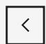

Previous

# Keywords

Global navigation satellite system; Classification; Multipath; Urban; Indoor; Support vector machine; Support vector classification; Convolutional neural network; Non-Line-of-Sight; Fault detection and exclusion

# Acronyms

ACF

Auto Correlation Function

ADC

Analog-to-Digital Converter

bps

bits per second

BPSK

Binary Phase Shift Keying

C/N 0

Carrier-to-Noise Power Density

CNN

Convolutional Neural Network

DOP

Dilution of Precision

FC

Fully Connected

FDE

Fault Detection and Exclusion

GNSS

Global Navigation Satellite System

GPS

Global Positioning System

I&D

Integrate-and-Dump

LHCP

Left-Hand Circularly Polarized

LOS

Line of Sight

ML

Machine Learning

MP

Multipath

NLOS

Non-Line-of-Sight

PCA

Principal Component Analysis

PRN

Pseudo-Random Noise

PVT

Position, Velocity and Time

RAIM

Receiver Autonomous Integrity Monitoring

RF

Radio Frequency

RHCP

Right-Hand Circularly Polarized

SDR

Software-Defined Radio

SVC

Support Vector Classifier

SVM

Support Vector Machine

TOA

Time of Arrival

USRP

Universal Software Radio Peripheral

WLS

Weighted Least Squares

# 1. Introduction

GNSS positioning is based on the one-way ranging technique: the time of travel of a signal, transmitted by a satellite, is measured and scaled by the speed of light, to obtain the pseudorange information. When only one constellation is available, GNSS navigation requires signals from at least four different satellites for computing the PVT solution. Pseudoranges are utilized to estimate this solution using a WLS approach, through the minimization of the residuals defined as:

$$
\boldsymbol {r} = \boldsymbol {z} - \boldsymbol {H} \widehat {\boldsymbol {x}} \tag {1}
$$

where is the vector of the measured pseudoranges (observations), is the geometry matrix to project measurements into the vector state space, while is the estimated state that can be written as:

$$
\widehat {\boldsymbol {x}} = \left(\boldsymbol {H} ^ {T} \boldsymbol {W} \boldsymbol {H}\right) ^ {- 1} \boldsymbol {H} ^ {T} \boldsymbol {W} \boldsymbol {z} \tag {2}
$$

where is the weighting matrix of the measurement accuracies ((Mikhail and Ackermann, 1976)). Unfortunately, in harsh environments (such as urban, semi-urban or indoor ones), these accuracies can significantly deteriorate due to additional errors related to surrounding obstacles. First, obstacles can obstruct the direct Line-of-Sight (LOS) to satellites, reducing their visibility and undermining the relative geometry between satellites and user. This results in degraded positioning accuracy and only multi-constellation receivers can effectively mitigate this risk. Additionally, the signal blockage limits the relative geometry of satellites and users, degrading the Dilution of Precision (DOP). Two other challenges arise from reflective surfaces, causing Non-Line-Of-Sight (NLOS) reception and multipath (MP) interference. These scenarios are depicted in Fig. 1.

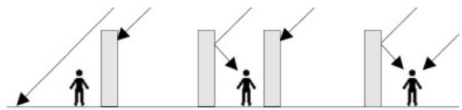

natural_image

Three identical diagrams showing human silhouettes standing at attention points with arrows pointing outward (no text or symbols)

Download: Download high-res image (114KB)   
Download: Download full-size image

Fig. 1. Blockage, NLOS reception and MP interference.

In GNSS signal processing, correlation is a critical step for estimating the TOA of the received signals, which is directly related to pseudorange measurements. By correlating the received satellite PRN code with the replica internally generated by the receiver, the TOA can be determined from the maximum of their correlation function, usually estimated using interpolation techniques (Kaplan et al., 2006).

The MP interference distorts the direct-signal correlation function; consequently, the code phase of LOS signal, used to compute the pseudorange, cannot be determined by the tracking loop using the three replica codes of the transmitted code block (Early (E), Prompt (P) and Late (L)), each separated by a half-chip phase difference. Fig. 2 shows the correlation functions of a BPSK GNSS signal subject to both constructive and destructive MP interferences, resulting in positive and negative ranging errors, respectively (Bellad and Petovello, 2013, Zidan et al., 2021).

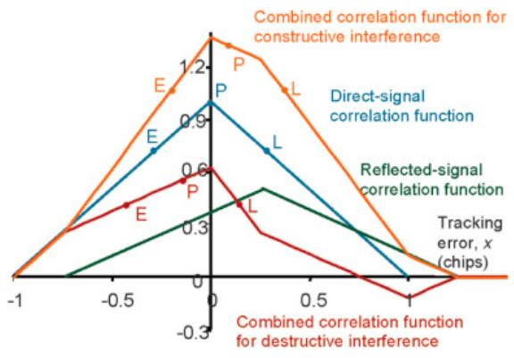

line

| x    | Combined correlation function for constructive interference | Direct-signal correlation function | Reflected-signal correlation function | Combined correlation function for destructive interference |
| ---- | -------------------------------------------------------- | ----------------------------------- | -------------------------------------- | -------------------------------------------------------- |
| -1   | 0.0                                                      | 0.0                                 | 0.0                                    | 0.0                                                    |
| -0.5 | 0.8                                                      | 0.9                                 | 0.3                                    | 0.5                                                    |
| 0    | 1.2                                                      | 1.0                                 | 0.6                                    | 0.6                                                    |
| 0.5  | 0.8                                                      | 0.7                                 | 0.5                                    | 0.3                                                    |
| 1    | 0.0                                                      | 0.0                                 | 0.0                                    | 0.0                                                    |

Download: Download high-res image (378KB)   
Download: Download full-size image

Fig. 2. Multipath effects on correlation function ((Zidan et al., 2021)).

Constructive MP results in a positive timing error, while destructive MP pushes down the composite correlation function, resulting in a negative timing error and a shorter range. Theoretically, the maximum pseudorange error due to interference from a reflected signal – of the same amplitude as the LOS signal – is 50% of the ranging code chip, equivalent to 150m for the GPS C/A code. However, modern receivers generally mitigate this effect.

Though to a lesser degree, MP interference also affects the carrier phase, Doppler shift and ${ \mathsf { C } } / { \mathsf { N } } _ { 0 }$ measurements. These effects are largest when the path delay is shortest because these measurements are based on the Prompt correlator output. In particular, the maximum theoretical carrier phase tracking error due to MP interference from a reflected signal – of the same amplitude as the LOS one – is 25% of the signal wavelength, equivalent to about 5cm for GPS L1 band. Regarding the $\mathrm { C } / \mathrm { N } _ { 0 } ,$ , with significant impacts on the receiver tracking performance, constructive MP increases $\mathsf { C } / \mathsf { N } _ { 0 } ,$ while destructive interference decreases it.

Regarding NLOS, as only the reflection is received, the pseudorange measurement error is equal to the path delay, which is the difference between the length of the path taken by the reflected signal and the one of the blocked LOS one. This error always has a positive value and, while it typically falls within a range of tens of meters, it can in principle be larger. The corresponding carrier-based ranging error is within 50% of the wavelength of the pseudorange error (modulo 1 carrier cycle) as the path delay is the same, but a phase change occurs on reflection. The strength of NLOS signals varies greatly. As the high-sensitivity receivers can acquire much weaker signals, they can therefore receive many more NLOS signals.

Usually, the described MP and NLOS phenomena occur separately, but they could also happen simultaneously when a signal is received via multiple reflected paths only. In this scenario, the combined ranging error may be considered as the sum of an NLOS error (due to the strongest reflected signal) and an MP error (due to the additional reflected signals interfering with the strongest signal). Another interesting scenario is when the LOS signal is attenuated or diffracted, making it weaker even than the reflected signal. In this case, the receiver will track the reflected signal (resulting in an NLOS error), which will then be subject to MP interference with the low LOS signal.

The challenges outlined above are currently addressed through many mitigation techniques. This work proposes a machine learning-based approach that uses the receiver's correlation functions to classify signal quality, distinguishing between Opensky signals and those degraded by reflections and/or blockages in complex environments. Specifically, the aim is to discriminate between four environments (Opensky, outdoor with MP only, outdoor with NLOS only, indoor) to potentially exclude or downweight low-quality signals before they are used in the downstream navigation algorithm.

The next section provides an overview of existing mitigation techniques. Section 3 presents the proposed solution (methodology, data collection, processing and machine learning). Section 4 reports the results, discussed in Section 5. Section 6 concludes the paper.

# 2. Existing mitigation techniques

Integrity is fundamental for many GNSS applications, as anomalies can lead to unpredictable range errors, degrading the final navigation solution. To address this challenge, numerous techniques have been developed, typically classified based on their specific area of focus (Bellad and Petovello, 2013, Groves et al., 2013, Xue et al., 2022), Zhu et al., 2018).

# 2.1. Antenna-based techniques

GNSS LOS signals are Right-Hand Circularly Polarized (RHCP), but reflected multipath signals can change their polarization. Dualpolarization antennas can distinguish between RHCP and Left-Hand Circularly Polarized (LHCP) signals, helping mitigate multipath signals affected by this change in polarization (Kim et al., 2022). However, this method cannot detect all NLOS signals, particularly those reflected an even number of times.

Choke ring antennas use a ring of radiating elements to create a directional radiation pattern, effectively reducing the reception of signals coming from low elevation angles, where multipath is more likely to occur. Despite their effectiveness, these systems are often too large for most dynamic positioning applications.

Array antennas utilize multiple elements to form steerable beams, enabling the receiver to focus on the LOS signal while minimizing the impact of multipath signals. The main challenge with this type of antennas lies in their complexity and cost.

In any case, regardless of resonance frequencies, the design of the gain pattern of the antennas is crucial for its immunity to interference and multipath.

# 2.2. Receiver-based techniques

Receiver-based techniques leverage algorithms and signal processing methods within GNSS receivers and they are standard in professional-grade devices. These methods primarily address medium-delay multipath interference (from 10 to 100m) by enhancing the resolution of the receiver's code discriminator or adjusting acquisition and tracking loop parameters based on signal conditions.

Such improvements enable the separation of direct and reflected signal components through some common techniques. The narrow correlator spacing uses multiple correlators with spacing smaller than one chip, to better discriminate between LOS and multipath signals. By reducing correlator spacing, the correlation region becomes smaller, minimizing multipath interference, though it may increase sensitivity to noise (Townsend and Fenton, 1994, Lee et al., 2019). Instead, the double-delta correlator technique employs two pairs of correlators with different spacing to estimate and correct multipath errors. In particular, the Early-Late Slope technique compares early and late correlator outputs but emphasizes the slope of the correlation function to estimate and correct the multipath errors.

Other methods focus on isolating multipath-contaminated signals in the Doppler domain. However, these techniques do not solve the issue of NLOS reception, as no direct signal is available to be recovered. In this case, the vector tracking, which integrates signal tracking and position determination, prevents the receiver from locking onto signals reflected by distant objects.

FFT-based techniques use the Fast Fourier Transform to analyse signals in the frequency domain, identifying and mitigating multipath signals based on their distinct characteristics. Likewise, wavelet decomposition techniques analyse signals at various frequency scales, allowing for the separation and mitigation of multipath based on their frequency characteristics.

Other methodologies use statistical models to estimate multipath signal parameters and correct measurement errors (Closas et al., 2009). While effective, these approaches usually require many correlators, significantly increasing system complexity and computational cost.

# 2.3. Navigation techniques

The multipath mitigation navigation techniques, also known as post-receiver methods, aim to improve positioning accuracy by utilizing data from various sensors and external sources, in addition to GNSS signals. These techniques include filtering, redundancy and consistency checking.

Carrier smoothing is an effective filtering technique for dynamic applications, as it averages out most of the multipath errors in the code. Unfortunately, it is less useful for NLOS reception, where both code and carrier signals experience similar delays across frequencies. Sidereal filtering exploits the repetitive nature of multipath errors in static positions, modelling and filtering them out, but it only works with static antennas in unchanged environments, as multipath errors repeat every sidereal day.

In redundancy-based methods, a multi-constellation receiver uses excess measurements to improve the accuracy of the position solution by prioritizing more reliable signals. For instance, smartphones often have antennas designed to minimize errors from NLOS signals with low $\mathsf { C } / \mathsf { N } _ { 0 }$ levels, although low-elevation satellites remain vulnerable to such errors. Additionally, Assisted GNSS, which receives auxiliary data like ephemeris and almanac from external sources (e.g., cellular networks or the internet), can help reduce acquisition time and position errors.

Consistency checking compares position solutions derived from various satellite signals to detect and exclude MP or NLOScontaminated measurements. This approach is applied in RAIM algorithms, which use residual analysis to detect faults. While effective in environments with predominantly LOS signals, these methods are less reliable in complex signal conditions. Traditional RAIM assumes that range and position errors follow a Gaussian distribution, typically rely on at least six visible satellites to exclude outliers and assumes a single bias for each fault scenario. Recently, more advanced “bottom-up” techniques based on subset comparison have been introduced, though further research is required. Another approach, the innovation filtering, detects inconsistencies by comparing current measurements with data from previous epochs, commonly in Kalman filter-based positioning systems.

Sparse estimation, usually classified as an optimization technique, is an advanced signal processing technique used to improve GNSS positioning accuracy in complex environments. It operates on the assumption that only a small subset of satellite signals is affected by multipath or NLOS errors, while the majority remain unaffected. By identifying and isolating these corrupted signals, sparse estimation either corrects or excludes them from the positioning calculation. This method enhances accuracy with lower computational complexity, making it especially useful in challenging environments where multipath interference is prevalent. Sparse estimation is often linked to optimization techniques like compressed sensing.

Doppler-based techniques in GNSS positioning focus on utilizing the distinct Doppler frequency shifts of reflected signals to mitigate MP and NLOS errors. Since reflected signals have different velocities compared to direct line-of-sight (LOS) signals, these Doppler shifts can be exploited to differentiate between them. By analysing the Doppler characteristics, receivers can separate the LOS signals from the reflected ones, minimizing the impact of multipath. This method is particularly effective in dynamic environments, where motion creates detectable variations in the Doppler frequencies of incoming signals, allowing for more accurate positioning despite signal interference.

# 2.4. Emerging techniques

Among the emerging techniques for mitigating MP and NLOS effects, the use of three-dimensional city models has been attracting considerable attention for some years. These models help predict signal blockages and reflections that can degrade positioning accuracy. If the user position is known, detecting MP and NLOS signals becomes relatively straightforward. Conversely, if the user position is unknown, signal reception must be considered across several potential locations, complicating the detection process. It is worth noting that the computational load required by this approach can be significantly high because the models must be sufficiently accurate due to their high sensitivity to the phase delay of reflected signals.

Machine learning has emerged as a valuable tool in GNSS positioning, especially in complex environments (outdoor or indoor) where models may be invalid (Siemuri et al., 2022). These methods, including supervised (Hsu, 2017, Groves et al., 2012, Yozevitch et al., 2016) or unsupervised techniques like PCA and clustering, have been used to analyse GNSS measurements and detect patterns that indicate MP or NLOS errors. These patterns can then be applied to filter out the erroneous data. Artificial neural networks, trained on large datasets from various environments, can model such errors to estimate the error-free user location in real time. Deep learning approaches (Borhani et al., 2023), especially Convolutional Neural Networks (Quan et al., 2018, Blais et al., 2022), are effective at extracting features and classifying raw GNSS measurements, while Recurrent Neural Networks can model temporal dependencies in the experimental data. The present work can be placed within the scope of these emerging mitigation techniques (see Sec. 3).

# 3. Proposed solution

This work proposes a machine learning-based mitigation technique that uses the receiver's Auto Correlation Functions (ACFs) to classify signal quality. It builds on recent advancements in applying artificial intelligence to raw GNSS measurements. Although the use of ACFs is not new (Suzuki and Amano, 2021, Blais et al., 2022), the proposed solution offers several distinct advantages. In summary, it:

• utilizes sampled ACFs, which are already available in receivers, without requiring additional operations like interpolation.   
• avoids the use of high-level metrics such as elevation and $\mathrm { { C / N _ { 0 } } , }$ , which may lack detailed information on signal corruption.   
• employs a self-contained labelling technique that does not rely on additional complex and expensive sensors, models or computations beyond GNSS.   
• classifies signals into four categories: clear Opensky signals, multipath-corrupted outdoor signals, NLOS outdoor signals and indoor signal reception.

# 3.1. GNSS signal model

The GNSS data signals typically have a narrow bandwidth, just a few tens of bits per second (bps), but they are spread across a much wider bandwidth using a high-rate ranging code. This is achieved through a technique known as Direct-Sequence Spread Spectrum, where the fundamental transmission units are called “chips”. For instance, in the GPS L1 C/A signal, the original 50 bps data rate is expanded to a 1.023MHz chipping rate. This frequency spreading serves multiple purposes: it enhances positioning accuracy, reduces multipath interference in challenging environments, mitigates radio frequency interference and enables satellite identification through unique ranging PRN codes. A key feature of GNSS systems is the use of Code Division Multiple Access, a method that allows multiple satellites to share the same frequency by distinguishing their signals based on these PRN codes (Kaplan et al., 2006, Khan et al., 2011).

The signal coming from the -th satellite, at time instant , can be modelled as (Pirsiavash, 2019):

$$
s _ {l} (t) = \sqrt {2 P _ {l}} b _ {l} (t) c _ {l} (t) \cos \left(2 \pi f _ {R F} t + \varphi_ {l}\right) \tag {3}
$$

where.

• $\mathbf { \nabla } _ { P _ { l } }$ is its signal power at the transmitting antenna output   
• $\pmb { b } _ { l }$ is its binary navigation data   
• $\pmb { c } _ { l }$ is the PRN code used to modulate $b _ { l }$ (t)   
• and are the carrier frequency and initial phase, respectively.

For a generic GNSS receiver, the first step involves receiving signals, down-conversion and digitization using an RF Front-End. Then, digital processing is employed to extract range and timing information. Hence, the three stages are.

(a) pre-despreading (pre-amplification, down-conversion and IF sampling);   
(b) IF signal processing (acquisition, tracking and Navigation Message decoding);   
(c) navigation solution computation (data processing).

In particular, the IF signal can be represented as a combination of digitized signals corresponding to different PRNs. Assuming that the signal parameters from each satellite (signal power, code delay, carrier phase and Doppler shift) remain constant over a coherent time interval, the digitized IF signal received at the time instant $\pmb { n } T _ { s }$ can be written as:

$$
r \left(n T _ {s}\right) = \sum_ {l = 1} ^ {L} \sqrt {C _ {l , k}} b _ {l} \left(n T _ {s} - \tau_ {l, k}\right) c _ {l} \left(n T _ {s} - \tau_ {l, k}\right) e ^ {j \left(2 \pi \left(f _ {I F} + f _ {l, k}\right) n T _ {s} + \varphi_ {l, k}\right)} + \eta_ {F E} \left(n T _ {s}\right) \tag {4}
$$

where.

• is the sample index;   
• $\pmb { T _ { \vartheta } }$ is the sampling time interval;   
• the number of satellites in view;   
• is the IF frequency;

• =1, 2, …is the coherent interval index and the corresponding interval is defined as $( k - 1 ) N _ { c o h } \le n < k N _ { c o h }$ where $N _ { c o h }$ is the number of samples in each coherent interval;

• $\mathbf { \Phi } _ { C _ { l , k } }$ is the power of the -th satellite signal, received during the -th coherent interval;

• $\pi , k \cdot , \hbar , k$ and $\varphi _ { l , k }$ are the code delay, Doppler shift and carrier phase of the -th signal during the -th coherent interval;

·nFE $( n T _ { s } )$ is the Front-End complex noise at time instant $\pmb { n T _ { s } }$

The range and range rate information (contained in the codes and Doppler frequencies, respectively) must now be extracted from the received signal: each PRN signal needs to be processed and de-spread in each receiver channel. This process involves

despreading the received signals and aligning them with receiver-generated duplicates to synchronize the code, carrier phase and Doppler frequencies.

In Fig. 3 the GNSS signal despreading operations, to be performed for each channel, are shown. A reference correlator multiplies the received signal by the corresponding PRN code and by a replica of the carrier signal. Then, the resulting samples are processed through an I&D filter over each coherent interval.

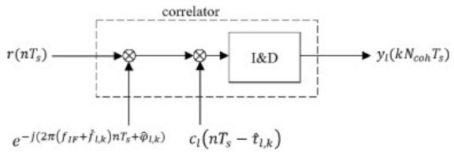

flowchart

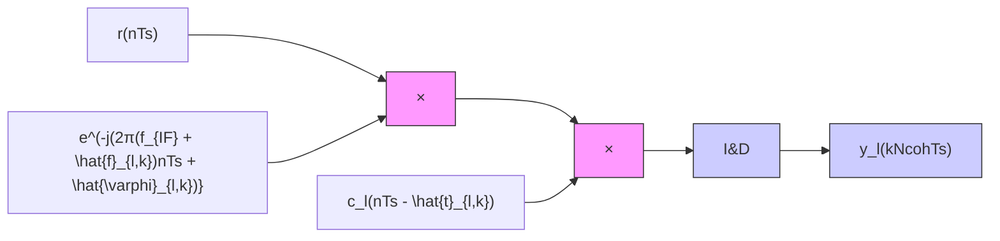

Download: Download high-res image (132KB)   
Download: Download full-size image

Fig. 3. GNSS signal despreading.

Finally, the output of the -th channel at the -th coherent integration epoch (i.e., at the time instant $k N _ { c o h } T _ { s } )$ ) is given by:

$$
y _ {l} \left(k N _ {c o h} T _ {s}\right) = \frac {1}{N _ {c o h}} \sum_ {n = (k - 1) N _ {c o h}} ^ {k N _ {c o h} - 1} r \left(n T _ {s}\right) c _ {l} \left(n T _ {s} - \hat {\tau} _ {l, k}\right) e ^ {- j \left(2 \pi \left(f _ {I F} + \hat {f} _ {l, k}\right) n T _ {s} + \hat {\varphi} _ {l, k}\right)} \tag {5}
$$

where $\hat { \tau } _ { l , k } , \widehat { f } _ { l , k }$ and $\widehat { \varphi } _ { l , k }$ are the code delay, carrier Doppler frequency and phase of the replica generated by the -th reference correlator during the -th coherent integration interval. Assuming that the binary data is also constant during each integration period, the above equation can be rewritten as:

$$
y _ {l} \left(k N _ {c o h} T _ {s}\right) = \sqrt {C _ {l , k}} b _ {l, k} R _ {\tau} \left(\Delta \tau_ {l, k}\right) R _ {f} \left(\Delta \mathrm{f} _ {l, k}\right) e ^ {j \left(\pi \Delta \mathrm{f} _ {l, k} ((2 k - 1) N _ {c o h} - 1) T _ {s} + \Delta \varphi_ {l, k}\right)} \tag {6}
$$

$$
+ \eta_ {l} \left(k N _ {c o h} T _ {s}\right) = y _ {l, k} \left(\Delta \tau_ {l, k}, \Delta \mathrm{f} _ {l, k}, \Delta \varphi_ {l, k}\right)
$$

where.

• ${ \boldsymbol { b } } _ { l , k }$ is the binary navigation data corresponding to the -th signal over the -th coherent integration period;   
• $\Delta \pi , \boldsymbol { k } = \tau _ { l , k } - \hat { \tau } _ { l , k } , \Delta \mathbf { f } _ { l , k } = \mathbf { f } _ { l , k } - \hat { \mathbf { f } } _ { l , k }$ and $\Delta \varphi _ { l , k } = \varphi _ { l , k } - \widehat { \varphi } _ { l , k }$ are respectively the code, the frequency and the phase offsets between the -th received and generated replica signals at the -th integration epoch;   
• $\pmb { N _ { c o h } T _ { s } }$ is the coherent integration time $( T _ { I } ) ;$   
nt $( k N _ { c o h } T _ { S } )$ is the noise and residual cross correlation terms of the -th receiver channel at the -th integration epoch, with approximately zero-mean Gaussian In-phase and Quadrature-phase (I/Q) components;   
• $R _ { f } \left( \Delta f _ { l , k } \right)$ is the ACF of the received signal in frequency domain:

$$
R _ {f} \left(\Delta f _ {l, k}\right) = \left\{ \begin{array}{c} \frac {\sin \left(\pi \Delta f _ {l , k} N _ {c o h} T _ {s}\right)}{N _ {c o h} \sin \left(\pi \Delta f _ {l , k} T _ {s}\right)} \text {for} \Delta f _ {l, k} \neq 0 \\ 1 \text {for} \Delta f _ {l, k} = 0 \end{array} \right. \tag {7}
$$

• $R _ { \tau } \left( \Delta \eta _ { l , k } \right)$ is the ACF of the received signal in code domain, related to the specific signal structure. For instance, for the BPSK modulation with $\pmb { T _ { c } }$ as the chip duration (GPS L1 $\mathsf C / \mathsf A$ code, also called legacy signal, used in this work), it has a triangular shape:

$$
R _ {\tau} \left(\Delta \tau_ {l, k}\right) = \left\{ \begin{array}{c} 1 - \left| \frac {\Delta \tau_ {l , k}}{T _ {c}} \right| \text {   for   } | \Delta \tau_ {l, k} | \leq T _ {c} \\ 0 \text {   for   } | \Delta \tau_ {l, k} | > T _ {c} \end{array} \right. \tag {8}
$$

The correlation of the received signal with the appropriate local replica yields a correlation peak, crucial for estimating signal parameters. This estimation generally occurs in two different steps.

1. Coarse estimation of code phase and Doppler frequency during the acquisition process. This initial step provides rough estimates of code delay and Doppler shift, which are essential for starting signal tracking.

2. Fine estimation of signal parameters during continuous tracking. After the coarse estimates are obtained, this step refines the signal parameters using a recursive closed-loop procedure in the GNSS correlator, ensuring accurate and timely estimates of the incoming code and carrier signal parameters.

# 3.2. Methodology

As mentioned in the Introduction, the MP and NLOS errors depend on many factors (obstacle geometries, their distances from the user, their physical characteristics, user/satellite relative geometry, etc.). Since these factors are generally unknown, the resulting errors cannot be predicted or adequately compensated for. Consequently, a ML approach is successfully used to mitigate the complex and unpredictable effects of MP and NLOS conditions in challenging environments.

To proceed with the ML approach to signal classification, we collected data consisting of GPS RF C/A L1 signals, available before the receiver tracking loops. The acquisition was performed at 30MHz but also at 15MHz, closer to typical frequencies of entrylevel professional receivers ((Shapiro, 2010), (Xu et al., 2015)). More details are provided in Sec. 3.3. A data collection campaign was planned and executed (see Sec. 3.4) and subsequently the acquired data were analysed, processed and labelled (see Sec. 3.5 and Sec. 3.6). The ACF computation was performed by processing baseband I/Q samples using a MATLAB (The MathWorks Inc, 2021) script following the model reported in Sec.3.1. This computation required knowledge of the PRN of the acquired satellites, which were obtained from a mobile app. The app also provided the elevation angles of Opensky satellites, which were necessary for normalizing the ACF data (see Sec. 3.5). Labelling the ACF data was straightforward, utilizing elevation and azimuth angle data from the same app and online maps. The accuracy of the labelling was validated through independent measurements of C/N0 (see Sec. 3.6). The dataset was then split into training, validation and test sets and used to train various ML models for ACF signal classification (see Sec. 3.7 and Sec. 3.8). ACF data were used in different ways depending on the ML model being explored: in some cases, they were grouped into blocks of varying sizes (5, 10, 15, 20) for the same PRN, while in others, they were used individually for each PRN.

The aim of the classification is to categorize these signals into various “quality classes” based on characteristics that may not be easily visible to the human eye but are evident in the experimental data. Following the classification step, low-quality signals can be excluded (or assigned lower weights), enabling the receiver modules to operate under conditions that more closely resemble the ideal scenario (i.e., LOS signals). Naturally, as we move toward the optimal functioning of GPS, the accuracy of position estimation is expected to improve. Four static scenarios were identified: (1) Opensky; (2) MP Outdoor; (3) NLOS Outdoor; (4) Indoor.

Fig. 4 provides a schematic overview of the dataset collection process, with all steps detailed in the following sections. Fig. 5 illustrates the machine learning training process.   
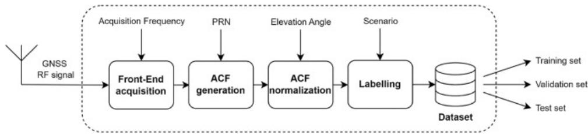

flowchart

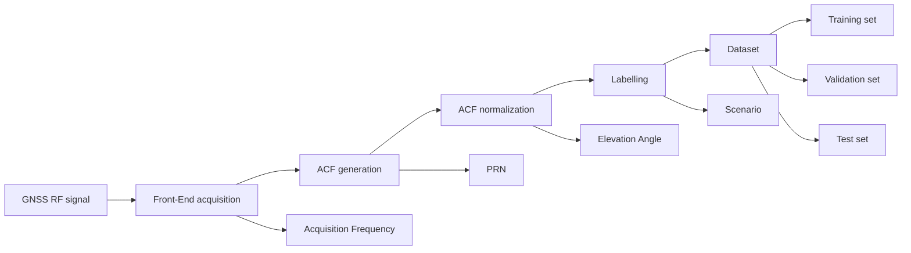

Download: Download high-res image (250KB)   
Download: Download full-size image

Fig. 4. Dataset generation process for the proposed approach.   
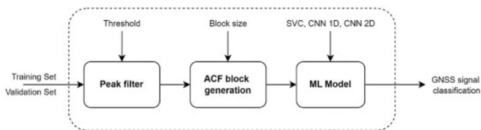

flowchart

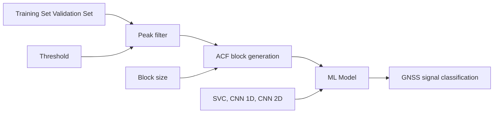

Download: Download high-res image (181KB)   
Download: Download full-size image

Fig. 5. Machine learning training process.

# 3.3. Experimental setup

This section briefly describes the hardware and software setup used for data collection. In stage (a) of Sec. 3.1, the Front-End captures the raw RF signals and down-converts them to a lower frequency for subsequent digital processing. In this application, we acquire the oldest GPS signal, known as the legacy signal L1 C/A, which is broadcast by all currently operational satellites at a frequency of 1575.42MHz (DoD, 2007).

To this end, we used the USRP E310 (Ettus Research, 2021) as Front-End. It is a high-performance, compact and embedded SDR platform designed for a wide range of wireless research and development applications. It supports a frequency range of 70MHz up to 6GHz and it comes equipped with its own GPS antenna (Trimble, 2011). It includes a wideband RF transceiver and DSP/FPGA modules. The RF transceiver has a Low-Noise Amplifier and a high dynamic range ADC module that can sample up to 100MS/s with 14-bit resolution. The RF data from the USRP are stored on a host computer.

The USRP is controlled by a GNU Radio (GNU Radio) diagram (Fig. 6), where the Front-End parameters can be easily set. The diagram consists of a Python script that allows configuring, for example, the frequency and the time duration for the data acquisition. The acquisitions have been carried out at 15 and 30MHz.

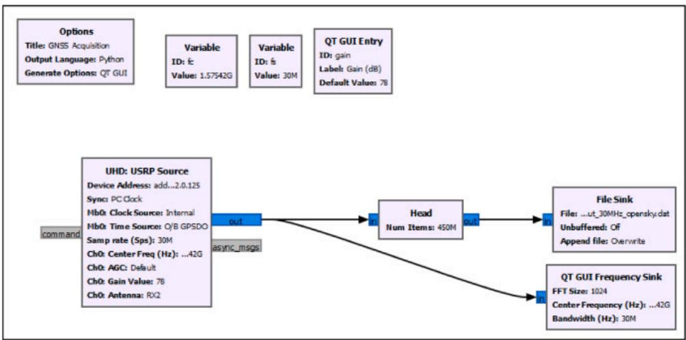

flowchart

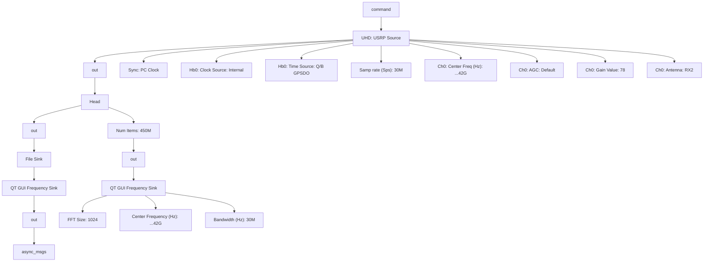

Download: Download high-res image (563KB)   
Download: Download full-size image

Fig. 6. GNU Radio diagram for the USRP acquisition.   
In Fig. 7, the setup for the experimental acquisition is depicted and the live FFT is displayed in a terminal window.   
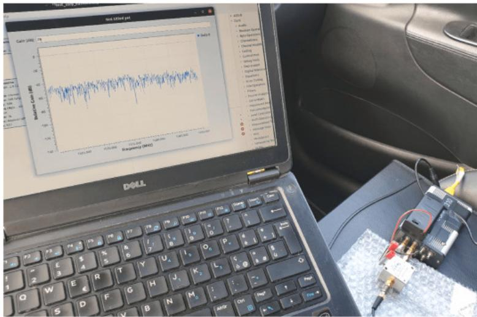

text_image

Laptop displaying a line chart of 'Relative Gain (MHz)' with a Dell keyboard and connected electronic components

Download: Download high-res image (914KB)   
Download: Download full-size image

Fig. 7. Experimental setup: the USRP with its host computer.

Also a mobile app (GPSTest, (GPSTest App on Google Play)) was used, which allowed us to obtain the PRN codes of the LOS/MP/NLOS satellites, along with their C/N , elevation and azimuth values. The app screenshots were captured multiple times

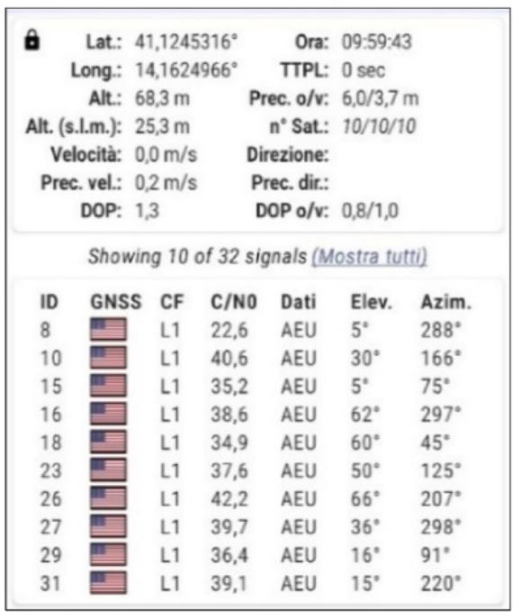

text_image

Lat.: 41,1245316° Ora: 09:59:43
Long.: 14,1624966° TTPL: 0 sec
Alt.: 68,3 m Prec. o/v: 6,0/3,7 m
Alt. (s.l.m.): 25,3 m n° Sat.: 10/10/10
Velocità: 0,0 m/s Direzione:
Prec. vel.: 0,2 m/s Prec. dir.:
DOP: 1,3 DOP o/v: 0,8/1,0
Showing 10 of 32 signals (Mostra tutti)
ID GNSS CF C/N0 Dati Elev. Azim.
8 L1 22,6 AEU 5° 288°
10 L1 40,6 AEU 30° 166°
15 L1 35,2 AEU 5° 75°
16 L1 38,6 AEU 62° 297°
18 L1 34,9 AEU 60° 45°
23 L1 37,6 AEU 50° 125°
26 L1 42,2 AEU 66° 207°
27 L1 39,7 AEU 36° 298°
29 L1 36,4 AEU 16° 91°
31 L1 39,1 AEU 15° 220°

Download: Download high-res image (487KB)   
Download: Download full-size image

Fig. 8. A screenshot of the GPSTest app.

# 3.4. Data collection

In this section, we outline the procedures used to collect the static data necessary for classifying GPS signals into the four categories introduced earlier. These GPS signals were gathered using the experimental setup described in the previous section. The data collection process was conducted as follows.

• initially, we collected experimental data in Opensky situations, ensuring the absence of MP or NLOS issues. To achieve this, we chose locations in open countryside areas free from surrounding obstacles.   
next, we collected data in outdoor locations near straight high walls (see Fig. 9, for example) or angular buildings to facilitate labelling. This scenario is expected to yield two distinct classes named: MP Outdoor and NLOS Outdoor.

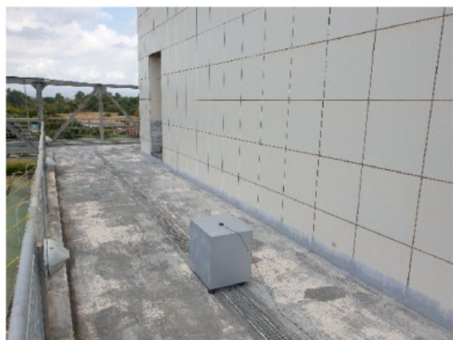

natural_image

Exterior view of a modern building rooftop with concrete flooring and a concrete base (no signage or text visible)

Download: Download high-res image (493KB)   
Download: Download full-size image

Fig. 9. An example of one of the MP Outdoor scenarios.

• finally, we collected GPS data from inside rooms with windows, where we anticipate that NLOS signals are predominant. These data are classified as Indoor (see Fig. 10).

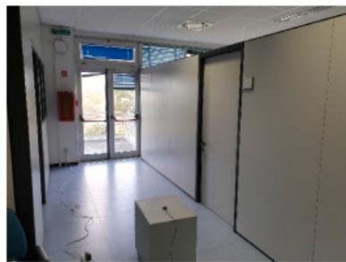

natural_image

Interior view of a modern office or lab space with white walls, doors, and a cardboard box (no visible text or symbols)

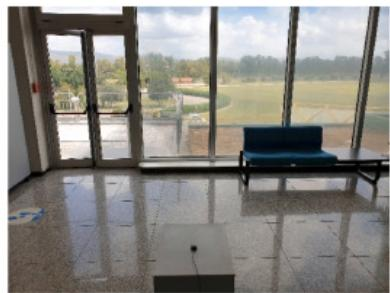

natural_image

Interior view of a modern living room with large windows overlooking a river and distant hills (no visible text or symbols)

Download: Download high-res image (573KB)   
Download: Download full-size image

Fig. 10. Examples of two of the Indoor scenarios.

Acquisition was conducted across various locations and buildings, under differing satellite visibility conditions and at different times of day. By collecting GPS signals from these diverse scenarios, we aim to evaluate the impact of varying conditions on signal quality. This approach not only enables us to assess the performance of the proposed solution across multiple contexts but also minimizes the risk of overfitting as far as possible. As a result, our efforts culminated in a dataset that encompasses all the categories introduced earlier: Opensky, Indoor, MP Outdoor and NLOS Outdoor.

# 3.5. Data processing

From the acquired GPS raw data, the ACF signals were computed using the equations shown in Sec. 3.1 using a coherent time of 1 ms. For the two adopted sample frequencies, 15 and 30MHz, the ACFs consist of 29 and 59 samples, respectively. Due to the relatively high frequencies, no interpolation is performed, therefore the maximum value belongs to one of the ACF samples. A typical diagram of the two-dimensional ACF in the code and frequency domains is shown in Fig. 11.

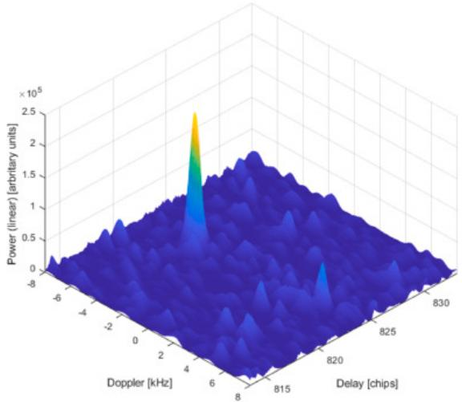

area_stacked

| Doppler [kHz] | Delay [chips] | Power (linear) [arbitrary units] |
| ------------- | ------------- | -------------------------------- |
| -6            | 830           | 0                                |
| -4            | 825           | 0                                |
| -2            | 820           | 0                                |
| 0             | 815           | 0                                |
| 2             | 810           | 0                                |
| 4             | 805           | 2.5×10⁵                          |
| 6             | 800           | 1.5×10⁵                          |
| 8             | 795           | 1.0×10⁵                          |
| 10            | 790           | 0.5×10⁵                          |
| 12            | 785           | 0.25×10⁵                         |
| 14            | 780           | 0.1×10⁵                          |
| 16            | 775           | 0.05×10⁵                         |
| 18            | 770           | 0.025×10⁵                        |
| 20            | 765           | 0.01×10⁵                         |
| 22            | 760           | 0.005×10⁵                        |
| 24            | 755           | 0.0025×10⁵                       |
| 26            | 750           | 0.001×10⁵                        |
| 28            | 745           | 0.0005×10⁵                       |
| 30            | 740           | 0.00025×10⁵                      |
| 32            | 735           | 0.0001×10⁵                       |
| 34            | 730           | 0.00005×10⁵                      |
| 36            | 725           | 0.000025×10⁵                     |
| 38            | 720           | 0.00001×10⁵                       |
| 40            | 715           | 0.000005×10⁵                     |
| 42            | 710           | 0.0000025×10⁵                    |
| 44            | 705           | 0.000001×10⁵                     |
| 46            | 700           | 0.0000005×10⁵                    |
| 48            | 695           | 0.00000025×10⁵                   |
| 50            | 690           | 0.0000001×10⁵                    |
| 52            | 685           | 0.00000005×10⁵                   |
| 54            | 680           | 0.000000025×10⁵                  |
| 56            | 675           | 0.00000001×10⁵                   |
| 58            | 670           | 0.000000005×10⁵                  |
| 60            | 665           | 0.0000000025×10⁵                 |
| 62            | 660           | 0.000000001×10⁵                  |
| 64            | 655           | 0.0000000005×10⁵                 |
| 66            | 650           | 0.00000000025×10⁵                |
| 68            | 645           | 0.0000000001×10⁵                 |
| 70            | 640           | 0.00000000005×10⁵                |
| 72            | 635           | 0.000000000025×10⁵               |
| 74            | 630           | 0.00000000001×10⁵               |
| 76            | 625           | 0.000000000005×10⁵              |
| 78            | 620           | 0.0000000000025×10⁵             |
| 80            | 615           | 0.000000000001×10⁵             |
| 82            | 610           | 0.0000000000005×10⁵            |
| 84            | 605           | 0.00000000000025×10⁵           |
| 86            | 600           | 0.0000000000001×10⁵            |
| 88            | 595           | 0.00000000000005×10⁵           |
| 90            | 590           | 0.000000000000025×10⁵          |
| 92            | 585           | 0.00000000000001×10⁵           |
| 94            | 580           | 0.000000000000005×10⁵          |
| 96            | 575           | 0.0000000000000025×10⁵         |
| 98            | 570           | 0.000000000000001×10⁵          |
| 100           | 565           | 0.0000000000000005×10⁵         |

Download: Download high-res image (294KB)   
Download: Download full-size image

Fig. 11. Typical ACF diagram.

Only ACFs with peaks greater than $6 . 0 \times 1 0 ^ { 4 }$ were considered. This threshold was derived from a statistical analysis on the available dataset to filter out correlation peaks that were too low, also considering our coherent integration time.

Subsequently, the ACFs were normalized using the fitting line of the ACF maxima in Opensky scenario related to the actual elevation coming from the GPSTest app. This adjustment is necessary as the ACF heights naturally decrease for low satellites, even without any surrounding obstacles. Fig. 12 displays the maximum ACF and C/N values plotted against satellite elevations,0 along with the corresponding fitting lines. As expected, both the ACF maximum and the $\mathsf { C } / \mathsf { N } _ { 0 }$ exhibit the same trend against elevation, consistently with the Literature (Kubo et al., 2020).

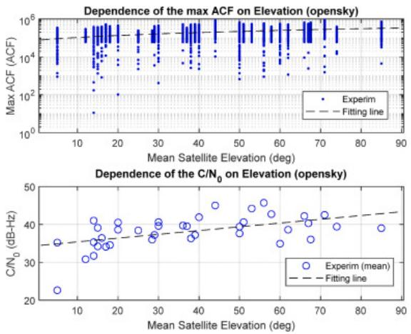

scatter

| Mean Satellite Elevation (deg) | Max ACF (ACF) | C/N0 (dB-Hz) |
| ----------------------------- | ------------- | ------------ |
| 10                            | 10^5          | 35           |
| 20                            | 10^4          | 40           |
| 30                            | 10^5          | 38           |
| 40                            | 10^5          | 42           |
| 50                            | 10^5          | 40           |
| 60                            | 10^5          | 42           |
| 70                            | 10^5          | 40           |
| 80                            | 10^5          | 42           |
| 90                            | 10^5          | 40           |

Download: Download high-res image (564KB)   
Download: Download full-size image

Fig. 12. Relationships between max ACF, $\mathrm { C } / \mathrm { N } _ { 0 }$ and satellite elevation (Opensky).

The final dataset, the same for all the adopted techniques, is composed of approximately 90k ACF signals of the visible satellites in the four scenarios outlined in Sec. 3.2, spanning various locations, days and times. Care was taken during the acquisition process to ensure that the dataset was relatively balanced across the classes. The labelling process for this dataset is detailed in the following section.

# 3.6. Data labelling

The GPSTest app mentioned in Sec. 3.3 can assist in performing simple data labelling without the need for additional complex and expensive sensors, models or computations.

Since it has been expected (and confirmed) that the Opensky and Indoor environments contain all LOS and NLOS satellites, respectively, this app was only used to distinguish between MP and NLOS in Outdoor environments. Knowing the azimuth angles of the nearby walls and those of the satellites, the received satellites could be split into these two categories.

In Fig. 13, a skyplot is shown for some outdoor acquisitions made near an angular wall (black dashed line). The blue and red squares indicate satellites internal and external to the angular zone, respectively and, for this reason, they were labelled as “MP Outdoor” and “NLOS Outdoor”.

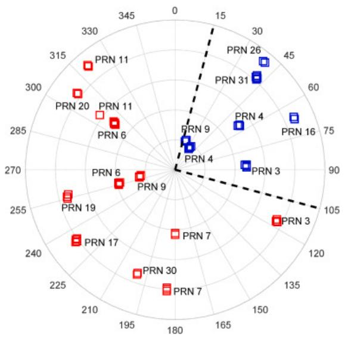  
Download: Download high-res image (406KB)   
Download: Download full-size image

Fig. 13. Skyplot for outdoor acquisitions.

The wall was high enough to block the satellites outside of the said zone, while the antenna was positioned close enough to the walls that signal reflection was inevitable.

In Fig. 14 the $\mathsf { C } / \mathsf { N } _ { 0 }$ values, as provided by the GPSTest app, are reported for each scenario.   
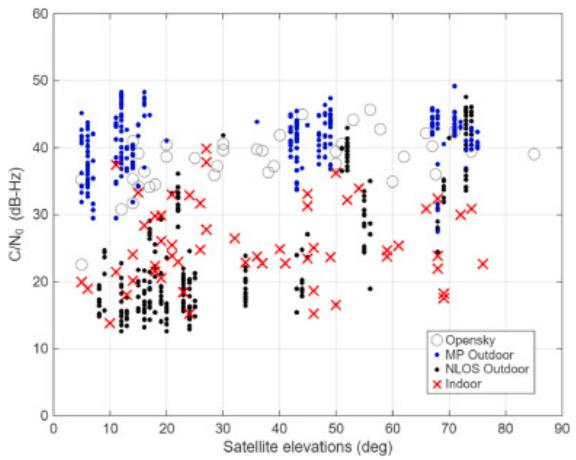

scatter

| Satellite elevations (deg) | C/N₀ (dB-Hz) | Category     |
| -------------------------- | ------------ | ------------ |
| 5                          | 22           | Opensky      |
| 10                         | 35           | MP Outdoor   |
| 15                         | 40           | NLOS Outdoor |
| 20                         | 30           | Indoor       |
| 25                         | 35           | Opensky      |
| 30                         | 40           | MP Outdoor   |
| 35                         | 25           | NLOS Outdoor |
| 40                         | 45           | Indoor       |
| 45                         | 35           | Opensky      |
| 50                         | 40           | MP Outdoor   |
| 55                         | 30           | NLOS Outdoor |
| 60                         | 45           | Indoor       |
| 65                         | 40           | Opensky      |
| 70                         | 45           | MP Outdoor   |
| 75                         | 40           | NLOS Outdoor |
| 80                         | 35           | Indoor       |
| 85                         | 40           | Opensky      |
| 90                         | 35           | MP Outdoor   |

Download: Download high-res image (377KB)   
Download: Download full-size image

Fig. 14. C/N vs. Satellite Elevation for the four signal classes.0

As expected, for all elevations, higher values are generally associated with Opensky and MP Outdoor, while lower values are linked to NLOS Outdoor and Indoor scenarios. This confirms, on one hand, that the data labelling (especially in distinguishing between MP and NLOS Outdoor) is quite reliable. On the other hand, it indicates that it is not possible to distinguish among all four scenarios using this parameter only and that it is necessary to consider additional data, such as ACF data.

# 3.7. Support vector classifier

The first adopted classification method is based on Support Vector Classification (SVC (Scikit -learn, 2011),). The “poly” kernel function with a degree of 3 was used, while all the other parameters were left at their default values. Since SVC is a feature-based classifier, the process of feature selection is needed.

We attempted to mathematically describe the multipath and NLOS effects on the ACF, as widely discussed in the Literature (Suzuki and Amano, 2021, Xu et al., 2019, Townsend and Fenton, 1994). We tried to define features that would capture the characteristics of attenuation, asymmetry and noise. Fig. 15 shows two random ACFs for Opensky and Indoor scenarios, which can be considered the most distinct environments. As shown, the Indoor data are characterized by lower peaks (due to multiple reflections), as well as significant asymmetry and additional noise, also more evident due to the lower correlation values.

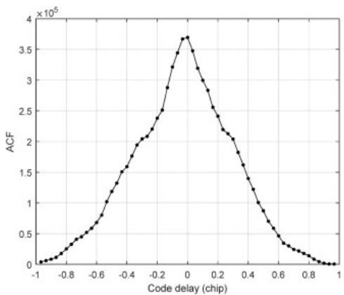

line

| Code delay (chip) | ACF (×10⁵) |
| ----------------- | ---------- |
| -1.0              | 0.0        |
| -0.8              | 0.2        |
| -0.6              | 0.8        |
| -0.4              | 1.6        |
| -0.2              | 2.4        |
| 0.0               | 3.7        |
| 0.2               | 2.6        |
| 0.4               | 1.8        |
| 0.6               | 0.8        |
| 0.8               | 0.2        |
| 1.0               | 0.0        |

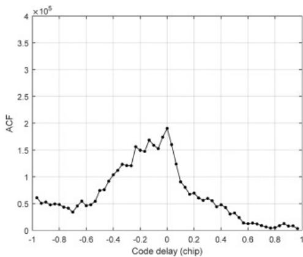

line

| Code delay (chip) | ACF (×10⁵) |
| ----------------- | ---------- |
| -1.0              | 0.6        |
| -0.9              | 0.5        |
| -0.8              | 0.4        |
| -0.7              | 0.3        |
| -0.6              | 0.5        |
| -0.5              | 0.7        |
| -0.4              | 1.0        |
| -0.3              | 1.2        |
| -0.2              | 1.5        |
| -0.1              | 1.7        |
| 0.0               | 1.9        |
| 0.1               | 1.6        |
| 0.2               | 0.8        |
| 0.3               | 0.6        |
| 0.4               | 0.5        |
| 0.5               | 0.3        |
| 0.6               | 0.1        |
| 0.7               | 0.05       |
| 0.8               | 0.02       |
| 0.9               | 0.01       |
| 1.0               | 0.0        |

Download: Download high-res image (375KB)   
Download: Download full-size image

Fig. 15. ACFs in Opensky (PRN 14, $\mathsf { C } / \mathsf { N } _ { 0 } { = } 3 4 . 1 \mathsf { d B - H z } ,$ EL=15deg) and Indoor (PRN 2, $\mathrm { C } / \mathrm { N } _ { 0 } { = } 2 4 . 7 \mathrm { d B } { - } \mathrm { H z } ,$ EL 59deg).

Three features (F1, F2 and F3) were engineered from the ACF dataset. These features were calculated for individual ACFs as well as for blocks of stacked ACFs (for a given PRN) in sizes of 5, 10, 15 and 20. Initially, an average was computed over each respective block, yielding related to each acquisition frequency, PRN and scenario. F1 corresponds to the maximum amplitude of , while F2 and F3 provide information about the asymmetry of the ACFs, representing the mean and standard deviation, respectively, of the absolute difference between the left and right sides of .

Fig. 16 shows histograms of the defined features for an acquisition frequency of 30MHz and an ACF block size of 20. While it is difficult to visually find differences between these distributions, a few observations can be made.

• The F1 distribution is low and narrow in the NLOS Outdoor scenario, likely due to multiple reflections. In the Indoor scenario, strong background noise may prevent a similar result from being observed. Conversely, in the MP Outdoor scenario, F1 is broader due to the presence of both constructive and destructive interference in the dataset. The Opensky scenario resembles the MP Outdoor case but presents a narrower distribution of F1, as no interference should be present.   
• The asymmetry features, F2 and F3, are particularly low for Opensky, as it is an obstacle-free scenario. In contrast, higher values are found in the MP scenario. In NLOS, the absence of interference results in relatively low detected asymmetry.

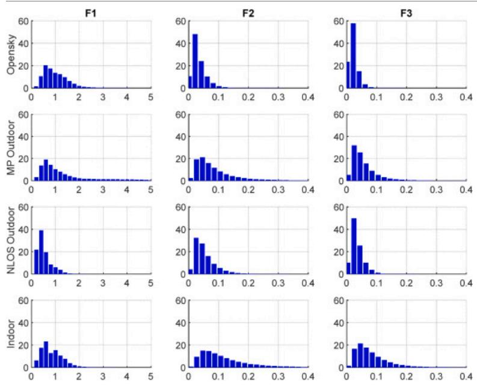  
Download: Download high-res image (512KB)   
Download: Download full-size image

Fig. 16. Distribution frequencies (%) of features (30MHz sample rate, 20 ACF block size).

We also defined a larger set of features, referred to as “many features” in Sec. 4. These features are simply computed for each code delay as an average across the ACF block size. As a result, we obtain 29 and 59 features, for 15 and 30MHz, respectively.

# 3.8. Convolutional neural network

The ACF signal classification was initially implemented using a one-dimensional CNN (Kiranyaz et al., 2021). The network architecture consists of two convolutional layers, each employing a kernel size of 5 with padding set to 2 and stride equal to 1, followed by max-pooling layers with a kernel of size 2 and stride equal to 2 and three Fully Connected (FC) layers tailored for time-series classification. The model takes a one-dimensional input sequence (i.e., a single ACF signal) of length 59 and outputs 4 classification labels. More specifically, the first convolutional layer extracts 32 feature maps from the input time series sequence. The max-pooling layer then reduces the dimensionality of these feature maps. The second convolutional layer extracts another set of 32 feature maps, followed by another max-pooling layer for dimensionality reduction.

The extracted feature maps are then flattened and fed into the FC layers. The first FC layer comprises 1024 neurons. The second FC layer further processes the information with 512 neurons, followed by the output layer with 4 neurons, which produce the final classification labels. Batch normalization layers are applied to the outputs of both convolutional layers to stabilize the learning process, enhance training convergence and improve generalization performance. The LeakyReLU activation function (negative slope =0.01) was chosen over ReLU to prevent the issue of dead neurons.

Further classification improvements were achieved by using blocks of consistent ACFs corresponding to the same PRN. These stacks can be treated as images and analysed by a convolutional network to extract meaningful feature maps. For example, Fig. 17 shows four stacked ACFs of size 20, one for each class being predicted.

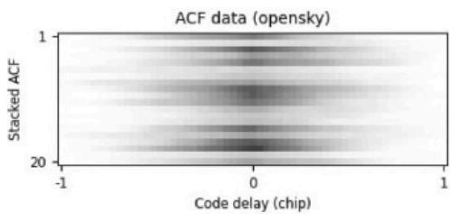

heatmap

ACF data (opensky)
| Code delay (chip) | 1 | 20 |
|---|---|---|
| -1 | 1 | 0 |
| 0 | 0 | 1 |
| 1 | 1 | 0 |

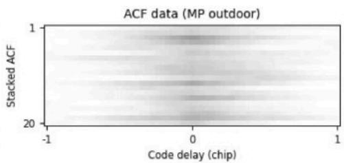

line

| Code delay (chip) | Stacked ACF |
| ----------------- | ----------- |
| -1                | 1           |
| 0                 | 20          |
| 1                 | 20          |

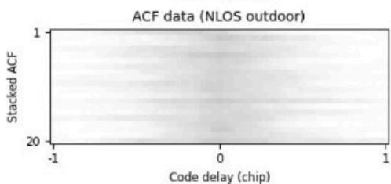

line

| Code delay (chip) | Stacked ACF |
| ----------------- | ----------- |
| -1                | 1           |
| 0                 | 1           |
| 1                 | 1           |

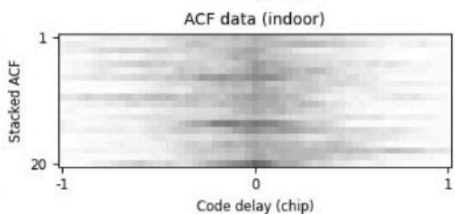

heatmap

| Code delay (chip) | Stacked ACF |
| ----------------- | ----------- |
| -1                | 1           |
| 0                 | 1           |
| 1                 | 1           |

Download: Download high-res image (439KB)   
Download: Download full-size image

Fig. 17. Examples of ACF stacks of size 20 for each label.

In fact, in this case, classification is carried out considering a network model based on two-dimensional convolutional layers with a filter having a height different from its width. This choice is justified by the nature of the problem, in which the characteristics of the ACF exhibit a directionality that is more prominent in the width dimension. More specifically, the network architecture consists of a first two-dimensional convolutional layer employing a 3x5 kernel, with stride equal to 1 and padding set to (1,2), which extracts 32 feature maps from the input representation. A subsequent 2D max-pooling layer with kernel size 2x2 and stride equal to 2 reduces the spatial resolution of these feature maps. The second convolutional layer, again using a 3x5 kernel with stride equal to 1 and padding set to (1,2), extracts an additional set of 32 feature maps, followed by a second max-pooling layer for further dimensionality reduction. The resulting feature maps are then flattened and provided as input to a classifier composed of three fully connected layers. The first FC layer has 1024 neurons, the second has 512 neurons and the final output layer has 4 neurons to produce the final classification labels. Again, batch normalization is applied to the outputs of both convolutional layers and the activation function used is LeakyReLU. Fig. 18 shows a schematic representation of the neural network architecture. Both networks (CNN 1D and CNN 2D) are trained using the Adam optimizer with a learning rate of 10 , a−4 batch size of 1024 and the cross-entropy loss function for classification. As classification is performed using the PyTorch crossentropy loss (Paszke et al., 2019), the final fully connected layer does not employ any activation function and directly outputs raw logits. Training was conducted on the training set for up to 30 epochs. However, an early stopping strategy is adopted to mitigate overfitting by monitoring the validation performance and terminating the optimization process when no further improvement is observed. In practice, the optimal model checkpoints are generally achieved after approximately 15 epochs for the CNN 1D and 21–22 epochs for the CNN 2D.

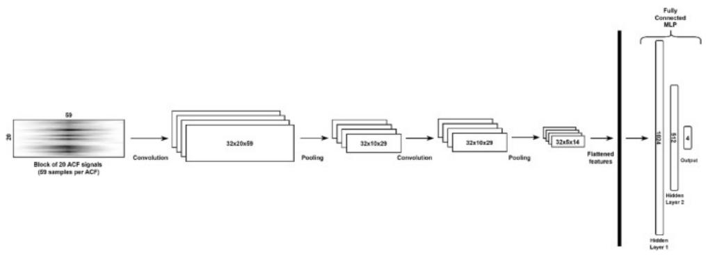

flowchart

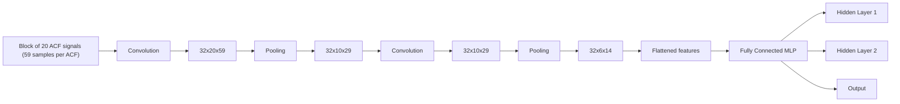

Download: Download high-res image (199KB)   
Download: Download full-size image

Fig. 18. CNN 2D architecture.

The CNN 2D architecture was designed to accommodate images composed of ACF blocks of different sizes: 5, 10, 15 and 20. Four different models were trained to assess the accuracy of classification in relation to the varying block size with respect to the test set. While the order in which ACFs are stacked together to form data blocks (for a given PRN and scenario) is irrelevant when considering the features used in the SVC (these features rely on mean values across code delays), this is not necessarily the case for blocks analysed by a CNN. However, we carried out a dedicated analysis that revealed that, given PRN and scenario, the ACF signals do not need to be arranged in chronological order or as continuous sequences for accurate classification. This finding confirms the lack of correlation between individual ACFs and also indicates that any potential data gaps in the acquisition do not affect the results.

The presented deep-learning architectures were developed through an iterative process that involved evaluating various configurations. These configurations ranged from simpler to more complex models, with the size of the convolutional filter also being varied.

The design and training of above-described networks were carried out in Python using PyTorch (Paszke et al., 2019) on a computer equipped with an Intel Core i7-8665U CPU and 16GB DDR4 RAM.

# 4. Results

Table 1, Table 2 show the overall classification accuracies on the test sets obtained for the different approaches (SVC, CNN 1D, CNN 2D) and under different conditions: different features (for SVC only), different acquisition frequencies and different ACF block sizes. The highest accuracies for each case are reported in bold.   
Table 1. Global accuracies (%) at 15MHz acquisition frequency. 

<table><tr><td rowspan="3">ACF block size</td><td colspan="4">Method</td></tr><tr><td colspan="2">SVC</td><td rowspan="2">CNN 1D</td><td rowspan="2">CNN 2D</td></tr><tr><td>Four features</td><td>Many features</td></tr><tr><td>1</td><td>48.5</td><td>50.7</td><td>71.6</td><td>-</td></tr><tr><td>5</td><td>57.7</td><td>61.3</td><td>-</td><td>84.1</td></tr><tr><td>10</td><td>60.5</td><td>64.5</td><td>-</td><td>90.2</td></tr><tr><td>15</td><td>62.5</td><td>66.3</td><td>-</td><td>93.3</td></tr><tr><td>20</td><td>63.5</td><td>66.1</td><td>-</td><td>94.9</td></tr></table>

Table 2. Global accuracies (%) at 30MHz acquisition frequency. 

<table><tr><td rowspan="3">ACF block size</td><td colspan="4">Method</td></tr><tr><td colspan="2">SVC</td><td rowspan="2">CNN 1D</td><td rowspan="2">CNN 2D</td></tr><tr><td>Four features</td><td>Many features</td></tr><tr><td>1</td><td>49.8</td><td>53.3</td><td>74.3</td><td>-</td></tr><tr><td>5</td><td>61.1</td><td>64.9</td><td>-</td><td>84.6</td></tr><tr><td>10</td><td>63.9</td><td>67.3</td><td>-</td><td>90.6</td></tr><tr><td>15</td><td>64.9</td><td>67.4</td><td>-</td><td>93.6</td></tr><tr><td>20</td><td>65.4</td><td>67.3</td><td>-</td><td>96.4</td></tr></table>

Precision, Recall and F1 score metrics are extracted from the confusion matrices and presented in Table 3, which refers to an acquisition frequency of 30MHz and an ACF block size of 20. The best SVC configuration is obtained with many features and ACF block size =20, and achieves 67.3%, while the CNN 1D is, of course, defined with an ACF block size of 1.

Table 3. Precision, Recall and F1-score metrics (%) for 30MHz acquisition frequency. 

<table><tr><td rowspan="3">Classes</td><td colspan="9">Method</td></tr><tr><td colspan="3">SVC</td><td colspan="3">CNN 1D</td><td colspan="3">CNN 2D</td></tr><tr><td>Precision</td><td>Recall</td><td>F1-Score</td><td>Precision</td><td>Recall</td><td>F1-Score</td><td>Precision</td><td>Recall</td><td>F1-Score</td></tr><tr><td>Opensky</td><td>57.6</td><td>76.4</td><td>66.1</td><td>62.7</td><td>85.5</td><td>72.4</td><td>96.2</td><td>96.1</td><td>96.1</td></tr><tr><td>MP Outdoor</td><td>92.3</td><td>21.4</td><td>34.3</td><td>62.2</td><td>35.8</td><td>45.5</td><td>92.3</td><td>93.8</td><td>93.0</td></tr><tr><td>NLOS Outdoor</td><td>50.3</td><td>83.6</td><td>65.3</td><td>59.5</td><td>45.8</td><td>51.8</td><td>89.2</td><td>87.8</td><td>88.5</td></tr><tr><td>Indoor</td><td>98.4</td><td>77.4</td><td>86.6</td><td>98.1</td><td>97.9</td><td>98.0</td><td>98.4</td><td>98.0</td><td>98.2</td></tr></table>

# 5. Discussion

Results presented in Sec. 4 indicate that CNN 2D is the top-performing method, particularly when using larger ACF block sizes and the higher acquisition frequency of 30MHz. However, the performance at 15MHz is very similar, demonstrating that even at lower sampling frequencies, the relevant signal features are effectively captured by the deep-learning architecture. The CNN 1D approach demonstrates reasonable accuracy with just a single ACF. In contrast, while the SVC method, especially with “many features”, shows some improvement in accuracy as the ACF block size increases, its overall performance remains moderate to suboptimal, likely due to limitations in the selected feature set. Furthermore, the classification accuracies for SVC are quite similar across both frequencies, as the features used in both cases do not vary significantly. For quantitative reference, state-ofthe-art conventional classifiers based on SVMs report global accuracies of approximately 75.4% for three-class LOS/MP/NLOS problems using optimized feature combinations (Hsu, 2017) and about 74.2% when operating at correlator level (Xu et al., 2019). Approaches relying exclusively on standard receiver outputs (e.g., NMEA or RINEX) perform substantially worse, with reported accuracy around 45% (Xu et al., 2019). In fact, the advantage of using a CNN is its capability to extract meaningful features from complex data structures, such as those embedded in ACF stacks, which are difficult to analyse through traditional approaches and standard feature engineering techniques.

Plotting the global accuracies against the ACF block size reveals a clear upward trend (Fig. 19); the more ACFs are accumulated (relative to a specific PRN), the higher the classification accuracy. This highlights the substantial informational content of the ACF stack for discriminating among different GPS signal propagation conditions. Notably, stacking as few as 10 ACFs already yields a classification accuracy exceeding 90%. This performance markedly exceeds that of single-parameter C/N -based classifiers, which0 typically achieve accuracies of approximately 67.1% (Hsu, 2017), as well as standard NMEA/RINEX-based approaches, whose reported accuracies remain in the 44–45% range (Xu et al., 2019).

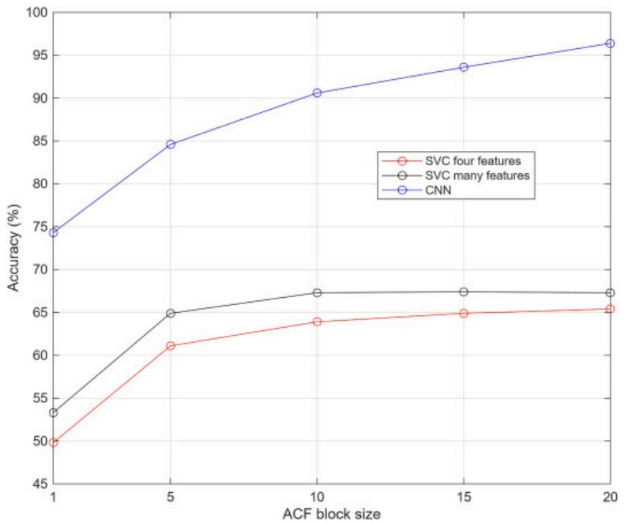

line

| ACF block size | SVC four features | SVC many features | CNN  |
| -------------- | ----------------- | ----------------- | ---- |
| 1              | 50                | 53                | 75   |
| 5              | 61                | 65                | 85   |
| 10             | 64                | 67                | 91   |
| 15             | 65                | 67                | 94   |
| 20             | 65                | 67                | 96   |

Download: Download high-res image (329KB)   
Download: Download full-size image

Fig. 19. Global accuracies (%) against the ACF block sizes (30MHz).

These results demonstrate the promising capabilities of the presented methodology. As noted, optimal outcomes are achieved at both 30MHz and 15MHz sampling frequencies. These frequencies, of course, influence the data storage requirements needed to compile adequate training datasets. Although data collection for the training phase necessitates substantial storage capacity, it is important to highlight that once training is complete, the deep-learning model is lightweight. During inference, it requires no heavy computations beyond the forward evaluation of the trained neural network.

The system requires stacking only 10, 15 or 20 ACFs to achieve classification accuracies exceeding 90%, highlighting a methodological departure from conventional classification methods based on handcrafted high-level features.

The proposed ACF-based CNN 2D achieves a peak global accuracy of 96.4% (see Table 2, 30MHz, ACF size =20) on the four-class classification problem that explicitly includes an Indoor scenario. Its robust performance across classes is confirmed by the high per-class F1-scores reported in Table 3, which reach up to 98.2% for the Indoor class. This corresponds to an absolute improvement of approximately 21 percentage points with respect to the best-performing conventional three-class methods reported in the Literature (Hsu, 2017). Overall, these results demonstrate that direct representation learning from the physical signal signature enables the extraction of complex, non-linear patterns that traditional feature-engineering approaches fail to capture, as further evidenced by the 29-percentage-point accuracy gap between the CNN 2D and the best SVC benchmark (Table 2) under the same experimental conditions. More in detail, this configuration shows robust discriminative performance across all environments. However, the remaining overlaps between classes reflect inherent physical limitations of ACF-based feature extraction.

Class Opensky: The model identifies LOS signals with a recall of 96.1%. Most errors correspond to limited confusion primarily with MP Outdoor (2.3%) and NLOS Outdoor (1.4%). These false negatives likely arise from propagation near obstacles where weak diffraction or secondary reflections slightly distort the ACF peak, mimicking a multipath signature.   
• Class MP Outdoor: This class achieves a recall of 93.8%. Misclassifications are mainly distributed between Opensky (3.2%) and NLOS Outdoor (2.1%), indicating intermediate propagation conditions that share features with both direct-path and obstructed scenarios.   
• Class NLOS Outdoor: This class is the most challenging, with a recall of 87.8%. The dominant confusion occurs with MP Outdoor (6.5%). In some static configurations, a strong single reflection may generate a sharp correlation peak reducing the apparent multipath structure and biasing the classifier toward the MP class.   
Class Indoor: The model exhibits near-perfect isolation for this class, reaching a recall of 98.0%. Only a negligible fraction of samples from the outdoor classes is misidentified as Indoor, confirming that the ACF signatures in these environments are highly distinct from the outdoor propagation models.

As mentioned in Sec. 3.4, the data were collected under static conditions. In dynamic conditions, ACF characteristics are affected by motion-induced distortions, such as Doppler-related peak shifts, widening from rapid movement and multipath effects and changes in peak-to-sidelobe amplitude ratios (Parkinson and Spilker, 1996). These effects can degrade time delay estimation and reduce classification reliability. Although the proposed method was validated on static data, its extension to dynamic scenarios depends on preserving key ACF features, such as peak definition and amplitude stability. At low speeds (e.g., walking, or slow urban driving), these properties remain largely unaffected, ensuring reliable performance. However, at higher velocities, increased Doppler variability and complex multipath dynamics may lead to misclassification between multipath and NLOS signals due to overlapping ACF characteristics. A viable solution is to incorporate motion-related features as classifier inputs, providing contextual information to distinguish distortions caused by movement from those due to signal obstruction. Incorporating such domain-aware features may significantly improve robustness under varying dynamics and therefore it should be explored in future experimental validation.

A promising research direction involves integrating the proposed classifier into a Fault Detection and Exclusion (FDE) framework. Leveraging the classification outputs to assign context-aware weights to pseudorange measurements can substantially enhance PVT accuracy (Suzuki and Amano, 2021). In particular, the 93.8% recall achieved for the MP Outdoor class provides high confidence for implementing a graded weighting strategy: while NLOS signals should be excluded due to their large, unmodeled biases, correctly identified MP signals can be retained with reduced weights. This approach preserves satellite geometry and improves service availability in challenging urban environments. Moreover, such probabilistic fault handling could relax traditional RAIM assumptions, including the single-failure hypothesis and the requirement for at least six visible satellites (Kaplan et al., 2006).

Finally, this research could also be expanded to classify GNSS anomalies, such as failures or spoofing events, as their effects can be observed in the ACFs. The proposed classification could serve as an Anomaly Detection System (Sun et al., 2018). However, given the challenges of acquiring datasets affected by real failures or spoofing incidents, dedicated simulation models should be employed to generate the corrupted data necessary for testing and validating this approach.

# 6. Conclusions

In harsh environments, multipath and NLOS GNSS reception can lead to positioning errors that are too large for certain applications, necessitating at least partial correction. This work applies several machine learning techniques (SVC, CNN 1D and CNN 2D) to classify autocorrelations of received signals, allowing corrupted pseudorange measurements to be identified and either excluded or weighted appropriately in the navigation algorithm. The method classifies signals into four scenarios: Opensky, Outdoor with multipath, Outdoor with NLOS and Indoor. Data collection utilized two front-end acquisition frequencies: 15MHz and 30MHz, with the lower frequency typical of entry-level professional receivers. ACF signals were processed and labelled using a self-contained technique that relies on GNSS, employing a cost-effective and efficient procedure that leverages a mobile application and online maps. Machine learning algorithms were trained on either individual ACF data or blocks of sizes 5, 10, 15 and 20 (for a given PRN). The experimental results achieved overall classification accuracies of 67.3%, 74.3% and 96.4% for SVC, CNN 1D and CNN 2D, respectively. The CNN method proved most successful, as this deep-learning technique excels in extracting meaningful features from complex data. Additionally, increasing the block size correlated with improved accuracy, highlighting the value of ACF stacks in distinguishing GPS signal characteristics. Although data collection for the training phase necessitates substantial storage capacity, it is important to highlight that once the training phase is complete, the deep-learning model is lightweight. During inference, it requires no heavy computations beyond evaluating the neural network. Remarkably, stacking as few as 10 ACFs can achieve classification accuracy exceeding 90%, surpassing conventional methods based on highlevel features like elevation and signal-to-noise ratio, as well as ACF-feature-based shallow classifiers, with an improvement exceeding 20 percentage points over the best-performing methods reported in the Literature.

# CRediT authorship contribution statement

Francesco Nebula: Writing – review & editing, Writing – original draft, Software, Methodology, Data curation, Conceptualization. Roberto Palumbo: Writing – review & editing, Software, Data curation, Conceptualization.

# Declaration of competing interest

The authors declare that they have no known competing financial interests or personal relationships that could have appeared to influence the work reported in this paper.

Recommended articles

# Data availability

Data will be made available on request.

# References

Bellad and Petovello, 2013 Vijaykumar Bellad, Mark Petovello Indoor Multipath Characterization and Separation Using Distortions in GPS Receiver Correlation Peaks (2013) Google Scholar

Blais et al., 2022 A. Blais, N. Couellan, E. Munin A novel image representation of GNSS correlation for deep learning multipath detection Array, 14 (2022), Article 100167, 10.1016/j.array.2022.100167 ISSN 2590-0056

View PDF View article View in Scopus Google Scholar

Borhani-Darian et al., 2023 P. Borhani-Darian, H. Li, P. Wu, P. Closas Deep learning of GNSS acquisition Sensors, 23 (2023), p. 1566, 10.3390/s23031566 View in Scopus Google Scholar

Closas et al., 2009 P. Closas, C. Fernandez-Prades, J.A. Fernandez-Rubio

A Bayesian approach to multipath mitigation in GNSS receivers

IEEE J. Sel. Top. Signal Process., 3 (4) (2009), pp. 695-706

View in Scopus Google Scholar

DoD, 2007  U.S. DoD

Global Positioning System Precise Positioning Service Performance Standard

(2007)

Google Scholar

Ettus Research, 2021 Ettus Research

USRP E310 datasheet

https://www.ettus.com/content/fi les/e310-datasheet.pdf (2021)

Google Scholar

GNU Radio GNU radio, version 3.10.5.1

https://www.gnuradio.org/

Google Scholar

GPSTest App on Google Play  GPSTest app on google play

https://play.google.com/store/apps/details?id=com.android.gpstest , Accessed 8th Nov 2023

Google Scholar

Groves et al., 2012  Paul Groves, Ziyi Jiang, Lei Wang, Marek Ziebart

Intelligent urban positioning using multi-constellation GNSS with 3D mapping and NLOS signal detection

Proceedings of the 25 International Technical Meeting of the Satellite Division of the Institute of Navigation (Ion Gnss 2012), vol. 1th (2012), pp. 458-472

View in Scopus Google Scholar

Groves et al., 2013  P.D. Groves, Z. Jiang, M. Rudi, P. Strode

A portfolio approach to NLOS and multipath mitigation in dense urban areas

Proceedings of the 26th International Technical Meeting of the Satellite Division of the Institute of Navigation (ION GNSS+ 2013), Nashville, TN (2013), pp. 3231-3247

View in Scopus Google Scholar

Hsu, 2017  L.-T. Hsu

‘GNSS multipath detection using a machine learning approach’, in 2017

IEEE 20th International Conference on Intelligent Transportation Systems (ITSC), IEEE, Yokohama, Japan (2017), pp. 1-6, 10.1109/ITSC.2017.8317700

16–19 October

Google Scholar

Kaplan et al., 2006  E.D. Kaplan, C.J. Hegarty

Understanding GPS Principles and Applications

(second ed.), Artech House, Norwood, MA, USA (2006)

Google Scholar

Khan et al., 2011 R. Khan, S.U. Khan, R. Zaheer, S. Khan

Acquisition strategies of GNSS receiver

International Conference on Computer Networks and Information Technology, Abbottabad, Pakistan (2011), pp. 119-124, 10.1109/ICCNIT.2011.6020917

View in Scopus Google Scholar

Kim et al., 2022  Sanghyun Kim, Jungyun Byun, Kwansik Park

Machine learning-based GPS multipath detection method using dual antennas

2022 13th Asian Control Conference (ASCC), IEEE (2022)

Google Scholar

Kiranyaz et al., 2021  Serkan Kiranyaz, Onur Avci, Osama Abdeljaber, Turker Ince, Moncef Gabbouj, Daniel J. Inman

1D convolutional neural networks and applications: a survey

Mech. Syst. Signal Process., 151 (2021), Article 107398, 10.1016/j.ymssp.2020.107398

Kubo et al., 2020  Nobuaki Kubo, Kaito Kobayashi, Rei Furukawa

GNSS Multipath detection using continuous time-series C/N0

Sensors, 20 (2020), p. 4059, 10.3390/s20144059

Google Scholar

Lee et al., 2019  A GPS multipath mitigation technique using correlators with variable chip spacing

Jin Hyuk Lee, Deok Won Lim, Jae Hee Noh, Gwang Hee Jo, Chansik Park, Jae Min Ahn, Sang Jeong Lee (Eds.), E3S Web Conf., vol. 94 (2019), Article 03006, 10.1051/e3sconf/20199403006

Google Scholar

Mikhail and Ackermann, 1976 E.M. Mikhail, F.E. Ackermann

Observations and least squares

IEP Series in Civil Engineering, IEP (1976)

Google Scholar

Parkinson and Spilker, 1996  B.W. Parkinson, J.J. Spilker Jr.

Global Positioning System: Theory and Applications, Vol.I, Progress in Astronautics and Aeronautics

American Institute of Aeronautics and Astronautics, Washington DC (1996)

Google Scholar

Paszke et al., 2019  A. Paszke, S. Gross, F. Massa, Adam Lerer, J. Bradbury, G. Chanan, T. Killeen, Z. Lin, N. Gimelshein, L. Antiga, A. Desmaison,

A. Kopf, E. Yang, Z. DeVito, M. Raison, A. Tejani, S. Chilamkurthy, B. Steiner, L. Fang, J. Bai, S. Chintala

PyTorch: an imperative style, high-performance deep learning library

Adv. Neural Inf. Process. Syst., 32 (2019), pp. 8024-8035

Google Scholar

Pirsiavash, 2019 A. Pirsiavash

Receiver-level Signal and Measurement Quality Monitoring for Reliable GNSS-based Navigation (Doctoral thesis)

University of Calgary, Calgary, Canada (2019)

URL:

https://prism.ucalgary.ca

Google Scholar

Quan et al., 2018  Yiming Quan, Lawrence Lau, Gethin Roberts, Xiaolin Meng, Chao Zhang

Convolutional neural network based Multipath detection method for static and kinematic GPS high precision positioning

Remote Sens., 10 (2018), p. 2052, 10.3390/rs10122052

View in Scopus Google Scholar

Scikit -learn, 2011 Scikit-learn

Machine learning in python

Pedregosa et al., JMLR, 12 (2011), pp. 2825-2830

Google Scholar

Shapiro, 2010  Adam M. Shapiro

FPGA-based real-time GPS Receiver

(2010)

Google Scholar

Siemuri et al., 2022  Akpojoto Siemuri, Kannan Selvan, Heidi Kuusniemi, Petri Välisuo, Mohammed Elmusrati

A systematic review of machine learning techniques for GNSS use cases

IEEE Trans. Aero. Electron. Syst. (2022), pp. 1-42, 10.1109/TAES.2022.3219366

Google Scholar

Sun et al., 2018  C. Sun, J.W. Cheong, A.G. Dempster, H. Zhao, W. Feng

GNSS spoofing detection by means of Signal Quality Monitoring (SQM) metric combinations

IEEE Access, 6 (2018), pp. 66428-66441, 10.1109/ACCESS.2018.2875948

View in Scopus Google Scholar

Suzuki and Amano, 2021  T. Suzuki, Y. Amano

NLOS multipath classification of GNSS signal correlation output using machine learning

Sensors, 21 (2021), p. 2503, 10.3390/s21072503

View in Scopus Google Scholar

The MathWorks Inc, 2021  The MathWorks Inc

MATLAB version R2021a (9.10), Natick, Massachusetts (2021)

Google Scholar

Townsend and Fenton, 1994 B. Townsend, P. Fenton

A Practical Approach to the Reduction of Pseudorange Multipath Errors in a L1 GPS Receiver

Proceedings of the 7th International Technical Meeting of the Satellite Division of (ION GPS 1994), The Institute of Navigation, Salt

Lake City, UT, USA (1994), pp. 143-148

20–23 September 1994,

View in Scopus Google Scholar

Trimble, 2011  Trimble

GPS Antennas for Embedded Systems – Datasheet

[online] Available at:

https://www.ettus.com/wp-content/uploads/2019/01/Trimble/\_GPS/\_Antenna/\_DS.pdf , Accessed 11th Feb 2026

Google Scholar

Xu et al., 2015  R. Xu, W. Chen, Y. Xu, S. Ji

A new indoor positioning system architecture using GPS signals

Sensors, 15 (2015), pp. 10074-10087, 10.3390/s150510074

View in Scopus Google Scholar

Xu et al., 2019 B. Xu, Q. Jia, Y. Luo, L.-T. Hsu

Intelligent GPS L1 LOS/Multipath/NLOS classifiers based on Correlator-, RINEX- and NMEA-level measurements

Remote Sens., 11 (2019), p. 1851, 10.3390/rs11161851

View in Scopus Google Scholar

Xue et al., 2022 Z Xue, Z Lu, Z Xiao, J Song, S Ni

Overview of multipath mitigation technology in global navigation satellite system

Front. Phys., 10 (2022), p. 1071539, 10.3389/fphy.2022.1071539

View in Scopus Google Scholar

Yozevitch et al., 2016 R. Yozevitch, B.B. Moshe, A. Weissman

A robust GNSS LOS/NLOS signal classifier

J. Inst. Navig., 63 (2016), pp. 429-442, 10.1002/navi.166

View in Scopus Google Scholar

Zhu et al., 2018  Ni Zhu, Juliette Marais, David Betaille, Marion Berbineau

GNSS position integrity in urban environments: a review of literature

IEEE Trans. Intell. Transport. Syst. (2018), p. 17, 10.1109/TITS.2017.2766768

IEEE

Google Scholar

Zidan et al., 2021  J. Zidan, E.I. Adegoke, E. Kampert, S.A. Birrell, C.R. Ford, M.D. Higgins

GNSS vulnerabilities and existing solutions: a review of the literature

IEEE Access, 9 (2021), pp. 153960-153976, 10.1109/ACCESS.2020.2973759

View in Scopus Google Scholar

View Abstract

© 2026 Elsevier Ltd. All rights are reserved, including those for text and data mining, AI training, and similar technologies.

All content on this site: Copyright © 2026 Elsevier B.V., its licensors, and contributors. All rights are reserved, including those for text and data mining, AI training, and similar technologies. For all open access content, the relevant licensing terms apply.

