# Automated Calibration of Position Sensors in Coarse Pointing Assemblies for Free-Space Optical Communication Using Gaussian Process Regression

Max van Meer , Emre Deniz, Gert Witvoet, Member, IEEE, and Tom Oomen , Senior Member, IEEE

Abstract—Free-space optical satellite communication terminals rely on accurate metrology of their pointing mirrors to correctly aim their laser to a counter terminal, while at the same time requiring simple, lightweight and low-cost sensors. The aim of this paper is to develop an automated procedure for the calibration of these sensors in a mass production setting, using a pointing test bench (PTB) to automatically calibrate the angular sensors of many Coarse Pointing Assemblies (CPAs), which position pointing mirrors over a large field-of-regard. The PTB and CPA are aligned using feedback over an external optical position sensor (OPS) and an inverse kinematic model is learned from data, after which Gaussian Process regression models are created to predict and correct sensor errors, taking into account propagation of calibration errors from the PTB to the CPA. Experimental results show that the CPA sensor errors are reduced by two orders of magnitude by this automated calibration approach, even at orientations at which the PTB itself is uncalibrated. The developed framework is generalizable to calibration of arbitrary 2 degree of freedom (2-DOF) rotary systems and is not limited to specific types of position sensors, thereby enabling significant cost savings and increased accuracy in mass production of satellite communication terminals.

Index Terms—Mechatronic systems, free-space optical communication, Bayesian methods, calibration, Gaussian process regression.

Received 21 May 2025; revised 16 February 2026; accepted 16 March 2026. Date of publication 18 March 2026; date of current version 9 April 2026. This work was supported in part by the Netherlands Organisation for Scientific Research (NWO) through Research Programme VIDI under Project 15698, in part by ECSEL Joint Undertaking under Grant 101007311 (IMOCO4.E), in part by European Union’s Horizon 2020 Research and Innovation Programme, in part by internal TNO IEBVA funding (development of the PTB by TNO), in part by RVO Fieldlab (CPA by TNO) via the Dutch Optics Center, and in part by TKI HTSM with partners Raytheon and FSO Instruments. (Corresponding author: Tom Oomen.)

Max van Meer is with the Eindhoven University of Technology, 5612, AZ Eindhoven, The Netherlands (e-mail: m.v.meer@tue.nl).

Emre Deniz is with the Department of Optomechatronics, TNO, 2628, CK Delft, The Netherlands.

Gert Witvoet is with the Eindhoven University of Technology, 5612, AZ Eindhoven, The Netherlands, and also with the Department of Optomechatronics, TNO, 2628, CK Delft, The Netherlands.

Tom Oomen is with the Eindhoven University of Technology, 5612, AZ Eindhoven, The Netherlands, and also with the Delft University of Technology, 2600, AA Delft, The Netherlands (e-mail: t.a.e.oomen@tue.nl).

Color versions of one or more figures in this article are available at https://doi.org/10.1109/JSTQE.2026.3675528.

Digital Object Identifier 10.1109/JSTQE.2026.3675528

# I. INTRODUCTION

A CCURATE angular measurements are crucial in high-techindustries, particularly those involving optical systems such as free-space optical communication (FSOC) [1], [2]. FSOC refers to data transmission using highly collimated optical beams through space or atmosphere, offering orders of magnitude higher throughput and low probability of interception compared to traditional radio-frequency links due to the large available optical bandwidth and narrow beamwidths [3], [4]. Because these beams are highly directional, the angular accuracy of the steering optics must be very high to prevent link losses and thus to maintain the optical link and guarantee high communication performance.

Space-based laser communication has matured from early demonstrations to operational and planned systems that support high data rates and network-scale architectures [5]. For example, NASA’s TeraByte InfraRed Delivery (TBIRD) mission demonstrated multi-hundred-gigabit per second downlinks from low Earth orbit [6], and commercial constellations such as SpaceX’s Starlink employ laser inter-satellite links to form optical mesh networks connecting thousands of satellites in orbit [7]. Amazon’s Project Kuiper has also tested 100 Gbps optical links between prototype satellites as part of its planned mesh architecture [8]. This shift from one-off missions to network-scale constellations motivates cost-effective, high-volume production of optical terminals and their pointing subsystems.

While certain FSOC terminals rely on body pointing of the parent platform, more generic FSOC terminals employ a coarse pointing assembly (CPA) to perform large-angle beam steering, often complemented by a fine pointing stage to maintain precise beam alignment in the presence of high-frequency disturbances. Physically, the CPA consists of two orthogonal rotary axes supporting a steering mirror, driven by actuators such as switched reluctance motors [9]. Motivated by the required accuracies, angular position sensing is often done using costly devices such as optical encoders or eddy-current sensors. However, to facilitate cost-effective implementation of FSOC terminals at scale, there is a growing demand to adopt low-cost angular sensors in laser pointing modules, such as Hall-effect sensors. While affordable, these sensors exhibit systematic inaccuracies, needing calibration before deployment, in order to comply with the required accuracies for acquisition and pointing. For LEO-to-LEO (Low-Earth Orbit) optical links, typical CPA performance requirements include a pointing knowledge better than 500 rad (3 ), which is directly determined by the angular μ σsensor accuracy, and a pointing jitter below 1 rad (3 ), which μ σis compensated by the fine pointing stage [9]. These requirements illustrate that systematic errors in coarse pointing sensor measurements must be accurately calibrated to ensure reliable optical link acquisition and tracking. In this work, the focus is on the sensing and calibration of this coarse pointing stage.

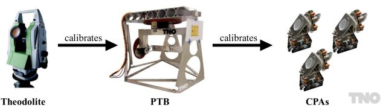

flowchart

Fig. 1. Overview of cascaded calibration from TNO. A highly accurate theodolite is used to manually calibrate the pointing test bench (PTB) angular sensors once. The PTB, in turn, automatically calibrates the angular sensors of many Coarse Pointing Assemblies (CPAs) in series production.

Calibration becomes especially critical when employing lowcost angular sensors in CPAs for FSOC terminals, including magnetic sensors such as linear Hall-effect sensors. While Hall sensors are used as an illustrative example in this manuscript, the developed calibration procedure is not specific to Hall-effect sensing and applies to any repeatable, orientation-dependent sensor errors. As an example, Hall-effect sensors suffer from parasitic effects due to uneven magnetization and mechanical misalignments [9], [10], [11]. Such imperfections limit the achievable pointing accuracy and thus require calibration, and as production scales up, automation of calibration becomes necessary to support high-volume manufacturing while maintaining the required pointing performance.

Sensor calibration typically involves comparing CPA sensor outputs with those of external high-accuracy metrology instruments, such as a theodolite, laser tracker, or autocollimator, and modeling systematic, angle-dependent sensor errors. In current practice, this calibration is often performed manually by orienting the CPA to a sequence of discrete reference angles and recording both the sensor readings and the corresponding angles measured by the external instrument. This process requires careful mechanical alignment and operator intervention at each calibration point, making it time-consuming and limiting the number of measurements that can be obtained. As a result, calibration models are typically constructed from sparse datasets, which may not fully capture nonlinear sensor errors. A Pointing Test Bench (PTB), as presented in [12] and shown in Fig. 1, could facilitate the automation of this calibration process by enabling repeatable, high-density measurements without manual intervention, for series production in a factory. A critical prerequisite for calibration is that the PTB is aligned to the CPA, as misalignment distorts calibration, see Fig. 2. Achieving precise alignment generally involves external measurements [13], [14], such as optical position sensors (OPS), adding complexity due to the nonlinear kinematics between PTB and OPS measurements.

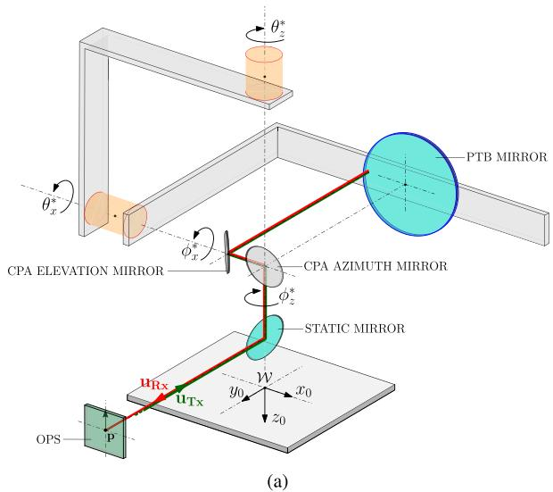

text_image

PTB MIRROR
CPA ELEVATION MIRROR
CPA AZIMUTH MIRROR
STATIC MIRROR
uRx
uTx
OPS
p
θz*
φz*
φz*
θz*
(a)

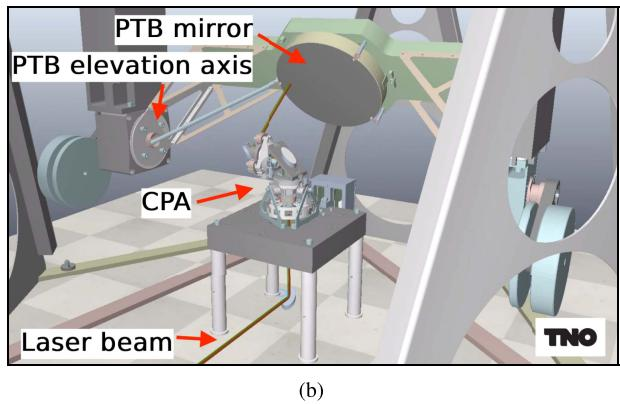

text_image

PTB mirror
PTB elevation axis
CPA
Laser beam
(b)
TNO

Fig. 2. (a) Schematic and (b) rendering of a coarse pointing assembly (CPA) placed underneath a pointing test bench (PTB). In (a), the CPA consists only of the two mirrors labeled with the prefix “CPA”, while all other optical and mechanical components belong to the PTB. The two CPA mirrors are mounted on a rigid CPA frame, which can be rotated in two axes, independently of the PTB. A laser beam $\scriptstyle { \mathbf { \pmb { u } } } _ { \mathrm { T x } }$ is emitted from the origin of an optical position sensor (OPS) and reflected back as $\scriptstyle \mathbf { \pmb { u } } _ { \mathrm { R x } }$ via the CPA and the PTB. The location p of the incoming beam uRx on the OPS conveys information about the alignment of the PTB to the CPA, since they are installed such that $\mathbf { \nabla } _ { \mathbf { \mathcal { P } } } = \mathbf { 0 }$ when $\theta ^ { * } = \phi ^ { * }$ .

Apart from alignment, accurate calibration of the PTB itself is crucial, as any inaccuracy propagates directly into the calibration of every CPA. PTB calibration typically involves alignment with a precise external instrument, such as a theodolite, but geometric constraints can make this impossible for certain orientations. Additionally, manual alignment is labor-intensive, limiting the number of available data points and complicating the calibration process [15], [16].

Existing solutions for optical alignment and calibration, such as theodolites, laser trackers, and autocollimation techniques [15], [17], achieve high accuracy but are labor-intensive and impractical for large-scale production of CPAs. This has led to increasing interest in data-driven methods that can effectively model calibration errors. Among these, Gaussian Process (GP) regression has emerged as a promising tool for modeling nonlinear functions from limited data [11], [18], [19]. GP regression not only models the calibration function but also quantifies uncertainty, making it well-suited for addressing error propagation in cascaded calibration. An initial application of GP regression to cascaded calibration is presented in [20], which demonstrates its potential on a 1-DOF simulation example.

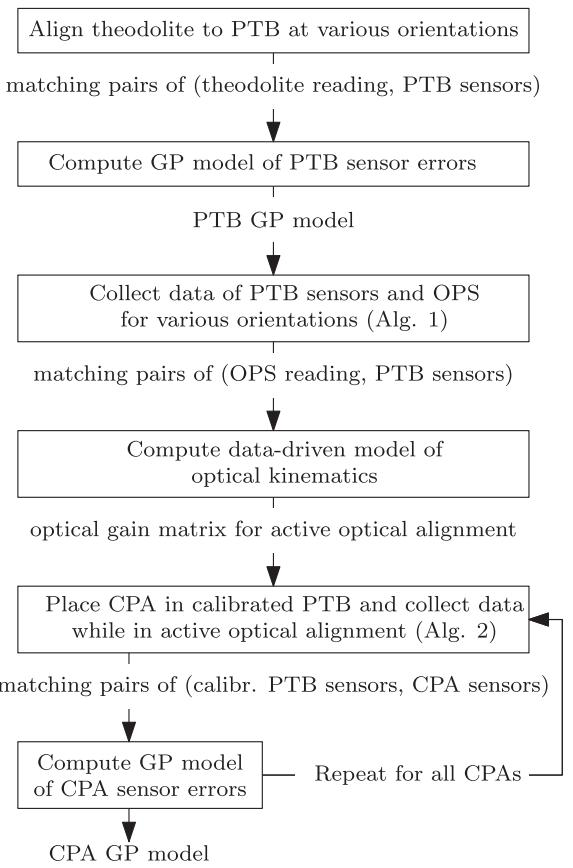

flowchart

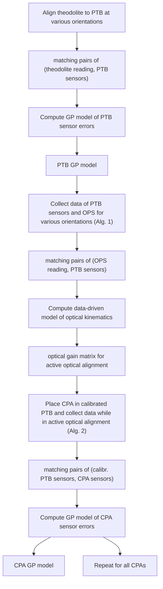

Fig. 3. High-level overview of the developed methodology for automated calibration of position sensors.

The contributions of this paper are the following.

1) A control strategy is developed to actively align the CPA to the PTB for calibration, using an external optical position sensor (OPS) for feedback, and optical kinematics learned from data.   
2) A probabilistic framework for the modeling of the PTB and CPA sensor errors is developed. Using Gaussian Process regression the uncertainty in the calibration models is quantified as a function of orientation.   
3) The developed framework is validated experimentally, demonstrating reductions of factors 83 and 64 in CPA sensor errors at validation points where the PTB itself is uncalibrated.

This paper is structured as follows. First, in Section II, the cascaded calibration problem is detailed. Next, Section III presents the developed approach to automated cascaded calibration, a high-level schematic of which is provided in Fig. 3. Subsequently, Section IV presents experimental results, and finally, conclusions are provided in Section V.

# II. PROBLEM FORMULATION

This section addresses the problem of calibrating multiple CPAs using a single PTB. Since calibration errors of the PTB propagate to all CPAs, the problem is treated as cascaded calibration, in which the calibrations of both the angular sensors of the PTB and CPAs are jointly considered.

# A. Overview

First, the background of the cascaded calibration problem is described. Next, the nature of the sensor errors is detailed.

1) Background: Free-space optical communication (FSOC) requires accurate pointing of a laser from a transmitter terminal to a receiver, e.g., from one satellite to another, or from a satellite to a ground station. In LEO-to-LEO systems for example, coarse pointing assemblies require a pointing knowledge better than 500 rad(3 ) [9], which adds to the uncertainty cone in a typical acquisition link budget. Uncalibrated low-cost sensors can exhibit much larger errors on the order of tens of milliradians, supposedly making them unsuitable for acquisition purposes. However, when these sensors are properly calibrated, their error potentially reduces to sub-milliradian levels, thereby enabling their use in establishing reliable optical links.

A Coarse Pointing Assembly (CPA), displayed on the righthand side of Fig. 1, directs the transmitted beam (Tx) over a high field-of-regard by rotating two mirrors mounted on a frame rotatable by two actuators, achieving a hemisphere range of motion. The mirror orientation is measured by angular position sensors mounted on the CPA axes. In systems using magnetic sensing, such as linear Hall-effect sensors [10], the measurements exhibit repeatable, orientation-dependent inaccuracies due to sensor and assembly imperfections; see, e.g., [9], [11], [21] for experimental results showing the repeatability of these errors. Such repeatable, orientation-dependent errors can be compensated through calibration; Hall-effect sensing is used here as an illustrative example.

Calibration could be performed using a Pointing Test Bench (PTB), as presented in [12] and depicted in Figs. 1 and 2. The PTB contains its own actuators and angular position sensors, which in this work are high-accuracy rotary encoders mounted on the PTB axes, providing a reference orientation against which CPA sensors are calibrated. This test bench, equipped with two actuators, angular sensors, and a mirror, rotates around a CPA in two degrees of freedom. To ensure accurate calibration of CPAs, the PTB angular sensors themselves must be calibrated against a highly precise external instrument, typically a theodolite, whose angular measurement uncertainty is significantly smaller than the CPA pointing knowledge requirement.

2) Sensor Errors of the PTB and CPA: The PTB, displayed in the center of Fig. 1 and depicted schematically in Fig. 2, consists of heavy beams that deform under their own weight, depending on its orientation. This deformation, considered static because of the low operating velocities, affects the optical sensors of the PTB, leading to sensor inaccuracies. In the experimental setup used in this manuscript, the CPA uses linear Hall sensors for angular position measurements. These sensors approximate the angle by measuring magnetic flux density along a toothed rotor, as detailed in [9]. The sensor readings are distorted by compliance and small misalignments in the placement of the sensors, leading to nonlinear sensor inaccuracies. The subsequent alignment and cascaded calibration steps are sensor-agnostic and only assume that the dominant error is repeatable and orientation-dependent.

# B. Calibration of Angular Sensors

This section introduces the terminology and notation for the calibration of angular sensors. The orientation of the CPA with respect to a fixed-world frame is given by

$$
\phi^ {*} := \left[ \begin{array}{l l} \phi_ {z} ^ {*} & \phi_ {x} ^ {*} \end{array} \right] ^ {\top}, \tag {1}
$$

with  and  the azimuth axis and elevation axis, respectively. z xThe angular sensor readings of the CPA are given by

$$
\phi = \mathbf {S} _ {1} \left(\phi^ {*}\right), \tag {2}
$$

with $\mathbf { S } _ { 1 } : \mathbb { R } ^ { 2 }  \mathbb { R } ^ { 2 }$ a nonlinear function describing the sensor inaccuracy. This function is assumed invertible, i.e., there exists a unique map from  to $\phi ^ { * }$ . This holds unless sensors are severely non-functional. The aim is to obtain an accurate inverse model $\widetilde { \mathbf { S } _ { 1 } ^ { - 1 } } \approx \mathbf { S } _ { 1 } ^ { - 1 }$ , such that the function

$$
\hat {\phi} = \widehat {\mathbf {S} _ {1} ^ {- 1}} (\phi) \tag {3}
$$

estimates $\hat { \phi } \approx \phi ^ { * }$ , as a function of the sensor reading. Modeling this function from data requires a proxy for the true angle $\phi ^ { * }$ , φi.e., an external, more accurate sensor. To calibrate the CPA in an automated fashion, the PTB in Fig. 2 is used. With respect to the same fixed-world frame as the CPA, the PTB in Fig. 2 has orientation

$$
\boldsymbol {\theta} ^ {*} := \left[ \begin{array}{l l} \theta_ {z} ^ {*} & \theta_ {x} ^ {*} \end{array} \right] ^ {\top}, \tag {4}
$$

with sensor

$$
\boldsymbol {\theta} = \mathbf {S} _ {2} \left(\boldsymbol {\theta} ^ {*}\right), \tag {5}
$$

where $\mathbf { S } _ { 2 }$ is also assumed invertible. For the PTB sensor to be a proxy of the CPA orientation, two requirements are that ( ) the PTB needs to be perfectly aligned to the CPA such that $\theta ^ { * } = \phi ^ { * }$ , θ φand ( ) the PTB itself is calibrated, such that its calibrated sensor accurately reflects the PTB orientation, i.e., $\widehat { \pmb { \theta } } : = \widehat { \mathbf { S } _ { 2 } ^ { - 1 } } ( \pmb { \theta } ) \approx \pmb { \theta } ^ { * }$ . θ θThe next two sections detail these sub-problems separately.

# C. Active Alignment of a CPA to the PTB

To align a CPA to the PTB, an external optical position sensor (OPS) is used, see Fig. 2. A laser is transmitted from the center of this sensor and reflected through a static mirror to the CPA mirrors, to finally be reflected back by the PTB and return to the OPS via the same path, yielding a measurement

$$
\boldsymbol {p} = \left[ \begin{array}{l} x _ {\text { ops }} \\ y _ {\text { ops }} \end{array} \right] = \mathbf {G} \left(\boldsymbol {\theta} ^ {*}, \boldsymbol {\phi} ^ {*}\right), \tag {6}
$$

where $\mathbf { G } : \mathbb { R } ^ { 2 } \times \mathbb { R } ^ { 2 } \to \mathbb { R } ^ { 2 }$ is an optical kinematic function that maps the orientations of the PTB and the CPA to the beam location on the OPS. The mirrors are installed such that $\pmb { p } = \mathbf { 0 }$ during exact alignment $\boldsymbol { \theta ^ { * } } = \boldsymbol { \phi ^ { * } }$ p. Hence, by actively steering the θ φCPA mirrors to continuously achieve $\mathbf { \nabla } _ { \mathbf { \mathcal { P } } } = \mathbf { 0 }$ while the CPA is in motion, many data samples $( \phi , \hat { \pmb \theta } )$ pcan be obtained without manφ, θual intervention, in order to calibrate the CPA on the calibrated PTB. Actively steering the CPA mirrors to achieve $\mathbf { \nabla } _ { \mathbf { \mathcal { P } } } = \mathbf { 0 }$ is a pchallenging control problem because G is unknown and highly nonlinear.

# D. Cascaded Calibration

The PTB is used to calibrate many CPAs in series production, so any flaws in its own calibration model deteriorate calibration of all CPAs, as follows. The PTB calibration model is given by

$$
\hat {\boldsymbol {\theta}} := \widehat {\mathbf {S} _ {2} ^ {- 1}} (\boldsymbol {\theta}). \tag {7}
$$

This calibration model is obtained by manually aligning the PTB to a highly accurate calibration instrument, a theodolite, which is assumed to yield perfectly accurate measurements of $\pmb { \theta } ^ { * }$ , and fitting $\widehat { \mathbf { S } _ { 2 } ^ { - 1 } }$ to measurements

$$
\mathcal {D} _ {\theta} = \left\{\boldsymbol {\theta} _ {k}, \boldsymbol {\theta} _ {k} ^ {*} \right\} _ {k = 1} ^ {N _ {\theta}}. \tag {8}
$$

Importantly, only a limited number $N _ { \theta }$ of orientations can be Nmeasured using the theodolite because ( ) the process is laboriintensive and ( ) physical obstructions prevent alignment of the theodolite to the PTB at some orientations. Therefore, $\widehat { \mathbf { S } _ { 2 } ^ { - 1 } } \neq$ ${ \bf S } _ { 2 } ^ { - 1 }$ , and the true PTB orientation is given by

$$
\boldsymbol {\theta} ^ {*} = \hat {\boldsymbol {\theta}} + \varepsilon , \tag {9}
$$

with calibration error

$$
\varepsilon := \theta^ {*} - \hat {\theta}
$$

$$
= \boldsymbol {\theta} ^ {*} - \widehat {\mathbf {S} _ {2} ^ {- 1}} \circ \mathbf {S} _ {2} \left(\boldsymbol {\theta} ^ {*}\right). \tag {10}
$$

Consequently, when the CPA is placed into the PTB and actively aligned such that $\theta ^ { * } = \phi ^ { * }$ , then the data set

$$
\mathcal {D} _ {\phi} = \left\{\phi_ {k}, \hat {\boldsymbol {\theta}} _ {k} \right\} _ {k = 1} ^ {N _ {\phi}} \tag {11}
$$

contains observations of $\mathbf { S } _ { 1 } ^ { - 1 }$ in (2) that are disturbed by . εHence, it is critical to consider the calibration errors  of the PTB when calibrating the CPA to obtain $\widehat { \mathbf { S } _ { 1 } ^ { - 1 } }$ . The next section summarizes this cascaded calibration problem.

# E. Problem Definition

The aim is to obtain an accurate CPA calibration model $\widetilde { \mathbf { S } } _ { 1 } ^ { - 1 } \approx \mathbf { S } _ { 1 } ^ { - 1 }$ , despite the presence of PTB calibration errors . εFirst, the control problem associated with active alignment is addressed, which involves modeling the optical kinematics G from data. Next, a probabilistic calibration model $\widehat { \mathbf { S } _ { 2 } ^ { - 1 } }$ of the PTB is constructed, and finally, a CPA calibration model $\widehat { \mathbf { S } _ { 1 } ^ { - 1 } }$ is created by explicitly taking into account the uncertainty of the PTB calibration model.

# III. AUTOMATED CASCADED CALIBRATION

This section describes the developed framework for automated cascaded calibration, starting with active optical alignment of the PTB to the CPA. Calibration of the PTB is a prerequisite to active alignment, but described later, for notational reasons.

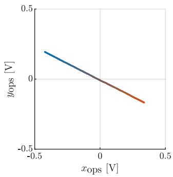

line

| x_ops [V] | y_ops [V] |
| --------- | --------- |
| -0.5      | 0.2       |
| 0.0       | 0.0       |
| 0.5       | -0.2      |

Fig. 4. OPS data p(t) measured around orientation $\hat { \pmb { \theta } } = [ - 4 5 ^ { \circ } , 2 0 ^ { \circ } ] ^ { \top }$ . Over the course of 45 seconds, the PTB elevation axis gradually steps from −45.2◦ $( - ) \operatorname { t o } - 4 4 . 8 ^ { \circ } ( - )$ while the CPA is fixed in place. The trace is linear, validating approximation (13). The direction of the trace conveys information about the kinematics at this orientation.

# A. Active Optical Alignment

When the CPA is placed beneath the PTB as in Fig. 2, a measurement $\mathbf { \nabla } _ { \mathbf { \boldsymbol { p } } } \neq \mathbf { 0 }$ indicates a misalignment

$$
e ^ {*} := \phi^ {*} - \theta^ {*}, \tag {12}
$$

between CPA and PTB axes. The aim is to drive this misalignment $e ^ { * }$ to zero by using measurements  of the OPS, e pbut this is complicated by the unknown nonlinear relationship G in (6). The first step is therefore to estimate and linearize this nonlinear relationship. For small alignment errors, the relationship between the alignment error and OPS measurements is approximated by linearized optical kinematics as

$$
\boldsymbol {p} \approx \tilde {\mathbf {G}} \left(\boldsymbol {\theta} ^ {*}\right) \boldsymbol {e} ^ {*}, \tag {13}
$$

where the optical gain matrix $\tilde { \mathbf { G } } ( \pmb { \theta } ^ { * } ) \in \mathbb { R } ^ { 2 \times 2 }$ depends on the nominal PTB orientation $\pmb { \theta } ^ { * }$ θ. This linearization is verified exθperimentally for many orientations, one of which is displayed in Fig. 4.

To drive the alignment error to zero using measurements $^ { p , }$ the error $e ^ { * }$ is estimated using the inverse optical kinematics:

$$
\hat {\boldsymbol {e}} = \mathbf {F} (\hat {\boldsymbol {\theta}}) \boldsymbol {p}, \quad \text { where } \quad \mathbf {F} (\hat {\boldsymbol {\theta}}) = \hat {\mathbf {G}} ^ {- 1} (\hat {\boldsymbol {\theta}}), \tag {14}
$$

using a model $\hat { \mathbf { G } } \approx \tilde { \mathbf { G } }$ and calibrated PTB sensor readings $\hat { \pmb { \theta } } .$ θThe optical gain matrix G˜ becomes singular only when the PTB mirror faces exactly upwards or downwards. This follows directly from the optical kinematics: in this configuration, rotation about the vertical axis does not change the beam location on the OPS, resulting in a loss of sensitivity in one alignment direction.

To ensure reliable inversion, $\hat { \mathbf { G } } ( \hat { \pmb { \theta } } )$ is evaluated offline over θthe full orientation range of interest. This allows identification of orientations where the matrix becomes ill-conditioned. Such orientations are excluded from the alignment procedure, ensuring that the estimated alignment error remains bounded during operation.

The following subsections detail how $\tilde { \mathbf { G } } ( \theta ^ { * } )$ is first modeled θfrom experimental data, and subsequently inverted during runtime to estimate ˆ for feedback control.

e1) Data Collection for Modeling Optical Kinematics: The optical gain matrix $\tilde { \bf G } ( \theta ^ { * } )$ is identified from data collected according to Algorithm 1, as follows. At several applicationrelevant PTB orientations $\hat { \theta } _ { j } \in \mathcal { T }$ , the PTB is fixed in place, θand the CPA is manually aligned so that $\mathbf { \nabla } _ { \mathbf { \boldsymbol { p } } } ( t _ { 0 } ) \approx \mathbf { 0 }$ . Then, a single PTB axis $i \in \{ z , x \}$ p tis slowly stepped over a small range $\delta _ { i \cdot }$ i z, x over time . Since the CPA orientation remains fixed, stepping δ taxis  directly changes the alignment error $e _ { i } ^ { * }$ as

Algorithm 1: Data Collection for Active Optical Alignment.   
Require: PTB calibration model $\widehat{\mathbf{S}_2^{-1}(\boldsymbol{\theta}^*)}$ from Section III-C.  
1: for each orientation $\boldsymbol{\theta}_j \in \mathcal{T}$ do  
2: Position PTB such that its sensor yields $\hat{\boldsymbol{\theta}} = \boldsymbol{\theta}_j$ .  
3: for each axis $i \in \{z, x\}$ do  
4: Move CPA to $\phi \approx \boldsymbol{\theta}_j$ , yielding $p_0 \approx \mathbf{0}$ .  
5: Start stepping PTB axis $i$ over time $t$ from $\theta_i - \delta_i$ to $\theta_i + \delta_i$ to induce an alignment error.  
6: Store data in $\mathbf{D}_{j,i}$ according to (16).  
7: end for  
8: end for  
9: return $\mathbf{D}_{j,i} \forall j \in \{1, \dots, N_p\}, i \in \{z, x\}$ .

$$
e _ {i} ^ {*} \left(t _ {k}\right) = e _ {i} ^ {*} \left(t _ {0}\right) + \theta_ {i} ^ {*} \left(t _ {0}\right) - \theta_ {i} ^ {*} \left(t _ {k}\right). \tag {15}
$$

Due to the linear relationship (13) and $\delta _ { i }$ being small, the δresulting measurements approximately form a straight line, see Fig. 4. This thus results in a dataset

$$
\mathbf {D} _ {j, i} = \left[ \begin{array}{c c c} x _ {\mathrm{ops}} \left(t _ {1}\right) & y _ {\mathrm{ops}} \left(t _ {1}\right) & \hat {\theta} _ {i} \left(t _ {1}\right) \\ \vdots & \vdots & \vdots \\ x _ {\mathrm{ops}} \left(t _ {n}\right) & y _ {\mathrm{ops}} \left(t _ {n}\right) & \hat {\theta} _ {i} \left(t _ {n}\right) \end{array} \right]. \tag {16}
$$

With this data, the columns of $\tilde { \mathbf { G } } ( \theta _ { j } ^ { * } )$ are identified as follows.

θ2) Extracting Optical Gains: To model the optical kinematics from datasets $\mathbf { D } _ { j , i } ,$ the first step is to extract observations $\overline { { G } } _ { j }$ of function $\tilde { \mathbf { G } } ( \theta _ { j } ^ { * } )$ from data $\mathbf { D } _ { j , i }$ . To this end, the kinematic θrelationship (13) is rewritten in terms of its columns:

$$
\boldsymbol {p} \left(t _ {k}\right) \approx \tilde {\mathbf {G}} _ {z} \left(\boldsymbol {\theta} ^ {*} \left(t _ {k}\right)\right) e _ {z} ^ {*} \left(t _ {k}\right) + \tilde {\mathbf {G}} _ {x} \left(\boldsymbol {\theta} ^ {*} \left(t _ {k}\right)\right) e _ {x} ^ {*}. \tag {17}
$$

Because each data set $\mathbf { D } _ { j , i }$ corresponds to a misalignment $e _ { i } ^ { * }$ in a esingle axis with the other remaining fixed at zero, an estimate of column $\tilde { \mathbf { G } } _ { i } ( \theta ^ { * } )$ can be obtained from the ratio of measurements ${ \bf \mathit { p } } ( t _ { k } )$ θto misalignment $e _ { i } ^ { * } ( t _ { k } )$ . The exact quantity of $e _ { i } ^ { * } ( t _ { k } )$ is p tunknown because $e _ { i } ^ { * } ( t _ { 0 } )$ t e tis unknown, see (15). However, by e texploiting the fact that the data $\mathbf { D } _ { j , i }$ involves a moving PTB angle $\theta _ { i } ^ { * } ( t _ { k } )$ over time, observation $\overline { { G } } _ { j }$ of function $\tilde { \mathbf { G } } ( \theta _ { j } ^ { * } )$ can θ tbe obtained from

$$
\overline {{{\boldsymbol {G}}}} _ {j, i} = \frac {1}{u _ {j , i , 3}} \left[ \begin{array}{l} u _ {j, i, 1} \\ u _ {j, i, 2} \end{array} \right], \tag {18}
$$

where j,i ∈ R3×1 i $\boldsymbol { u } _ { j , i } \in \mathbb { R } ^ { 3 \times 1 }$ s a principal eigenvector of the data covariuance, satisfying

$$
\operatorname{cov} \left(\mathbf {D} _ {j, i}\right) \boldsymbol {u} _ {j, i} = \lambda_ {\max, j, i} \boldsymbol {u} _ {j, i}, \tag {19}
$$

indicating the OPS sensitivity to $\theta _ { i } .$ . The use of this principal θeigenvector to extract directionality from data is known as principal component analysis (PCA) in literature [22].

Repeating this procedure for both PTB axes $i \in \{ z , x \}$ at several application-relevant orientations $\pmb \theta _ { j } \in \mathcal { T }$ i z, xyields observations $\overline { { G } } _ { j }$ of the optical gain matrix $\tilde { \bf G } ( \theta _ { j } )$ , which serve as the basis for modeling the optical kinematics.

3) Parametric Modeling of the Optical Gain Matrix: Once observations $\overline { { G } } _ { j }$ of function $\tilde { \mathbf { G } } ( \theta _ { j } ^ { * } )$ are available at multiple orientations $\hat { \theta } _ { j }$ , the optical gain for any orientation $\hat { \pmb { \theta } }$ is modeled θusing a harmonic basis function expansion:

$$
\hat {\mathbf {G}} (\hat {\boldsymbol {\theta}}) = \left[ \begin{array}{l l} \hat {G} _ {1 1} (\hat {\boldsymbol {\theta}}) & \hat {G} _ {1 2} (\hat {\boldsymbol {\theta}}) \\ \hat {G} _ {2 1} (\hat {\boldsymbol {\theta}}) & \hat {G} _ {2 2} (\hat {\boldsymbol {\theta}}) \end{array} \right] = \left[ \begin{array}{l l} \boldsymbol {\psi} ^ {\top} (\hat {\boldsymbol {\theta}}) \boldsymbol {\alpha} _ {1 1} & \boldsymbol {\psi} ^ {\top} (\hat {\boldsymbol {\theta}}) \boldsymbol {\alpha} _ {1 2} \\ \boldsymbol {\psi} ^ {\top} (\hat {\boldsymbol {\theta}}) \boldsymbol {\alpha} _ {2 1} & \boldsymbol {\psi} ^ {\top} (\hat {\boldsymbol {\theta}}) \boldsymbol {\alpha} _ {2 2} \end{array} \right], \tag {20}
$$

where each $\mathbf { \alpha } _ { \alpha b }$ is a vector of parameters to be estimated with $a , b \in \{ 1 , 2 \}$ α, and the basis functions $\psi ( { \hat { \pmb { \theta } } } )$ are given by the a, b ,Kronecker product expansion:

$$
\boldsymbol {\psi} (\hat {\boldsymbol {\theta}}) = \boldsymbol {\psi} _ {h} \left(\theta_ {x}\right) \otimes \boldsymbol {\psi} _ {h} \left(\theta_ {z}\right), \tag {21}
$$

where $\psi _ { h } ( \boldsymbol { \theta } )$ is a harmonic basis with $n _ { \mathrm { h a r } }$ harmonics:

$$
\boldsymbol {\psi} _ {h} (\theta) = \left[ \begin{array}{l l l l l} \cos (\theta) & \sin (\theta) & \dots & \cos \left(n _ {\text {har}} \theta\right) & \sin \left(n _ {\text {har}} \theta\right) \end{array} \right] ^ {\top}. \tag {22}
$$

Finally, to obtain the model parameters $\pmb { \alpha } _ { a b } \in \mathbb { R } ^ { n _ { \alpha } \times 1 } , n _ { \alpha } =$ $4 n _ { \mathrm { h a r } } ^ { 2 }$ , a least-squares problem is solved:

$$
\begin{array}{l} \boldsymbol {\alpha} _ {a b} = \arg \min _ {\boldsymbol {\alpha} _ {a b}} \left\| \boldsymbol {\Psi} \boldsymbol {\alpha} _ {a b} - \boldsymbol {g} _ {a b} \right\| _ {2} ^ {2} \\ = \left(\boldsymbol {\Psi} ^ {\top} \boldsymbol {\Psi}\right) ^ {- 1} \boldsymbol {\Psi} ^ {\top} \boldsymbol {g} _ {a b}, \quad \forall a, b \in \{1, 2 \}, \tag {23} \\ \end{array}
$$

where $\pmb { g } _ { a b } = [ G _ { a b } ( \hat { \pmb { \theta } } _ { 1 } ) , \dots , G _ { a b } ( \hat { \pmb { \theta } } _ { N _ { p } } ) ] ^ { \top }$ and

$$
\boldsymbol {\Psi} = \left[ \boldsymbol {\psi} (\hat {\boldsymbol {\theta}} _ {1}), \dots , \boldsymbol {\psi} (\hat {\boldsymbol {\theta}} _ {N _ {p}}) \right] ^ {\top}.
$$

Solution (23) requires invertibility of $\Psi _ { i } ^ { \top } \Psi _ { i }$ i, which is easily satisfied when $N _ { p } > n _ { \alpha }$ .

N > nFig. 5 shows the model $\hat { \mathbf { G } } ( \hat { \pmb { \theta } } )$ fitted to the observations $\overline { { G } } _ { j }$ , θ Gdemonstrating that the model accurately captures the optical gain matrix. This model is used to estimate the alignment error ˆ in realtime, as follows.

4) Real-Time Inversion for Real-Time Alignment: With the optical gain model $\hat { \mathbf { G } } ( \phi )$ available from offline modeling, the alignment error $\hat { \boldsymbol e }$ φis estimated in real-time by numerically inverting $\hat { \mathbf { G } } ( \phi )$ :

$$
\hat {\boldsymbol {e}} = \hat {\mathbf {G}} ^ {- 1} (\boldsymbol {\phi}) \boldsymbol {p}. \tag {24}
$$

As previously mentioned, inversion is always possible except at singular orientations, which are explicitly avoided during operation. Moreover, since $\hat { \mathbf { G } } ( \phi ) \in \mathbb { R } ^ { 2 }$ , the inverse operation is φcomputationally negligible in practice. Therefore, (24) provides an estimate of the alignment error for use in feedback control, as discussed in the following section.

5) Active Alignment Using Feedback Control: The alignment error ˆ is driven to zero using feedback as follows. The eCPA is tasked with tracking the PTB, as the CPA axes feature a bandwidth of 60 Hz, while the PTB bandwidth is only 10 Hz. If $\mathbf { F } ( \hat { \pmb { \theta } } ) \approx \tilde { \mathbf { G } } ^ { - 1 } ( \pmb { \theta } ^ { * } )$ , then the output nonlinearity in Fig. 6 is

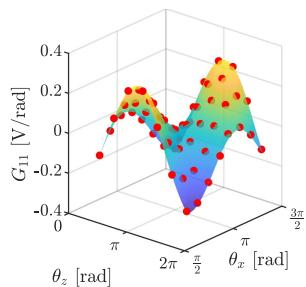

scatter_3d

| θ_x [rad] | θ_z [rad] | G_11 [V/rad] |
| --------- | --------- | ------------ |
| 0         | 0         | -0.4         |
| π/2       | 0         | 0.2          |
| π         | π/2       | 0.0          |
| 3π/2      | π         | 0.4          |

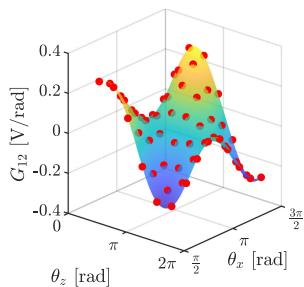

scatter

| θ_z [rad] | G₁₂ [V/rad] |
| --------- | ----------- |
| 0         | 0.4         |
| π/2       | 0.2         |
| π         | 0.0         |
| 3π/2      | -0.2        |

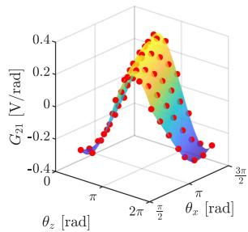

scatter

| θ_z [rad] | G_21 [V/rad] |
| --------- | ------------ |
| 0         | -0.4         |
| π/2       | 0.0          |
| π         | 0.4          |

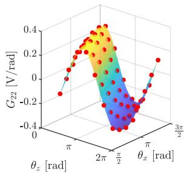

scatter

| θ_z [rad] | G_22 [V/rad] |
| --------- | ------------ |
| 0         | -0.4         |
| π/2       | 0.4          |
| π         | 0.0          |
| 3π/2      | -0.4         |

Fig. 5. Model $\hat { \mathbf { G } } ( \pmb { \theta } )$ of the optical gain matrix, describing how an alignment error e maps to an OPS reading p. The model (surface), parametrized by $n _ { \mathrm { h a r } } =$ 3 harmonics, fits the observations $\overline { { G } } _ { j } \mathbf { \sigma } ( \bullet )$ at $N _ { p } = 6 4$ orientations $\theta _ { j }$ well. This model is inverted during runtime to estimate the alignment error e.   
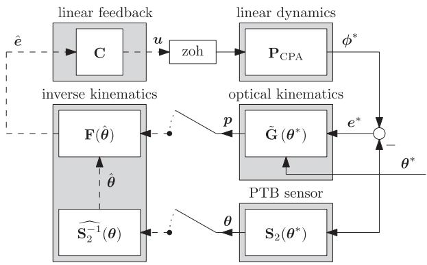

flowchart

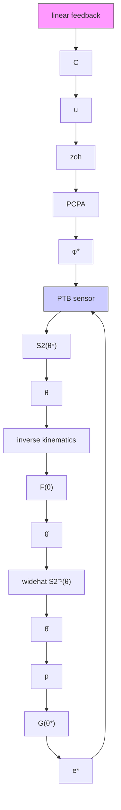

Fig. 6. Control scheme for active optical alignment of the PTB to the CPA. Dashed lines and solid lines denote discrete-time and continuous time signals, respectively, and switches represent samplers. Using a model F of the inverse kinematics, the alignment error $e ^ { * } = \phi ^ { * } \stackrel { } { - } \theta ^ { * }$ is estimated during runtime, such that it can be reduced by feedback.

effectively linearized and $\hat { \boldsymbol { e } } \approx { \boldsymbol { e } } ^ { * }$ . Since the transfer function

$$
\boldsymbol {\phi} ^ {*} (s) = \mathbf {P} _ {\mathrm{CPA}} (s) \boldsymbol {u} (s) \tag {25}
$$

is also linear, with Laplace operator , this allows the use of traditional loop-shaping methods [23] for feedback control. Interaction between the axes is neglected, and a feedback controller $\mathbf { C } ( s ) = \mathrm { d i a g } ( C _ { z } ( s ) , C _ { x } ( s ) )$ is designed based on a frequency s C s , C sresponse function measurement of $\mathbf { P } _ { \mathrm { C P A } } ( j \omega )$ , see [24] for details. The transfer of a PTB movement $\phi ^ { * }$ jωto the alignment error is then given by the sensitivity

$$
\begin{array}{l} \boldsymbol {e} ^ {*} = \mathbf {S} _ {\text { sens }} (s) \boldsymbol {\theta} ^ {*} (s) \\ = \left(\mathbf {I} + \mathbf {P} _ {\mathrm{CPA} (s)} \mathbf {C} (s)\right) ^ {- 1} \boldsymbol {\theta} ^ {*} (s). \tag {26} \\ \end{array}
$$

Hence, when the loop gain $\mathbf { P } _ { \mathrm { C P A } } ( s ) \mathbf { C } ( s )$ is large, the estimated s salignment error ˆ can be driven to zero, achieving $\phi ^ { * } \approx \theta ^ { * }$ . Any imperfections $\mathbf { F } ( { \widehat { \pmb { \theta } } } ) { \tilde { \mathbf { G } } } ( { \pmb { \theta } } ^ { * } ) - \mathbf { I }$ φ θare regarded as a local variation θ θof the loop gain; as long as these variations are sufficiently small so as not to destabilize the loop, ˆ is still driven to zero, despite imperfections in PTB calibration model $\widehat { \mathbf { S } _ { 2 } ^ { - 1 } }$ or inverse kinematics F.

Algorithm 2: Data Collection for CPA Calibration.   
Require: PTB calibration model $S_{2}^{-1}$ , inverse optical kinematics $\mathbf{F}(\hat{\boldsymbol{\theta}})$ .
1: Initialize data set $D_{\phi} = \{\}$ .
2: for PTB elevation angle $\theta_{x,j} \in X$ do
3: Move PTB to initial orientation $\hat{\theta} = [\theta_{z,\text{init}}, \theta_{x,j}]^{\top}$ .
4: Start CPA active alignment, see Fig. 6.
5: Step PTB to $\hat{\theta} = [\theta_{z,\text{end}}, \theta_{x,j}]^{\top}$ over T seconds.
6: Save all samples $\hat{\theta}(t), \phi(t), \hat{e}(t)$ in $D_{\phi}$ .
7: end for
8: return $D_{\phi}$ .

# B. Data Collection for Sensor Calibration

As explained in Section II-D, cascaded calibration requires two datasets: one for calibrating the PTB and one for calibrating the CPA. These datasets are obtained as follows.

1) Manual PTB Data Collection: To calibrate the PTB, a dataset $\mathcal { D } _ { \theta }$ is collected manually by aligning the PTB to a highly accurate theodolite. At $N _ { \theta }$ application-relevant orientations, pairs of sensor measurements $( \theta , \theta ^ { \ast } )$ are recorded. Due to the θ, θlabor-intensive nature of this manual alignment, the dataset $\mathcal { D } _ { \theta }$ is limited in size.

2) Automated CPA Data Collection: After calibrating the PTB, data for calibration of CPAs is collected automatically according to Algorithm 2. Using the active alignment procedure described in Section III-A5, the CPA continuously aligns itself to the PTB and simultaneously records corresponding CPA sensor readings $\phi$ and calibrated PTB sensor readings $\hat { \pmb { \theta } } .$ φ. This automated procedure results in a larger dataset ${ \mathcal { D } } _ { \phi } ,$ θcollected without manual intervention. Algorithm $2$ performs $N _ { \mathrm { e x p } }$ separate experiments at different, fixed elevation angles $\theta _ { x } \in \mathcal { X }$ . At each elevation angle, the PTB rotates through its θazimuth range $\theta _ { z }$ , while the CPA actively aligns itself. The θresidual misalignment ˆ, although small, is known from the OPS measurements and used to correct the data. Specifically, the true CPA orientation $\phi ^ { * }$ is approximated as:

$$
\phi^ {*} \approx \hat {\boldsymbol {\theta}} + \hat {\boldsymbol {e}}. \tag {27}
$$

The next section describes how datasets $\mathcal { D } _ { \theta }$ and $\mathcal { D } _ { \phi }$ are used to construct probabilistic calibration models.

# C. Sensor Calibration

This section describes how calibration models

$$
\begin{array}{l} \widehat {\mathbf {S} _ {1} ^ {- 1}} (\boldsymbol {\phi} ^ {*}) =: \left[ \begin{array}{c c} g _ {z} ^ {(1)} (\boldsymbol {\phi} ^ {*}) & g _ {x} ^ {(1)} (\boldsymbol {\phi} ^ {*}) \end{array} \right] ^ {\top}, \\ \widehat {\mathbf {S} _ {2} ^ {- 1}} \left(\boldsymbol {\theta} ^ {*}\right) =: \left[ g _ {z} ^ {(2)} \left(\boldsymbol {\theta} ^ {*}\right) \quad g _ {x} ^ {(2)} \left(\boldsymbol {\theta} ^ {*}\right) \right] ^ {\top}, \tag {28} \\ \end{array}
$$

are created using $\mathcal { D } _ { \phi }$ and ${ \mathcal { D } } _ { \theta } .$ , to correct for the PTB and CPA sensor errors through (3) and (7), respectively.

As detailed in Section II-D, a major challenge in cascaded calibration is that calibration errors in the PTB deteriorate the calibration of all CPAs. Therefore, the first step is to obtain a probabilistic calibration model $\widehat { \mathbf { S } _ { 2 } ^ { - 1 } }$ of the PTB. The uncertainty associated with this model can then be used when calibrating a CPA in the second step: at locations where the PTB calibration model cannot be trusted, more weight is attributed to a userdefined prior.

To this end, the four calibration functions $g _ { i } ^ { ( j ) }$ in (28) are gmodeled as Gaussian Processes. This involves ( ) the definition iof a prior distribution over all possible calibration functions, ( ) iithe appropriate specification of uncertainty of the observations, and ( ) conditioning the prior distribution on the uncertain iiiobservations in $\mathcal { D } _ { \phi }$ and $\mathcal { D } _ { \theta }$ to obtain a posterior distribution. The following sections detail these three steps, in reverse order for improved clarity.

1) Calibration Models as Gaussian Processes: First, some notation is introduced for presentation purposes. The CPA and PTB angles are written as

$$
\boldsymbol {q} ^ {(1)} := \boldsymbol {\phi}, \quad \boldsymbol {q} ^ {(2)} := \boldsymbol {\theta},
$$

$$
\hat {\boldsymbol {q}} ^ {(1)} := \hat {\boldsymbol {\phi}}, \quad \hat {\boldsymbol {q}} ^ {(2)} := \hat {\boldsymbol {\theta}}. \tag {29}
$$

When $g _ { i } ^ { ( j ) } ( \pmb q ^ { ( j ) } )$ (j)i ( (j) ) in (28) is modeled as a GP, there is a joint prior g qprobability distribution between a vector of function values

$$
\begin{array}{l} \hat {\boldsymbol {Q}} _ {i} ^ {(j)} := \left[ \begin{array}{c c c} g _ {i} ^ {(j)} (\boldsymbol {q} _ {1} ^ {(j)}) & \dots & g _ {i} ^ {(j)} (\boldsymbol {q} _ {N} ^ {(j)}) \end{array} \right] ^ {\top}, \\ := \left[ \hat {q} _ {i, 1} ^ {(j)} \quad \dots \quad \hat {q} _ {i, N} ^ {(j)} \right] ^ {\top}, j \in \{1, 2 \}, i \in \{z, x \} \tag {30} \\ \end{array}
$$

at $N$ arbitrary points

$$
\boldsymbol {X} ^ {(j)} := \left[ \begin{array}{l l l} \boldsymbol {q} _ {1} ^ {(j)} & \dots & \boldsymbol {q} _ {N} ^ {(j)} \end{array} \right] ^ {\top}, j \in \{1, 2 \}, \tag {31}
$$

and the data vector

$$
\overline {{{\boldsymbol {Q}}}} _ {i} ^ {(1)} := \left[ \begin{array}{c c c} \hat {\theta} _ {1, i} + \hat {e} _ {1, i} & \dots & \hat {\theta} _ {N _ {\phi}, i} + \hat {e} _ {N _ {\phi}, i} \end{array} \right] ^ {\top} \in \mathcal {D} _ {\phi}, i \in \{z, x \},
$$

$$
\overline {{{\boldsymbol {Q}}}} _ {i} ^ {(2)} := \left[ \begin{array}{c c c} \theta_ {1, i} ^ {*} & \dots & \theta_ {N _ {\theta}, i} ^ {*} \end{array} \right] ^ {\top} \in \mathcal {D} _ {\theta}, \quad i \in \{z, x \}, \tag {32}
$$

at observed points

$$
\overline {{\boldsymbol {X}}} ^ {(1)} := \left[ \begin{array}{c c c} \phi_ {1} & \ldots & \phi_ {N _ {\phi}} \end{array} \right] ^ {\top} \in \mathcal {D} _ {\phi},
$$

$$
\overline {{{\boldsymbol {X}}}} ^ {(2)} := \left[ \begin{array}{l l l} \boldsymbol {\theta} _ {1} & \dots & \boldsymbol {\theta} _ {N _ {\theta}} \end{array} \right] ^ {\top} \in \mathcal {D} _ {\theta}. \tag {33}
$$

This joint prior distribution is given [18] by

$$
\left[ \begin{array}{c} \hat {\boldsymbol {Q}} _ {i} ^ {(j)} \\ \overline {{\boldsymbol {Q}}} _ {i} ^ {(j)} \end{array} \right] \sim \mathcal {N} \left(\left[ \begin{array}{c} \mathbf {m} ^ {(j, i)} (\boldsymbol {X} ^ {(j)}) \\ \mathbf {m} ^ {(j, i)} (\overline {{\boldsymbol {X}}} ^ {(j)}) \end{array} \right] \right.,
$$

$$
\left. \left[ \begin{array}{c c} \mathbf {K} ^ {(j, i)} \left(\boldsymbol {X} ^ {(j)}, \boldsymbol {X} ^ {(j)}\right) & \mathbf {K} ^ {(j, i)} \left(\boldsymbol {X} ^ {(j)}, \overline {{{\boldsymbol {X}}}} ^ {(j)}\right) \\ \mathbf {K} ^ {(j, i)} \left(\overline {{{\boldsymbol {X}}}} ^ {(j)}, \boldsymbol {X} ^ {(j)}\right) & \mathbf {K} ^ {(j, i)} \left(\overline {{{\boldsymbol {X}}}} ^ {(j)}, \overline {{{\boldsymbol {X}}}} ^ {(j)}\right) + \boldsymbol {\Sigma} ^ {(j, i)} \end{array} \right]\right), \tag {34}
$$

where $\mathbf { m } ^ { ( i , j ) }$ and $\mathbf { K } ^ { ( i , j ) }$ denote the prior mean and prior covariance respectively, which are detailed later. Moreover, $\pmb { \Sigma } ^ { ( j , i ) }$ denotes the variance matrix of the observations, as detailed in the next section. When joint prior distribution (34) is conditioned on the observations using Bayes’ rule, the resulting posterior distribution [18] is a Gaussian

$$
\hat {\boldsymbol {Q}} _ {i} ^ {(j)} \mid \overline {{\boldsymbol {Q}}} _ {i} ^ {(j)}, \boldsymbol {X}, \overline {{\boldsymbol {X}}} \sim \mathcal {N} \left(\boldsymbol {\mu} _ {\hat {Q} _ {i} ^ {(j)}}, \boldsymbol {\Sigma} _ {\hat {Q} _ {i} ^ {(j)}}\right), \tag {35}
$$

with posterior mean

$$
\begin{array}{l} \boldsymbol {\mu} _ {\hat {Q} _ {i} ^ {(j)}} \triangleq \mathbb {E} \left[ \hat {\boldsymbol {Q}} _ {i} ^ {(j)} \right] \\ = \mathbf {m} ^ {(j, i)} (\boldsymbol {X} ^ {(j)}) + \mathbf {K} ^ {(j, i)} (\boldsymbol {X} ^ {(j)}, \overline {{\boldsymbol {X}}} ^ {(j)}) \mathbf {A} ^ {(j, i)} \\ \cdot \left(\overline {{\boldsymbol {Q}}} _ {i} ^ {(j)} - \mathbf {m} ^ {(j, i)} \left(\overline {{\boldsymbol {X}}} ^ {(j)}\right)\right), \tag {36} \\ \end{array}
$$

and posterior variance

$$
\begin{array}{l} \boldsymbol {\Sigma} _ {\hat {Q} _ {i} ^ {(j)}} \triangleq \operatorname{cov} \left(\hat {\boldsymbol {Q}} _ {i} ^ {(j)}\right) \\ = \mathbf {K} ^ {(j, i)} (\boldsymbol {X} ^ {(j)}, \boldsymbol {X} ^ {(j)}) - \mathbf {K} ^ {(j, i)} (\boldsymbol {X} ^ {(j)}, \overline {{\boldsymbol {X}}} ^ {(j)}) \\ \cdot \mathbf {A} ^ {(j, i)} \mathbf {K} ^ {(j, i)} \left(\overline {{{\boldsymbol {X}}}} ^ {(j)}, \boldsymbol {X} ^ {(j)}\right), \tag {37} \\ \end{array}
$$

where

$$
\mathbf {A} ^ {(j, i)} := \left[ \mathbf {K} ^ {(j, i)} \left(\overline {{{\boldsymbol {X}}}} ^ {(j)}, \overline {{{\boldsymbol {X}}}} ^ {(j)}\right) + \boldsymbol {\Sigma} ^ {(j, i)} \right] ^ {- 1}. \tag {38}
$$

Hence, (36) provides an expression for both calibration models, defined as in (30), returning calibrated sensor estimates $\hat { \pmb q } ^ { ( j ) }$ for arbitrary uncalibrated sensor readings $\pmb q ^ { ( j ) }$ q. The next section qexplains the propagation of uncertainty through the calibration models, through appropriate choice of Σ(j,i) . $\mathbf { \vec { \Sigma } } ^ { ( j , i ) }$

2) Propagation of Calibration Uncertainty: The variance $\pmb { \Sigma } ^ { ( j , i ) }$ of the observations in (38) affects the posterior mean and variance, and so it must be chosen appropriately. For the calibration of the PTB, recall that the theodolite readings  in $\mathcal { D } _ { \theta }$ θin are assumed highly precise and independent, so their variance is given by

$$
\boldsymbol {\Sigma} ^ {(2, i)} = \sigma_ {\theta , i} ^ {2} \mathbf {I}, \quad i \in \{z, x \}, \tag {39}
$$

with $\sigma _ { \theta , : } ^ { 2 }$ i known and small. However, the CPA calibration model σrelies on observations of the calibrated PTB in ${ \mathcal { D } } _ { \phi } .$ , which are only as accurate as the PTB calibration model, see (8). The observations thus are disturbed by calibration error  in (10). This calibration error has variance

$$
\begin{array}{l} \operatorname{Cov} (\varepsilon) = \operatorname{Cov} \left(\boldsymbol {\theta} ^ {*}\right) + \operatorname{Cov} (\hat {\boldsymbol {\theta}}) - 2 \operatorname{Cov} \left(\boldsymbol {\theta} ^ {*}, \hat {\boldsymbol {\theta}}\right) \\ = \operatorname{Cov} (\hat {\boldsymbol {\theta}}), \tag {40} \\ \end{array}
$$

i.e., the variance of the observations is given by the model variance:

$$
\boldsymbol {\Sigma} ^ {(1, i)} = \boldsymbol {\Sigma} _ {\hat {Q} _ {i} ^ {(j)}}. \tag {41}
$$

Choosing the variance $\pmb { \Sigma } ^ { ( 1 , i ) }$ to be the posterior variance of the PTB calibration model $\Sigma _ { \hat { Q } _ { i } ^ { ( 2 ) } }$ in (37) affects the mean $\mu _ { \hat { Q } _ { i } ^ { ( 1 ) } }$ and variance $\Sigma _ { \hat { Q } _ { i } ^ { ( 1 ) } }$ of the CPA calibration model through (36) and (37), respectively. Consequently, at sensor readings $\phi$ where the PTB calibration model is uncertain, $\mathbf { A } ^ { ( j , \bar { i } ) }$ φis decreased.

This reduction of data matrix $\mathbf { A } ^ { ( j , i ) }$ offers two major advantages. First, the CPA calibration model has increased posterior variance at orientations where the PTB calibration model is uncertain. This is important information for the application of FSOC, where pointing knowledge is crucial. Second, when $\mathbf { A } ^ { ( j , i ) }$ is decreased, the prior covariance $\mathbf { K } ^ { ( j , i ) } ( { \pmb X } ^ { ( j ) } , { \pmb X } ^ { ( j ) } )$ is X , Xmore influential in the posterior mean. This can be interpreted as a higher reliance on the prior distribution when the data is uncertain.

3) Definition of the Calibration Model Priors: The following two priors are defined for both calibration models: ( ) in the iabsence of counter-evidence, the sensors are expected to be accurate, and ( ) the sensor inaccuracy is smooth and periodic iiwith period 2 . The first prior is imposed by selecting the mean function m $\mathbf { \Psi } _ { \downarrow } ( j , i ) : \mathbb { R } ^ { n \times 2 }  \mathbb { R } ^ { n }$ as

$$
\mathbf {m} ^ {(j, i)} \left(\boldsymbol {Z} ^ {(j)}\right) = \boldsymbol {Z} ^ {(j)} \xi_ {i}, \quad \boldsymbol {Z} ^ {(j)} \in \left\{\boldsymbol {X} ^ {(j)}, \overline {{\boldsymbol {X}}} ^ {(j)} \right\} \tag {42}
$$

with $\xi _ { z } = [ 1 , 0 ] ^ { \top } , \xi _ { x } = [ 0 , 1 ] ^ { \top }$ . The second prior is imposed by ξ , , ξ ,choosing the elements of covariance matrix $\mathbf { K } ^ { ( j , i ) } ( Z _ { A } ^ { ( j ) } , Z _ { B } ^ { ( j ) } )$ : $\mathbb { R } ^ { n \times 2 } \times \mathbf { \bar { R } } ^ { m \times 2 }  \mathbb { R } ^ { n \times m }$ as

$$
\begin{array}{l} K _ {n, m} ^ {(j, i)} (\mathbf {Z} _ {A} ^ {(j)}, \mathbf {Z} _ {B} ^ {(j)}) = k ^ {(j, i)} (\mathbf {z} _ {A, n} ^ {(j)}, \mathbf {z} _ {B, m} ^ {(j)}), \\ \boldsymbol {Z} _ {A} ^ {(j)}, \boldsymbol {Z} _ {B} ^ {(j)} \in \left\{\boldsymbol {X} ^ {(j)}, \overline {{{\boldsymbol {X}}}} ^ {(j)} \right\}, \boldsymbol {z} _ {A, n} ^ {(j)} \in \boldsymbol {Z} _ {A} ^ {(j)}, \boldsymbol {z} _ {B, m} ^ {(j)} \in \boldsymbol {Z} _ {B} ^ {(j)}, \tag {43} \\ \end{array}
$$

with covariance function

$$
k ^ {(j, i)} (\boldsymbol {x}, \boldsymbol {x} ^ {\prime}) = \sigma_ {f, j, i}
$$

$$
\cdot \exp \left(- \sum_ {d \in \{z, x \}} \frac {1}{\ell_ {j , i , d} ^ {2}} \sin^ {2} \left(\frac {1}{2} \left| \mathrm{x} _ {d} - \mathrm{x} _ {d} ^ {\prime} \right|\right)\right). \tag {44}
$$

This covariance function is standard in Gaussian Process regression [25], enforcing periodicity with $2 \pi$ , smoothness based on length-scales $\ell _ { j , i , d } ,$ π and amplitude parameter $\sigma _ { f , j , i }$ .

# D. Automatic Selection of Hyperparameters

The hyperparameters $\Omega = \{ \sigma _ { f , j , i } , \ell _ { j , i , d } \}$ of the calibration σ , 	models are selected automatically using an empirical Bayes approach, as follows. Consider the log marginal likelihood

$$
\begin{array}{l} \log p (\overline {{\boldsymbol {Q}}} ^ {(j)} \mid \overline {{\boldsymbol {X}}} ^ {(j)}, \boldsymbol {\Omega}) = - \frac {1}{2} \overline {{\boldsymbol {Q}}} ^ {(j) \top} \mathbf {A} ^ {(j, i)} \overline {{\boldsymbol {Q}}} ^ {(j)} \\ - \frac {1}{2} \log \left| (\mathbf {A} ^ {(j, i)}) ^ {- 1} \right| - \frac {N _ {j}}{2} \log (2 \pi), \\ i \in \{z, x \}, j \in \{1, 2 \} \tag {45} \\ \end{array}
$$

which can be interpreted as the probability of the data given the model hyperparameters. By maximizing (45) with respect to Ω using interior-point optimization, hyperparameters are obtained that reflect a local maximum of the marginal likelihood, resulting in a good fit of the models to the data. An example implementation is presented in [26]. Since the problem is not convex, the optimization is repeated multiple times with different initial points.

Algorithm 3: Cascaded Calibration of Angular Sensors.   
1: Align theodolite to PTB at $N_{\theta}$ orientations, store data of both sensors in $\mathcal{D}_{\theta}$ .
2: Compute $\widehat{\mathbf{S}_{2}^{-1}}$ with (36), (37) and $(j)=2$ to calibrate PTB, using hyperparameters from Section III-D.
3: Follow Algorithm 1 and the procedure in Section III-A5 to obtain inverse kinematics $\mathbf{F}(\hat{\boldsymbol{\theta}})$ .
4: for all CPAs do
5: Follow Algorithm 2 to collect data $\mathcal{D}_{\phi}$ .
6: Model $\widehat{\mathbf{S}_{1}^{-1}}$ with (36), (37) and $(j)=1$ to calibrate CPA, using hyperparameters from Section III-D.
7: end for
9: returnCPA calibration models.

# E. Summary

The developed cascaded calibration procedure is summarized in Algorithm 3. After initial calibration of the PTB and modeling the kinematics, a high degree of automation is achievable for the subsequent calibration of all CPAs: data collection is automated through Algorithm 2, and the resulting data-set $D _ { \phi }$ can be pro-Dcessed immediately after to obtain the CPA calibration models.

# IV. EXPERIMENTAL RESULTS

This section verifies the developed approach experimentally, starting with a description of the setup.

# A. Experimental Hardware

The CPA used in the experiments is a custom two-degreeof-freedom mirror pointing module developed by TNO [11], [12]. The CPA consists of two orthogonal rotary axes, each supporting a steering mirror, providing a hemispherical field-ofregard. Each axis is actuated by a custom switched reluctance motor, commutated using direct torque control [27] and controlled by a PID position controller. Angular position sensing is implemented using linear Hall-effect sensors that measure the magnetic flux density of a toothed rotor, enabling low-cost angular sensing but introducing repeatable, orientation-dependent measurement errors, as described in [9]. The control and data acquisition are implemented on a dSPACE real-time platform at a sampling frequency of 10 kHz. The CPA used in this work follows the same sensing and actuation principles as the system reported in [9], extended to two degrees of freedom.

Calibration of the CPA is performed using a pointing test bench (PTB), described in detail in [12]. The PTB consists of two off-the-shelf orthogonal rotary stages supporting a mirror, allowing precise control of the mirror orientation over a spherical range of motion. These stages are equipped with high-accuracy rotary encoders that serve as reference angular sensors for CPA calibration. The PTB and CPA are mounted on a common optical table to ensure mechanical stability and alignment during calibration.

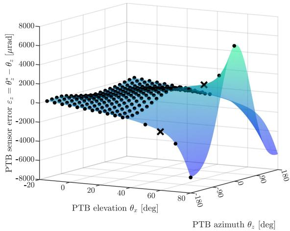

scatter

| PTB elevation θₓ [deg] | PTB sensor error ε_z = θ_z* - θ_z [μrad] |
| ---------------------- | ---------------------------------------- |
| 0                      | 0                                        |
| 20                     | 0                                        |
| 40                     | 0                                        |
| 60                     | 0                                        |
| 80                     | 0                                        |
| 100                    | 0                                        |
| 120                    | 0                                        |
| 140                    | 0                                        |
| 160                    | 0                                        |
| 180                    | 0                                        |

Fig. 7. Sensor error $\varepsilon _ { z }$ of the PTB, as measured by a theodolite. The theodolite is manually aligned to the PTB at 275 orientations for low elevation angles $\theta _ { x } < 3 5 ^ { \circ }$ and eight more orientations at higher elevation angles. The data is divided into a training set (•) and a validation set (×). The mean of GP model $\widehat { S _ { 2 , z } ^ { - 1 } }$ (surface), fitted to the training set only, predicts the sensor error at locations that are too costly or difficult to measure.

# B. PTB Calibration

The PTB is manually aligned to a theodolite at $N _ { \theta } = 2 8 3$ orientations, with the theodolite measuring the PTB sensor error  at each orientation. For high elevation angles $\theta _ { x } > 3 5 ^ { \circ }$ , ε θ >aligning the theodolite to the PTB mirror is difficult because of physical obstruction. Therefore, the theodolite is aligned to the PTB at only eight orientations for these high elevation angles, via a labor-intensive process that involves an extra mirror. The total process of data collection takes approximately an afternoon; note that this step has to be performed only once, before multiple CPAs can be calibrated automatically.

The data is divided into a training set $\mathcal { D } _ { \theta }$ and a validation set $\mathcal { D } _ { \theta } ^ { \mathrm { v a l } }$ . The training set is used to fit the GP model $\widehat { \mathbf { S } _ { 2 } ^ { - 1 } }$ to the data, while the validation set is used to evaluate the model.

Fig. 7 displays the results. The PTB sensor error is slightly angle-dependent in the order of 1 mrad at low elevation angles, but increases to 6 mrad at high elevation angles, exhibiting a stronger dependence on the azimuth axis as well. This sensor error is likely caused by deformation in the PTB structure, caused by its weight. The GP model $\widehat { \mathbf { S } _ { 2 } ^ { - 1 } }$ , fitted to this data, predicts the sensor error at arbitrary orientations. Even though no theodolite measurements are available for $\pmb { \theta } > [ 0 , 3 5 ^ { \circ } ] ^ { \top }$ , the θ > ,periodic model structure (44) successfully extrapolates from the data of lower azimuth angles. Next, the accuracy of this PTB model is assessed at the two validation points. The prediction error

$$
S _ {2, z} ^ {- 1} (\boldsymbol {\theta}) - \widehat {S _ {2 , z} ^ {- 1}} (\boldsymbol {\theta})
$$

is −104 rad at $\theta _ { \mathrm { v a l , 1 } } = [ - 1 8 0 ^ { \circ } , 6 0 ^ { \circ } ] ^ { \top }$ and 79 rad at $\theta _ { \mathrm { v a l , 2 } } =$ $[ 0 ^ { \circ } , 6 0 ^ { \circ } ] ^ { \top }$ θ , μ θ. These are significant improvements from the mrad-,level sensor errors at these locations; recall that ≤500 rad μpointing knowledge is required for successful inter-satellite links.. The next section describes the results of active optical alignment.

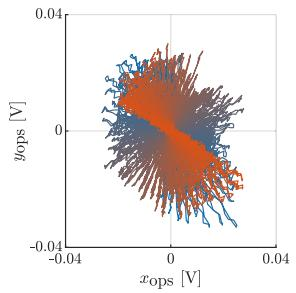

scatter

| xops [V] | yops [V] |
| -------- | -------- |
| -0.04    | 0.04     |
| 0.04     | -0.04    |

Fig. 8. OPS data p(t) during active optical alignment. While the PTB is moving from $\pmb { \theta } = [ - 2 2 5 ^ { \circ } , 2 0 ^ { \circ } ] ^ { \top } \ ( - )$ to $\pmb { \theta } = [ 4 5 ^ { \circ } , 2 0 ^ { \circ } ] ^ { \top } ~ ( - )$ , the CPA is estimating alignment error ${ \hat { \mathbf { e } } } = \mathbf { F } ( { \hat { \mathbf { \theta } } } ) p$ from this signal and actively driving it to zero with feedback, see Fig. 6. As $\mathbf { \nabla } _ { \mathbf { \mathcal { P } } } = \mathbf { 0 }$ corresponds to exact alignment of the CPA to the PTB, the proximity of this signal to the origin shows that active optical alignment is successful. This data corresponds to an estimated misalignment of approximately 10 μrad, see also Fig. 9.

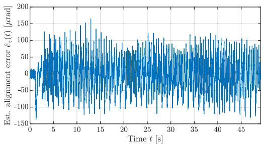

line

| Time t [s] | Est. alignment error ê_z(t) [μrad] |
| ---------- | ---------------------------------- |
| 0          | 0                                  |
| 5          | 100                                |
| 10         | 50                                 |
| 15         | 150                                |
| 20         | 0                                  |
| 25         | 100                                |
| 30         | 50                                 |
| 35         | 100                                |
| 40         | 0                                  |
| 45         | 100                                |

Fig. 9. Estimated alignment error $\hat { e } _ { z } ( t ) = \mathbf { F } _ { z } ( \hat { \pmb { \theta } } ( t ) ) \mathbf { { p } } ( t )$ during active optical alignment. While the PTB is moving from $\pmb { \theta } = [ - 2 2 5 ^ { \circ } , 2 0 ^ { \circ } ] ^ { \top }$ to $\theta =$ $[ 4 5 ^ { \circ } , 2 0 ^ { \circ } ] ^ { \intercal }$ , the CPA is minimizing this error with feedback, see Fig. 6.

# C. Active Optical Alignment

First, the theodolite is removed, and a CPA is placed underneath the PTB. Algorithm 1 is followed to collect data for the optical kinematics. This process, that has to be performed only once before calibrating many CPAs, took several hours and the results are shown in Section III-A3, see Fig. 5. Next, $N _ { \mathrm { e x p } } = 4$ experiments are carried out, at constant elevation Nangles $\theta _ { x } \in \mathcal { X } = \{ 2 0 ^ { \circ } , 4 0 ^ { \circ } , 6 0 ^ { \circ } , 8 0 ^ { \circ } \}$ . In each experiment, the θ , , ,PTB azimuth actuators drive the PTB gradually from $\theta _ { z , \mathrm { i n i t } } =$ $- 2 2 5 ^ { \circ } \tan \theta _ { z , \mathrm { e n d } } = 4 5 ^ { \circ }$ over the course of $T = 5 0$ θseconds. Meanθ Twhile, the CPA actively aligns itself to the PTB, as described in Section III-A5, automatically collecting millions of samples in a matter of minutes. In contrast, manual alignment of the CPA to an external instrument would achieve only a few samples per minute, and significant sacrifices in the number of measured data points would have to be made.

Fig. 8 depicts the resulting trace of ${ \bf p } ( t )$ during the experiment at $\theta _ { z } = 2 0 ^ { \circ }$ p t, showing that the incoming laser remains close to the θcenter of the OPS during the entire experiment. Moreover, Fig. 9 displays the estimated alignment error ${ \hat { \mathbf { e } } } ( t ) = \mathbf { F } ( \pmb { \theta } ( t ) ) \mathbf { p } ( t )$ . As e t θ t p texplained in Section III-B, this estimate of the alignment error is exploited to correct the data through (32), and the resulting dataset $\mathcal { D } _ { \phi }$ is used to calibrate the CPA. The next section presents the CPA calibration model.

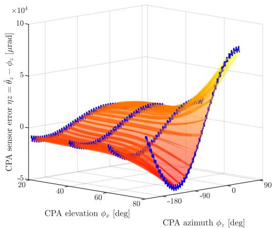

line

| CPA elevation φₓ [deg] | CPA azimuth φ₂ [deg] | CPA sensor error ηz = θ̂₂ - φ_z [μrad] ×10⁴ |
| ---------------------- | --------------------- | ------------------------------------------ |
| 0                      | 0                     | 10                                         |
| 40                     | -180                  | 0                                          |
| 80                     | -180                  | -5                                         |
| 120                    | -180                  | 0                                          |
| 160                    | -180                  | 5                                          |
| 200                    | -180                  | 10                                         |

Fig. 10. Sensor error $\eta _ { z }$ of the CPA, as measured by the calibrated PTB $( \bullet ) .$ The theodolite is actively aligned to the PTB at four elevation angles, with the CPA completing a full azimuth rotation. The mean of GP model $\widehat { S _ { 1 , z } ^ { - 1 } }$ (orange surface), predicts the sensor error at arbitrary orientations.

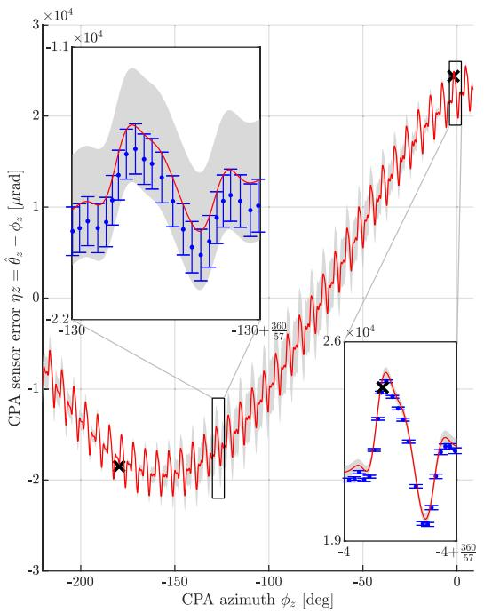

line

| CPA azimuth φz [deg] | CPA sensor error ηz = θz - φz [μrad] |
| --------------------- | ---------------------------------- |
| -200                  | -1.1 × 10⁴                         |
| -130                  | -2.2 × 10⁴                         |
| -360                  | 2.6 × 10⁴                          |
| 0                     | 3.0 × 10⁴                          |

Fig. 11. Sensor error $\eta _ { z }$ of the CPA at $\phi _ { x } = 6 0 ^ { \circ }$ . The prediction ( ) of the CPA model $\widehat { S _ { 1 , z } ^ { - 1 } }$ is shown with three standard deviations ( ). The top inset shows model uncertainty at $\phi _ { z } = 1 3 0 ^ { \circ }$ , where the PTB is uncalibrated, see Fig. 7. Since the CPA model takes into account the variance of the PTB model ( ), the CPA model relies more on the prior at this location, partially rejecting the data. The bottom inset shows that when PTB is more certain, the CPA model confidently relies on the calibrated PTB. Validation points (×), measured by the theodolite and not used for training, confirm the CPA model, despite not aligning the theodolite to the CPA, nor calibrating the PTB at this exact location.

# D. CPA Calibration

The result of the CPA calibration is shown in Figs. 10 and 11. At low elevation angles, the measurement error of the uncalibrated CPA in the azimuth axis is approximately 10 mrad, increasing to 83 mrad at high elevation angles. With a laser beam divergence in the order of ten milliradians, such measurement errors would prevent inter-satellite links. While the sensor error varies smoothly in the elevation axis, for the specific Hall-effect sensor used in this CPA, a more complex pattern is observed in the azimuth axis, showing distortions at each of the $n _ { t } = 5 7$ nrotor teeth, see Section II-A2. To include the prior knowledge of this sensor error, the kernel functions $k ^ { ( 1 , \bar { i } ) }$ in (44) of the CPA is multiplied by an additional term $k _ { \mathrm { l o c a l } , i }$ defined as

$$
k _ {\text { local }, i} \left(\boldsymbol {x}, \boldsymbol {x} ^ {\prime}\right) = \exp \left(- \left(\frac {1}{\ell_ {\text { local } , i}}\right) ^ {2} \sin^ {2} \left(\frac {n _ {t}}{2} \left| x _ {i} - x _ {i} ^ {\prime} \right|\right)\right). \tag {46}
$$

This term enforces a local periodicity with period $2 \pi / n _ { t }$ , π/nsee [25]. This local periodic term is an optional, sensor-informed prior used only to better fit the Hall-sensor error structure; the core cascaded calibration framework remains unchanged and does not require this term. The additional hyperparameters $\ell _ { \mathrm { l o c a l , \ell } }$ i are included as design variables in Ω for automatic selection during minimization of (45).

Fig. 11 demonstrates how the CPA calibration model behaves at an elevation angle of $\phi _ { x } = 6 0 ^ { \circ }$ . At azimuth angles where φthe PTB model variance is low $( \phi _ { z } = - 4 ^ { \circ } )$ , the resulting CPA φvariance is small, and the CPA model closely follows the PTB model. However, at azimuth angles where the PTB model variance is higher $( \phi _ { z } = - 1 3 0 ^ { \circ } )$ , the CPA model displays higher φvariance and partially rejects the PTB model, relying more on the prior distribution. As the prior assumes perfect accuracy in the absence of reliable counter-evidence, this results in a CPA calibration model that is closer to $\hat { \phi _ { z } } = \phi _ { z }$ at these orientations.

φ φNext, the accuracy of the CPA calibration model is assessed at the two validation points. Fig. 11 shows that these two theodolite measurements agree well with the CPA calibration model, despite not aligning the theodolite to the CPA, nor calibrating the PTB at this exact location. Indeed, the CPA sensor error is reduced from

$$
\phi_ {z} ^ {*} - \phi_ {z} \approx \hat {\theta} _ {z} + \hat {e} _ {z} - \phi_ {z} = 2 4 \mathrm{mrad} \tag {47}
$$

to

$$
\phi_ {z} ^ {*} - \widehat {S _ {1 , z} ^ {- 1}} \left(\phi_ {z}\right) \approx \hat {\theta} _ {z} + \hat {e} _ {z} - \widehat {S _ {1 , z} ^ {- 1}} \left(\phi_ {z}\right) = 0. 2 9 \mathrm{mrad} \tag {48}
$$

at $\phi = [ - 4 ^ { \circ } , 6 0 ] ^ { \top }$ . This hundredfold improvement occurs near φ ,a calibrated PTB point, see Fig. 7. The second validation point, at $\phi = [ - 1 3 0 ^ { \circ } , \bar { 6 0 ^ { \circ } } ] ^ { \top }$ , is further from any PTB calibration point, φ ,yet the CPA calibration model still significantly reduces the measurement error, from 18 mrad to 0 28 mrad. Given the pointing knowledge requirement of ≤0 5 mrad, this reduction .from milliradian- to sub-milliradian-level errors enables the CPA to meet the accuracy required for reliable link acquisition.

These results demonstrate that the low-cost CPA angular sensors can be successfully calibrated using the developed cascaded calibration procedure, in an automated fashion.

# E. Discussion

This section discusses some further observations and implications of the developed cascaded calibration procedure.

1) Influence of the Prior distribution: The prediction of the CPA calibration model at orientations where the PTB calibration is uncertain depends on the chosen prior distribution, as explained in Section III-C2 and demonstrated in Fig. 11. This underlines the importance of choosing an appropriate covariance function. The kernel function in (44) is widely applicable to smooth functions, but if more specific knowledge is available, this can be incorporated in the kernel. An example of this is shown in the previous section, but other choices are possible. For example, knowledge of the nonlinear kinematics governing the angle-dependent sagging of PTB beams could be incorporated in the covariance function, as explained in [18, Section 2.7].

2) Automatic Selection of Calibrated CPA Orientations: The measured PTB orientations P in Fig. 7 and CPA orientations X in Fig. 10 are manually selected in this paper. As the number of measurements strongly affect the total calibration time, it would be desirable to have an automatic procedure for selecting the most informative orientations given a fixed budget. As the calibration models are GPs, such a procedure can be obtained from mutual information optimization; the approach presented in [28] is directly applicable here.

3) Environmental Robustness and Long-Term Stability: The calibration framework assumes that the PTB provides a stable and repeatable reference, which is a fundamental design requirement of pointing test benches used in production environments. PTBs are typically engineered with high structural stiffness, thermal stability, and vibration isolation to ensure robustness against environmental influences such as temperature variations, humidity, and mechanical disturbances. Long-term stability is therefore primarily a property of the PTB hardware rather than of the calibration algorithm itself.

Like any precision metrology equipment, the PTB may require periodic recalibration as part of normal operation. When this occurs, the same calibration procedure can be repeated to update the PTB calibration model. The framework itself remains unchanged, enabling continued calibration accuracy over time.

# V. CONCLUSION

The developed framework enables the automated calibration of low-cost angular sensors in high-precision free-space optical communication (FSOC) terminals, overcoming the need for costly manual calibration. The coarse pointing assemblies (CPAs) mounted on these terminals are calibrated by a pointing test bench (PTB). Initially, the PTB is calibrated by a theodolite using Gaussian Process (GP) regression. Then, the PTB automatically calibrates any CPA placed underneath it, using feedback from an external optical position sensor (OPS) and an inverse kinematic model learned from data. The CPA sensor values are compared to the calibrated PTB sensor, resulting in a second GP. The uncertainty of the PTB calibration model is thus propagated to the CPA calibration model, enabling the quantification of the reliability of the angular estimates, which is essential information for FSOC.

The developed approach is demonstrated on experimental data, showing that the low-cost angular sensors are successfully calibrated in an automated fashion, reducing sensor errors by two orders of magnitude. The results show that smart algorithms enable accurate automated calibration in FSOC applications, achieving cost reductions by allowing the use of cheap sensors, and drastically reducing user intervention. Future work is aimed at integrating this procedure into actual FSOC terminals for constellation projects.

# REFERENCES

[1] V. W. S. Chan, “Free-space optical communications,” J. Lightw. Technol., vol. 24, no. 12, pp. 4750–4762, Dec. 2006.   
[2] A. U. Chaudhry and H. Yanikomeroglu, “Free space optics for nextgeneration satellite networks,” IEEE Consum. Electron. Mag., vol. 10, no. 6, pp. 21–31, Nov. 2021.   
[3] A. Carrasco-Casado and R. Mata-Calvo, Space Optical Links for Communication Networks. Cham, Switzerland: Springer, 2020, pp. 1057–1103.   
[4] M. Cardakli, “Challenges and opportunities in free space optical satellite communication,” J. Lightw. Technol., vol. 44, no. 3, pp. 903–912, Feb. 2026.   
[5] N. Doelman et al., “Design and in-orbit performance of a 1U 1 Gbit/s optical communication terminal,” IEEE J. Sel. Topics Quantum Electron., vol. 32, no. 1, Jan./Feb. 2026, Art. no. 2300100.   
[6] K. Riesing et al., “SSC23-I-03 operations and results from the 200 Gbps TBIRD laser communication mission,” in Proc. 37th Annu. Small Satell. Conf., 2023, pp. 1–8.   
[7] T. R. Brashears, “Achieving 99% link uptime on a fleet of 100G space laser inter-satellite links in LEO,” Proc. SPIE, vol. 12877, 2024, Art. no. 1287702.   
[8] Amazon, “Amazon’s Project Kuiper completes successful tests of optical mesh network in low Earth orbit,” 2023. [Online]. Available: https://www.aboutamazon.com/news/innovation-at-amazon/ amazon-project-kuiper-oisl-space-laser-december-2023-update   
[9] L. Kramer et al., “Novel motorization axis for a coarse pointing assembly in optical communication systems,” in Proc. IFAC PapersOnLine, 2020, vol. 53, no. 2, pp. 8426–8431.   
[10] E. Ramsden, Hall-Effect Sensors, 2nd ed. Burlington, NJ, USA: Elsevier, 2006.   
[11] N. Mooren, M. van Meer, G. Witvoet, and T. Oomen, “Compensating torque ripples in a coarse pointing mechanism for free-space optical communication: A Gaussian process repetitive control approach,” Mechatronics, vol. 97, Feb. 2024, Art. no. 103107.   
[12] M. Dresscher et al., “Key challenges and results in the design of cubesat laser terminals, optical heads and coarse pointing assemblies,” in Proc. 2019 IEEE Int. Conf. Space Opt. Syst. Appl., 2019, pp. 1–6.   
[13] P. Coulter et al., “A toolbox of metrology-based techniques for optical system alignment,” Proc. SPIE, vol. 9951, 2016, Art. no. 995108.   
[14] C. Graham et al., “Steering mirror system with closed-loop feedback for free-space optical communication terminals,” Aerospace, vol. 11, no. 5, 2024, Art. no. 330.   
[15] W. L. Eichhorn, “Optical alignment measurements at goddard space flight center,” Appl. Opt., vol. 21, no. 21, 1982, Art. no. 3891.   
[16] R. Krishna, “Improved pointing accuracy using high-precision theodolite measurements,” Proc. SPIE, vol. 2812, pp. 199–209, Oct. 1996.   
[17] J. H. Burge, P. Su, C. Zhao, and T. Zobrist, “Use of a commercial laser tracker for optical alignment,” Proc. SPIE, vol. 6676, 2007, Art. no. 66760E.   
[18] C. Rasmussen and C. Williams, Gaussian Processes for Machine Learning. London, U.K.: MIT Press, 2006.   
[19] M. Poot et al., “Gaussian processes for advanced motion control,” IEEJ J. Ind. Appl., vol. 11, no. 3, pp. 396–407, 2022.   
[20] M. van Meer, E. Deniz, G. Witvoet, and T. Oomen, “Cascaded calibration of mechatronic systems via bayesian inference,” in Proc. 22nd World Congr. Int. Federation Autom. Control, Yokohama, Japan, 2023, pp. 3405–3410.   
[21] M. van Meer et al., “Self-calibrating position measurements: Applied to imperfect hall sensors,” in Proc. Joint 10th IFAC Symp. Mechatronic Syst. 14th IFAC Symp. Robot., Paris, France, 2025, pp. 79–84.   
[22] F. L. Gewers et al., “Principal component analysis: A natural approach to data exploration,” ACM Comput. Surv., vol. 54, no. 4, pp. 1–34, May 2021.   
[23] G. Franklin, J. D. Powell, and M. L. Workman, Digital Control of Dynamic Systems. 3rd ed. Boston, MA, USA: Addison-Wesley, Nov. 2022.   
[24] R. Pintelon and J. Schoukens, System Identification: A Frequency Domain Approach, 2nd ed. Hoboken, NJ, USA: Wiley, Jan. 2012.   
[25] D. Duvenaud, “Automatic model construction with Gaussian processes,” Ph.D. dissertation, Univ. Cambridge, Machine Learning Group, Cambridge, U.K., 2014.   
[26] C. E. Rasmussen and H. Nickisch, “Gaussian processes for machine learning (GPML) toolbox,” J. Mach. Learn. Res., vol. 11, pp. 3011–3015, 2010.

[27] M. Ili´c-Spong, T. J. Miller, S. R. Macminn, and J. S. Thorp, “Instantaneous torque control of electric motor drives,” IEEE Trans. Power Electron., vol. PE-2, no. 1, pp. 55–61, Jan. 1987. [28] M. Poot, M. van Haren, D. Kostic, J. Portegies, and T. Oomen, “Positiondependent motion feedforward via Gaussian processes: Applied to snap and force ripple in semiconductor equipment,” IEEE Trans. Control Syst. Technol., vol. 32, no. 6, pp. 1968–1982, Nov. 2024.

Max van Meer received the M.Sc. (cum laude) and Ph.D. degrees from the Eindhoven University of Technology, Eindhoven, The Netherlands, in 2021 and 2025, respectively. He is currently a Dynamics and Control Specialist with MI-Partners, Veldhoven, the Netherlands. His research interests include machine learning for control, and data-driven calibration of sensors and actuators.

Emre Deniz received the M.Sc. degree (cum laude) in mechanical engineering from the Eindhoven University of Technology, Eindhoven, the Netherlands, in 2024. He is currently Dynamics and Control Specialist with TNO, Delft, the Netherlands.

Gert Witvoet (Member, IEEE) received the M.Sc. (cum laude) and Ph.D. degrees from the Eindhoven University of Technology, Eindhoven, The Netherlands, in 2007 and 2011, respectively. He is currently a Senior Dynamics and Control Specialist with the Netherlands Organization for Applied Scientific Research (TNO), Delft, The Netherlands, and a part-time Associate Professor with the Mechanical Engineering Department, Eindhoven University of Technology. His research interest includes the application of advanced motion control techniques on high-tech instruments and applications in the semiconductor, astronomy, and space markets. Dr. Witvoet was the recipient of the Unilever Research Prize and several Best Master Teacher awards.

Tom Oomen (Senior Member, IEEE) received the M.Sc. (cum laude) and Ph.D. degrees from the Eindhoven University of Technology, Eindhoven, The Netherlands. He held visiting positions with KTH, Stockholm, Sweden, and with The University of Newcastle, Australia. He is currently a Full Professor with the Department of Mechanical Engineering, Eindhoven University of Technology. He is also a part-time Full Professor with the Delft University of Technology, Delft, The Netherlands. His research interests include the field of data-driven modeling, learning, and control, with applications in precision mechatronics. He was the recipient of the 7th Grand Nagamori Award, the Corus Young Talent Graduation Award, IFAC 2019 TC 4.2 Mechatronics Young Research Award, 2015 IEEE Transactions on Control Systems Technology Outstanding Paper Award, 2017 IFAC Mechatronics Best Paper Award, 2019 IEEJ Journal of Industry Applications Best Paper Award, and Veni and Vidi Personal Grant. He is also a Senior Editor of IEEE CONTROL SYSTEMS LETTERS (L-CSS) and Co-Editor-in-Chief of IFAC Mechatronics, and was on the Editorial Board of IEEE TRANSACTIONS ON CONTROL SYSTEMS TECHNOLOGY. He has also been Vice-Chair for IFAC TC 4.2 and a Member of the Eindhoven Young Academy of Engineering.